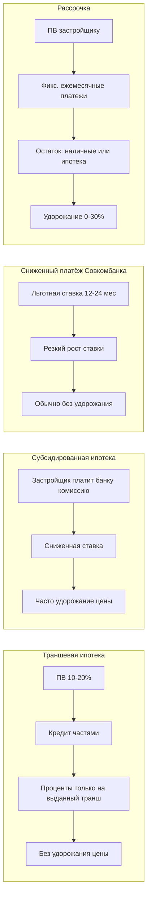
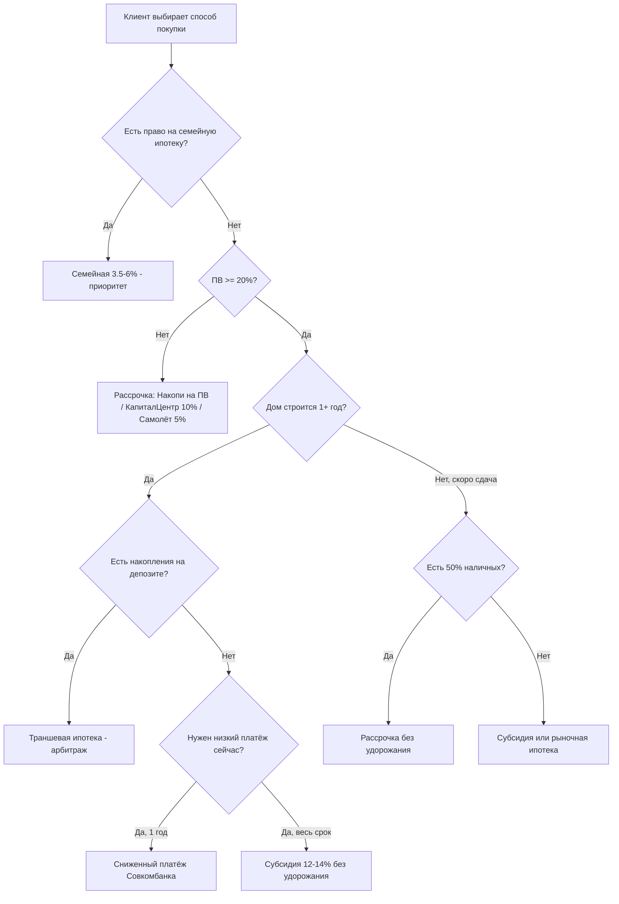

# Анализ способов покупки новостроек в Уфе

Источники: [INDEX.md](9. Застройщики/Способы покупок/INDEX.md), [Условия траншевой ипотеки.md](9. Застройщики/Способы покупок/Траншевая ипотека/Условия траншевой ипотеки.md), [Условия субсидированной ипотеки.md](9. Застройщики/Способы покупок/Субсидированная ипотека/Условия субсидированной ипотеки.md), [Условия сниженного платежа.md](9. Застройщики/Способы покупок/Сниженный платеж от Совкомбанка/Условия сниженного платежа.md), [Условия рассрочек.md](9. Застройщики/Способы покупок/Рассрочка/Условия рассрочек.md).

---

## 1. Механика каждого инструмента

| Инструмент | Кто финансирует | Базовая ставка / «цена денег» | Удорожание квартиры | Покрытие по Уфе |
|---|---|---|---|---|
| **Траншевая ипотека** | Банк (почти только Сбер) | ~21,7% (до ~19,5% со скидками) | **Нет** | ~30+ ЖК |
| **Субсидированная ипотека** | Банк + субсидия застройщика | 0,11%–14% (льготный) или 11,6–14% (на весь срок) | 0–19,5% (часто «индивидуально») | ~50+ строк, 8+ банков |
| **Сниженный платёж Совкомбанка** | Совкомбанк (подвид субсидии) | 4,4–14,2% на 12 мес., далее 14,5–22,5% | **Чаще нет** | ~10 застройщиков / ЖК |
| **Рассрочка** | Застройщик | 0% при ПВ 50%+ или скрытая ставка 1,5–20%/год | 0–30% (зависит от ПВ и срока) | ~25 застройщиков, 70+ программ |

---

## 2. Траншевая ипотека — ключевые выводы

**Суть:** кредит выдаётся траншами; проценты начисляются только на уже выданную сумму. Это снижает ежемесячный платёж на период стройки, не меняя цену квартиры.

**Сильные стороны:**
- Единственный ипотечный инструмент в базе с **гарантированным отсутствием удорожания** (явно зафиксировано в каталоге).
- Минимальный платёж при первом транше 100 000 ₽ — **~1 700–1 800 ₽/мес.** (ЖК Зорге.Премьер, Нью лайф, Старая Уфа и др.).
- При ПВ 20,1%+ и накоплениях на депозите 18–20% — классический **финансовый арбитраж**: деньги работают, пока дом строится.
- Широкое покрытие: от бюджетных (Каретная 51, ПВ 10%) до премиум (Ультра, Грани).

**Слабые стороны и риски:**
- **«Обрыв платежа»** при выдаче финального транша (ввод в эксплуатацию): платёж может вырасти в 5–15 раз.
- Монополия **СберБанка** — нет альтернативного банка в реестре.
- Ставка рыночная (~21,7%) — без субсидии переплата по процентам за весь срок высокая.
- Разные графики траншей по ЖК — расчёт всегда индивидуальный (фиксированные суммы vs % от кредита).

**Кому подходит:** клиент с ПВ 20%+ и стабильным доходом, который (а) хочет низкий платёж до сдачи, (б) держит разницу на депозите, (в) готов к росту платежа после ввода или планирует досрочное погашение / рефинансирование при снижении ключевой ставки.

---

## 3. Субсидированная ипотека — ключевые выводы

**Суть:** застройщик компенсирует банку разницу между рыночной и льготной ставкой (через комиссию или удорожание цены). Два принципиально разных подтипа:

1. **Фиксированная сниженная ставка на весь срок** (11,6–14,5%) — предсказуемая переплата.
2. **Льготный период** (0,11%–10% на 1–5 лет) → далее рыночная/индивидуальная ставка (17–22%) — низкий вход, высокий риск «обрыва».

**Сильные стороны:**
- Максимальный выбор: **Сбер, ВТБ, Альфа, Совкомбанк, ДОМ.РФ, МКБ, ТКБ, Металлинвестбанк**.
- При **нулевом удорожании** и ставке 12,49% на весь срок (Бионика Парк, Конди Нова) — реальная альтернатива рыночным 21%+.
- Пересечение с **семейной ипотекой** (3,5–6% на весь срок) на десятках ЖК — часто выгоднее любой коммерческой субсидии.
- Экстремально низкие «маркетинговые» ставки: 0,1% на 1 год (МКБ, Урбан Мартен), 0,11% на 1–3 года (ВТБ, Совкомбанк).

**Слабые стороны и риски:**
- **Удорожание непрозрачно:** от «без удорожания» до +19,5% (Грани) — без Excel-расчёта клиент не понимает реальную стоимость.
- Ставка после льготного периода помечена как **«индивидуально»** — риск сюрприза при рефинансировании внутри банка.
- Страхование часто обязательно; без него +1% к ставке (Лесная симфония, Зорге.Премьер).
- Конкурирующие программы одного ЖК (до 5 банков × 3 варианта) — парадокс выбора для клиента.

**Кому подходит:**
- Семьи с детьми → в первую очередь **семейная ипотека**, не коммерческая субсидия.
- Клиент с ПВ 20%+ без права на льготу → фиксированная ставка 12–14% на весь срок **без удорожания**.
- Клиент, уверенный в снижении ключевой ставки через 1–3 года → льготный период 6% на 2 года с планом рефинансирования.

---

## 4. Сниженный платёж от Совкомбанка — ключевые выводы

**Суть:** узкоспециализированная программа Совкомбанка — субсидия процентов на **первые 12–24 месяца**. По сути это «облегчённая» коммерческая субсидия с акцентом на кэшфлоу, а не на ставку на весь срок.

**Отличие от общей субсидированной ипотеки:**

| Параметр | Сниженный платёж (Совком) | Субсидия (общая) |
|---|---|---|
| Банк | Только Совкомбанк | 8+ банков |
| Фокус | Платёж в 1-й год | Ставка на весь срок или длинный льготный период |
| Удорожание | Почти всегда **нет** | Часто есть |
| Маткапитал в ПВ | **Запрещён** | Обычно разрешён |
| Типичная ставка | 4,4% → 19,99% | 0,11%–14% с разными хвостами |

**Два паттерна в реестре:**
- **«Мягкий обрыв»:** 14,2% → 15,99% (Архстрой) — платёж растёт незначительно.
- **«Жёсткий обрыв»:** 4,4% → 19,99%+ (Зорге.Премьер, Нова, Легенда) — платёж может удвоиться или утроиться.

**Вариант с комиссией за аккредитив** (Пьермонт, Сердце Уфы, Старая Уфа): ставка 0,1%, но «комиссия = платёж» — маркетинговая ставка, реальная нагрузка скрыта.

**Кому подходит:** клиент **без маткапитала** в ПВ, с подтверждённым ростом дохода через 12 мес. (повышение, бонус, продажа актива). Не подходит семьям, планирующим МК в первый взнос.

---

## 5. Рассрочка — ключевые выводы

**Суть:** застройщик даёт отсрочку оплаты по ДДУ. Деньги не на эскроу-банковском кредите — это **прямой долг застройщику** до полной оплаты или перехода на ипотеку.

**Три модели удорожания в реестре:**

1. **Без удорожания** при высоком ПВ (50%): Первый трест, КПД, Альтима, Архстрой (ПВ 50%).
2. **Фиксированная надбавка к цене м²** (+5 000–10 000 ₽/м² у Архстроя) или **% к базе** (+5–15% у БРИГ, Корабли, ИСК).
3. **Прогрессивная шкала от ПВ** (Самолёт Урбан: при ПВ 10% → +30% удорожания; при 60% → скидка 1%).

**Сильные стороны:**
- **Мост к ипотеке:** большинство программ допускают переход на ипотеку для погашения остатка — инструмент «дождаться снижения ставки ЦБ».
- Низкий порог входа: от **3,4% ПВ** (Архстрой «Накопи на ПВ») и **5%** (Самолёт для беременных).
- Нет банковского одобрения на старте — проще войти в сделку.
- Фиксированные платежи (20 000–100 000 ₽/мес.) — предсказуемый бюджет.

**Слабые стороны и риски:**
- **Ключи до полной оплаты — почти никогда** (исключения: индивидуально у КПД, Альтима).
- Скрытая стоимость: +10 000 ₽/м² на 50 м² = **+500 000 ₽** — риелторы часто называют «бесплатной рассрочкой».
- Короткие сроки (3 мес. у Terle Park, 9 мес. у Архстроя) — агрессивный график.
- БРИГ требует **страхование жизни** на сумму рассрочки.
- Urman City: **1,5%/мес. на остаток** с 7-го месяца — эффективная ставка ~18–20% годовых.

**Кому подходит:**
- Нет полного ПВ → «Накопи на ПВ» (Архстрой) или рассрочка КапиталЦентр (ПВ 10%).
- Есть 25–50% наличных → КПД (25/25/50 без удорожания), Первый трест (50% + 50к/мес.).
- Инвестор с Trade-In → Самолёт (5/95, 3 мес.).
- Ждёт падения ставки → длинная рассрочка до ввода (Самолёт АН 15/10/75, КПД до 2027).

---

## 6. Сравнительная матрица: когда что выбирать

---

## 7. Пересечения и комбо-схемы

Некоторые ЖК одновременно присутствуют во всех 4 реестрах — это точки максимальной гибкости для подбора:

- **Архстрой** (Свой берег, 8 Марта, Цветы Башкирии): траншевая + субсидия + Совком сниженный платёж + 6 видов рассрочки.
- **ЖК Зорге.Премьер:** траншевая (от 1 716 ₽/мес.) + субсидия (4 банка) + Совком 4,4% + рассрочка через Жилстройинвест.
- **Урбан Мартен / Тау:** траншевая + субсидия (6 банков) + 7 видов рассрочки Самолёта.
- **Первый трест** (8 Небо, Атлантис, Урбаника и др.): траншевая + субсидия + рассрочка 50к/мес.

**Типовые комбо:**
- Рассрочка «Накопи на ПВ» → переход на траншевую ипотеку (Архстрой).
- Рассрочка 25/25/50 (КПД) → ипотека на остаток 50% при снижении ставки.
- Траншевая + депозит → досрочное погашение при выдаче финального транша.

---

## 8. Главные выводы

### Экономика (что реально дешевле)

1. **Траншевая ипотека — лучший «бесплатный» инструмент снижения платежа** на период стройки: нет удорожания, есть арбитраж с депозитом. Но полная стоимость кредита при 21,7% на 30 лет — самая высокая среди ипотечных инструментов.
2. **Субсидия 12–14% на весь срок без удорожания** (Бионика, Конди Нова, Совкомбанк 12,49%) — оптимальна по полной переплате для клиентов без льготных программ.
3. **Рассрочка с удорожанием** при ПВ 30% часто **дороже ипотеки**: +10 000 ₽/м² у Архстроя на 55 м² ≈ 550 000 ₽ ≈ 10% цены — сопоставимо с 2–3 годами процентов по субсидии, но без права на налоговый вычет.
4. **Сниженный платёж Совкомбанка** выгоден только как **краткосрочный кэшфлоу-инструмент** (12 мес.); варианты 4,4% → 19,99% требуют обязательного моделирования платежа на 2-й год.
5. **Семейная ипотека 3,5–6%** побеждает все 4 инструмента — при наличии права на неё остальные программы вторичны.

### Риски (что продают, но не говорят)

| Риск | Где встречается |
|---|---|
| Обрыв платежа после льготного периода | Субсидия 0,11–6% → 19–22%; Совком 4,4% → 19,99% |
| Обрыв при финальном транше | Траншевая ипотека при вводе |
| Скрытое удорожание в «бесплатной» рассрочке | Архстрой +5–10к/м²; Самолёт до +30%; Urman 1,5%/мес. |
| Запрет маткапитала | Совкомбанк сниженный платёж |
| Нет ключей до 100% оплаты | Почти все рассрочки |
| «Индивидуальная ставка» после льготы | Большинство субсидий |

### Покрытие рынка

- **Траншевая:** доминирует Сбер, ~30+ ЖК — сильный, но монопольный инструмент.
- **Субсидия:** самый широкий охват, 8 банков — основной коммерческий инструмент продаж в 2026.
- **Совком сниженный платёж:** нишевый (10 ЖК), но с уникальным УТП «без удорожания + низкий 1-й год».
- **Рассрочка:** самый гибкий по ПВ (от 3,4%), но самый разнородный по условиям — требует нормализации в калькуляторе.

### Стратегические выводы для продаж и контента

1. **Не сравнивать инструменты по «ставке в рекламе»** — сравнивать по полной стоимости владения (цена квартиры + все проценты + удорожание рассрочки).
2. **Траншевая + депозит** — сильнейший контент-нарратив при ключевой ставке ЦБ выше депозитных (арбитраж 18–20% vs платёж 1 700 ₽).
3. **Рассрочка с удорожанием** — провокационная тема для Reels (уже заложена в [Идея контента](Идея контента на привлечение покупателей.md)): «бесплатная рассрочка vs 20% банку».
4. **Совкомбанк** — отдельный сегмент клиентов без МК; нельзя смешивать с общей субсидией в одной таблице для клиента.
5. **Калькулятор должен считать 4 сценария** для одного лота: траншевая, лучшая субсидия, Совком (если есть), лучшая рассрочка — и показывать платёж в год 1, в год 3 и полную переплату.

---

## 9. Рекомендуемые следующие шаги (если нужно углубить анализ)

- Собрать Excel-калькулятор с 4 сценариями на эталонном лоте (например, 55 м², 6 млн ₽, ПВ 20%).
- Добавить в [INDEX.md](9. Застройщики/Способы покупок/INDEX.md) сводную матрицу «ЖК × доступные инструменты».
- Вынести в отдельную заметку правило: **приоритет подбора** (семейная → траншевая/субсидия без удорожания → рассрочка → Совком).
