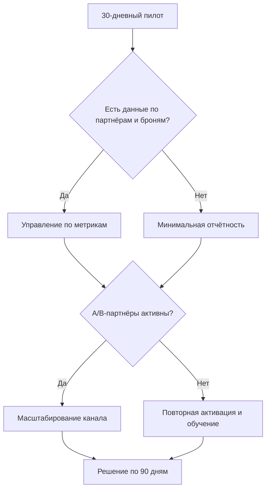

# Маршрутная карта — СУ-10: система эксклюзивных продаж

**Период:** 90 дней  
**Первый кейс внедрения:** ЖК Центральный Парк  
**Стратегическая цель:** выстроить управляемый партнёрский канал, который помогает ускорить реализацию остатка объектов СУ-10.  
**Логика обязательств:** первые 30 дней фиксируют фактическую динамику пилота, после чего уточняются прогноз, темп масштабирования и условия дальнейшего эксклюзива.

## Контекст

У СУ-10 есть сильный продукт и понятное ценовое преимущество. По ЖК Центральный Парк уже продано 312 из 508 апартаментов, остаток составляет 196 апартаментов. При этом продажи за первый квартал 2026 года составили 7 сделок, что показывает не слабость объекта, а ограничение текущей системы продаж.

Задача пилота — не просто подключить дополнительные агентства, а превратить партнёрский канал в управляемую систему: с понятной сегментацией, регулярным обучением, единой точкой входа, быстрыми ответами, прозрачной воронкой и ответственными ролями.

## Целевая модель через 90 дней

Через 90 дней у СУ-10 должна появиться рабочая модель партнёрских продаж, которую можно масштабировать на объекты застройщика:

- ABC-сегментация партнёрской сети с понятной логикой работы по группам A/B/C.
- Запущенный контур партнёрской заботы: единая точка входа, SLA реакции, правила эскалации.
- Регулярная система обучения агентств по объектам СУ-10.
- Единые скрипты, шаблоны коммуникаций и база ответов на типовые вопросы.
- Рабочий календарь офлайн-активностей для удержания внимания партнёров.
- Отдельный контур работы с агрегаторами: НМаркет, Тренд Агент, Репрофит, Авито, Домклик.
- Управленческий цикл: план, факт, отклонения, решения, ответственные.
- Пилотные данные для решения о продлении, масштабировании и условиях эксклюзива.

## Принцип адаптивности

Маршрутная карта адаптируется не под абстрактный идеальный процесс, а под фактическое состояние СУ-10 на старте. Главные параметры адаптации:

- **Зрелость системы продаж:** если процессов мало, первые недели усиливаются диагностикой, регламентами и быстрыми правилами работы.
- **Скорость продаж:** если брони появляются быстро, фокус смещается на конверсию и сопровождение; если медленно — на активацию партнёров и повторную упаковку аргументов.
- **Сила партнёрской сети:** если A/B-партнёры откликаются, усиливаем персональные планы; если нет — запускаем повторное вовлечение и офлайн-активности.
- **Качество данных:** если данных достаточно, управляем через метрики; если нет — сначала вводим минимальную отчётность.
- **Ресурсы и согласования:** если решения принимаются быстро, масштабируем темп; если медленно — фиксируем короткий список обязательных согласований на неделю.

## Этап 1. Дни 1-30: пилот и запуск управляемости

**Цель этапа:** быстро запустить партнёрский канал в рабочий режим и получить фактические данные по активности, броням, вопросам и узким местам.

### Что делаем

- Собираем стартовую картину по партнёрам: кто уже работает, кто даёт заявки, кто способен давать брони.
- Проводим ABC-сегментацию агентств и агрегаторов.
- Определяем правила работы для групп A/B/C.
- Запускаем единую точку входа для партнёров.
- Вводим SLA: первая реакция в течение рабочего дня, полное решение вопроса до 48 часов.
- Готовим базовый пакет материалов по ЖК Центральный Парк и объектам СУ-10.
- Запускаем первые обучения для партнёров.
- Настраиваем шаблоны коммуникаций: приглашение, follow-up, ответы на вопросы, работа с бронью.
- Фиксируем первый календарь офлайн-активностей.
- Запускаем еженедельный управленческий обзор: план, факт, проблемы, решения.

### Артефакты 30-го дня

- ABC-карта партнёрской сети.
- Список A/B/C-партнёров и правила работы с каждой группой.
- Единая точка входа и регламент обработки обращений.
- Первый пакет скриптов и шаблонов.
- График обучений и первые факты посещаемости.
- Первичный отчёт по активности, вопросам, броням и SLA.
- Решение по корректировке плана на дни 31-60.

### Критерии успешного пилота

- Партнёры понимают, куда обращаться и как быстро получают ответ.
- У СУ-10 появляется прозрачная картина активности партнёрского канала.
- Команда видит не только результат, но и причины: где теряются заявки, почему не доходят до брони, какие вопросы тормозят сделку.
- Есть фактическая база для решения о масштабировании.

## Этап 2. Дни 31-60: усиление канала и регулярный ритм

**Цель этапа:** перевести первые действия в регулярную систему и усилить партнёров, которые показывают активность.

### Что делаем

- Уточняем ABC-сегментацию по фактическим данным первого месяца.
- Для A-партнёров вводим персональные планы активности и броней.
- Для B-партнёров запускаем программу дожима: обучение, материалы, регулярные касания.
- Для C-партнёров оставляем упрощённый регламент и массовые коммуникации.
- Настраиваем регулярный календарь обучений.
- Усиливаем работу с агрегаторами: отдельные правила передачи информации, контроль качества лидов, разбор броней.
- Проводим первую офлайн-активность или презентацию для партнёров.
- Обновляем скрипты по фактическим вопросам и возражениям.
- Вводим регулярный отчёт по воронке: активность → заявки → брони → сделки.

### Артефакты 60-го дня

- Обновлённая ABC-карта по факту.
- План работы с A/B/C-партнёрами на следующий месяц.
- Обновлённый пакет скриптов и база ответов.
- Отчёт по посещаемости обучений и вовлечённости партнёров.
- Отчёт по агрегаторам и качеству входящего потока.
- Список системных барьеров, которые требуют решения СУ-10.

## Этап 3. Дни 61-90: закрепление и решение о масштабировании

**Цель этапа:** закрепить работающую модель, убрать повторяющиеся сбои и подготовить решение о дальнейшем эксклюзиве или расширении формата.

### Что делаем

- Закрепляем регламенты партнёрской работы.
- Формируем регулярный управленческий ритм на следующий квартал.
- Уточняем целевые показатели по броням, партнёрской активности и SLA.
- Выделяем партнёров, которые реально дают движение по воронке.
- Готовим предложения по усилению мотивации A/B-партнёров.
- Фиксируем формат дальнейшего взаимодействия: роли, отчётность, условия, календарь.
- Готовим итоговый отчёт 90 дней и рекомендации по масштабированию на другие объекты СУ-10.

### Артефакты 90-го дня

- Итоговый отчёт по пилоту и 90-дневному циклу.
- Решение по дальнейшему эксклюзиву или расширению модели.
- Регламент партнёрского канала.
- План масштабирования на следующий период.
- Обновлённая база знаний и коммуникационных материалов.
- Список управленческих решений, необходимых со стороны СУ-10.

## Метрики управления

### Главные KPI

- Количество броней от партнёрского канала.
- Активность партнёров: подключения, обучения, встречи, повторные касания.
- SLA по обращениям: скорость первой реакции и полного решения вопроса.

### Поддерживающие метрики

- Количество активных A/B-партнёров.
- Посещаемость обучений.
- Количество вопросов от партнёров и доля повторяющихся тем.
- Конверсия заявка → бронь → сделка.
- Количество конфликтов по уникальности клиентов.
- Доля вопросов, закрытых без эскалации на СУ-10.

## Роли

| Роль | Зона ответственности |
|---|---|
| Куратор проекта | Общая логика запуска, контакт с СУ-10, управленческие решения |
| Партнёрский менеджер | Работа с агентствами, ABC-сегментация, регулярные касания |
| Отдел заботы | Единая точка входа, вопросы партнёров, SLA, эскалации |
| Тренер/эксперт по объекту | Обучения, материалы, ответы на продуктовые вопросы |
| Аналитик | Метрики, отчёты, воронка, выявление узких мест |
| Ответственный со стороны СУ-10 | Согласования, доступ к данным, решения по условиям и объектам |

## Риски и управленческие решения

| Риск | Как проявится | Что делаем |
|---|---|---|
| Медленные согласования | Материалы, условия и ответы партнёрам зависают | Вводим еженедельный список решений и ответственного со стороны СУ-10 |
| Нехватка данных | Нельзя точно оценить активность и конверсию | Стартуем с минимальной отчётности: партнёр, обращение, статус, бронь, срок ответа |
| Сопротивление внутри отдела продаж | Партнёрский канал воспринимается как конкуренция | Фиксируем правила взаимодействия и показываем роль канала как усиление продаж СУ-10 |
| Конфликты по комиссии и уникальности | Споры между агентствами, агрегаторами и застройщиком | Вводим прозрачные правила регистрации клиента и разбор спорных кейсов |
| Низкая активность партнёров | Обучения посещают, но брони не растут | Меняем коммуникации, усиливаем A/B-партнёров, проводим офлайн-активацию |

## Решения, которые нужны на старте

Чтобы первые 30 дней не ушли на согласования, до запуска нужно утвердить:

- ответственного со стороны СУ-10;
- правила регистрации клиента и уникальности;
- базовые условия комиссии и скидки;
- перечень объектов и материалов, доступных партнёрам;
- канал коммуникации с партнёрами;
- формат еженедельного отчёта;
- даты первых обучений и офлайн-активности.

## Следующий шаг

Зафиксировать календарь первых 30 дней, назначить роли и открыть партнёрский контур. После первого месяца перейти от гипотез к управлению по фактам: какие партнёры дают движение, какие вопросы тормозят сделки и какие решения нужны для масштабирования.
