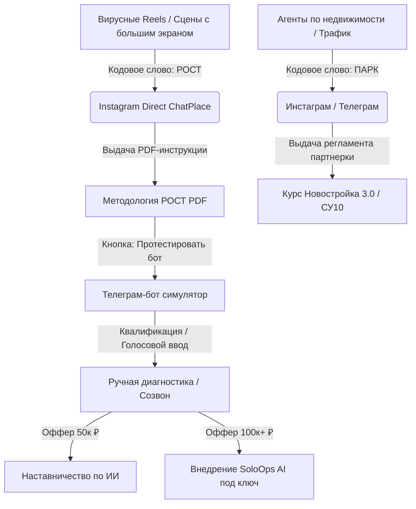

# 📐 Архитектура воронки продаж: ИИ-автоматизация и Новостройки (Методология РОСТ)

> **Статус:** Бизнес-модель и архитектура продаж  
> **Целевая аудитория:** Предприниматели, руководители компаний, соло-специалисты с бюджетом (ИТ, инфлюенсеры, эксперты).  
> **Основной упор:** Внедрение искусственного интеллекта и личного Второго Мозга (автоматизация собственника и компании). Второстепенный упор: практическое обучение продаже новостроек (как партнерский лид-магнит).

---

## 📊 1. Схема движения трафика (Сквозная воронка)

---

## 📱 2. Воронка в Инстаграме (Точка входа)

### Специфика визуального стиля Reels:
* Кадры записаны на фоне **большого премиального темного экрана с гипертрофированными, огромными буквами и минималистичным дизайном**. Это сразу выделяет картинку из ленты шаблонных «экспертных видео».
* Текст на экране должен дублировать ключевые жесткие смыслы.

### Сценарии для нарезки (Reels-связки):

#### reels_1: Ловушка 3 часов в ChatGPT (Для руководителей)
* **Визуальный ряд**: Антон на фоне огромного темного экрана. На экране большими буквами: **«ИИ ЗАБИРАЕТ ВРЕМЯ?»**
* **Хук**: Вы просидели 3 часа в ChatGPT, пытаясь составить регламент, но в итоге переписали все руками. Почему ИИ работает как развлечение, а не как инструмент?
* **Суть**: ChatGPT из коробки не знает ваш бизнес, ваши регламенты и ваш стиль общения. Нейросети нужен контекст вашей компании. Методология РОСТ решает это за счет привязки ИИ к вашей локальной базе знаний.
* **Призыв к действию**: Напиши «РОСТ» в комментарии или Директ, скину 3 страницы жесткой практики без воды.

#### reels_2: Оцифровка одной рукой (Для занятых лидеров)
* **Визуальный ряд**: Антон указывает на экран. На экране надпись: **«300 СЛОВ В МИНУТУ»**.
* **Хук**: Написание регламентов и задач сотрудникам больше не занимает часы. Как ставить ТЗ одной рукой за рулем?
* **Суть**: Вы наговариваете хаотичные мысли голосом в Телеграм. Система РОСТ переводит это со скоростью 300 слов в минуту, обращается к вашей базе знаний и через 15 секунд выдает сотруднику готовое ТЗ строго по стандартам компании.
* **Призыв к действию**: Пиши «РОСТ» в сообщения — вышлю доступ к симулятору такого бота.

#### reels_3: Кладбище заметок (Боль всех предпринимателей)
* **Визуальный ряд**: Экран с надписью: **«КЛАДБИЩЕ ИНСАЙТОВ»**.
* **Хук**: Сколько сотен заметок с обучений лежит мертвым грузом в вашем телефоне? Спойлер — вы их никогда не откроете.
* **Суть**: Вы тратите деньги на курсы, записываете идеи и забываете о них. Инсайты должны лежать в структуре 4 папок (Бизнес, План, Мой клон, Мастерство). Тогда ваш ИИ-клон сам связывает новые данные с текущими задачами и подсвечивает их во время работы.
* **Призыв к действию**: Напиши «РОСТ» в Директ, вышлю структуру оцифровки личных принципов.

---

## 🤖 3. Воронка в Телеграме (Прогрев и симуляция)

После того как человек скачал PDF-инструкцию в Instagram Direct, автосообщение переводит его в **Телеграм-бот (ИИ-двойник Антона Цоя)**.

### Архитектура и функции Телеграм-бота:
1. **Голосовой симулятор (Wow-эффект)**:
   * Пользователь может наговорить боту хаотичное голосовое сообщение (например, «нужно сделать регламент по онбордингу новичка, чтобы он изучил ЖК и сдал отчет»).
   * Бот за 10 секунд присылает структурированный markdown-документ, демонстрируя скорость и методологию в действии.
2. **Диалог с «Клоном»**:
   * Бот отвечает на любые вопросы о бизнесе, ИИ и недвижимости строго в манере речи Антона Цоя (используя данные из папки `3. Мой клон/voice/хранилище-фраз.md`).
3. **Квалификационный опрос**:
   * Если пользователь задает вопросы про внедрение, бот ненавязчиво предлагает пройти короткий опрос из 3 вопросов:
     * *«Какой у вас бизнес и сколько времени уходит на операционку?»*
     * *«Есть ли у вас база знаний или всё держится на вашей памяти?»*
     * *«Хотите внедрить систему РОСТ лично для себя или настроить процессы для всей компании?»*
4. **Вывод на диагностику**:
   * Бот передает заполненный профиль Антону, и ты заходишь в диалог для назначения 15-минутного созвона.

---

## 🖥 4. Воронка на Сайте (Конвертер в сделку)

Одностраничный сайт (лендинг) решает задачу презентации продуктов для теплой аудитории, пришедшей из Инстаграма или Телеграма.

### Стилистика (по дизайну РОСТ):
* Премиальный темный брутализм.
* Оранжево-черная цветовая гамма, Outfit/Inter шрифты.
* Крупные, контрастные заголовки (дублирующие визуал твоего экрана на мастер-классе).

### Структурные блоки сайта:
1. **Главный экран**:
   * Крупный заголовок: **«НЕЙРОСЕТИ ДЛЯ РУКОВОДИТЕЛЯ»**.
   * Подзаголовок: *«Освободи до 15 часов в неделю, переложив рутину на локального ИИ-двойника по методологии РОСТ. Без написания сложных промптов.»*
   * Кнопка: **«Протестировать ИИ-двойника в Телеграм»**.
2. **Блок болей (В чем хаос?)**:
   * Разбор 3 ключевых проблем: Хаос в чатах / Кладбище заметок / Страх безопасности данных (152-ФЗ).
3. **Презентация продуктов (Что мы продаем)**:
   * **Тариф 1: Индивидуальное наставничество (50 000 ₽)**
     * *Суть*: Месяц совместной работы. Оцифровка личных процессов, базы знаний в Obsidian и подключение твоего персонального Телеграм-ассистента. 5 часов созвонов перед стартом настройки ИИ — обязательно.
   * **Тариф 2: Внедрение SoloOps AI под ключ (от 100 000 ₽)**
     * *Суть*: Разворачивание ИИ-экосистемы компании на выделенном сервере в РФ. Маскирование персональных данных клиентов, создание корпоративной базы знаний, автоматизация постановки ТЗ и регламентов команды.
4. **Блок Новостройки (Альтернативный продукт)**:
   * Для агентов и девелоперов: переход на страницу курса **«Новостройка 3.0»** и партнерских условий по ЖК «Центральный Парк» (СУ10).

---

## 🔄 5. Правила связывания воронки
1. **Кодовые слова**:
   * Для ИИ-направления используется триггер **`РОСТ`**.
   * Для направления новостроек и работы с партнерами используется триггер **`ПАРК`**.
2. **Диагностика как главный этап**:
   * Любой лид из Инстаграма или Бота должен закрываться на короткую 15-минутную бесплатную диагностику (где выявляются ключевые боли и предлагается нужный тариф).
3. **Безопасность**:
   * На сайте и в боте четко прописывается: *«Мы не отправляем ваши конфиденциальные данные в открытые облака. Все решения базируются на защищенных локальных серверах в РФ по 152-ФЗ»*.
