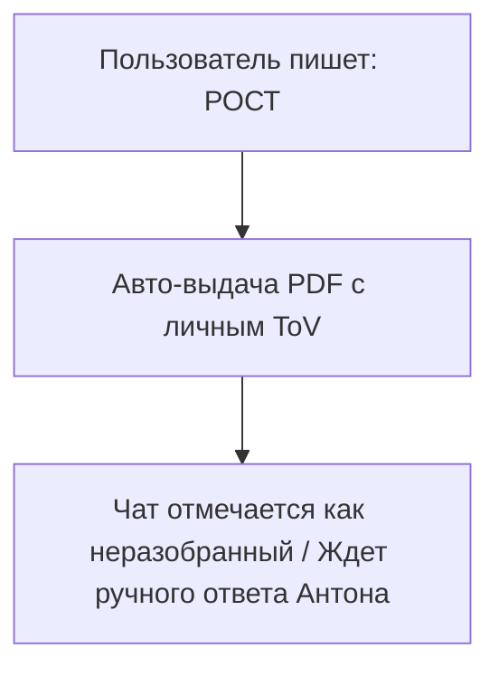

# 🤖 ЛИЧНАЯ ВОРОНКА CHATPLACE: Автоматическая выдача + Ручные продажи

> **Триггер (Ключевое слово):** `РОСТ` (регистронезависимый)  
> **Канал:** Instagram Direct / Telegram  
> **Цель:** Моментально и автоматически выслать файл «Методология РОСТ» (чтобы не делать это вручную), зафиксировать лид в Директе и дать тебе возможность продолжить диалог лично, без роботов.

---

## 📐 Простая схема автоматизации

---

## 📝 Текст автоматического сообщения в ChatPlace

* **Действие:** Отправить сообщение сразу после того, как пользователь написал кодовое слово `РОСТ`.
* **Настройка кнопок:** 1 кнопка со ссылкой на скачивание.
* **Настройка чата в ChatPlace:** После отправки сообщения перевести чат в статус **«Ожидает ответа» (Unread/Open)** и прислать уведомление на телефон.

> **Текст сообщения:**
> Приветствую!
> 
> Лови практическое руководство по наведению порядка в процессах и оцифровке бизнеса с помощью ИИ. 
> 
> Рекомендую полистать на досуге - там всего 3 страницы жесткой практики без «воды»:
> 
> 📥 **[Скачать Методологию «РОСТ» (PDF)](file:///Users/anton_tsoy/Desktop/Обсидиан/3.%20Мой%20клон/методология-РОСТ.pdf)**
> 
> А я чуть позже подключусь сюда и напишу тебе лично. Расскажешь, как сейчас обстоят дела в твоем проекте. До связи!

---

## 🎯 Скрипты для твоего личного (ручного) входа в диалог

Когда ты заходишь в Директ и видишь, что человек скачал файл, ты можешь написать ему один из следующих простых вариантов (через несколько часов или на следующий день) без давления, по ToV «не врать, не приукрашивать, не подлизываться»:

### Вариант 1. Дружеский заход (Для знакомых или теплых подписчиков)
> «Привет! Удалось открыть PDF? Как тебе структура 4 папок, примерил уже на свой проект?»

### Вариант 2. Экспертный разбор боли (Для холодных предпринимателей)
> «Привет! Посмотрел твой профиль - крутой проект. Скажи, а у тебя сейчас в регламентах и задачах команды порядок или рутина всё-таки съедает большую часть времени?»

### Вариант 3. Заход через технологии и ИИ (Для технологичных лидов)
> «Привет! Как тебе идея с папкой 'Мой клон' из руководства? Пробовал уже обучать нейросети писать тексты под твой личный стиль речи?»

---

## 📋 Чек-лист настройки ChatPlace:
- [ ] Загрузить `методология-РОСТ.pdf` на Яндекс Диск или Google Drive и вставить ссылку в кнопку сообщения.
- [ ] Добавить триггеры: `Рост`, `рост`, `РОСТ`, `Rost`, `rost` (регистр не важен).
- [ ] **Критично:** Выключить любые авто-цепочки и авто-напоминания после этого сообщения. Диалог должен остаться открытым в твоей папке «Входящие», чтобы ты зашел и написал сам.
