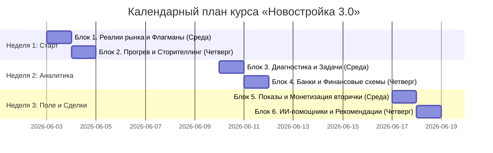

# 🎓 Практический курс обучения «Новостройка 3.0»
**Трехнедельная система запуска новичков в продажи новостроек в «Эксперт Сити»**

> **Главный манифест курса:** «Я не продаю - я объясняю». Мы уходим от навязывания к честному консультированию на основе цифр. Наш результат - это следствие дисциплины, знания объектов и умения решать жизненные задачи клиентов.

Этот курс рассчитан строго на **3 недели** и разбит на **6 последовательных блоков** (модулей). Вся учеба жестко привязана к твоему еженедельному ритму:
* **Теория и разборы:** Каждую среду и четверг с 10:00 до 11:00.
* **Полевые выезды:** Каждую среду и четверг после 11:00 (стабильное посещение одного нового застройщика в день, всего 6 выездов за курс).

Каждый блок содержит теорию, практическое задание с отчетом в рабочем чате или системе учета клиентов (СРМ) и точку контроля. Выполнение заданий - твой путь к стабильным **150 000 - 500 000+ рублей в месяц** и личной свободе.

---

## 📅 График и структура курса на 3 недели

---

## 🛠️ Неделя 1. Вход в рынок и Первые выезды

### 📦 Блок 1. Реалии рынка и Флагманы Уфы (Среда, 10:00 - 11:00)
**Фокус:** Понимание стоимости квадратного метра по районам Уфы, изучение ключевых объектов компании.

#### 1. Реалии рынка Уфы: Ценовая карта квадратного метра
Агент-Стратег должен безупречно ориентироваться в стоимости квадратного метра в разных районах Уфы. Без этого понимания невозможно вести профессиональный диалог и подбирать финансовые схемы.

Ниже приведена средняя стоимость квадратного метра жилья в Уфе на Апрель 2026 года в рублях:

| Район | Студии | 1-к квартира | 2-к квартира | 3-к квартира | 4-к квартира | Апартаменты |
| :--- | :--- | :--- | :--- | :--- | :--- | :--- |
| **8 Марта** | 129 600,00 | 123 500,00 | 120 000,00 | - | - | - |
| **Булгаково** | - | - | - | - | - | - |
| **Глумилино** | 226 416,27 | 189 202,59 | 159 333,51 | 151 879,63 | 159 630,93 | - |
| **Дема** | 171 593,89 | 151 865,02 | 142 505,23 | 112 619,51 | 134 558,24 | - |
| **Затон** | 187 445,13 | 140 893,35 | 167 302,20 | 130 833,35 | - | - |
| **Зеленая Роща** | 217 289,70 | 181 529,89 | 155 014,13 | 142 289,85 | 180 270,90 | 219 171,00 |
| **Зубово** | 167 307,35 | 157 445,58 | 146 265,03 | - | - | - |
| **Инорс** | 132 171,69 | 125 483,34 | 118 503,48 | 115 062,15 | - | - |
| **Кузнецовский Затон** | 162 543,79 | 143 644,96 | 132 985,13 | 129 550,30 | 115 835,13 | - |
| **Миловка** | 229 560,38 | 176 929,29 | 160 243,08 | 135 347,02 | - | - |
| **Михайловка** | 144 500,11 | - | - | - | - | - |
| **Проспект Октября** | 203 534,34 | 188 321,96 | 184 546,71 | 165 312,87 | 222 155,20 | 220 676,05 |
| **Сипайлово** | 184 816,50 | 178 407,51 | 168 930,50 | 134 761,00 | 166 549,00 | - |
| **Цветы Башкирии** | 160 500,00 | 166 200,00 | 155 333,33 | 126 000,00 | - | - |
| **Центр** | 252 491,80 | 196 292,07 | 207 351,24 | 212 191,52 | 175 045,87 | 274 405,35 |
| **Черниковка** | 132 783,33 | 135 828,41 | 130 340,00 | 125 162,50 | - | - |

Ключевые выводы по ценовым реалиям:
* **Закономерность площади:** Чем меньше квартира, тем дороже стоит каждый квадратный метр. Студии - самый дорогой тип жилья за квадрат в любом районе (Центр - 252 тыс. руб., Глумилино - 226 тыс. руб.).
* **Географическая разница:** Премиальные районы (Центр, Проспект Октября, Зеленая Роща) удерживают планку свыше 200-250 тыс. руб. за метр в студиях. Бюджетные окраины (Инорс, Черниковка, 8 Марта) - от 120 до 135 тыс. руб. за метр.
* **Апартаменты:** Относятся к дорогой категории за метр (Центр - 274 тыс. руб.) из-за высокого коммерческого и арендного потенциала в ключевых точках города.

#### 2. Теоретический минимум: Реальные лидеры продаж Уфы (Март и Апрель 2026)
Агент-Стратег опирается только на твердые данные рынка, а не на свои домыслы. Ниже приведена официальная статистика зарегистрированных сделок (ДДУ) по лидерам продаж новостроек Уфы за Март и Апрель 2026 года:

##### 📅 Март 2026 года:

###### ТОП-5 жилых комплексов по общему количеству сделок:
1. **ЖК «Лесное Ожерелье»** - **35 сделок** (абсолютный рекордсмен, весь объем пришелся на 2-комнатные квартиры семейного формата).
2. **ЖК «Новатор»** - **28 сделок** (стабильный спрос во всех классах - от студий до просторных квартир).
3. **ЖК «Волна»** - **23 сделки** (высокие продажи за счет бюджетных ликвидных студий).
4. **ЖК «LUNA»** - **22 сделки** (популярен как у инвесторов в студии, так и у семейных покупателей).
5. **ЖК «Акварель»** - **22 сделки**.

###### Лидеры спроса по комнатности квартир:
* **Студии:** ЖК «Волна» (18 шт.), ЖК «Новоуфимский» (16 шт.), ЖК «LUNA» (10 шт.), ЖК «Акварель» (10 шт.).
* **1-комнатные квартиры:** ЖК «Паруса» (15 шт.), ЖК «Formula» (13 шт.), ЖК «Холмогоры» (12 шт.), ЖК «Йондоз» (10 шт.).
* **2-комнатные квартиры:** ЖК «Лесное Ожерелье» (35 шт. - феноменальный результат), ЖК «Новатор» (11 шт.), ЖК «Некрасовский» (10 шт.).
* **3-комнатные квартиры:** ЖК «Новая Дема» (кв. Чемпионов) (9 шт.), ЖК «Свой Берег» (9 шт.), ЖК «Лесная Симфония» (9 шт.).
* **4-комнатные квартиры и выше:** ЖК «Atlantis» (2 шт.), ЖК «Urman City» (2 шт.).

###### На какие объекты Стратег обращает внимание в первую очередь:
* **ЖК «Новатор»:** Самый денежный объект месяца. Сгенерировал более **205 млн рублей** выручки с идеальным балансом спроса по всем планировкам.
* **ЖК «Лесное Ожерелье»:** Аномальный спрос на семейный формат. Продано **35 двухкомнатных квартир на сумму 231.5 млн рублей**. Задача агента - изучить их планировочные решения и финансовые условия, которые так сильно привлекли семейную аудиторию.
* **ЖК «LUNA»:** Высокая ликвидность. Сделки принесли **155 млн рублей** при 22 продажах (сильный инвесторский фокус).
* **ЖК «Лесная Симфония»:** Лидер дорогого чека. При 19 продажах сделали **166 млн рублей** выручки (почти половина объема - дорогие 3-комнатные квартиры).
* **ЖК «Цветы Башкирии»:** Пример сбалансированного спроса. Продажи распределены абсолютно равномерно по комнатности (4 студии, 4 однокомнатные, 5 двухкомнатных, 5 трехкомнатных), что дает стабильную устойчивость объекту (**124.8 млн рублей**).

##### 📅 Апрель 2026 года:

###### ТОП-5 жилых комплексов по общему количеству сделок:
1. **Комплекс апартаментов «Серп и Молот»** - **37 сделок** (феноменальный лидер нежилого сектора, обеспечивший девелоперу быструю ликвидность).
2. **ЖК «Новая Дема»** (суммарно кварталы Чемпионов и Виртуозов) - **37 сделок** (абсолютный лидер спроса в сегменте семейного жилья и студий).
3. **ЖК «Мир»** - **29 сделок** (стабильный интерес во всех сегментах с акцентом на двухкомнатные квартиры).
4. **ЖК «Волна»** - **28 сделок** (высокий темп продаж за счет бюджетных ликвидных студий).
5. **Экогород «Яркий»** - **27 сделок** (столько же у **ЖК «Новатор»** - 27 сделок).

###### Лидеры спроса по комнатности квартир:
* **Студии / Апартаменты:** Комплекс апартаментов «Серп и Молот» (37 шт. - коммерческий формат), ЖК «Волна» (12 шт.), ЖК «Новоуфимский» (12 шт.), ЖК «LUNA» (8 шт.).
* **1-комнатные квартиры:** ЖК «Новая Дема» (21 шт.), ЖК «Паруса» (16 шт.), Экогород «Яркий» (14 шт.), ЖК «НЬЮ-ЙОРТ» (12 шт.), ЖК «Культура» (10 шт.).
* **2-комнатные квартиры:** ЖК «Мир» (19 шт.), ЖК «Городской квартал "Некрасовский"» (15 шт.), ЖК «Новатор» (15 шт.), ЖК «Лесное Ожерелье» (11 шт.), ЖК «8 NEBO» (10 шт.).
* **3-комнатные квартиры:** ЖК «Заря» (8 шт.), ЖК «Новая Дема» (7 шт.), ЖК «Новатор» (6 шт.), ЖК «Городской квартал "Некрасовский"» (5 шт.), ЖК «The Sky» (5 шт.).
* **4-комнатные квартиры и выше:** ЖК «Urman City» (3 шт.), ЖК «Atlantis» (2 шт.), ЖК «Лайф Дема» (1 шт.), ЖК «Grand Avenue» (1 шт.), ЖК «Эдисон» (1 шт.).

###### На какие объекты Стратег обращает внимание в первую очередь:
* **ЖК «Новатор»:** При 27 проданных квартирах комплекс принес девелоперу более **188.5 млн рублей** выручки со средним чеком около ~7 млн рублей за лот.
* **ЖК «Культура»:** Лидер дорогого чека. Зафиксировано 16 продаж на общую сумму свыше **159.2 млн рублей**, при этом средняя стоимость одной квартиры здесь вплотную приблизилась к **10 млн рублей**.
* **ЖК «Городской квартал "Некрасовский"»:** Отличный баланс: высокий объем продаж (23 квартиры) со средним чеком около **7.4 млн рублей**, что сгенерировало **170.5 млн рублей** общей выручки.
* **ЖК «Urman City»:** Флагман в сегменте больших квартир (лидер по четырехкомнатным лотам). Имеет высокий средний чек в **9.6 млн рублей** за лот.
* **Комплекс апартаментов «Серп и Молот»:** Штучный рекордсмен апреля в сегменте апартаментов (37 продаж на сумму **190.4 млн рублей**).

#### 3. Сравнительный анализ рынка: Динамика и смена трендов (Март - Апрель 2026)
Анализ изменения структуры спроса помогает агенту понимать текущий вектор рынка и адаптировать свои предложения под реальные тренды.

##### 📈 Ключевые маркеры и инсайды рынка:
* **Смена абсолютных лидеров:** Лидер марта (ЖК «Лесное Ожерелье») резко снизил темп, уступив пальму первенства новым игрокам. В топе закрепились масштабные квартальные проекты.
* **Взрывной спрос на апартаменты:** Появление в апрельском топе специализированных комплексов апартаментов (лидер - «Серп и Молот») говорит о смещении фокуса части инвесторов в сторону более доступного и коммерчески эффективного формата.
* **Стабилизация семейного спроса:** Сверхпопулярные в марте двухкомнатные квартиры уступили долю рынка однокомнатным квартирам и студиям.

##### 🔄 Сравнительный анализ по номинациям:

###### Общие объемы продаж:
* **Ротация лидеров:** ЖК «Лесное Ожерелье» (лидер марта с 35 сделками) в апреле упал до 15 сделок (спад более чем в 2 раза).
* **Новые гиганты:** Первое место в апреле разделили Комплекс апартаментов «Серп и Молот» (37 сделок) и ЖК «Новая Дема» (37 сделок).
* **Рыночная устойчивость:** ЖК «Новатор» и ЖК «Волна» демонстрируют стабильный рост и удержание объемов (ЖК «Новатор» - 28 в марте, 27 в апреле; ЖК «Волна» - 23 в марте, 28 в апреле).

###### Однокомнатные квартиры и студии:
* **Рывок однушек:** В апреле безоговорочным лидером по однокомнатным квартирам стал ЖК «Новая Дема» (21 шт.), обогнав лидера марта ЖК «Паруса» (16 шт.).
* **Спад активности:** ЖК «Formula» (упал с 13 шт. до 7 шт.) и ЖК «Холмогоры» (упал с 12 шт. до 5 шт.) заметно просели по сравнению с мартом.

###### Двухкомнатные квартиры (Семейный формат):
* **Коррекция аномального спроса:** В марте ЖК «Лесное Ожерелье» показал рекордные 35 сделок (все - двухкомнатные). В апреле в этом комплексе продано всего 11 двухкомнатных квартир.
* **Новые ориентиры:** В апреле лидерами по двухкомнатным квартирам стали ЖК «Мир» (19 шт.), ЖК «Городской квартал "Некрасовский"» (15 шт.) и ЖК «Новатор» (15 шт.).

###### Трехкомнатные и многокомнатные квартиры (3к и 4к+):
* **Трехкомнатные:** Мартовские лидеры («Свой Берег» и «Лесная Симфония») уступили позиции ЖК «Заря» (8 шт.) и ЖК «Новая Дема» (7 шт.).
* **Четырехкомнатные:** ЖК «Urman City» укрепил свое лидерство, продав в апреле 3 квартиры (против 2 в марте), подтверждая статус главного семейного объекта повышенного комфорта.

##### 🎯 Фокусные точки для работы Агента-Стратега:
1. **ЖК «Новая Дема» - Прорыв месяца:** Проект сгенерировал 212.9 млн рублей выручки в апреле (37 сделок). Задача агента - изучить их текущие рассрочки и субсидированные программы, за счет которых произошел этот взрывной рост.
2. **Спад лидеров:** Анализ просадки выручки ЖК «Лесное Ожерелье» (минус 124 млн рублей к марту) и ЖК «LUNA» (минус 59 млн рублей). Выясни у наставника, с чем это связано (вымывание ликвидных планировок или изменение ценовой политики).
3. **Железная стабильность ЖК «Новатор»:** Стабильная выручка в пределах 188-205 млн рублей ежемесячно доказывает высокую устойчивость спроса на этот объект независимо от сезонности.

#### 📝 Практические задания Блока 1:
1. **Выезд к Застройщику №1 (Среда после 11:00):** Физический выезд на строительную площадку первого объекта совместно с наставником. Изучение расположения, хода строительства и окружения.
2. **Оформление карточки объекта:** В своей персональной Базе знаний создай файл «Библия агента» и заполни первую подробную карточку по этому ЖК (плюсы, минусы, средние цены, типы планировок).
3. **Отчет в чат:** Отправь 3 фотографии со стройки в рабочий чат группы с кратким выводом: для кого этот объект подходит идеально.
4. **Изучение ценовой карты Уфы:** Изучи представленную таблицу и запомни ориентиры стоимости метра в 3-х ключевых зонах (Центр, Зеленая Роща, Черниковка) для студий и 1-комнатных квартир.

#### 🏁 Точка контроля:
* Заполненная карточка Застройщика №1 в «Библии агента».
* Сдан зачет тимлиду по ценовой карте Уфы (умение называть среднюю цену квадрата по ключевым локациям).

---

### 📦 Блок 2. Прогрев и Сторителлинг в соцсетях (Четверг, 10:00 - 11:00)
**Фокус:** Запуск входящего потока клиентов через быстрый прогрев в социальных сетях.

#### 1. Теоретический минимум
Самый легкий способ получить первые теплые лиды - показать своим контактам, что ты теперь эксперт в новостройках. Мы используем короткие истории (сторителлинг) в Инстаграме (сторис/рилс), Телеграме и статусах Ватсапа по схеме «Проблема - Процесс - Результат».

#### 📝 Практические задания Блока 2:
1. **Выезд к Застройщику №2 (Четверг после 11:00):** Выезд на объект второго девелопера, изучение планировок и шоу-рума.
2. **Запись и запуск Сторителлинга:** Опубликуй серию из 3 коротких историй в своих соцсетях (Инстаграм, Телеграм, Ватсап):
   * *История 1 (Проблема):* Новость об исчерпании лимитов по семейной ипотеке. Текст: *«Банки снова приостановили выдачи по семейной программе. Паника? Нет, просто нужно знать, у каких застройщиков еще остались лимиты и субсидированные ставки»*.
   * *История 2 (Процесс):* Видео с твоего выезда на объект Застройщика №1 или №2. Текст: *«С утра лично проверяем стройки Уфы, чтобы отобрать ЖК, где еще можно зайти с минимальным первоначальным взносом и комфортным платежом на период строительства»*.
   * *История 3 (Результат/Призыв):* Твоя фотография на фоне объекта. Текст: *«Если планируете покупку в этом году, напишите мне ваш комфортный платеж в месяц - я выгружу вам закрытый список подходящих квартир в ПДФ формате»*.
3. **Заполнение карточки:** Оформи карточку Застройщика №2 в «Библии агента».

#### 🏁 Точка контроля:
* Опубликованный прогрев в соцсетях (скриншоты отправлены наставнику).
* Зафиксировано минимум 2 входящих запроса на расчет платежей в СРМ-системе.

---

## 📊 Неделя 2. Аналитика спроса и Финансовые схемы

### 📦 Блок 3. Диагностика и Задачи клиента (Среда, 10:00 - 11:00)
**Фокус:** Методология выявления истинных потребностей покупателя.

#### 1. Теоретический минимум
Мы не продаем квадратные метры, мы помогаем решить задачу, под которую клиент «нанимает» квартиру:
1. **Молодая семья:** нанимает жилье ради закрытого двора без машин, колясочных в подъезде и детского сада под окнами.
2. **Апгрейд (расширение):** нанимает квартиру, чтобы расселить детей или переехать в большую площадь.
3. **Переезд из региона:** родители покупают жилье для студента рядом с вузом.
4. **Инвестор:** нанимает объект для защиты рублей от инфляции или запуска посуточной аренды.

#### 📝 Практические задания Блока 3:
1. **Выезд к Застройщику №3 (Среда после 11:00):** Выезд на третий объект, разбор инфраструктуры района.
2. **Проведение 3-х диагностик:** Свяжись с полученными лидами и проведи опрос по 5 обязательным вопросам (одобрена ли ипотека, взнос, комфортный платеж, наличие долгов, продажа вторички).
3. **Составление карты задач:** Создай в Базе знаний таблицу «Карта задач клиентов» и распиши по каждому из 3-х лидов их истинную мотивацию и ограничения.
4. **Заполнение карточки:** Оформи карточку Застройщика №3 в «Библии агента».

#### 🏁 Точка контроля:
* Успешная сдача ролевой игры «Диагностика сложного клиента» тимлиду.

---

### 📦 Блок 4. Банки и Финансовые схемы (Четверг, 10:00 - 11:00)
**Фокус:** Анализ банковских сделок в Уфе, рассчет субсидированных ставок и аналитика спроса.

#### 1. Ипотечные реалии Уфы: Карта сделок по банкам
Каждый Агент-Стратег обязан знать, долей какого банка закрывается большинство сделок на рынке, чтобы правильно вести клиента по финансовому коридору. 

Ниже приведена статистика распределения ипотечных сделок по банкам за Апрель 2026 года в Уфе:

| Банки | Количество сделок | % от всех сделок |
| :--- | :---: | :---: |
| **Сбербанк России** | 373,00 | 67,45% |
| **Банк ВТБ** | 56,00 | 10,13% |
| **Альфа-Банк** | 39,00 | 7,05% |
| **Совкомбанк** | 30,00 | 5,42% |
| **Банк ДОМ.РФ** | 15,00 | 2,71% |
| **Банк ПСБ** | 9,00 | 1,63% |
| **ТБанк** | 7,00 | 1,27% |

Ключевые выводы по банковским реалиям:
* **Абсолютное доминирование Сбербанка:** Сбербанк контролирует **67,45%** всего ипотечного рынка новостроек. Это значит, что 2 из 3 твоих клиентов пойдут именно через него. Ты обязан знать все требования Сбера в первую очередь.
* **Тройка лидеров:** Сбербанк, ВТБ (10,13%) и Альфа-Банк (7,05%) суммарно контролируют **почти 85%** всех сделок в городе. 
* **Альтернативные лазейки (Совкомбанк):** Занимает 4-е место (5,42%) за счет уникальных программ рассрочки и схем покупки без первоначального взноса, которые часто спасают сложные сделки.
* **Лимиты решают все:** Лимиты у лидирующих банков исчерпываются в первую очередь. Задача агента - постоянно мониторить остаток лимитов в Сбербанке и ВТБ, чтобы успеть завести клиента в сделку до приостановки программ.

#### 📝 Практические задания Блока 4:
1. **Выезд к Застройщику №4 (Четверг после 11:00):** Выезд на четвертый объект, изучение рассрочек девелопера.
2. **Анализ лидеров спроса в ТрендАгенте:** Изучи приведенную в Блоке 1 статистику продаж за Март и Апрель 2026 года. Напиши краткий отчет в рабочий чат группы по 3 объектам-лидерам: благодаря каким именно финансовым программам или преимуществам планировок они забирают наибольшую долю спроса покупателей.
3. **Анализ банковского рынка:** Изучи представленную таблицу распределения сделок по банкам. Запомни долю рынка топ-3 банков. На зачете тимлид проверит твое понимание влияния банковских лимитов на твою текущую воронку клиентов.
4. **Создание 3-х Финансовых моделей:** Сделай для 3-х реальных клиентов сравнительные расчеты в ПДФ (сравнение базовой цены и субсидированной ставки с разницей в ежемесячных платежах и итоговой переплате).
5. **Заполнение карточки:** Оформи карточку Застройщика №4 в «Библии агента».

#### 🏁 Точка контроля:
* Сдан зачет тимлиду по долям банков в Уфе и лидерам спроса в ТрендАгенте.
* В СРМ-системе прикреплены 3 ПДФ расчета финансовых моделей для клиентов.

---

## 🏃  Неделя 3. Полевая работа, Вторичка и Масштабирование

### 📦 Блок 5. Показы и Монетизация вторички (Среда, 10:00 - 11:00)
**Фокус:** Проведение показов, регламент 214-ФЗ и связка вторичного рынка с новостройками.

#### 1. Теоретический минимум
На показе мы выступаем в роли независимого строительного аудитора: показываем качество отделки, толщину стен, напор воды. Объясняем безопасность 214-ФЗ (деньги лежат на безопасном эскроу-счете в банке, застройщик не получит их до сдачи дома).

Для ускорения сделок мы используем связку «Вторичка - Новостройка»:
* **Работа с собственниками вторички:** Мы не ждем продажи их старой квартиры. Уже через неделю везем их смотреть новостройки, в которые они планируют переехать. Клиент эмоционально влюбляется в новый современный ЖК, видит готовность к торгу на рынке и охотнее снижает цену на свою старую вторичную квартиру для быстрой продажи.
* **Переориентация покупателей вторички:** Если входящий покупатель звонит по нашему объекту вторички, но ставка банка 18%+ для него неподъемна, мы переводим его на новостройки-аналоги в этой же локации с льготными ставками, используя метод контраста платежей.

#### 📝 Практические задания Блока 5:
1. **Выезд к Застройщику №5 (Среда после 11:00):** Выезд на пятый объект, разбор условий Трейд-ин (обмена квартир).
2. **Письменный анализ базы вторички:** 
   * По всем своим активным собственникам вторички составь анализ и защити перед наставником: *«Зачем и ради чего собственник продает объект, какова его истинная жизненная задача, какую именно новостройку из нашей базы (и на каких финансовых условиях) мы предложим ему взамен его вторички для улучшения условий»*.
   * По каждому своему вторичному объекту в рекламе пропиши 2 конкретные новостройки-аналога. Напиши речевые сценарии перевода входящих покупателей с высокой ставки вторички на льготную ставку первички по методу контраста платежей.
3. **Заполнение карточки:** Оформи карточку Застройщика №5 в «Библии агента».

#### 🏁 Точка контроля:
* Защищен письменный анализ базы вторичных объектов (собственники и сценарии переориентации покупателей).
* Факт первой брони или закрытой сделки в СРМ-системе.

---

### 📦 Блок 6. ИИ-помощники и Рекомендации (Четверг, 10:00 - 11:00)
**Фокус:** Подключение нейросетей для рутины, создание экспертного контента и запуск сарафанного радио.

#### 1. Теоретический минимум
Агент-Стратег делегирует рутину технологиям. Мы используем искусственный интеллект для транскрибации (перевода в текст) звонков и встреч, чтобы за 30 секунд получать выжимку болей клиента.
Для генерации бесплатных повторных сделок мы запускаем систему «3 касания» после сделки (связь через 1 месяц, 3 месяца и 6 месяцев с предложением бонуса 10-15 тысяч рублей за рекомендацию).

#### 📝 Практические задания Блока 6:
1. **Выезд к Застройщику №6 (Четверг после 11:00):** Финальный выезд на шестой объект Уфы.
2. **Настройка ИИ-ассистента:** Подключи совместно с наставником ИИ-помощника для автоматической расшифровки диалогов с клиентами.
3. **Написание 3-х экспертных статей:** Напиши 3 аналитических статьи для нашего Телеграм-канала на основе «Голоса рынка» без воды и англицизмов.
4. **Запуск Пост-сервиса:** Прозвони прошлых клиентов (если есть) по регламенту «3 касания» или отправь сообщения с предложением бонуса за рекомендации.
5. **Заполнение карточки:** Оформи карточку Застройщика №6 в «Библии агента».

#### 🏁 Точка контроля:
* Настроенная рабочая среда с ИИ-помощником.
* Успешная защита выпускного портфеля сделок перед Антоном Цоем и Тимуром Мустакимовым.
* Выход на стабильный результат: закрытие не менее 2-х сделок ежемесячно с показателем выполнения недельного ритма планирования не ниже 85%.

---
**Связанные регламенты Базы знаний:**
* [[Маршрутная карта новичка - Эксперт Сити]] - общая траектория развития агента по 4 уровням.
* [[старт для новичка]] - базовое руководство и математика дохода риелтора в Уфе.
* [[Анализ диалога - боли и маршрутная воронка новичков]] - детальный чек-лист холодного контакта и встреч.
* [[sales/Топ-100-ближний-круг]] - инструмент поиска первых клиентов по ближнему кругу общения.
* [[методология-РОСТ]] - принципы ведения Второго Мозга и оцифровки бизнес-процессов.
* [[дизайн-код-РОСТ]] - стандарты визуального оформления корпоративных материалов.

**Разработано для агентства недвижимости «Эксперт Сити»**  
*Переход от хаотичного ремесла к системному и прибыльному бизнесу.*
