# Адаптация мастер-класса «От первой заявки до встречи» для Эксперт Сити

> **Статус:** Черновик выступления и сценарии Reels  
> **Дата мастер-класса:** Завтра  
> **Спикер:** Антон Цой (для своих агентов: авторитетный, жесткий, но любящий наставник)  
> **Ключевой ToV:** Прямо, по делу, факты без давления, системный подход, «я объясняю, а не продаю». С агентами — требовательно, с энергией лидера, убираем лень и глупые ошибки.

---

## 🎭 Часть 1. Сценарий и структура мастер-класса
**Задача:** Зажечь команду, приземлить на реальность нового рынка, заставить отказаться от ошибок «справочного бюро» и дать им почувствовать себя дорогими экспертами.

### ⏱️ Тайминг-план выступления (90 минут)

```mermaid
gantt
    title Тайминг-план мастер-класса (90 мин)
    dateFormat  X
    axisFormat %s
    section Выступление
    Вводный разнос (Рынок умер)          :active, 0, 15
    LTV и Самоценность (Считаем деньги)    : 15, 30
    Выставление границ + Манифест        : 30, 50
    Финансовый аудит (Схема vs Стены)      : 50, 65
    JTBD-диагностика (Жизненные боли)     : 65, 80
    Практикум и Домашнее задание         : 80, 90
```



---

### 🚀 Шаг 1. Вводный разнос: «Рынок дешевых денег умер» (15 минут)
* **Цель:** Включить внимание на 100%, убрать расслабленность.
* **Тональность:** Жесткая правда, энергия лидера.
* **Что говорить (смысловые тезисы):**
  > «Ребят, давайте честно. Лафа закончилась. Тот рынок, где квартиры продавались сами, потому что ипотека была под 6-8% всем подряд, а вы просто выписывали бумажки — сдох. Всё. Кто до сих пор ждет, что клиент придет, скажет: "Дай однушку в центре", а вы скинете планировку и заберете комиссию — можете прямо сейчас идти устраиваться в Самокат. Там тоже платят за доставку коробок. 
  > 
  > Сейчас выживут только те, кто умеет думать. Не продавать бетонные коробки, а проектировать финансовые схемы. Тот, кто сегодня умеет делать финансовый аудит, будет забирать все сделки. Тот, кто продолжает работать по-старому — сольет даже теплые лиды.
  > 
  > Мы сегодня здесь, чтобы вы перестали быть дешевыми автоответчиками и стали навигаторами, за которыми клиенты бегают сами».

---

### 💰 Шаг 2. LTV и Самоценность: «Кто из нас тупит?» (15 минут)
* **Цель:** Показать математику денег в долгосрок, поднять самооценку агентов.
* **Тональность:** Спокойно, с цифрами на доске, уверенно.
* **Что делать:** Рисуем на флипчарте простую математику LTV (1 клиент = 1,08 млн руб. за 5 лет).
* **Что говорить:**
  > «Смотрите на доску. Риелтор-дилетант ("рыбак") видит в клиенте разовую комиссию. Закрыл сделку, получил свои 150-200 тысяч, убежал. 
  > Риелтор-системщик ("навигатор") видит в клиенте **актив**. Запишите себе: один довольный клиент за 5-7 лет приносит вам больше 1 миллиона рублей чистыми через повторные покупки, расширение, рекомендации.
  > 
  > Если вы это понимаете, вы никогда не станете впаривать ему кривой ЖК ради быстрой комиссии. Вы будете беречь его доверие как зеницу ока. 
  > 
  > И второе — **самоценность**. Почему вы стесняетесь говорить клиенту, сколько работы проделали? Если вы молча одобрили сложную ипотеку, выбили скидку у застройщика и согласовали рассрочку, а потом просто сказали: "Всё готово" — клиент подумает, что это произошло само собой. Продавайте свои усилия! Объясняйте ценность процесса, а не только результат».

---

### 🛑 Шаг 3. Выставление границ и Манифест: «Не работайте с мудаками» (20 минут)
* **Цель:** Искоренить слив времени на неадекватных клиентов, ввести жесткие правила гигиены в работе.
* **Тональность:** Жесткая, бескомпромиссная, с акцентом на самоуважение брокера.
* **Что говорить (Раздел 1 — Справочное бюро):**
  > «А теперь о наболевшем. Кто из вас до сих пор на сообщение клиента: "Скиньте варианты в ЖК Х" сразу отправляет презентацию? Поднимите руки. 
  > *(Пауза, смотрим в глаза)*. 
  > Поздравляю, вы бесплатно поработали поисковиком Авито. Человек взял ваши планировки, сравнил цены с фейками в интернете, запутался и ушел. Или пошел напрямую к застройщику, потому что вы не объяснили, зачем вы ему нужны.
  > 
  > Запомните правило: **Мы не справочное бюро**. Никаких подборок на первом шаге. Вообще. 
  > Если клиент жестко требует: "Просто скинь мне что-нибудь" и не идет на контакт — скиньте ему рандомную планировку студии на окраине и забудьте про него. Тратьте время на тех, кто готов к диалогу».
* **Что говорить (Раздел 2 — Золотое правило «Не работать с мудаками»):**
  > «И запишите себе на лбу второе правило: **Мы не работаем с мудаками**. 
  > Что это значит? Если человек вас откровенно пользует: вытягивает информацию, заставляет делать 15 разных расчетов, просит скидку с вашей комиссии, хамит, обесценивает ваш труд и при этом явно не планирует с вами честно работать вдолгую — шлите его лесом. Не тратьте на него свое время и энергию. Время брокера — самый дорогой и невосполнимый ресурс. Попытка ублажить токсичного клиента всегда заканчивается тем, что он сольется, а вы останетесь выжатыми как лимон и не закроете сделки с нормальными, адекватными людьми.
  > 
  > Но у этого правила есть и вторая сторона. **Мудаками быть тоже не надо**. 
  > Не смейте врать клиентам. Не смейте впаривать неликвидные ЖК только потому, что там застройщик платит повышенный процент комиссии. Не смейте за спиной коллег или менеджеров девелопера крутить серые схемы. Мы строим цивилизованный бизнес. Репутация создается годами, а теряется за одну секунду. Работаем честно, по принципу win-win и правилу 3П: не врать, не приукрашивать, не подлизываться».

---

### 💳 Шаг 4. Финансовый аудит: «Сначала схема, потом стены» (15 минут)
* **Цель:** Научить продавать через платеж и инструменты, а не через цену квартиры.
* **Тональность:** Экспертная, обучающая.
* **Что говорить:**
  > «Запомните: людям плевать, стоит квартира 10 миллионов или 12. Им важен **ежемесячный платеж**. Если платеж 40 тысяч рублей в месяц комфортен для семьи — они купят квартиру за 12 миллионов. Если платеж 80 тысяч — они не купят её даже за 8 миллионов.
  > 
  > Поэтому мы ломаем шаблон. Сначала мы выстраиваем финансовую модель: рассрочка, транши, субсидии, первоначальный взнос. И только под готовую финансовую схему подбираем стены. 
  > Если вы сначала влюбите клиента в планировку, а потом банк откажет в ипотеке или не пропустит первоначальный взнос — вы потеряли клиента навсегда. Сначала — расчет, потом — показ».

---

### 🎯 Шаг 5. JTBD-диагностика: «Что они покупают на самом деле?» (15 минут)
* **Цель:** Научить видеть истинные боли людей.
* **Тональность:** Эмоциональная, жизненные примеры, разборы кейсов.
* **Что делать:** Разобрать несколько жестких сценариев из методички (разъезд из-за ссор, спасение брака через покупку трешки).
* **Что говорить:**
  > «Квартиры не покупают просто так. Их "нанимают" на работу для решения жизненных задач.
  > 
  > Когда молодая семья с ребенком съезжает из аренды — они покупают не евродвушку. Они покупают **безопасность**. Избавление от страха, что хозяин квартиры придет с проверкой или завтра выселит их, а у них ребенок привязан к садику.
  > 
  > Когда семья с двумя детьми берет трешку вместо двушки — они покупают **семейный мир**. Потому что дети разнополые дерутся в одной комнате, муж прячется от криков на кухне, жена на грани нервного срыва. Они трешку покупают, чтобы не развестись! 
  > 
  > Если вы на встрече будете говорить с ними о высоте потолков и толщине кирпича, когда у них семья рушится — вы профнепригодны. Говорите о том, что болит».

---

### 📝 Шаг 6. Практикум и Домашнее задание (10 минут)
* **Цель:** Закрепить материал через действие.
* **Что делать:** Раздать задание.
* **Домашка:** Описать 3 свои последние сделки (или сорвавшиеся сделки) строго по 10 вопросам JTBD и LTV из методички.
* **Что говорить:**
  > «Ребят, чтобы это обучение не осталось просто приятным сотрясением воздуха, вот вам домашнее задание. Если вы его не сделаете — грош цена вашему сегодняшнему присутствию здесь. 
  > Вы берете 3 свои последние сделки и расписываете их как эссе. Истинный триггер покупки, финансовая схема, LTV, что сработало. Жду отчеты к [День недели]. Работаем».

---

## 📹 Часть 2. Идеи для Reels (Пакет «Новый рынок недвижимости»)
**Задача:** Записать Reels сразу после МК, пока энергия на пике. В кадре Антон должен выглядеть авторитетным экспертом, ломающим иллюзии.

> [!TIP]
> Снимайте эти Reels в стиле «разговор на ходу» или «прямо из офиса», с хорошей динамикой. Голос уверенный, без заигрываний с аудиторией. Мы объясняем, а не продаем.

````carousel
### Идея 1. Про риелторов-автоответчиков
- **Рабочее название:** Конец эпохи «справочного бюро»
- **Хук (0–3 с):** «Почему 80% риелторов скоро пойдут работать в доставку еды?»
- **Визуал:** Антон стоит у флипчарта в офисе Expert City или идет по коридору.
- **Текст / озвучка:** «Раньше продавать новостройки было легко: клиент просил скинуть варианты, вы кидали презентацию в Telegram и получали комиссию. Этот рынок умер. Сейчас, если вы отправляете подборки без финансового аудита, вы просто работаете бесплатным поисковиком. Клиент запутается и уйдет. Современный брокер сначала строит финансовую схему покупки (рассрочки, транши, субсидии), а под нее выбирает объект. Хотите понять, как покупать недвижимость выгодно в 2026 году — думайте о расчетах, а не о планировках».
- **Текст на экране:** «Почему риелторы теряют сделки?»
- **CTA:** «В шапке профиля ссылка на разбор актуальных финансовых схем покупки».

<!-- slide -->
### Идея 2. Ежемесячный платеж против цены
- **Рабочее название:** Магия ежемесячного платежа
- **Хук (0–3 с):** «Квартира за 12 миллионов может быть выгоднее, чем за 10. Как?»
- **Визуал:** Антон пишет на маркерной доске две цифры: «10 млн» и «12 млн».
- **Текст / озвучка:** «Большинство людей совершают одну ошибку: смотрят на общую цену квартиры. Но вам жить не на цену, а на ежемесячный платеж. За счет правильного финансового инструмента — например, траншевой ипотеки или субсидированной рассрочки — платеж за квартиру стоимостью 12 миллионов может быть 35 тысяч рублей в месяц. А за квартиру за 10 миллионов на стандартных условиях — все 60 тысяч. Перестаньте искать дешевые квадратные метры. Ищите комфортную финансовую схему».
- **Текст на экране:** «Цена квартиры не имеет значения?»
- **CTA:** «Напишите в директ ваш комфортный платеж, и я пришлю расчеты по рынку».

<!-- slide -->
### Идея 3. Истинные причины покупки (JTBD)
- **Рабочее название:** Вы покупаете не бетон
- **Хук (0–3 с):** «Вы никогда не покупаете квадратные метры. Вы покупаете решение боли».
- **Визуал:** Крупный план, Антон говорит прямо в камеру, серьезно, спокойно.
- **Текст / озвучка:** «Никто не просыпается утром с мыслью: "Хочу отдать банку 10 миллионов за кусок бетона". Люди покупают решения жизненных задач. Молодая семья из аренды покупает безопасность — чтобы хозяин квартиры не выселит их перед началом учебного года. Семья с детьми покупает мир в доме — чтобы у каждого ребенка была своя комната и дома прекратились ссоры. Задача брокера — понять эту истинную боль, а не просто показать планировку. Если вам предлагают просто стены — бегите от таких специалистов».
- **Текст на экране:** «Зачем на самом деле покупают квартиры?»
- **CTA:** «Поделитесь в комментариях, какую главную задачу должна решить ваша следующая покупка?»

<!-- slide -->
### Идея 4. Сколько стоит ваш риелтор
- **Рабочее название:** Миф о бесплатности услуг
- **Хук (0–3 с):** «Почему работа риелтора по новостройкам для вас бесплатна?»
- **Визуал:** Антон сидит за столом с ноутбуком, закрывает его и смотрит в камеру.
- **Текст / озвучка:** «Многие думают: "Если я обращусь к агенту, я переплачу". Объясняю один раз. Мою работу полностью оплачивает застройщик из своего маркетингового бюджета. Для вас цена квартиры, все скидки и акции будут ровно такими же, как если бы вы пришли в отдел продаж напрямую. Но есть разница. Менеджер застройщика продает только свои дома и умалчивает об их минусах. Я — независимый эксперт. Моя задача — показать вам аналитику всего рынка и уберечь от переплат».
- **Текст на экране:** «В чем подвох бесплатного риелтора?»
- **CTA:** «Запишитесь на независимый финансовый аудит по ссылке в профиле».

<!-- slide -->
### Идея 5. Правило «Не работать с мудаками» (🔥 NEW)
- **Рабочее название:** Главный секрет выгорания
- **Хук (0–3 с):** «Мое главное правило в недвижимости, о котором молчат на курсах».
- **Визуал:** Антон уверенно идет по коридору офиса, говорит эмоционально, но твердо.
- **Текст / озвучка:** «Запомните: никогда не работайте с мудаками. Если вас откровенно используют, требуют бесконечные расчеты "просто так", обесценивают вашу работу или пытаются кинуть — уходите сразу. Вы сольете всю энергию и упустите адекватных клиентов. Но есть и вторая сторона этого правила: мудаками быть тоже не надо. Не врите людям, не впаривайте неликвид ради комиссии и держите слово перед партнерами. Наш рынок Уфы тесный. Репутация — это то, что кормит вас годами, не сливайте ее ради сиюминутных копеек».
- **Текст на экране:** «Главное правило в недвижимости»
- **CTA:** «Согласны? Напишите свое мнение в комментариях, обсудим».
````

---

### 🎯 Чек-лист подготовки к завтрашнему дню
* [ ] Распечатать / открыть на планшете [Методичку От заявки до встречи](file:///Users/anton_tsoy/Desktop/%D0%9E%D0%B1%D1%81%D0%B8%D0%B4%D0%B8%D0%B0%D0%BD/6.%20%D0%BE%D0%B1%D1%83%D1%87%D0%B5%D0%BD%D0%B8%D1%8F%20%D0%B0%D0%B3%D0%B5%D0%BD%D1%82%D0%BE%D0%B2/1.%20%D0%9E%D0%BF%D1%8B%D1%82%D0%BD%D1%8B%D0%B5%20%D0%B0%D0%B3%D0%B5%D0%BD%D1%82%D1%8B/%D0%91%D0%BB%D0%BE%D0%BA%D0%B8%20%D0%BE%D0%B1%D1%83%D1%87%D0%B5%D0%BD%D0%B8%D1%8F/1%20%D0%B1%D0%BB%D0%BE%D0%BA%20%28%D0%BE%D1%82%20%D0%BA%D0%B0%D1%81%D0%B0%D0%BD%D0%B8%D1%8F%20%D0%B4%D0%BE%20%D1%8D%D0%BA%D1%81%D0%BA%D1%83%D1%80%D1%81%D0%B8%D0%B8%29/%D0%9C%D0%B5%D1%82%D0%BE%D0%B4%D0%B8%D1%87%D0%BA%D0%B0%20%D0%9E%D1%82%20%D0%B7%D0%B0%D1%8F%D0%B2%D0%BA%D0%B8%20%D0%B4%D0%BE%20%D0%B2%D1%81%D1%82%D1%80%D0%B5%D1%87%D0%B8.md).
* [ ] Приготовить маркеры и флипчарт (нарисовать схему LTV и две цены: 10 млн vs 12 млн заранее, чтобы не терять динамику).
* [ ] Договориться с кем-то из агентов, чтобы сняли бэкстейдж выступления на телефон — это отличный контент для сторис и B-roll для Reels.
* [ ] Прочитать ToV-настройки перед выходом на сцену: быть уверенным, спокойным профессионалом, который делится мясом, а не абстрактной мотивацией.
