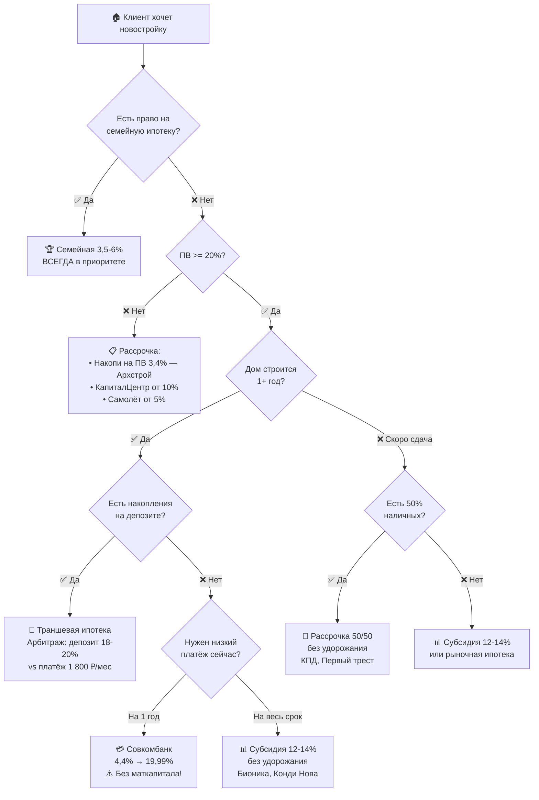

# 🎓 Практикум «Способы покупки новостроек»

*Обучающий модуль для агентов по новостройкам*
*Актуальность данных: июнь 2026, рынок Уфы*

---

## Как устроен этот практикум

Ты пройдёшь 5 блоков. Каждый следующий опирается на предыдущий:

> [!IMPORTANT]
> **Главное правило этого обучения:** Не сравнивай инструменты по «ставке в рекламе». Сравнивай по **полной стоимости владения**: цена квартиры + удорожание + все проценты за весь срок кредита. Агент, который это умеет — закрывает сделки. Агент, который не умеет — теряет клиентов.

---

# 📖 БЛОК 1. Теория: 4 способа покупки новостройки

## 1.1. Четыре инструмента за 2 минуты

| # | Инструмент | Суть одним предложением |
|---|-----------|------------------------|
| 1 | **Траншевая ипотека** | Банк выдаёт кредит частями — ты платишь проценты только на выданную часть, цена квартиры не меняется |
| 2 | **Субсидированная ипотека** | Застройщик платит банку комиссию, чтобы снизить тебе ставку — но часто прибавляет к цене квартиры |
| 3 | **Рассрочка** | Платишь напрямую застройщику без банка, потом переходишь на ипотеку или вносишь остаток наличными |
| 4 | **Сниженный платёж Совкомбанка** | Совкомбанк снижает ставку на первый год до 4,4%, потом поднимает до рыночной — но без удорожания квартиры |

---

## 1.2. Кому подходит, а кому нет

| Критерий клиента | Траншевая | Субсидия | Рассрочка | Совкомбанк |
|:---|:---:|:---:|:---:|:---:|
| **Маткапитал в ПВ** | ✅ Да | ✅ Да | ⚠️ По согласованию | ❌ **ЗАПРЕЩЁН** |
| **ПВ < 20%** | ❌ (мин. 10-20%) | ❌ (мин. 20,1%) | ✅ от 3,4% (Архстрой) | ❌ (мин. 20,01%) |
| **Дом строится 1+ год** | ✅ Идеально | ✅ Подходит | ✅ Мост к ипотеке | ✅ На 12 мес. |
| **Нужен предсказуемый платёж** | ❌ Обрыв при вводе | ✅ На весь срок | ❌ Остаток разово | ❌ Обрыв на 13-й мес. |
| **Есть деньги на депозите** | ✅ Арбитраж | — | — | — |
| **Не одобряют ипотеку** | ❌ | ❌ | ✅ Без банка | ❌ |
| **Боится удорожания** | ✅ 0% | ❌ до +15,5% | ⚠️ до +30% | ✅ Почти всегда 0% |

---

## 1.3. Дерево выбора: с чего начать разговор с клиентом

> [!TIP]
> **Распечатай это дерево** и держи перед глазами при каждом разговоре с клиентом. Через 20 клиентов оно будет в голове автоматически.

---

## 1.4. Пять красных флагов — что ОБЯЗАН проговорить клиенту

| # | Красный флаг | Где встречается | Что сказать клиенту |
|---|:---|:---|:---|
| 🚩 1 | **Обрыв платежа после льготного периода** | Субсидия 0,11-6% → 19-22%; Совком 4,4% → 19,99% | «Ваш платёж вырастет с ___ до ___ рублей на 13-й месяц. Давайте посчитаю точно» |
| 🚩 2 | **Обрыв при финальном транше** | Траншевая ипотека при вводе дома | «Платёж вырастет в 15-50 раз при получении ключей. Нужен план: досрочка, рефинанс или продажа» |
| 🚩 3 | **Скрытое удорожание в «бесплатной» рассрочке** | Архстрой +5-10 тыс./м²; Самолёт до +30% при ПВ 10% | «Рассрочка бесплатная, но цена квартиры выше на ___ рублей. Считаем вместе» |
| 🚩 4 | **Маткапитал запрещён** | Совкомбанк «Сниженный платёж» | «В эту программу маткапитал нельзя. Давайте посмотрим траншевую — там можно» |
| 🚩 5 | **Ключи до полной оплаты — почти никогда** | Все рассрочки (кроме индив. у КПД, Альтима) | «Ключи получите только после 100% оплаты. Пока идёт рассрочка — заселиться нельзя» |

---

## 1.5. Сводная экономика на эталонном лоте

Один и тот же лот: **6 000 000 ₽, 55 м², ПВ 20,1%, срок 30 лет.**

| Сценарий | Платёж, год 1 | Платёж после стабилизации | Полная стоимость |
|:---|---:|---:|---:|
| Траншевая (Сбер, транш 100к) | **~1 800 ₽/мес** | ~86 800 ₽/мес | ~32,5 млн ₽ |
| Субсидия 12,49% (весь срок, 0% удорожание) | ~51 100 ₽/мес | ~51 100 ₽/мес | **~19,6 млн ₽** |
| Совком (4,4% → 19,99%) | ~24 000 ₽/мес | ~80 200 ₽/мес | ~28,9 млн ₽ |
| Рассрочка Архстрой (ПВ 30%, +10к/м²) | 40 000 ₽/мес | ~45 200 ₽/мес* | ~18,2 млн ₽* |

\* После 9 мес. рассрочки остаток переводится в ипотеку 12,49%.

**Главный вывод:** Самый дешёвый вариант — субсидия 12,49% без удорожания (Бионика Парк, Конди Нова). Самый дорогой — траншевая ипотека, если не гасить досрочно.

---

# 🧮 БЛОК 2. Практикум: считаем на калькуляторе

> [!IMPORTANT]
> **Что тебе понадобится:**
> 1. Компьютер или телефон с браузером
> 2. Калькулятор Домклик: **https://domclick.ru/ipoteka/calculator** — открой его прямо сейчас
> 3. Блокнот для записи результатов
> 4. Время: ~45 минут на все 4 задания

---

## Задание 1. Траншевая ипотека 🏦

### Вводная
Клиент покупает квартиру в **ЖК Нью лайф**. Цена: **5 500 000 ₽**. Первоначальный взнос: **20,1%**. По условиям траншевой — первый транш банка: **100 000 ₽**. Ставка: **21,7%**. Срок: **30 лет**.

### Пошаговая инструкция

**Шаг 1.** Открой калькулятор Домклик (https://domclick.ru/ipoteka/calculator).

**Шаг 2.** Рассчитай «полный» платёж (как будто весь кредит выдан сразу):
- Стоимость квартиры: **5 500 000**
- Первоначальный взнос: **20,1%** → это ~1 105 500 ₽
- Сумма кредита: 5 500 000 − 1 105 500 = **4 394 500 ₽**
- Ставка: **21,7%**
- Срок: **30 лет**
- 📝 Запиши платёж: _____________ ₽/мес ← это «платёж после выдачи второго транша»

**Шаг 3.** Теперь рассчитай платёж на первый транш:
- Введи сумму кредита: **100 000 ₽** (игнорируй стоимость квартиры, введи напрямую сумму кредита)
- Ставка: **21,7%**
- Срок: **30 лет**
- 📝 Запиши платёж: _____________ ₽/мес ← это «платёж на первый год»

**Шаг 4.** Посчитай разницу:

> ❓ **Вопрос 1:** Во сколько раз вырастет платёж при выдаче второго транша?
> 
> Формула: Платёж полный ÷ Платёж на 100к = ?

**Шаг 5.** Посчитай «арбитраж с депозитом»:
- Клиент мог бы положить ПВ (1 105 500 ₽) на депозит под 18% годовых
- Доход с депозита за год: 1 105 500 × 0,18 = **198 990 ₽/год** = ~16 583 ₽/мес
- Платёж по траншу: ~1 800 ₽/мес

> ❓ **Вопрос 2:** Сколько «зарабатывает» клиент в месяц на арбитраже? (Доход депозита − платёж транша)

### Эталонные ответы
- Полный платёж: **~79 400 ₽/мес** (на сумму ~4,4 млн)
- Платёж на 100к: **~1 810 ₽/мес**
- Рост: **в ~44 раза**
- Арбитраж: 16 583 − 1 810 = **~14 773 ₽/мес чистыми** (пока дом строится)

---

## Задание 2. Субсидированная ипотека 📊

### Вводная
Тот же клиент. Тот же ЖК. Но застройщик предлагает программу субсидирования: **ставка 12,49% на весь срок**, при этом цена квартиры с удорожанием **+8%**.

### Пошаговая инструкция

**Шаг 1.** Рассчитай новую стоимость квартиры:
- Базовая цена: 5 500 000 ₽
- Удорожание: +8% → 5 500 000 × 1,08 = **5 940 000 ₽**
- Переплата в цене: 5 940 000 − 5 500 000 = **440 000 ₽**

**Шаг 2.** На Домклик:
- Стоимость: **5 940 000**
- ПВ: **20,1%** → ~1 193 940 ₽
- Сумма кредита: ~4 746 060 ₽
- Ставка: **12,49%**
- Срок: **30 лет**
- 📝 Запиши платёж: _____________ ₽/мес

**Шаг 3.** Посчитай полную переплату за 30 лет:
- Полная стоимость = ПВ + (ежемесячный платёж × 360 месяцев)
- 📝 Запиши: _____________ ₽

**Шаг 4.** Сравни с траншевой (полный платёж после ввода):

> ❓ **Вопрос 1:** На сколько рублей в месяц субсидия дешевле рыночной ипотеки (21,7%)?

> ❓ **Вопрос 2:** За сколько лет экономия на процентах «отбивает» удорожание 440 000 ₽?
> 
> Формула: 440 000 ÷ (платёж рыночный − платёж субсидия) ÷ 12 = ? лет

### Эталонные ответы
- Платёж по субсидии: **~50 500 ₽/мес** (стабильный 30 лет)
- Платёж рыночный (21,7%): ~79 400 ₽/мес
- Экономия: ~28 900 ₽/мес
- Отбивается за: 440 000 ÷ 28 900 ≈ **~15 месяцев** — через 1 год и 3 месяца удорожание уже окупается!

---

## Задание 3. Рассрочка от застройщика 🤝

### Вводная
Клиент выбирает рассрочку от Архстроя в ЖК Цветы Башкирии. Условия: **ПВ 30%**, удорожание: **+10 000 ₽/м²**, площадь: **55 м²**, срок рассрочки: **9 месяцев**, затем переход на ипотеку.

### Пошаговая инструкция

**Шаг 1.** Рассчитай удорожание:
- 10 000 ₽ × 55 м² = **550 000 ₽**
- Новая цена: 5 500 000 + 550 000 = **6 050 000 ₽**

**Шаг 2.** Рассчитай ПВ и сумму рассрочки:
- ПВ 30%: 6 050 000 × 0,30 = **1 815 000 ₽**
- Остаток: 6 050 000 − 1 815 000 = **4 235 000 ₽**

**Шаг 3.** Ежемесячный платёж по рассрочке:
- Ежемесячный платёж по программе «Рассрочка для всех» (ПВ 30%, 2-к.кв.): **45 000 ₽/мес**
- За 9 месяцев: 45 000 × 9 = **405 000 ₽**
- Остаток для ипотеки: 4 235 000 − 405 000 = **3 830 000 ₽**

**Шаг 4.** На Домклик — рассчитай ипотеку на остаток:
- Сумма кредита: **3 830 000 ₽**
- Ставка: **12,49%** (субсидированная)
- Срок: **25 лет** (30 минус рассрочка)
- 📝 Запиши платёж: _____________ ₽/мес

> ❓ **Вопрос 1:** Какая суммарная переплата за всё время (ПВ + рассрочка + ипотека за 25 лет)?

> ❓ **Вопрос 2:** Удорожание 550 000 ₽ — это сколько % от базовой цены квартиры (5 500 000)? Стоит ли «бесплатная» рассрочка этих денег?

### Эталонные ответы
- Платёж по ипотеке после рассрочки: **~41 400 ₽/мес**
- Полная стоимость: 1 815 000 (ПВ) + 405 000 (рассрочка) + 41 400 × 300 (ипотека) = ~14 640 000 ₽
- Удорожание: 550 000 ÷ 5 500 000 = **10%** — клиент платит «скрытые» 10% за «бесплатную» рассрочку

---

## Задание 4. Сниженный платёж Совкомбанка 💳

### Вводная
Клиент **без маткапитала** (своими деньгами). Покупает в ЖК Нова. Цена: **5 500 000 ₽**. ПВ: **20,01%**. Программа Совкомбанка: **4,4% первый год → 19,99% далее**. Без удорожания.

### Пошаговая инструкция

**Шаг 1.** На Домклик — рассчитай платёж за первый год:
- Сумма кредита: 5 500 000 − (5 500 000 × 0,2001) = 5 500 000 − 1 100 550 = **~4 399 450 ₽**
- Ставка: **4,4%**
- Срок: **30 лет**
- 📝 Платёж год 1: _____________ ₽/мес

**Шаг 2.** Рассчитай платёж после 12-го месяца:
- Та же сумма кредита: ~4 399 450 ₽ (упрощённо, без учёта погашенного тела)
- Ставка: **19,99%**
- Срок: **29 лет** (осталось)
- 📝 Платёж со 2-го года: _____________ ₽/мес

**Шаг 3.** Посчитай «экономию» и «обрыв»:
- Сравни с рыночной ставкой 21,7% → платёж ~79 400 ₽/мес

> ❓ **Вопрос 1:** Во сколько раз вырастет платёж с 12-го на 13-й месяц?

> ❓ **Вопрос 2:** Сколько клиент «экономит» за 12 месяцев по сравнению с рыночной ипотекой 21,7%? Формула: (Платёж рыночный − Платёж Совком) × 12

> ❓ **Вопрос 3:** Представь, что ты — агент. Клиент говорит: «Мне подруга сказала, что можно ипотеку под 4 процента взять». Что ты ответишь? (Запиши своими словами)

### Эталонные ответы
- Платёж год 1 (4,4%): **~22 200 ₽/мес**
- Платёж год 2+ (19,99%): **~73 600 ₽/мес**
- Рост: **в ~3,3 раза**
- «Экономия» за год: (79 400 − 22 200) × 12 = **~686 400 ₽**
- Но с 13-го месяца платёж — 73 600 ₽/мес. Клиент должен быть готов.

---

# 🧩 БЛОК 3. Тест: «Какой инструмент предложить?»

> Прочитай описание клиента. Выбери один или два оптимальных инструмента. Обоснуй, почему именно этот. Ответы — в конце блока.

---

### Кейс 1
**Ирина, 32 года.** Замужем, двое детей (3 и 6 лет). Доход семьи 95 000 ₽/мес. ПВ: маткапитал 833 000 ₽ + накопления 400 000 ₽. Хочет 2-комнатную до 6 000 000 ₽.

🤔 Твой ответ: _____________________________________________

---

### Кейс 2
**Тимур, 25 лет.** Холостой, без детей. Зарплата 60 000 ₽/мес. Накопления 450 000 ₽ (наличные). Хочет студию до 3 500 000 ₽. ПВ не хватает до 20%.

🤔 Твой ответ: _____________________________________________

---

### Кейс 3
**Олег, 40 лет.** Продаёт трёхкомнатную на вторичке (покупатель найден, сделка через 2 месяца, получит ~4 000 000 ₽). Хочет забронировать квартиру в ЖК Урбан Мартен за 7 000 000 ₽.

🤔 Твой ответ: _____________________________________________

---

### Кейс 4
**Лейла, 35 лет.** Замужем, без детей. Доход 120 000 ₽/мес. Накопления 1 800 000 ₽ (наличные). Хочет купить 2-комнатную за 6 500 000 ₽ и платить «комфортный платёж на 20 лет». Боится удорожания.

🤔 Твой ответ: _____________________________________________

---

### Кейс 5
**Ренат, 38 лет.** ПВ 2 000 000 ₽ (наличные) + на депозите 3 000 000 ₽ под 18%. Хочет квартиру за 7 000 000 ₽ в доме, который сдаётся через 2 года.

🤔 Твой ответ: _____________________________________________

---

### Кейс 6
**Айгуль, 29 лет.** Без детей, не замужем. ПВ: 1 500 000 ₽ наличными (без маткапитала). Ждёт повышение на работе через 8 месяцев (+30% к зарплате). Квартира в ЖК Нова — 4 200 000 ₽.

🤔 Твой ответ: _____________________________________________

---

### Кейс 7
**Семья Николаевых.** ПВ: 3 500 000 ₽ наличными. Квартира 7 000 000 ₽. Дом сдаётся через 4 месяца. Хотят заселиться как можно скорее.

🤔 Твой ответ: _____________________________________________

---

### Кейс 8
**Дмитрий, 30 лет.** Одинокий, 1 ребёнок. ПВ = маткапитал 833 000 ₽ + 200 000 ₽. Доход 45 000 ₽/мес. Хочет студию до 3 000 000 ₽.

🤔 Твой ответ: _____________________________________________

---

### Кейс 9
**Инвестор Артур.** Покупает студию за 3 200 000 ₽ для перепродажи через 2 года (после сдачи дома). ПВ: 1 000 000 ₽. Не планирует жить — только заработать.

🤔 Твой ответ: _____________________________________________

---

### Кейс 10
Клиент звонит и говорит: **«Мне застройщик предложил ипотеку под 0,1%. Это же лучше всех ваших вариантов?!»**

🤔 Что ты ответишь? _____________________________________________

---

### ✅ Ответы к тесту

👉 Нажми, чтобы открыть ответы

**Кейс 1 — Ирина:**
🏆 **Семейная ипотека 3,5-6%** — есть дети до 6 лет, это приоритет №0. Не коммерческая субсидия! ПВ = 833 000 + 400 000 = 1 233 000 ₽ (20,6% от 6 млн — проходит). Совкомбанк отпадает: маткапитал в ПВ запрещён.

**Кейс 2 — Тимур:**
📋 **Рассрочка «Накопи на ПВ»** (Архстрой, 3,4%) или **рассрочка КапиталЦентр** (ПВ 10%). У Тимура ПВ = 450 000 из 3 500 000 → 12,9%. Ипотека требует 20,1%. Рассрочка позволяет зафиксировать цену и копить.

**Кейс 3 — Олег:**
📋 **Trade-In рассрочка от Самолёта** (5/95, 3 месяца). ПВ = 5% от 7 000 000 = 350 000 ₽ (у Олега есть). Через 2-3 мес. получает деньги от продажи и закрывает остаток. Без удорожания.

**Кейс 4 — Лейла:**
📊 **Субсидия 12-14% на весь срок без удорожания** (Бионика Парк, Конди Нова — 12,49%). ПВ = 1 800 000 из 6 500 000 = 27,7% (проходит). Боится удорожания → ищем программы без удорожания. Предсказуемый платёж на 20 лет.

**Кейс 5 — Ренат:**
🏦 **Траншевая ипотека** — классический арбитраж. ПВ 2 000 000 (28,6%). Депозит 3 000 000 под 18% = 45 000 ₽/мес дохода. Платёж по траншу 100к: ~1 800 ₽/мес. Чистый плюс: ~43 000 ₽/мес 2 года, пока дом строится. При вводе — досрочное погашение с депозита.

**Кейс 6 — Айгуль:**
💳 **Сниженный платёж Совкомбанка** (4,4% → 19,99%). ПВ: 1 500 000 из 4 200 000 = 35,7% (проходит). Маткапитала нет — ОК. Ждёт повышение → через 8 мес. сможет платить больше. За год экономит ~400 000 ₽ по сравнению с рынком.

**Кейс 7 — Николаевы:**
🤝 **Рассрочка 50/50 без удорожания** (Первый трест, КПД, Альтима). ПВ = 3 500 000 = 50% от 7 000 000 — идеально для рассрочки 50/50. Дом через 4 мес. → рассрочка короткая, ключи после полной оплаты.

**Кейс 8 — Дмитрий:**
🏆 **Семейная ипотека** — 1 ребёнок = право на программу. ПВ = 833 000 + 200 000 = 1 033 000 ₽ (34,4% от 3 000 000). Ставка 3,5-6% на весь срок. **НЕ Совкомбанк** — маткапитал в ПВ запрещён!

**Кейс 9 — Артур-инвестор:**
🏦 **Траншевая ипотека.** ПВ 1 000 000 из 3 200 000 = 31,3%. Транш 100к → платёж ~1 800 ₽/мес 2 года. Минимум затрат до перепродажи. При продаже — закрывает кредит целиком. Рассрочка тоже вариант, но траншевая дешевле (0% удорожания).

**Кейс 10 — «0,1% ипотека»:**
🚩 **Красный флаг!** Ответ: «Давайте разберём вместе. 0,1% — это ставка на **льготный период** (обычно 1 год). После этого ставка вырастает до 18-22%. Плюс, скорее всего, есть удорожание цены квартиры. Давайте я посчитаю на калькуляторе обе программы — с 0,1% и без, и покажу вам полную стоимость за весь срок. Вот тогда будет понятно, что реально дешевле.»

---

# 📋 БЛОК 4. Шпаргалка для работы с клиентом

> [!TIP]
> Эта шпаргалка — в отдельном файле для печати: [[Шпаргалка — Способы покупки]]

### Экспресс-таблица (держи перед глазами)

| Инструмент | Платёж год 1 (на 6 млн) | Платёж год 3+ | Удорожание | МК в ПВ | Когда предлагать |
|:---|:---:|:---:|:---:|:---:|:---|
| **Траншевая** | ~1 800 ₽ | ~86 800 ₽ | 0% | ✅ | Депозит + дом строится |
| **Субсидия 12,49%** | ~51 100 ₽ | ~51 100 ₽ | 0-15% | ✅ | Хочет стабильность |
| **Рассрочка** | 30-50к ₽ | Переход на ипотеку | 0-30% | ⚠️ | Нет ПВ / ждёт деньги |
| **Совкомбанк** | ~22 200 ₽ | ~73 600 ₽ | 0% | ❌ | Нет МК, рост дохода |

### Ссылки для работы
- 🧮 **Калькулятор Домклик:** https://domclick.ru/ipoteka/calculator
- 📊 **Калькулятор ЦБ РФ:** https://cbr.ru/calc/mortgage/

### Топ-3 ЖК на каждый инструмент (максимум гибкости)

| Инструмент | ЖК с лучшими условиями |
|:---|:---|
| **Траншевая (транш 100к)** | Зорге.Премьер (1 716 ₽/мес), Нью лайф, Старая Уфа |
| **Субсидия без удорожания** | Бионика Парк (12,49%), Конди Нова (12,49%), Геос (6% на 2 года) |
| **Рассрочка без удорожания** | КПД 25/25/50, Первый трест 50/50, Альтима 50/50 |
| **Совкомбанк без удорожания** | Нова (4,4%), Зорге.Премьер (4,4%), Архстрой (14,2%) |

### ЖК со всеми 4 инструментами одновременно
**ЖК Свой берег / 8 Марта / Цветы Башкирии** (Архстрой) и **ЖК Старая Уфа** (Кирпич Холдинг) — максимум вариантов для клиента.

---

# 🎯 БЛОК 5. Итоговое задание: «Подготовь расчёт для клиента»

> [!IMPORTANT]
> Это задание имитирует реальную работу. Ты должен подготовить **полноценное сравнение** для клиента — с числами, которые ты посчитал на калькуляторе. Результат — таблица, которую можно отправить клиенту в мессенджер.

---

## Кейс А. Семья с маткапиталом

**Алексей, 34 года.** Жена, ребёнок 2 года. Доход семьи: **120 000 ₽/мес**. Маткапитал: **833 000 ₽**. Накопления: **800 000 ₽**. Хотят 2-комнатную в **ЖК Свой берег** от **6 500 000 ₽**. Дом сдаётся через **1,5 года**.

### Что сделать:

1. **Определи, какие программы подходят** (используй дерево из Блока 1)
2. **Рассчитай 3 варианта** на калькуляторе Домклик:
   - Вариант 1: Семейная ипотека (ставка 3,5-5%, ПВ = МК + накопления)
   - Вариант 2: Траншевая ипотека (транш 500 000 ₽, ставка 21,7%)
   - Вариант 3: Рассрочка «для беременных» (ПВ 20,1%, 20 000 ₽/мес, 9 мес.) → переход на семейную
3. **Заполни таблицу для клиента:**

| Параметр | Семейная ипотека | Траншевая | Рассрочка → семейная |
|:---|:---|:---|:---|
| ПВ, ₽ | | | |
| Платёж, год 1, ₽/мес | | | |
| Платёж, год 3+, ₽/мес | | | |
| Полная стоимость за 30 лет, ₽ | | | |
| Удорожание квартиры, ₽ | | | |

4. **Напиши рекомендацию** (2-3 предложения): что лучше для Алексея и почему

---

## Кейс Б. Одинокий покупатель без маткапитала

**Марина, 28 лет.** Не замужем, без детей. Доход: **65 000 ₽/мес**. Накопления: **1 500 000 ₽** (наличные, без маткапитала). Хочет студию в **ЖК Нова** от **3 200 000 ₽**. Дом сдаётся через **1 год**.

### Что сделать:

1. **Определи 2 лучших варианта** для Марины
2. **Рассчитай каждый** на калькуляторе Домклик
3. **Заполни таблицу:**

| Параметр | Вариант 1: ___________ | Вариант 2: ___________ |
|:---|:---|:---|
| ПВ, ₽ | | |
| Платёж, год 1, ₽/мес | | |
| Платёж, год 2+, ₽/мес | | |
| Полная стоимость, ₽ | | |
| Подводные камни | | |

4. **Проверь красные флаги** — есть ли что-то, о чём обязательно предупредить Марину?
5. **Напиши рекомендацию** (2-3 предложения)

---

### Критерии оценки итогового задания

| Критерий | Отлично ✅ | Хорошо ⚠️ | Нужно доработать ❌ |
|:---|:---|:---|:---|
| Расчёты сходятся | Совпадают с калькулятором ±5% | Мелкие ошибки округления | Грубые ошибки, не считал |
| Выбор инструментов | Учёл семейную, МК, красные флаги | Забыл одну опцию | Предложил Совкомбанк с МК |
| Красные флаги | Все 5 проверил | Упомянул 3 из 5 | Не упоминал обрыв платежа |
| Рекомендация клиенту | Конкретная, с числами | Общие слова | «Вам подойдёт ипотека» |

---

## 📂 Связанные материалы

- **Полная база условий:** [[9. Застройщики/Способы покупок/INDEX|Индекс способов покупки]]
- **Сравнительный калькулятор (Excel):** [[Калькулятор 4 сценария]]
- **Приоритет подбора инструмента:** [[Приоритет подбора]]
- **Разбор каждого инструмента:**
  - [[Условия траншевой ипотеки]]
  - [[Условия субсидированной ипотеки]]
  - [[Условия рассрочек]]
  - [[Условия сниженного платежа|Условия сниженного платежа Совкомбанка]]

---

*Создано: 24.06.2026 | Актуальность данных: июнь 2026*

---

## 📞 Контакты автора

**Антон Цой** — 8 987 240 87 87
Системные продажи недвижимости & Развитие Партнёрского канала
Telegram: @anton_tsoy
Специализация: Обучающие программы для агентов по новостройкам

---

© 2026 Антон Цой. Все права защищены. При копировании материалов ссылка на автора обязательна.
