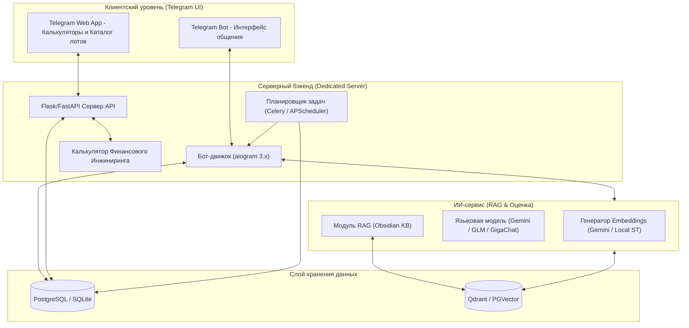
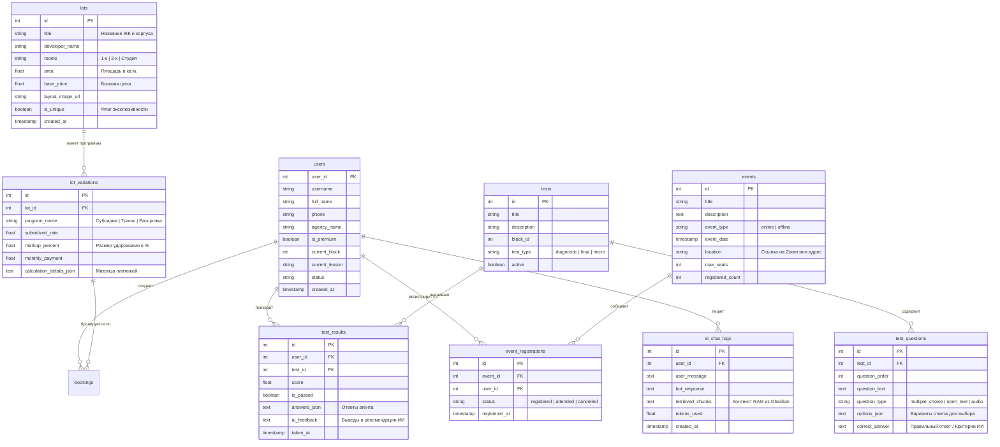

# Архитектура экосистемы Telegram-бота «СРЕДА ОБУЧЕНИЯ 2.0»

Данный документ описывает целевую архитектуру, схему базы данных, математику финансовых инструментов и ИИ-интеграцию для Telegram-бота обучения и автоматизации работы агентов по недвижимости.

---

## 🗺️ 1. Общая архитектурная схема

Система проектируется по трехзвенной архитектуре с выделенным ИИ-сервисом и интеграцией с вашей базой знаний Obsidian.



---

## 🛠️ 2. Технологический стек

* **Бот-движок:** `aiogram 3.x` (Python) — асинхронный, поддерживает Web App, кастомные клавиатуры и FSM (Finite State Machine).
* **API-сервер:** `FastAPI` (рекомендуется взамен Flask для лучшей асинхронности и производительности при ИИ-запросах) или текущий `Flask`.
* **База данных:** 
  * *Текущая:* SQLite (`bot_obucheniya.db`).
  * *Целевая для выделенного сервера:* `PostgreSQL` (обеспечивает многопоточность, надежность и интеграцию расширения `pgvector` для ИИ-поиска).
* **Векторная БД (для RAG):** `pgvector` (внутри Postgres) или `Qdrant` (легковесный Docker-контейнер на вашем сервере).
* **ИИ-модели (LLM & Embeddings):** 
  * Интеграция через API: `Gemini API` (Flash/Pro) — уже настроен в `.env`, либо отечественный `GigaChat API` / `YandexGPT API`.
  * При желании использовать GLM: `ChatGLM API` (через Zhipu AI) или развертывание локальной модели класса `Llama-3-8B-Instruct` / `Qwen-2.5-7B-Instruct` на вашем выделенном сервере (требуется GPU с 16GB+ VRAM, например, RTX 3090/4090).

---

## 📊 3. Расширенная схема базы данных

Для реализации нового функционала (тесты, мероприятия, уникальные лоты и ИИ-логи) текущая схема дополняется следующими таблицами:



---

## 🧮 4. Математика Финансового Инжиниринга (Ядро Калькулятора)

Калькулятор реализуется как на стороне бэкенда (Python API), так и в TWA (JavaScript) для мгновенного рендеринга без задержек сети.

### 4.1. Стандартная аннуитетная ипотека
Расчет ежемесячного платежа ($M$):
$$M = P \cdot \frac{r(1+r)^n}{(1+r)^n - 1}$$
Где:
* $P$ — Тело кредита (Цена лота $-$ Первоначальный взнос)
* $r$ — Месячная процентная ставка ($Rate_{annual} / 12 / 100$)
* $n$ — Срок кредита в месяцах (например, $30 \text{ лет} \times 12 = 360$)

---

### 4.2. Субсидированная ставка (с удорожанием)
Застройщики снижают ставку (например, с $18\%$ до $6\%$), но увеличивают стоимость квартиры на величину наценки (Markup, например, $15\%$).

**Входные параметры:**
* $Price_{base}$ — Базовая цена
* $Markup$ — Удорожание (коэффициент, например, $0.15$ для $15\%$)
* $Rate_{std}$ — Стандартная ставка ($18\%$)
* $Rate_{sub}$ — Субсидированная ставка ($6\%$)

**Алгоритм расчета:**
1. **Цена с удорожанием:** 
   $$Price_{sub} = Price_{base} \cdot (1 + Markup)$$
2. **Тело кредита для обоих вариантов:**
   $$P_{std} = Price_{base} - PV \quad | \quad P_{sub} = Price_{sub} - PV$$
   *(Где $PV$ — первоначальный взнос)*
3. **Ежемесячные платежи:**
   Вычисляются платежи $M_{std}$ и $M_{sub}$ по стандартной формуле аннуитета.
4. **Сравнение переплаты по процентам за период $T$ лет (обычно 5, 10 или 30 лет):**
   $$Overpay_{std} = (M_{std} \cdot T \cdot 12) - P_{std}$$
   $$Overpay_{sub} = (M_{sub} \cdot T \cdot 12) - P_{sub}$$
5. **Точка окупаемости (Break-Even Point в годах):**
   Время, за которое экономия на ежемесячном платеже перекроет сумму удорожания:
   $$Years_{break\_even} = \frac{Price_{sub} - Price_{base}}{(M_{std} - M_{sub}) \cdot 12}$$

---

### 4.3. Трашневая ипотека («Ипотека за 1 рубль»)
Банк выдает кредит частями (траншами). Обычно 1-й транш выдается сразу (например, $10-15\%$ от суммы кредита или фиксированно 100 рублей), а 2-й транш — за 3-6 месяцев до ввода дома в эксплуатацию.

**Алгоритм расчета:**
1. **Период 1 (До сдачи дома, например, первые 24 месяца):**
   Платеж рассчитывается на основе только первого транша:
   $$P_1 = Loan_{total} \cdot Tranche_1\_Percent$$
   $$M_{phase1} = P_1 \cdot \frac{r(1+r)^n}{(1+r)^n - 1}$$
   *(Если по программе идет транш "1 рубль в месяц", то платеж принудительно приравнивается к 1 рублю, а проценты капитализируются или субсидируются).*
2. **Период 2 (После сдачи дома до конца срока):**
   Платеж пересчитывается на основе полной суммы кредита с учетом оставшегося срока ($n - 24$ месяцев):
   $$M_{phase2} = Loan_{total} \cdot \frac{r(1+r)^{n - 24}}{(1+r)^{n - 24} - 1}$$
3. **Инвестиционный эффект депозита:**
   Показывает выгоду схемы: если у агента или клиента есть полная сумма на руках, первый взнос вносится, а оставшиеся деньги кладутся на депозит (например, под $19\%$). За 2 года действия траншевой ипотеки депозит генерирует сложный процент, который покрывает часть будущей ипотеки.

---

### 4.4. Рассрочки
Индивидуальный график платежей от застройщика (например, 30/30/40). Калькулятор рассчитывает даты, суммы и сравнивает их с финансовой нагрузкой по ипотеке, выводя график Cash Flow для клиента.

---

## 🤖 5. Архитектура AI Copilot & RAG (Интеграция с Obsidian)

Интеграция искусственного интеллекта на подхвате строится по технологии **RAG (Retrieval-Augmented Generation)** на базе материалов вашего Obsidian-хранилища.

### 5.1. Пайплайн обработки базы знаний (Sync & Vectorization)
```
[Obsidian Vault] ➔ [Скрипт парсинга .md] ➔ [Разбивка на чанки (300-500 токенов)]
        ➔ [Генерация Embeddings (Gemini Embeddings)] ➔ [Сохранение в Vector DB (Qdrant)]
```
* **Парсинг:** Скрипт на Python автоматически сканирует папку `6. обучения агентов` (и другие папки, например, `Методички`, `Серия reels про первый контакт`).
* **Чанкинг:** Тексты делятся на смысловые блоки (например, одна ролевая игра, один скрипт отработки возражения).
* **Синхронизация:** Запускается по cron (например, каждую ночь) или по вебхуку при изменении файлов в Git.

### 5.2. Сценарий работы ИИ в чате бота (Q&A Copilot)
Когда агент пишет вопрос в бот (например: *«Как отработать возражение, если клиент хочет переждать на депозите?»*):
1. Бот перехватывает сообщение.
2. Текст вопроса отправляется в Vector DB для поиска топ-3 наиболее релевантных статей/скриптов из вашего Obsidian.
3. Формируется системный промпт для LLM (Gemini/GLM):
   ```
   Ты — ИИ-коуч в роли Антона Цоя (Tone of Voice: прямо, по делу, без давления, "я объясняю, а не продаю", методология Навигатора).
   
   Используй ТОЛЬКО предоставленный контекст из базы знаний для ответа на вопрос агента.
   Если в контексте нет ответа, аккуратно скажи об этом и предложи обратиться в поддержку.
   
   Контекст:
   [Текст Чанка 1: Ролевая игра 2 "Я пережду на депозите"]
   [Текст Чанка 2: Блок 6.2 Отработка возражений]
   
   Вопрос агента: {user_message}
   Ответ:
   ```
4. LLM генерирует ответ в вашем фирменном стиле (ToV) с конкретными цифрами и расчетами.
5. Бот отправляет ответ агенту, прикрепляя ссылку на соответствующую заметку Obsidian (если она опубликована во внутреннем портале) или урок.

---

## 🎯 6. Модуль интерактивного тестирования и микрозапусков

### 6.1. Тестирование с ИИ-оценкой (AI Assessment)
Для уроков, требующих сдачи аудио (например, запись отработки скрипта):
1. Агент присылает голосовое сообщение в бот.
2. Бот отправляет аудиофайл в API распознавания речи (Whisper или напрямую в Gemini, которая умеет работать с аудио).
3. Полученный текст оценивается LLM по критериям:
   * Наличие этапа **Присоединение** (есть/нет)
   * Наличие **Разрушения иллюзии** (есть/нет)
   * **Финансовый аргумент** (правильность расчетов)
   * **Призыв к расчету** (мягкий переход)
   * Соблюдение Tone of Voice (отсутствие манипулятивного давления типа "завтра ставки вырастут, бегите брать").
4. ИИ выносит вердикт: `Approved / Rejected` и пишет разбор ошибок: *"Ты отлично привел расчеты, но пропустил Шаг 1 — присоединение. Клиент почувствует давление. Попробуй начать с фразы..."*

### 6.2. Микрозапуски (Когорты и Челленджи)
* Администратор может запустить "Поток обучения" для конкретного агентства недвижимости или группы агентов.
* Система настраивает расписание: уроки открываются одновременно для всей группы (например, каждый понедельник и четверг).
* Бот собирает аналитику прохождения по когорте и присылает РОПу/Директору отчет в виде таблицы Excel: кто застрял на каком блоке, у кого лучшие результаты тестов.

---

## 📅 7. Поэтапный план реализации (Roadmap)

### 📈 Фаза 1: Инфраструктура и База знаний ИИ (1-2 недели)
* [ ] Развертывание PostgreSQL и векторного хранилища на выделенном сервере.
* [ ] Написание скрипта автосинхронизации Obsidian-заметок с векторной БД.
* [ ] Подключение API модели Gemini / GLM-модели.
* [ ] Запуск функции "Спроси ИИ-Навигатора" в тестовом режиме для администраторов.

### 🧮 Фаза 2: Модуль Финансового Инжиниринга (2 недели)
* [ ] Разработка JS-библиотеки расчетов (Аннуитет, Субсидированная, Трашневая, Рассрочка).
* [ ] Интеграция калькулятора в Telegram Web App (TWA) с адаптивным премиум-дизайном (слайдеры, графики переплат, сравнение Вторичка vs Новостройка).
* [ ] Добавление в меню бота команды `/calc` для быстрого вызова калькулятора.

### 📝 Фаза 3: Тестирование и Сценарии обучения (2-3 недели)
* [ ] Реализация движка многоуровневых тестов в боте и TWA (квизы, выбор вариантов, открытые вопросы).
* [ ] Внедрение Whisper + LLM для автоматической проверки аудио-ДЗ агентов.
* [ ] Создание системы выводов и рекомендаций по итогам тестов (выдача полезных чек-листов при провале темы).
* [ ] Добавление аналитики микрозапусков (когортный анализ прогресса).

### 🏠 Фаза 4: Каталог Уникальных Лотов и События (2 недели)
* [ ] Разработка интерфейса каталога лотов в TWA с фильтрацией по финансовым параметрам (размер платежа, ПВ).
* [ ] Модуль мероприятий: создание встреч админом, RSVP от агентов, автонапоминания по крону.
* [ ] Полноценный запуск экосистемы и подключение аналитического дашборда для РОПа.
