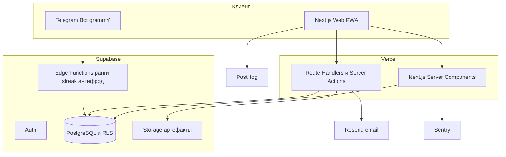

Дата: 2026-04-26
Назначение: решение по техническому стеку дашборда новичка и архитектура системы.

---

# 1. Стек и архитектура

## 1.1. Решение по стеку

**Выбран путь:** Next.js 15 + Supabase с самого старта, MVP узкий по фичам.

### Почему не no-code

| Критерий | No-code (Airtable + Softr) | Next.js + Supabase |
|---------|---------------------------|---------------------|
| Скорость до 1-го потока | 1–2 недели | 3–4 недели |
| Стоимость на горизонте 12 мес | дорого (Softr Business + Airtable Plus от 100$/мес и растёт по местам) | дёшево (Vercel Hobby + Supabase Free до пилота, затем Pro 25$/мес) |
| Кастомный UX, мобильный, геймификация | ограничено шаблонами Softr | без ограничений |
| Telegram-бот и автоматизации | через n8n / Make — отдельная связка | один бэкенд |
| Контроль данных и приватность | данные у вендора | свой Postgres |
| Миграция на «прод» | переписать всё | не нужна |
| Совместимость с Cursor | слабая | нативная — основной кейс Cursor |

### Окончательный стек

| Слой | Технология | Обоснование |
|------|-----------|-------------|
| Frontend | Next.js 15 (App Router) + TypeScript | SSR/RSC, SEO не критичен, но удобство компонентов и роутинг |
| UI | Tailwind CSS + shadcn/ui | быстрая сборка, единый дизайн-токен, тёмная тема из коробки |
| Стейт | Server Components + TanStack Query (для интерактивных кусков) | минимум клиентского стейта |
| Backend | Supabase (PostgreSQL + Auth + Storage + RLS) | один сервис закрывает БД, авторизацию, файлы и права |
| Edge / Crons | Supabase Edge Functions | пересчёт рангов, начисление streak, антифрод |
| Telegram-бот | grammY (TypeScript) на Edge Function | один язык с фронтом |
| Хостинг | Vercel (Hobby → Pro по факту) | стандарт для Next.js, нулевая настройка |
| Аналитика продукта | PostHog Cloud (EU) | бесплатный лимит закрывает пилот |
| Мониторинг ошибок | Sentry Free | до 5 000 событий/мес бесплатно |
| Email-уведомления | Resend | лучшая интеграция с Next.js |
| CI/CD | GitHub Actions + Vercel Preview | автоматический preview на каждый PR |

### Что мы сознательно НЕ делаем на старте

- Нативные мобильные приложения. PWA через Next.js закрывает потребность.
- Реалтайм-чат внутри дашборда. Чат группы остаётся в Telegram.
- Свою CRM для опытных агентов. Дашборд — инструмент новичка, не CRM компании.
- Видео-плеер уроков. Уроки идут офлайн / по существующим ссылкам.
- Мультиязычность. Только русский.

---

## 1.2. Архитектурная схема



### Логические границы (SOLID)

- **Domain** (`src/domain/`) — чистые сущности и правила: `User`, `XPRules`, `RankCalculator`, `CoinLedger`. Без зависимостей от Supabase.
- **Application** (`src/app-services/`) — use-cases: `LogActionUseCase`, `SubmitHomeworkUseCase`, `ConfirmDealUseCase`. Принимают порты-репозитории.
- **Infrastructure** (`src/infrastructure/`) — реализация портов через Supabase, Resend, Telegram.
- **Presentation** (`src/app/`) — Next.js маршруты, Server Actions, RSC.

Принцип: **правила геймификации не должны знать про Supabase**. Это позволит протестировать XP/монетки юнит-тестами и легко поменять стор хранения.

---

## 1.3. Структура проекта

```
src/
  app/                       # Next.js App Router
    (public)/
      login/
    (app)/
      hub/
      program/[week]/
      actions/
      clients/[id]/
      artifacts/
      knowledge/
      deals/
      leaderboard/
      achievements/
      profile/
    (admin)/
      mentor/                # интерфейс наставника
    api/
      telegram/route.ts      # webhook бота
  domain/
    user.ts
    xp-rules.ts
    rank.ts
    coin-ledger.ts
    achievement.ts
  app-services/
    log-action.ts
    submit-homework.ts
    confirm-deal.ts
    grant-achievement.ts
    leaderboard.ts
  infrastructure/
    supabase/
      client.ts
      repositories/
    telegram/
      bot.ts
    email/
      resend.ts
  components/                # shadcn + кастомные
  lib/
    cn.ts                    # утилиты UI
  config/
    xp.ts                    # значения из 02-pravila-geymifikacii.md
    program.ts               # структура 9 недель из курса
supabase/
  migrations/                # SQL-миграции
  seed.sql                   # программа, ачивки, ранги
  functions/                 # Edge Functions
tests/
  domain/                    # юнит-тесты на правила
  e2e/                       # Playwright по ключевым флоу
```

---

## 1.4. Модель данных (DDL-набросок)

Полная ER-диаграмма — в плане. Здесь — SQL-наброски ключевых таблиц для миграций.

```sql
create table users (
  id uuid primary key default gen_random_uuid(),
  email text unique not null,
  nickname text not null,
  cohort_id uuid references cohorts(id),
  mentor_id uuid references users(id),
  rank_id uuid references ranks(id),
  xp_total int not null default 0,
  coins_total int not null default 0,
  created_at timestamptz not null default now()
);

create table program_weeks (
  id uuid primary key default gen_random_uuid(),
  number int not null unique,
  title text not null,
  goal text,
  theory_md text,
  practice_md text
);

create table homeworks (
  id uuid primary key default gen_random_uuid(),
  week_id uuid not null references program_weeks(id) on delete cascade,
  title text not null,
  description_md text,
  criteria_md text,
  xp_reward int not null default 100
);

create table homework_submissions (
  id uuid primary key default gen_random_uuid(),
  user_id uuid not null references users(id),
  homework_id uuid not null references homeworks(id),
  status text not null check (status in ('draft','review','accepted','rework')),
  content_md text,
  attachments jsonb default '[]',
  mentor_feedback text,
  reviewed_by uuid references users(id),
  reviewed_at timestamptz,
  created_at timestamptz not null default now()
);

create table actions (
  id uuid primary key default gen_random_uuid(),
  user_id uuid not null references users(id),
  type text not null check (type in ('touch','dialog','selection','show','content')),
  client_id uuid references clients(id),
  channel text,
  comment text,
  occurred_at timestamptz not null default now()
);

create table clients (
  id uuid primary key default gen_random_uuid(),
  user_id uuid not null references users(id),
  full_name text not null,
  phone text,
  source text,
  funnel_status text not null default 'new',
  push_pull jsonb default '{}',
  created_at timestamptz not null default now()
);

create table deals (
  id uuid primary key default gen_random_uuid(),
  user_id uuid not null references users(id),
  client_id uuid references clients(id),
  jk text,
  amount numeric(12,2),
  commission numeric(12,2),
  status text not null check (status in ('reservation','contract','paid')),
  confirmed_by uuid references users(id),
  confirmed_at timestamptz,
  created_at timestamptz not null default now()
);

create table xp_events (
  id uuid primary key default gen_random_uuid(),
  user_id uuid not null references users(id),
  source_type text not null check (source_type in ('homework','action','artifact','deal','streak','manual')),
  source_id uuid,
  amount int not null,
  created_at timestamptz not null default now()
);

create table coins (
  id uuid primary key default gen_random_uuid(),
  user_id uuid not null references users(id),
  source_type text not null check (source_type in ('deal','special')),
  source_id uuid,
  applied_to_bonus_id uuid references bonus_grants(id),
  created_at timestamptz not null default now()
);

create table ranks (
  id uuid primary key default gen_random_uuid(),
  code text unique not null,
  title text not null,
  xp_threshold int not null
);

create table achievements (
  id uuid primary key default gen_random_uuid(),
  code text unique not null,
  title text not null,
  description text,
  icon text,
  rule_json jsonb not null
);

create table user_achievements (
  user_id uuid references users(id),
  achievement_id uuid references achievements(id),
  granted_at timestamptz not null default now(),
  primary key (user_id, achievement_id)
);
```

### Row Level Security (ключевые политики)

- `actions`, `clients`, `deals`, `homework_submissions`: `user_id = auth.uid()` или роль `mentor`/`admin`.
- `program_weeks`, `homeworks`, `ranks`, `achievements`, `kb_items`: read-only для всех, write только `admin`.
- `users`: read «свой профиль» + наставник видит подопечных по `cohort_id`.

---

## 1.5. Окружения

| Среда | Назначение | Домен |
|-------|-----------|-------|
| `local` | разработка | `http://localhost:3000` |
| `preview` | автопревью PR | `*.vercel.app` |
| `staging` | проверки наставника, демо | `staging.dashboard.sreda.tld` |
| `prod` | пилотный поток и далее | `dashboard.sreda.tld` |

Каждой среде — свой Supabase project и свой Telegram-бот (`@sreda_dash_dev_bot`, `@sreda_dash_bot`).

---

## 1.6. Решённые вопросы и фиксации

- Стек: Next.js 15 + Supabase + Vercel.
- Архитектура: Clean Architecture (Domain → Application → Infrastructure → Presentation).
- Хостинг файлов артефактов: Supabase Storage, бакет `artifacts`, до 50 МБ/файл.
- Авторизация: Magic Link по email на старте; OAuth Google добавляем после пилота.
- Локаль: только `ru-RU`, тайм-зона `Asia/Yekaterinburg`.
- Доступ к коду: один приватный репозиторий GitHub `sreda/agent-dashboard`.
