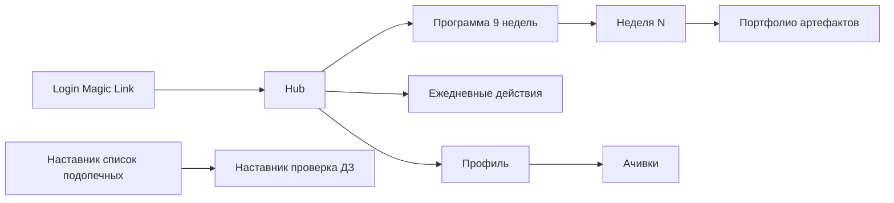

Дата: 2026-04-26
Назначение: детальная спецификация MVP-1 «Курс + действия + ачивки». То, что собираем за 2–3 недели и обкатываем на пилотной группе.

---

# 4. MVP-1 — Курс + действия + ачивки

## 4.1. Скоуп MVP-1

**В скоупе:**
- Регистрация / вход (Magic Link).
- Hub (главный экран новичка).
- Программа на 9 недель: страницы недель, чек-лист ДЗ, загрузка артефактов.
- Трекер действий (`+1` для 5 типов).
- Ранги и базовый набор ачивок (10 штук).
- Профиль с карточкой целей.
- Интерфейс наставника: список подопечных, проверка ДЗ, ручное начисление/отзыв XP.

**Вне скоупа MVP-1:**
- Топ-100 / клиенты (только привязка через `client_id`-плейсхолдер).
- Сделки и монетки (наставник вводит вручную через админку).
- Рейтинг потока.
- Telegram-бот.
- Генераторы PDF (фиксация уникальности, финмодель).

**Цель MVP-1:** проверить гипотезу «новичок реально ведёт работу в дашборде, а не в Excel».

---

## 4.2. Карта экранов MVP-1



---

## 4.3. Экраны и компоненты

### 4.3.1. `/login`

**Назначение:** вход по Magic Link.

UI:
- Лого СРЕДА.
- Поле email, кнопка «Получить ссылку».
- После отправки: «Письмо отправлено на your@email — откройте ссылку, чтобы войти».

Компоненты: `LoginForm`, `EmailInput`.

### 4.3.2. `/hub`

**Назначение:** главный экран. Одна страница — весь контекст агента.

Виджеты сверху вниз:

1. **`StatusBar`**
   - Аватар, ник, ранг (бейдж), прогресс-бар XP до следующего ранга, число монеток.
   - В MVP-1 место в рейтинге не показываем.

2. **`TodayCard`** — главная задача дня
   - Логика: ближайшее по времени из (а) ДЗ текущей недели в статусе `draft/rework`, (б) рекомендованное действие дня по плану.
   - Пример: «Сдай ДЗ Недели 4: фиксация уникальности — осталось 2 дня».
   - Кнопка «Открыть».

3. **`CurrentWeekCard`**
   - Заголовок «Неделя N: <название>».
   - Прогресс-бар по чек-листу ДЗ.
   - Кнопка «Открыть неделю».

4. **`ActionsTrackerWidget`**
   - 5 счётчиков: касания / диалоги / подборки / показы / контент.
   - На каждом — `+1` и подпись «сегодня X / план Y».

5. **`ActivityFeedWidget`**
   - Последние 10 событий по потоку: «Айгуль получила +50 XP за финмодель».
   - Только публичные события (XP/ранг/ачивки), не личные данные.

UX-правило: на экране всегда есть **одно главное действие** — кнопка `Today` подсвечена ярче остальных.

### 4.3.3. `/program`

**Назначение:** карта 9 недель.

UI:
- Вертикальный или горизонтальный список карточек недель.
- Каждая карточка: номер, название, статус (`locked / available / in_progress / completed`), процент сдачи ДЗ.
- Текущая неделя выделена.
- Заблокированные недели — серым с подсказкой «Откроется после сдачи Недели N-1».

### 4.3.4. `/program/[week]`

**Назначение:** содержание недели + ДЗ + артефакты.

Секции:
1. Шапка: номер, название, цель.
2. **Теория** — markdown-рендер из `program_weeks.theory_md`.
3. **Практика** — markdown.
4. **ДЗ** — список карточек:
   - Заголовок ДЗ.
   - Чек-лист критериев (read-only — для прозрачности).
   - Поле комментария / контента.
   - Загрузка файлов (множественная, до 50 МБ/файл).
   - Кнопка «Сохранить как черновик» / «Отправить наставнику».
   - Бейдж статуса.
   - Если `rework` — раскрывается фидбэк наставника.
5. **Артефакты** — карточки требуемых артефактов с тем же UX, что ДЗ, плюс выбор шаблона из `artifact_templates`.

### 4.3.5. `/actions`

**Назначение:** журнал действий и быстрая фиксация.

Секции:
1. **Дневной счётчик** (как на Hub, но крупнее).
2. **Форма «зафиксировать действие»**: тип, клиент (опционально, autocomplete), канал (select), комментарий.
3. **Лента моих действий** за 7 дней с группировкой по дням.
4. **Виджет «план vs факт»** — простая таблица: метрика, план/нед., факт/нед., индикатор.

Анти-фрод (UI):
- При попытке создать 5 одинаковых действий за 1 минуту — модалка «Похоже, вы дублируете запись. Подтвердите.».

### 4.3.6. `/artifacts`

**Назначение:** портфолио артефактов.

UI:
- Фильтры по статусу и типу.
- Карточки артефактов: тип, название, статус, дата.
- Клик — открывается просмотр.

### 4.3.7. `/profile`

**Назначение:** профиль агента и карточка целей.

Секции:
1. Аватар, ник, ранг, XP, монетки.
2. **Карточка целей с Недели 0** — read-only после первой сдачи.
3. История ачивок (галерея с заблокированными).
4. История XP-событий (последние 50).
5. Настройки уведомлений (email, Telegram-привязка — в MVP-1 заглушка).

### 4.3.8. `/achievements`

**Назначение:** каталог ачивок.

UI:
- Все 10 ачивок из каталога.
- Полученные — цветные с датой.
- Заблокированные — серые с условием получения.

### 4.3.9. Наставник: `/mentor`

**Назначение:** интерфейс проверки ДЗ.

UI:
- Список подопечных с фильтрами «есть на проверке / просрочено».
- Колонки: имя, неделя, ДЗ на проверке, дней с подачи.
- Клик → `/mentor/review/[submission_id]`.

### 4.3.10. Наставник: `/mentor/review/[id]`

UI:
- Содержимое сданного ДЗ + чек-лист критериев.
- Поля: «принять / на доработку», текст фидбэка.
- При «принять» — XP начисляется автоматически по конфигу.
- При «на доработку» — список конкретных правок (минимум 1 пункт).

---

## 4.4. Серверные действия (Server Actions)

```ts
// src/app/(app)/program/actions.ts
'use server'

export async function submitHomework(input: {
  homeworkId: string
  contentMd: string
  attachmentIds: string[]
}) {
  // 1. Проверка владельца
  // 2. Создание/обновление homework_submissions со статусом 'review'
  // 3. Письмо наставнику
}

// src/app/(app)/actions/actions.ts
export async function logAction(input: {
  type: ActionType
  clientId?: string
  channel?: string
  comment?: string
}) {
  // 1. Антифрод (анти-серия + обязательные поля)
  // 2. Запись в actions
  // 3. Запись в xp_events с учётом дневного и недельного кап
  // 4. Проверка ачивок (например, first_touch)
}

// src/app/(admin)/mentor/actions.ts
export async function reviewSubmission(input: {
  submissionId: string
  decision: 'accepted' | 'rework'
  feedback: string
}) {
  // 1. Только роль mentor/admin
  // 2. Обновление статуса
  // 3. При accepted — начисление XP, проверка ранга, проверка ачивок
}
```

---

## 4.5. Edge Functions / Crons

| Функция | Расписание | Назначение |
|---------|-----------|------------|
| `recalc_ranks_daily` | каждый день 03:00 | пересчёт ранга всех пользователей по `xp_total` (на случай если что-то рассинхронилось) |
| `compute_streaks` | каждый день 02:00 | проверка serie 7/30 дней, начисление streak-XP |
| `notify_pending_reviews` | каждый рабочий день 09:00 | письмо наставнику со списком ДЗ, висящих > 24 ч |
| `notify_today_task` | каждый день 08:00 | email агенту с «главной задачей дня» |

---

## 4.6. Seed-данные

В `supabase/seed.sql`:
- 10 недель программы (`program_weeks`) — из [programma-obucheniya-8-nedel.md](life/Обучение/programma-obucheniya-8-nedel.md).
- ДЗ для каждой недели — из [03-kriterii-zachyota-dz.md](6.%20обучения%20агентов/Рабочие%20материалы/Дашборд%20новичка/03-kriterii-zachyota-dz.md), сводная таблица для seed.sql.
- 5 рангов — из [02-pravila-geymifikacii.md](6.%20обучения%20агентов/Рабочие%20материалы/Дашборд%20новичка/02-pravila-geymifikacii.md).
- 10 ачивок — из стартового каталога.
- 1 пилотная когорта `cohort_2026_05`.
- 1 наставник-демо.

---

## 4.7. Acceptance criteria MVP-1

Релиз-готовность считается, если:

- [ ] Новичок может зарегистрироваться через Magic Link и попасть на Hub.
- [ ] На Hub видны: ранг, XP, текущая неделя, главная задача дня, трекер действий.
- [ ] Программа на 9 недель доступна; следующая неделя открывается после `accepted` всех обязательных ДЗ предыдущей.
- [ ] Сдача ДЗ работает: загрузка файлов, отправка наставнику, статус.
- [ ] Наставник видит подопечных и принимает / отправляет на доработку.
- [ ] При принятии — XP начисляется, ранг обновляется, при необходимости — ачивка.
- [ ] Трекер действий пишет в `actions` и `xp_events`, дневные/недельные капы работают.
- [ ] Профиль показывает карточку целей и историю.
- [ ] Все экраны адаптивны (тестируется на iPhone 13 / Galaxy S22).
- [ ] Покрытие тестами: домен (`xp-rules`, `rank`) — 100%, e2e — 3 ключевых сценария:
  1. Регистрация → сдача ДЗ Недели 0 → ранг «Стажёр» / первый XP.
  2. 10 касаний → срабатывание дневного капа.
  3. Наставник принимает ДЗ → агент получает XP и ачивку `first_touch` (если применимо).

---

## 4.8. Тайминг (рабочие дни одного разработчика + дизайн)

| Задача | Дни |
|--------|-----|
| Скаффолд Next.js + Supabase, базовый UI-кит | 1 |
| Auth (Magic Link), роли, RLS | 1 |
| Миграции БД и seed | 1 |
| Программа: страницы недель, чек-лист, сдача ДЗ | 3 |
| Трекер действий + антифрод-логика | 2 |
| Hub (виджеты) | 2 |
| Профиль + ачивки | 1 |
| Интерфейс наставника | 2 |
| Edge Functions (ранги, streak, нотификации) | 1 |
| Тесты (домен + e2e) | 2 |
| Деплой staging + прод, прогон | 1 |
| **Итого** | **17 рабочих дней (~3,5 нед.)** |

---

## 4.9. Риски и решения

| Риск | Решение |
|------|---------|
| Наставник не успевает проверять ДЗ за 48 ч | Email + Telegram-нотификация (в MVP-3), плюс SLA-таблица в админке |
| Новички фармят касания | Жёсткие капы, минимальные поля, антифрод-серия |
| Нет наставника на старте | Создаём роль `auto_review` для нечувствительных ДЗ (только Неделя 0) |
| Файл артефакта > 50 МБ | UI ограничивает, предлагает загрузить как ссылку (Google Drive) |
