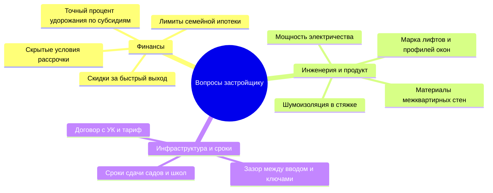

# 🧭 Стандарт работы с застройщиками и отправки подборок клиентам

Этот регламент определяет, как агент по новостройкам изучает рынок Уфы, позиционирует себя перед застройщиками как высококлассный эксперт и упаковывает информацию для клиентов. 

Цель стандарта — уйти от роли «глупого демонстратора» к позиции **партнера для застройщика** и **независимого навигатора для клиента**.

---

## 1. Какие новостройки изучать и с кем работать

Опытный агент не распыляется на весь рынок. Он фокусируется на объектах, которые генерируют 80% сделок и соответствуют реальным финансовым возможностям клиентов.

### Критерии отбора ЖК для изучения:
1. **Финансовая гибкость:** Наличие у застройщика траншевой ипотеки, рассрочек без ПВ или субсидированных программ с минимальным удорожанием.
2. **Ликвидность объекта:** Локации с дефицитом предложений, развивающейся инфраструктурой или близостью к точкам притяжения (вузы, бизнес-центры, парки).
3. **Надежность девелопера:** Анализ истории сдачи объектов, работы с эскроу-счетами и реальных темпов строительства.

### С кем взаимодействовать в ОП застройщика:
* **Запрещено:** Работать через дежурных менеджеров ОП на объекте. Они часто меняются, ориентированы на прямые продажи и не заинтересованы в защите агентской комиссии.
* **Рекомендовано:** Выходить на **курирующего менеджера по работе с партнерами (Partner Relation Manager)** или ведущих экспертов партнерского отдела застройщика. 
* **Почему:** Партнерский менеджер — ваш внутренний адвокат. Он заинтересован в объеме продаж через агентский канал, знает о «закрытых» стартах продаж, акциях для своих и помогает согласовывать индивидуальные дисконты под клиента.

---

## 2. Протокол появления на объекте: «Умные вопросы»

Чтобы менеджеры застройщика понимали, что перед ними профессионал высокого уровня (а не просто «девочка, пришедшая постоять рядом с клиентом»), агент обязан вести диалог на языке цифр, инженерии и регламентов.

### Вопросы для актуализации (спрашиваем при каждом визите):

#### Блок 1. Финансовые условия (актуализируем еженедельно)
* *«Какие банки сейчас дают минимальный процент удорожания при субсидировании семейной ипотеки на вашем объекте?»*
* *«Каковы точные лимиты по семейной ипотеке у ваших ключевых банков на этой неделе? Где ожидаются приостановки?»*
* *«Есть ли возможность индивидуального графика платежей по рассрочке для клиентов, продающих вторичное жилье? Какой процент удорожания при этом закладывается?»*
* *«Какова схема перехода с вашей беспроцентной рассрочки на ипотеку перед вводом дома в эксплуатацию?»*

#### Блок 2. Продукт, конструкт и инженерия (демонстрируем экспертность)
* *«Из какого материала выполнены межквартирные перегородки? Какова толщина стен и индекс звукоизоляции (Rw)?»* (Показывает, что вы заботитесь о приватности клиента).
* *«Какая марка оконного профиля и фурнитуры используется? Какое сопротивление теплопередаче у стеклопакетов?»*
* *«Какое технологическое решение по шумоизоляции заложено в стяжке пола?»*
* *«Какая выделенная мощность электричества на однокомнатные и двухкомнатные квартиры?»*
* *«Какое соотношение квартир и машиномест в подземном паркинге? Планируется ли лифт непосредственно в паркинг со всех этажей?»*

#### Блок 3. Сроки, риски и эксплуатация
* *«Какой реальный зазор заложен в ДДУ между вводом объекта в эксплуатацию и началом выдачи ключей?»*
* *«Какая управляющая компания зайдет на объект (собственная от девелопера или тендерная) и какой ориентировочный тариф на обслуживание (содержание + ремонт)?»*
* *«Каковы сроки строительства школы/детского сада на территории ЖК по проектной декларации? Кто финансирует стройку — город или застройщик?»*

---

## 3. Фиксация информации и подготовка материалов для клиента

Вся информация, собранная на объекте, должна быть немедленно оцифрована. Агент не полагается на память.

### Что обязательно фиксируется на объекте (в личную базу знаний):
1. **Визуальный статус:** Реальные фото и видео процесса строительства (не рендеры с сайта).
2. **Технические нюансы:** Фото инженерных ниш, качества кладки, маркировки оконных рам, отделки МОПов.
3. **Локационный контекст:** Видео видов из окон будущих квартир (куда реально выходит вид — на реку или на промзону/ЖД пути).
4. **Субъективная оценка эксперта:** Уровень шума на стройке, удобство подъездных путей, реальное время пешком до остановки/метро.

### Какие материалы готовятся для отправки клиенту (Пакет статуса):

* **«Живой» видеообзор (без цензуры):** 2-минутный ролик с объекта. 
  * *Пример ToV:* «Игорь, приветствую. Я на площадке ЖК Б. Вот ваш будущий корпус, монолит заливают на уровне 14 этажа, темп хороший. Окна выходят во двор, как вы просили — шума от проспекта не слышно. Из минусов: начали строить соседний корпус, до конца 2027 года перед окнами будет строительный кран. Показываю на видео, как это выглядит».
* **Интерактивная сравнительная таблица:** Сравнение 2-3 объектов по ключевым критериям (ПВ, ежемесячный платеж, переплата, срок сдачи, JTBD-соответствие).
* **Проект ДДУ с комментариями:** Выделенные желтым цветом пункты о сроках передачи ключей, порядке изменения площади после обмера БТИ и ответственности сторон.

---

## 4. Как отправлять подборки и взаимодействовать с клиентом

Главная ошибка агента — скинуть клиенту «простыню» ссылок на сайты ЖК или PDF-презентации без комментариев. Это перегружает клиента информацией и обесценивает работу эксперта.

### Регламент отправки подборки:

1. **Канал коммуникации:** Строго тот мессенджер, где велась диагностика. Вся история общения и расчетов должна быть в одном месте.
2. **Сопроводительное сообщение по формуле «Контекст ➔ Смысл ➔ Следующий шаг»:**
   * **Контекст:** Напоминаем о задаче клиента.
   * **Смысл:** Объясняем, почему выбраны именно эти 2-3 лота.
   * **Следующий шаг:** Предлагаем конкретное время для созвона/встречи для разбора цифр.

#### Шаблон сообщения при отправке подборки:

> **[Имя], приветствую!**
> 
> На основе нашей диагностики и ваших рамок по бюджету (ПВ [сумма] тыс. руб. и комфортный платеж до [сумма] руб.) я провел аудит рынка Уфы. Из 12 вариантов я отсек 9 из-за неподходящих финансовых условий или задержек по сдаче. 
> 
> Собрал для вас ровно 2 предложения, которые идеально решают вашу задачу (создать безопасное пространство для семьи с привязкой к 3-й гимназии):
> 
> 1. **ЖК А (Вариант с минимальным платежом):**
>    * *Почему он здесь:* За счет траншевой ипотеки платеж до сдачи дома (декабрь 2027) составит всего 1 рубль в месяц. После сдачи — [сумма] руб./мес. Это позволит вам спокойно продолжать арендовать жилье без финансовой нагрузки.
>    * *Планировка:* Евро-3 с просторной кухней-гостиной, где окна детской выходят в закрытый двор.
>    * *Минусы:* Отделка предчистовая, нужно будет закладывать бюджет на ремонт.
>    * *Посмотреть видео с площадки и расчеты:* [Ссылка на интерактивную финмодель]
> 
> 2. **ЖК Б (Вариант с готовым ремонтом):**
>    * *Почему он здесь:* Застройщик сдает дома с чистовой отделкой. Заезжаем сразу после получения ключей. Платеж по семейной ипотеке — [сумма] руб./мес.
>    * *Планировка:* Классическая 2-комнатная квартира с разнесенными спальнями («распашонка»), что решает вопрос личных границ для детей.
>    * *Минусы:* Стоимость квадратного метра на 12% выше, чем в ЖК А, из-за готовой отделки.
>    * *Посмотреть расчеты:* [Ссылка на интерактивную финмодель]
> 
> Давайте мы завтра созвонимся на 10 минут в первой половине дня (например, в 11:00) или ближе к вечеру (в 18:00), чтобы детально пройтись по этим цифрам и выбрать, какой вариант мы поедем смотреть вживую в субботу. Какое время вам удобнее?
