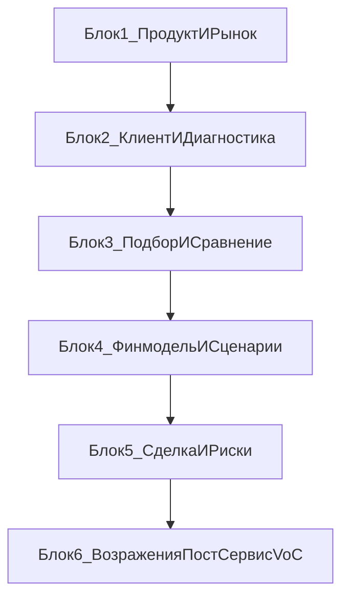

# Структура обучения по новостройкам для действующих агентов

Дата: 2026-03-17  
Назначение: архитектура апгрейд-трека по новостройкам для действующих агентов СРЕДА

---

## 1. Зачем нужен отдельный трек

Это не повторение онбординга для новичков.  
Трек нужен для действующих агентов, у которых уже есть базовое понимание продаж, но есть разрывы в продуктовой экспертизе, логике подбора, объяснении финмодели, работе с возражениями и безопасном доведении клиента до сделки.

Главная задача трека:
- усилить экспертность по новостройкам;
- повысить качество консультации и доверие клиента;
- сократить ошибки в обещаниях, подборе и коммуникации;
- усилить конверсию за счет более понятной аргументации;
- встроить в работу клиентацентричный подход: я не продаю, я объясняю.

---

## 2. Чем этот трек отличается от онбординга новичка

| Параметр  | Онбординг новичка                 | Трек для действующих агентов                                            |
| --------- | --------------------------------- | ----------------------------------------------------------------------- |
| Цель      | Дать базу и запустить в профессию | Усилить экспертизу и конверсию в новостройках                           |
| Фокус     | Термины, процесс, базовая воронка | Диагностика, подбор, финмодель, сделка, сложные кейсы                   |
| Формат    | Обучение с нуля                   | Практический апгрейд действующей работы                                 |
| Практика  | Базовые шаблоны и первые шаги     | Разбор реальных кейсов, ошибок, возражений и отказов                    |
| Результат | Агент понимает процесс            | Агент уверенно ведет клиента по новостройкам от запроса до пост-сервиса |

Вывод: действующим агентам не нужен длинный повтор базы. Им нужен короткий, плотный и прикладной трек с упором на разбор реальных ситуаций.

---

## 3. Формат программы

Рекомендуемый формат:
- 6 блоков по 1 неделе;
- 1 живой разбор в неделю: 90-120 минут;
- 1 практическое домашнее задание после каждого блока;
- 1 обязательный артефакт на сдачу;
- 1 мини-тест или кейсовая проверка по итогам блока;
- 1 итоговая аттестация по завершении трека.

Рекомендуемая нагрузка:
- 2 часа живой работы в неделю;
- 60-90 минут самостоятельной практики;
- 20-30 минут на короткий тест или разбор ошибок.

Принципы:
- 20-30% теории, 70-80% практики;
- один блок = одна ключевая компетенция;
- теория дается только та, которая помогает принимать решение и объяснять клиенту логику выбора;
- каждый блок заканчивается измеримым результатом;
- в коммуникации сохраняется ToV бренда: спокойно, уважительно, по делу, без давления.

---

## 4. Результат обучения

К концу трека агент должен уметь:
- быстро и глубоко диагностировать клиента по новостройкам;
- собирать карту критериев и видеть реальную логику выбора;
- подбирать и сравнивать 3-7 релевантных ЖК без перегруза клиента;
- объяснять финмодель простым языком и показывать 2-3 сценария;
- сопровождать клиента в сделке без лишних обещаний и хаоса;
- уверенно работать с возражениями и сложными вопросами;
- использовать пост-сервис и рекомендации как часть системы продаж;
- фиксировать частые вопросы, причины отказов и обновлять свою аргументацию через VoC.

---

## 5. Карта переиспользования существующих материалов

Новый трек не создается в вакууме. Он собирается на базе уже существующих документов.

| Материал | Что берем | Как используем в новом треке |
| --- | --- | --- |
| [[Брендбук агентства недвижимости СРЕДА]] | Принцип, ToV, границы обещаний, клиентский путь | Единые стандарты коммуникации и сервиса во всех блоках |
| [[Маршрутная карта обучений — СРЕДА]] | Логика развития действующих агентов | Встраиваем трек как углубленную тему по новостройкам |
| [[Клиентоцентричность]] | VoC, сервис-рекавери, клиентская логика | Добавляем в блок возражений, ошибок и пост-сервиса |
| [[life/Курс для Агенств 1.0/Обучение продажам новостроек - 2 месяца]] | Общий каркас тем и ритм обучения | Не копируем, а сжимаем и усиливаем под уровень действующих |
| [[Программа обучения по новостройкам — 8 недель]] | Практический подход, артефакты, кейсовый формат | Используем как источник упражнений и формата сдачи |
| [[Лекция по новостройкам — 60 минут]] | Краткая карта процесса по этапам 0-7 | Используем как компактную рамку для всей программы |
| [[Инструкция для обучения новичков-брокеров по новостройкам]] | Базовые определения, этапы, чек-листы | Берем только как справочник, без дублирования уроков |

Что не нужно дублировать в новом документе:
- базовый словарь терминов в полном объеме;
- длинные вводные объяснения про роль брокера;
- стартовую упаковку профиля и базовый SMM-контур для новичка;
- материал, который уже закрыт в онбординге и не влияет на качество работы действующего агента.

Что нужно добавить именно здесь:
- отдельный прикладной трек для действующих агентов;
- связку "продукт -> клиент -> подбор -> финмодель -> сделка -> пост-сервис";
- разбор типовых ошибок и причин отказа;
- контроль через кейсы, роль-плеи и проверку артефактов.

---

## 6. Архитектура трека

Логика трека:
1. Сначала агент должен уверенно понимать продукт и рынок.
2. Затем уметь быстро собирать критерии и правильно диагностировать запрос.
3. После этого - грамотно подбирать и сравнивать варианты.
4. Затем - объяснять деньги, ипотеку и сценарии без давления.
5. Дальше - вести сделку и снижать риски.
6. На финальном уровне - работать со сложными вопросами, возражениями, отказами и пост-сервисом.

---

## 7. Структура блоков

### Блок 1. Рынок новостроек и продуктовая экспертиза

**Цель:** обновить и выровнять продуктовую базу, чтобы агент уверенно ориентировался в рынке, объектах, документах и типовых рисках.

**Теория:**
- что изменилось на рынке новостроек: спрос, предложения, акции, ипотечные условия;
- классы жилья и реальные различия между ними;
- этапы строительства и как это влияет на аргументацию;
- ключевые документы: ДДУ, эскроу, проектная декларация, ДКП, переуступка;
- типовые риски: сроки, комплектация, скрытые ожидания клиента, маркетинговые обещания.

**Практика:**
- разобрать 3-5 актуальных ЖК по единому шаблону;
- собрать таблицу сравнения по критериям: цена, срок, локация, продукт, риски;
- провести упражнение "объясни объект за 60 секунд без воды и давления";
- разобрать 5 типовых ошибок агента в продуктовой презентации.

**Артефакт:** карточки 3 ЖК + короткая сравнительная таблица.

**Критерий сдачи:**
- агент объясняет разницу между объектами без общих фраз;
- по каждому ЖК зафиксированы не только плюсы, но и риски;
- сравнение сделано в единой логике и пригодно для клиента.

---

### Блок 2. Клиент, сегменты, диагностика и карта критериев

**Цель:** научить агента быстро видеть реальную мотивацию клиента и фиксировать критерии так, чтобы подбор был логичным, а не интуитивным.

**Теория:**
- основные сегменты клиентов по новостройкам: первое жилье, апгрейд, инвестор, переезд;
- триггеры покупки, тревоги и типовые стоп-факторы;
- структура сильной диагностики;
- карта критериев: приоритеты, компромиссы, стоп-факторы;
- ошибки диагностики, которые ломают воронку дальше.

**Практика:**
- провести диагностику в парах по 2 кейсам;
- заполнить 2 карты критериев;
- переписать слабые вопросы в сильные вопросы;
- сформулировать сообщение клиенту после диагностики по формуле: контекст -> смысл -> следующий шаг.

**Артефакт:** 2 карты критериев + 1 итоговое сообщение клиенту.

**Критерий сдачи:**
- диагностика выявляет цель, бюджет, сроки, ограничения и критерии;
- карта критериев содержит 5-7 приоритетов, стоп-факторы и компромиссы;
- сообщение клиенту фиксирует логику следующего шага, а не просто "я подумаю и вернусь".

---

### Блок 3. Подбор, сравнение ЖК и логика рекомендаций

**Цель:** научить агента делать подборку, которая держится на критериях клиента, а не на личных предпочтениях агента.

**Теория:**
- как собирать подборку 3-7 вариантов;
- логика сравнения: преимущества, ограничения, риски, компромиссы;
- как не перегружать клиента лишней информацией;
- как объяснять, почему один вариант сильнее другого;
- типовые ошибки: слишком много вариантов, нет прозрачной логики, игнорирование рисков.

**Практика:**
- собрать подборку по реальному или учебному кейсу;
- сделать сравнительную таблицу по согласованным критериям;
- презентовать подборку за 3 минуты;
- разобрать кейс "клиенту нравится не лучший вариант".

**Артефакт:** подборка 3-5 ЖК + сравнительная таблица + короткий скрипт презентации.

**Критерий сдачи:**
- каждый объект привязан к критериям клиента;
- у вариантов есть понятные плюсы, минусы и риски;
- в презентации нет давления, но есть четкая рекомендация и объяснение логики.

---

### Блок 4. Финмодель, ипотека, рассрочка, сценарное объяснение цифр

**Цель:** научить агента уверенно считать и объяснять финансовые сценарии так, чтобы клиент понимал последствия выбора.

**Теория:**
- базовые параметры финмодели: стоимость, ПВ, ставка, срок, платеж, допрасходы;
- различия между ипотекой, рассрочкой и комбинированными сценариями;
- как показывать чувствительность к ставке и сроку;
- как объяснять цифры клиенту простым языком;
- где агент должен остановиться и не обещать то, что не контролирует.

**Практика:**
- собрать 2-3 сценария финмодели по кейсу;
- сделать короткое объяснение сценариев для клиента;
- отработать роль-плей "клиент боится ипотеки";
- разобрать кейс "клиент ориентируется только на минимальный ежемесячный платеж".

**Артефакт:** финмодель в 2-3 сценариях + скрипт объяснения.

**Критерий сдачи:**
- агент показывает не один, а несколько сценариев;
- клиентская логика понятна: что меняется в зависимости от ПВ, срока и ставки;
- объяснение не перегружено терминами и не звучит как давление.

---

### Блок 5. Сделка, документы, риски и прозрачные статусы

**Цель:** выровнять понимание сделки по новостройкам, снять хаос в коммуникации и закрепить у агента привычку вести клиента через прозрачные статусы.

**Теория:**
- этапы сделки: бронь, согласование условий, договор, регистрация, сопровождение;
- документы и контрольные точки;
- что агент обязан фиксировать в CRM;
- как формулировать статусы клиенту;
- критические ошибки: обещание сроков, скрытие условий, отсутствие фиксации договоренностей.

**Практика:**
- пройти симуляцию сделки по кейсу;
- заполнить чек-лист сделки;
- составить 5 статусных сообщений клиенту на разных этапах;
- разобрать 3 риск-сценария: задержка, изменение условий, спорный вопрос по документам.

**Артефакт:** чек-лист сделки + пакет статусных сообщений.

**Критерий сдачи:**
- агент понимает этапность сделки и ключевые контрольные точки;
- статусы клиенту короткие, понятные и прозрачные;
- в разборе рисков агент не обещает то, что не контролирует, и предлагает корректный следующий шаг.

---

### Блок 6. Возражения, сложные кейсы, пост-сервис и VoC

**Цель:** усилить агента в сложных коммуникациях, снизить потери на возражениях и встроить в работу голос клиента.

**Теория:**
- типовые возражения по новостройкам: дорого, страшно, подожду, не доверяю, "вторичка понятнее";
- как работать с возражениями через логику, а не давление;
- сервис-рекавери: признать, исправить, подтвердить;
- пост-сервис как продолжение продажи и источник рекомендаций;
- VoC-цикл: вопросы, причины отказов, правки в аргументацию и материалы.

**Практика:**
- отработать 5 типовых возражений в роль-плее;
- разобрать 3 реальных отказа и найти, где была потеря;
- составить пост-сервисный сценарий на 30 дней после сделки;
- собрать мини-отчет VoC: 5 частых вопросов и 3 причины отказа.

**Артефакт:** 5 ответов на возражения + пост-сервисный сценарий + мини-отчет VoC.

**Критерий сдачи:**
- ответы на возражения строятся на фактах и уважении;
- агент умеет развернуть отказ в уточнение, а не в спор;
- пост-сервис содержит конкретные касания и полезные шаги;
- VoC-отчет фиксирует реальные паттерны, а не общие впечатления.

---

## 8. Универсальный шаблон каждого занятия

Рекомендуемая рамка одного занятия:
- 10 минут: разогрев и разбор домашки;
- 20-25 минут: теория блока;
- 45-60 минут: практика в кейсах, парах или мини-группах;
- 10-15 минут: дебриф и разбор ошибок;
- 5-10 минут: постановка домашки и критериев сдачи.

Единая структура каждого урока:
1. Цель урока.
2. 3-5 ключевых тезисов.
3. Практическое упражнение.
4. Домашнее задание.
5. Артефакт на сдачу.
6. Критерий "сдано / не сдано".

---

## 9. Система контроля и аттестации

### Входной контроль

Перед стартом трека:
- короткая самодиагностика по 5 компетенциям;
- мини-кейс на диагностику клиента;
- оценка текущего уровня по шкале: продукт, диагностика, подбор, финмодель, сделка.

### Контроль по каждому блоку

После каждого блока агент сдает:
- 1 артефакт;
- 1 мини-тест на 5-7 вопросов или кейсовую проверку;
- 1 короткую практику на живом разборе.

Порог сдачи:
- мини-тест: не ниже 80%;
- артефакт: принят наставником без критических ошибок;
- участие в живой отработке: обязательно.

### Итоговая аттестация

Финал трека:
- один комплексный кейс от входа до рекомендации;
- защита логики подбора;
- объяснение финмодели;
- отработка одного возражения;
- финальное статусное сообщение клиенту.

Итоговый результат "сдано":
- агент логично ведет клиента по всей цепочке;
- не нарушает границы обещаний;
- объясняет, а не давит;
- показывает зрелый уровень аргументации и контроля сделки.

---

## 10. Встроенный VoC-контур

Чтобы обучение не устаревало, после каждого потока или ежемесячно фиксируем:
- 5 самых частых вопросов клиентов;
- 3 самые частые причины отказа;
- 3 места, где агентам сложнее всего объяснять ценность;
- 3 правки в скрипты, подборки или финмодель.

Формат работы с VoC:
1. Собрали вопросы и отказы.
2. Разобрали по темам.
3. Обновили аргументацию или шаблоны.
4. Проверили, изменилась ли конверсия или качество диалога.

Это позволяет держать трек живым и полезным, а не статичным.

---

## 11. Артефакты по итогам программы

К концу обучения у агента должен быть готовый рабочий набор:
- карточки актуальных ЖК;
- таблица сравнения объектов;
- 2 карты критериев;
- 1 логичная подборка по кейсу;
- 1 финмодель в 2-3 сценариях;
- чек-лист сделки;
- пакет статусных сообщений;
- 5 ответов на типовые возражения;
- сценарий пост-сервиса на 30 дней;
- мини-отчет по голосу клиента.

---

## 12. Как запускать этот трек внутри системы обучения

Рекомендуемый сценарий внедрения:
- использовать как отдельный трек для действующих агентов после онбординга;
- запускать потоком 1 раз в квартал или по мере накопления группы;
- между потоками обновлять блок 1 и блок 6 по рынку и VoC;
- лучшие артефакты складывать в общую библиотеку команды;
- на ежемесячных разборах использовать куски трека как точечную тренировку.

Подходит для трех форматов:
- полноценный 6-недельный трек;
- интенсив на 3 недели, если объединять по 2 блока;
- ежемесячный цикл развития, где каждый блок идет как отдельный воркшоп.

---

## 13. Следующие документы, которые можно создавать на основе этой структуры

После утверждения архитектуры можно быстро развернуть:
- урок по каждому из 6 блоков;
- мини-тесты по каждому блоку;
- шаблоны артефактов для сдачи;
- роль-плеи и кейсы для наставника;
- отдельный документ с ответами на возражения по новостройкам;
- отдельный VoC-реестр по новостройкам.

Этот документ является мастер-структурой и базой для дальнейшей детализации.
