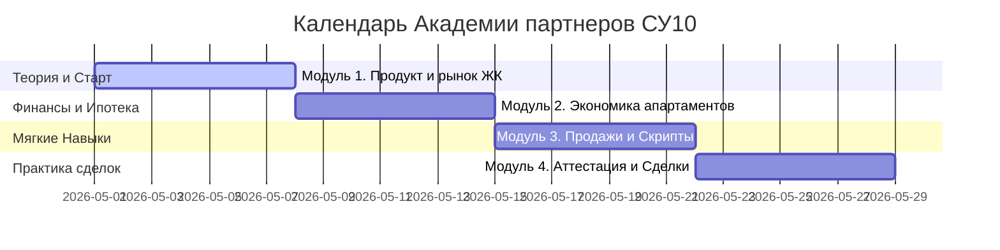

# 🎓 Программа обучения и Академия агентов для СУ10

> **Образовательная инфраструктура и лояльность партнёров**  
> Настоящая программа адаптирует успешные методологии обучения риелторов (включая опыт проекта «Академия новостроек») для застройщика **СУ10**. Её главная цель — превратить агентскую сеть в стабильный, высококомпетентный канал продаж, нативно ориентированный на предложение апартаментов в **ЖК «Центральный Парк»**.

---

## 📌 Концепция проекта: «Академия партнеров СУ10»

### Текущий барьер рынка:
Агенты по недвижимости часто избегают предложения апартаментов или сложных объектов из-за нехватки знаний юридической специфики (отличия апартаментов от квартир, налогообложение, прописка) и отсутствия эмоциональной привязки к бренду застройщика. 

### Решение:
Запуск **«Академии партнеров СУ10»** — комплексного гибридного обучения для риелторов ключевых агентств недвижимости Уфы («золотая группа» из 10–15 АН + частные брокеры).

### Ключевые форматы обучения:
1.  **Онлайн-обучение (Асинхронный модуль):** Короткие видеолекции, гайды, тесты и интерактивные тренажёры на GetCourse / LMS.
2.  **Офлайн-практика (Синхронный модуль):** Еженедельные тренинги, разбор живых кейсов, ипотечные QA-сессии.
3.  **Экскурсии и Событийный маркетинг:** Проведение регулярных туров на стройку ЖК «Центральный Парк» с нетворкингом.

---

## 🏗️ Регламент проведения экскурсий и офлайн-туров

Экскурсии на объект — это ключевой инструмент формирования лояльности риелторов и «влюбления» их в продукт. Мы уходим от скучных обходов стройки к эмоциональным бизнес-турам.

### 📅 Формат 1: «День открытой стройки» (Для риелторов)
*   **Частота:** 1 раз в две недели.
*   **Продолжительность:** 1.5 - 2 часа.
*   **Сценарий проведения:**
    1.  **Welcome-зона:** Встреча на объекте (ЖК «Центральный Парк»), выдача брендированных касок, жилетов, буклетов и горячего кофе/чая.
    2.  **Продуктовый тур:** Проход по демо-этажу, демонстрация планировочных решений, видов из окон, качества материалов стен и остекления, инженерных систем. Спикер — наш Тренер/эксперт по объекту (или прораб/инженер СУ10 для экспертности).
    3.  **Юридический разбор:** Короткий питч на объекте от нашего юриста. Разбор преимуществ апартаментов ЖК «Центральный Парк», вопросы о налогах, тарифах ЖКХ и юридической чистоте сделки.
    4.  **Событийный нетворкинг (Speed-Dating):** Короткая интерактивная сессия, где агенты знакомятся с нашей командой Заботы, обмениваются контактами и сразу получают доступ к закрытому Telegram-чату с материалами.
    5.  **Финал с подарками:** Вручение брендированных сувениров, раздача шахматок с актуальными остатками (из 196 апартаментов) и условий повышенного вознаграждения за быстрые сделки.

### 👥 Формат 2: «Персональный показ с клиентом»
*   **Частота:** По запросу агента (SLA подтверждения показа — **15 минут**).
*   **Логика проведения:**
    *   Агент оставляет заявку в Едином окне Отдела заботы.
    *   Наш менеджер по показам встречает агента с клиентом на объекте с подготовленными планировками и прайсом.
    *   Показ проводится совместно. Менеджер СУ10 выступает экспертом по технической части, а агент сохраняет статус главного доверенного лица клиента.

---

## 🎯 6 базовых профессиональных компетенций партнера СУ10

Для сертификации в Академии каждый агент должен продемонстрировать владение 6 ключевыми компетенциями, адаптированными под продажи ЖК «Центральный Парк»:

### 1. Знание продукта и рынка апартаментов
*   Понимает особенности ЖК «Центральный Парк» (локация, инфраструктура, технические характеристики).
*   Чётко знает разницу между квартирой и апартаментами, умеет закрывать юридические страхи клиентов.
*   **Индикаторы:**
    *   Знает технические фишки ЖК (высота потолков, тип остекления, бесшумные лифты, концепция благоустройства).
    *   С ходу называет **3 ключевых отличия** апартаментов от жилья и оборачивает их в выгоду для инвестора/покупателя (низкий порог входа, доходность аренды, престижная локация).
    *   Правильно отвечает на все вопросы теста по инфраструктуре района ЖК «Центральный Парк».

### 2. Навыки коммуникации и выстраивания доверия
*   Умеет расположить к себе клиента, задавать правильные вопросы для выявления потребностей.
*   **Индикаторы:**
    *   Более 70% первичных лидов агента соглашаются на встречу или показ в ЖК «Центральный Парк».
    *   Проводит презентацию с фокусом на образ жизни клиента, а не просто сухие метры.
    *   Получает положительную оценку лояльности (NPS ≥85) от клиентов по итогам сделки.

### 3. Работа с ипотекой и финансовыми инструментами
*   Знает все доступные ипотечные программы банков-партнёров для апартаментов.
*   Умеет рассчитывать платежи, первоначальный взнос и окупаемость инвестиций.
*   **Индикаторы:**
    *   Умеет составить инвестиционную модель окупаемости апартаментов ЖК «Центральный Парк» при сдаче в аренду за 5 минут.
    *   Знает особенности субсидированных программ на нежилые помещения.
    *   Готовит безошибочные ТЗ для ипотечного брокера СУ10.

### 4. Навык проведения эффективной презентации объекта
*   Умеет проводить экскурсии и показы на объекте так, чтобы клиент захотел забронировать объект на месте.
*   **Индикаторы:**
    *   Презентация на объекте длится не менее 15 минут, охватывает локацию, лобби, паркинг, планировку и условия покупки.
    *   Каждый 3-й показ агента на объекте завершается бронированием апартаментов.

### 5. Работа с возражениями и закрытие сделки
*   Умеет отрабатывать типовые возражения по ЖК «Центральный Парк» («это апартаменты, а не квартиры», «высокие налоги», «дорогая коммуналка», «у конкурентов дешевле»).
*   **Индикаторы:**
    *   Уверенно закрывает возражение про налоги: показывает разницу в цене покупки, которая полностью перекрывает разницу в налогах на 15–20 лет вперед.
    *   Успешно удерживает клиента в воронке при возникновении сомнений, конверсия из брони в сделку ≥80%.

### 6. Командное взаимодействие и регламенты СУ10
*   Соблюдает правила регистрации клиентов, бережно относится к SLA и ценит работу Отдела заботы СУ10.
*   **Индикаторы:**
    *   Посещает ≥80% обучающих вебинаров и офлайн-встреч Академии.
    *   Своевременно регистрирует клиентов в CRM, избегая конфликтов уникальности.
    *   Своевременно сдает аттестационные тесты Академии.

---

## 🗺️ Дорожная карта обучения (Гибридный формат)

Обучение рассчитано на **4 недели** непрерывного гибридного взаимодействия (онлайн + офлайн).

### 📚 Подробная программа модулей:

*   **Неделя 1: Модуль 1. Упаковка продукта и специфика рынка**
    *   *Онлайн:* Видеолекции по архитектуре, технологиям строительства СУ10 и благоустройству ЖК «Центральный Парк». Юридический гайд «Всё об апартаментах».
    *   *Офлайн:* **Стартовая экскурсия на объект** («День открытой стройки»), знакомство с командой.
*   **Неделя 2: Модуль 2. Экономика сделки и ипотечные решения**
    *   *Онлайн:* Расчёт окупаемости апартаментов, калькуляторы ипотеки, программы субсидирования от СУ10.
    *   *Офлайн:* Практический воркшоп с ведущими ипотечными брокерами и представителями банков-партнёров Уфы.
*   **Неделя 3: Модуль 3. Техники продаж и закрытие возражений**
    *   *Онлайн:* Аудиоподкасты со скриптами телефонных разговоров, отработка возражений по налогам и тарифам ЖКХ.
    *   *Офлайн:* Тренинг-симуляция в формате ролевых игр (агент — вредный клиент).
*   **Неделя 4: Модуль 4. Юридический трек и аттестация**
    *   *Онлайн:* Итоговое тестирование по 6 компетенциям в LMS.
    *   *Офлайн:* **Финальный форум риелторов**, вручение именных сертификатов «Сертифицированный партнер СУ10», награждение ТОП-агентов ценными призами, фуршет.

---

## 📊 Ожидаемые результаты от внедрения Академии

1.  **Рост компетенций:** 100% сертифицированных агентов безошибочно аргументируют выгоды апартаментов и закрывают типовые возражения.
2.  **Повышение лояльности (NPS ≥75):** Агенты ощущают СУ10 как лидера рынка, инвестирующего в их профессиональный рост.
3.  **Рост конверсии продаж:** Увеличение доли агентских сделок в общем объеме продаж ЖК «Центральный Парк» на **25–30%** уже через 60 дней после запуска Академии.

---

## 🏷️ Теги
#обучение_агентов #академия_су10 #экскурсии_на_объект #компетенции_риелтора #жк_центральный_парк #партнерская_сеть
