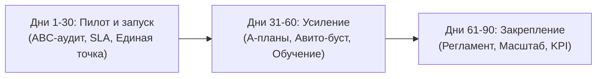

# 🗺️ Маршрутная карта партнёрщика (Система партнёрских продаж девелопера)

> **Статус:** Генерализованная база знаний и дорожная карта работы с агентствами недвижимости  
> **Проект:** ЖК «Центральный Парк» (СУ-10) и методология партнёрских продаж девелопера  
> **Автор сборки:** ИИ-ассистент Антона Цоя  

---

## 🎯 1. Философия и позиционирование партнёрского канала

Современный рынок девелопмента переходит от хаотичной работы с риелторами к модели **управляемого партнёрского канала**. Застройщик позиционирует себя не просто как продавца квадратных метров, а как **стратегического союзника риелтора**.

### Ключевые принципы:
1. **Модель «Внешнего партнёра по развитию»:** Мы заходим на проект не как рядовое агентство, а как структура, выстраивающая систему продаж девелопера «под ключ».
2. **Нейтральная финансовая модель (5% + 5%):** Вместо демпинга и раздачи прямых скидок покупателям до 10% (что обесценивает продукт), девелопер перераспределяет бюджет:
   * **5%** — скидка покупателю;
   * **5%** — фиксированная комиссия АН-партнёру.
   * **Результат для застройщика:** нулевое изменение среднего уровня цен при колоссальном росте мотивации партнёрской сети.
3. **Борьба с информационным ожирением клиентов (Реалии 2026):** Современный клиент перегружен рекламой и ипотечными схемами. Агент больше не просто «показывает варианты», он становится **навигатором по сложному решению**. Девелопер должен дать агенту инструменты для снятия тревоги клиента и структурирования выбора.

---

## 📈 2. 90-дневный операционный план запуска партнёрского канала

Система разворачивается в три этапа по 30 дней, превращая гипотезы в оцифрованный управляемый процесс.



### Этап 1. Дни 1–30: Пилот и запуск управляемости
* **Цель:** Быстро собрать базу, настроить единую точку входа и получить первые сделки (целевой KPI пилота: **5 сделок**).
* **Ключевые действия:**
  * Сбор лонг-листа партнёров и проведение стартового **ABC-аудита** агентств недвижимости Уфы.
  * Запуск единой точки входа (выделенной партнёрской линии в Telegram/WhatsApp).
  * Внедрение SLA: первая реакция в мессенджере — **15 минут**, полное решение сложного вопроса — **до 48 часов**.
  * Подготовка базы ответов на типовые вопросы и проведение первой продуктовой презентации для агентов.
* **Артефакты 30-го дня:** Стартовая ABC-карта партнёрской сети, пакет коммуникационных шаблонов, настроенный дашборд 4-х контрольных точек (Уникальности, График обучений, Вопросы партнёров, Брони).

### Этап 2. Дни 31–60: Усиление канала и регулярный ритм
* **Цель:** Перевести хаотичные касания в регулярный ритм работы и активировать спящих партнёров.
* **Ключевые действия:**
  * Внедрение персональных планов активности и броней для группы **A** (ТОП-партнёры).
  * Запуск программы вовлечения и дожима для группы **B** (обучение, экскурсии, точечные разборы).
  * Автоматизация работы с агрегаторами (НМаркет, Тренд Агент, Репрофит, Авито, Домклик).
  * Проведение первой оффлайн-активности («День открытой стройки»).
* **Артефакты 60-го дня:** Обновлённая ABC-карта на основе реального трафика, книга скриптов с отработкой возражений рынка 2026 года.

### Этап 3. Дни 61–90: Закрепление и подготовка к масштабированию
* **Цель:** Фиксация стандартов взаимодействия и подготовка модели к переносу на другие объекты девелопера.
* **Ключевые действия:**
  * Утверждение финального регламента работы с АН на уровне руководства застройщика.
  * Согласование KPI и планов продаж на следующий квартал.
  * Формирование предложений по долгосрочной мотивации лидеров продаж.
* **Артефакты 90-го дня:** Согласованный регламент партнёрского канала, готовая база знаний, рекомендации по масштабированию системы на другие ЖК.

---

## 🛡️ 3. Регламент защиты сделок и правила фиксации клиентов

Для исключения конфликтов («пересечений») между партнёрами и прямым отделом продаж девелопера внедряется прозрачная система закрепления лидов.

### Ключевые регламенты:
1. **Срок фиксации клиента — 45 дней:** Достаточный период для одобрения сложных ипотек или продажи вторички. Любая активность в CRM (показ, подача на ипотеку, трейд-ин) **автоматически продлевает фиксацию ещё на 30 дней**.
2. **Железная уникальность:** Если за последние **30 дней** в CRM застройщика нет открытых сделок, назначенных встреч или зафиксированных звонков напрямую от клиента — клиент считается уникальным для АН. Историческое наличие контакта в архивных базах прошлых лет **не является** причиной для отказа в фиксации за агентом.
3. **Мгновенная фиксация через мессенджер (SLA 15 минут):** Агент отправляет ФИО и телефон клиента на партнёрскую линию. Менеджер проверяет базу и подтверждает фиксацию в течение 15 минут.
4. **Фиксация цены и лота при бронировании:**
   * **Устная бронь (до 3-х рабочих дней):** Цена квартиры и планировка жёстко фиксируются.
   * **Ипотечная бронь (до 14 календарных дней):** Цена квартиры и планировка фиксируются на весь срок одобрения.
5. **Жёсткий запрет на рибейты (демпинг):** Возврат части комиссии клиенту (откат) карается немедленным расторжением договора и внесением АН в черный список на 6 месяцев. Мы сохраняем чистоту рынка и единые цены.

---

## 🔄 4. Технология Трейд-ин (Монополия на Авито)

Трейд-ин — мощнейший инструмент вытаскивания клиентов, у которых покупка новостройки привязана к продаже старой квартиры.

### Преимущества нашей программы:
* **Монополия на Авито:** Эксклюзивный договор с Авито на приоритетное платное продвижение объявлений увеличивает входящий спрос на вторичку клиента на **70%**.
* **Срок продажи:** Средний срок экспозиции квартиры по программе составляет всего **47 дней**.
* **Схема «0 рублей расходов»:** Комиссия за продажу вторички составляет **2%**. Но клиент не платит её из своего кармана — оплата услуг происходит из средств, выделяемых в рамках сделки по новостройке (после регистрации ДДУ на апартаменты).
* **Фиксация новостройки на 60 дней:** На время продажи вторичного жилья застройщик бронирует выбранные апартаменты в ЖК «Центральный Парк» без изменения стоимости.

### Схемы коридора цены в договоре Трейд-ин:
Для обеспечения быстрой продажи вторички в договор с клиентом встраивается один из двух вариантов ценового коридора:

* **Вариант А (Временной коридор):**
  > Начальная цена — `X` руб. Если объект не продан за 30 дней, цена автоматически снижается до `Y` руб. (минус 5%). Если объект не продан за 45 дней, применяется минимальная гарантированная цена `Z` руб.
* **Вариант Б (Активный коридор по спросу):**
  > Начальная цена — `X` руб. При отсутствии входящих звонков и показов в течение 7 дней подряд, цена снижается на 1.5% еженедельно до появления спроса или достижения нижнего порога `Y` руб.

---

## 🎓 5. Партнёрская Академия и амбассадорские программы

Обучение партнёров должно быть не теоретическим («продажи вообще»), а прикладным — направленным на снятие барьеров при предложении конкретного продукта.

### 6 базовых компетенций сертифицированного партнёра:
1. **Знание продукта и рынка апартаментов:** Понимание юридической специфики (налоги, прописка, ЖКУ) и умение переводить её в выгоды для инвестора.
2. **Коммуникация и доверие:** Выявление истинной боли клиента и перевод лида в показ с NPS ≥85.
3. **Финансовые инструменты:** Умение за 5 минут составить инвест-модель окупаемости и рассчитать платёж по сложной ипотеке.
4. **Эффективный показ:** Проведение экскурсии на объекте длительностью не менее 15 минут, ведущей к бронированию.
5. **Закрытие возражений:** Уверенная отработка страхов ("налоги на апартаменты", "нет прописки", "дорого").
6. **Соблюдение регламентов:** Дисциплина ведения сделки в связке с Отделом заботы девелопера.

### Формат оффлайн-мероприятия: «День открытой стройки»
* **Welcome-зона:** Выдача брендированных касок, жилетов, буклетов и горячих напитков.
* **Продуктовый тур:** Проход по демо-этажу со спикером (инженер или продуктолог проекта).
* **Юридический разбор:** Питч юриста о легализации прописки в апартаментах, налогах и сделках.
* **Speed-Dating:** Быстрое знакомство агентов с менеджерами Отдела заботы.
* **Вручение подарков:** Раздача актуальных шахматок остатков (из 196 апартаментов) и условий повышенной комиссии.

### Четыре уровня агента по продуктовой сложности:
```
[Уровень 4: Траншевые ипотеки] -> Знает, как получить ставку 3.99% и платёж 1900 р/мес
       ▲
[Уровень 3: Рассрочки] ---------> Продаёт напрямую без банковской бюрократии
       ▲
[Уровень 2: Субсидии] ----------> Умеет рассчитывать и предлагать субсидированные ставки
       ▲
[Уровень 1: Семейная ипотека] --> Базовый уровень работы риелтора (стандартные лиды)
```

---

## 📣 6. Маркетинговые инструменты и автоворонки продаж

Инструменты, которые помогают разорвать шаблоны скучной рекламы застройщиков и быстро вовлекать партнёров.

### Тактические приемы:
* **«Квартира месяца»:** Детальный разбор экономики конкретного лота (например, расчёт доходности студии при сдаче в аренду) с готовыми рекламными постами для соцсетей агентов.
* **«Переворачиваем цены»:** Маркетинговый ход с изменением формата презентации стоимости (показ цены не за квадратный метр, а через размер ежемесячного платежа по траншевой ипотеке — "Престижный центр за 1 900 рублей в месяц").
* **«Секси-вытаскивание»:** Специальный скрипт для реанимации клиентов, которые ушли думать, через предложение индивидуальных условий рассрочки или программы Трейд-ин.

### Связка: Выступление → Телеграм-бот
На оффлайн-выступлениях спикер девелопера не перегружает агентов техническими деталями ЖК. Его задача — продать саму систему работы:
1. Выступление длится ровно **15 минут** (Блок инструментов + Демонстрация бота).
2. На экране и в раздаточных материалах размещается крупный QR-код.
3. Агенты сканируют код и попадают в **телеграм-бот**, который содержит:
   * Простую форму фиксации клиента;
   * Актуальную шахматку и планировки;
   * Календарь обучений Академии;
   * Калькулятор окупаемости Трейд-ин;
   * Готовые контент-паки для соцсетей (Reels, карусели, посты).
4. Бот продолжает греть базу и собирать лиды 24/7.
