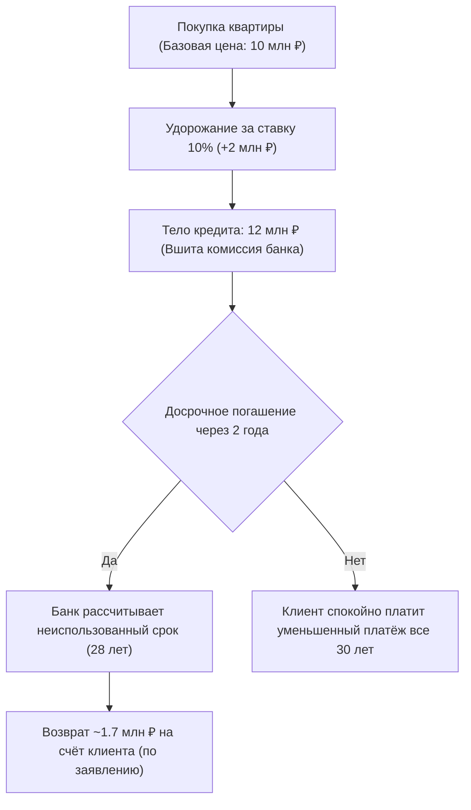

# 🧭 Исправленный финансовый инжиниринг: Практическое руководство по вебинару

Это руководство адаптировано на основе транскрипта вебинара для агентов-навигаторов. Оно убирает разговорный шум, систематизирует теорию по блокам, внедряет юридическую защиту по стандартам ЦБ РФ и даёт готовые инструменты для работы с клиентами в 2026 году.

---

## 🧠 БЛОК 0: Смена парадигмы (Агент-Рыбак vs Агент-Навигатор)

В реальности ипотечных ставок 18–20%+ обычные методы продажи недвижимости больше не работают. 
*   **Агент-«Рыбак»** пытается продать «бетонные стены», планировки, высоту потолков и вид из окна. Он давит на эмоции: *«Поднапрягитесь, займите у родственников, завтра подорожает»*. В итоге клиент уходит думать и замораживает сделку.
*   **Агент-«Навигатор»** продаёт **стоимость обслуживания долга, управление ликвидностью и оптимизацию семейного бюджета**. Его метод — сначала рассчитать финансовый коридор (первоначальный взнос и комфортный платёж), а затем «натянуть» на него подходящую новостройку.

> [!IMPORTANT]
> **Главное правило рынка 2026:**
> Покупателю безразлична конечная цена квартиры (10 млн или 12 млн), если его ежемесячный платёж комфортен, а цена входа минимальна. Квартира становится для него выгодным инструментом накопления капитала.

---

## 🏗️ БЛОК 1: Траншевая ипотека (Ипотека частями)

### 1. Механика инструмента
Банк выдаёт кредит на эскроу-счёт не всей суммой сразу, а частями (траншами). Проценты начисляются только на фактически выданную сумму, что минимизирует платёж во время стройки.
*   **Первый транш:** От 100 000 рублей до 15–20% от кредита. Платёж до сдачи дома составляет копейки (от 150 до 1 000 рублей).
*   **Второй транш:** Перечисляется перед вводом дома в эксплуатацию. Начинается стандартный платёж.

### 2. Регуляторные ограничения ЦБ РФ
*   Максимальное число траншей — **5**.
*   Минимальный размер первого транша — **100 000 рублей**.
*   Срок перевода последнего транша — **не более 36 месяцев** с даты первой выдачи.

### 3. JTBD-сценарий: Параллельная аренда (Арендатор-ожидатель)
Семья снимает жильё за 50 000 руб./мес. Платёж по ипотеке за новостройку — 48 000 руб. Двойная нагрузка в 98 000 руб. ведёт к кассовому разрыву.
*   **Решение:** Трамшевая схема. 1-й транш — 100 000 руб. Платёж до сдачи дома — 600 руб./мес. Семья продолжает арендовать жильё. Перед вводом дома выдаётся 2-й транш, семья съезжает с аренды и переходит на ипотечный платёж 48 000 руб. 
*   **Экономия:** Более 1.1 млн рублей за 2 года стройки.

##### 💬 Диалог-тренажер
| Действующее лицо | Реплика | Смысл действия |
| :--- | :--- | :--- |
| **Клиент** | *«Мне нравится проект, но платить за аренду 50 тысяч и ипотеку 48 тысяч я не смогу. Придется отказаться».* | Страх двойных платежей. |
| **Агент (Навигатор)** | *«Артур, платить 100 тысяч в месяц — это неоправданный риск для бюджета. Но нам и не нужно этого делать. Мы настроим траншевую схему. Банк выдаст первый транш всего 100 000 рублей, и ваш платёж до сдачи составит всего 600 рублей в месяц. Вы продолжите спокойно снимать жильё. А когда дом сдадут, вы переедете, перестанете платить аренду, и у вас начнётся стандартный платёж 48 000 рублей. Давайте посчитаем точный график?»* | Снятие тревоги, безопасное решение. |

---

## 📉 БЛОК 2: Субсидированная ставка (Купленная ставка)

### 1. Механика удорожания
Застройщик платит банку единовременную комиссию за снижение процентной ставки для клиента на весь срок (например, с рыночных 20% до 10%). Эта комиссия закладывается в стоимость квартиры (удорожание на 10–15%).

### 2. Защита по Ипотечному стандарту ЦБ РФ
*   **Возврат комиссии при досрочном погашении:** Если заемщик выкупил ставку за свой счёт (через удорожание), но погасил кредит досрочно, банк обязан вернуть неиспользованную часть комиссии пропорционально оставшемуся сроку.
*   **Правило «Одна семья — одна льготная ипотека» (с 1 февраля 2026 г.):** Повторное оформление допускается только при рождении нового ребёнка после полного закрытия предыдущей льготной ипотеки.

#### 📊 Блок-схема возврата комиссии (ЦБ РФ)

### 3. JTBD-сценарий: Долгосрочное гнездо (Консервативный покупатель)
Семья покупает трёхкомнатную квартиру за 15 млн руб. Быстрое гашение не планируется. Нужен минимальный платёж.
*   **Вариант А (Рыночная ставка 18%):** Платёж — 181 000 руб./мес. Переплата за 20 лет — 31.4 млн руб.
*   **Вариант Б (Субсидия 10%):** С удорожанием цена 16.2 млн руб. Кредит (ПВ 3 млн) — 13.2 млн руб. Платёж — 127 300 руб./мес.
*   **Экономия:** Снижение платежа на **53 700 руб. в месяц**. Чистая экономия бюджета на процентах за 20 лет с учётом удорожания превышает **11 000 000. руб.**

---

## 🤝 БЛОК 3: Рассрочка от застройщика (Внебанковские программы)

### 1. Правовой ландшафт (ФЗ № 283-ФЗ от 1 апреля 2026 г.)
*   **BNPL-сервисы:** Рассрочка через операторов до 6 месяцев, без переплат, данные автоматически уходят в БКИ.
*   **Прямая рассрочка от застройщика:** Долгосрочные программы (1–3 года). Застройщик вправе устанавливать наценку на лот. Данные в БКИ до момента оформления ипотеки не передаются.
*   **Риск проектного финансирования:** Из-за рассрочек эскроу-счета наполняются медленнее. Банк поднимает застройщику ставку проектного кредита. Поэтому объёмы рассрочек жёстко лимитируются застройщиками.

### 2. Сейф-рассрочка (Максимальная безопасность)
Первоначальный взнос размещается на безопасном эскроу-счёте, а остаток вносится одной суммой за месяц до ввода дома. Застройщик не пользуется деньгами до сдачи, снижая риск недостроя.

### 3. JTBD-сценарий: Мост-рассрочка (Продажа вторички)
Клиент хочет купить новостройку за 12 млн, продав свою вторичную квартиру. Рынок вторички стоит из-за ставок 20%+. Срок продажи вырос до 8 месяцев. Клиент не хочет демпинговать.
*   **Решение:** Рассрочка «10/90». ПВ — 10% (1.2 млн руб.) из накоплений. Остаток 90% (10.8 млн руб.) вносится через 18 месяцев перед вводом дома. 
*   **Экономический эффект:** Клиент заморозил цену новостройки на этапе котлована и получил 1.5 года на спокойную продажу вторички по максимальной рыночной цене без вынужденных скидок.

---

## 💼 БЛОК 4: Лизинг недвижимости для B2B (Списание НДС)

Для предпринимателей и юридических лиц вывод денег из бизнеса обходится дорого (налоги, обналичивание стоят до 40% от суммы). 
*   **Механика:** Лизинговая компания выкупает квартиру у застройщика на 100% и передаёт её в пользование юрлицу.
*   **Экономический эффект:** Юридическое лицо списывает лизинговые платежи на расходы (уменьшая налог на прибыль) и возвращает НДС. Квартира стоимостью 40 млн рублей обходится предпринимателю примерно в 32 млн рублей (экономия до 20% за счёт налогового вычета).
*   **Для застройщика:** Полное отсутствие рисков. Лизинговая компания сразу выплачивает 100% стоимости квартиры на эскроу-счёт.

---

## 📝 Домашнее задание для команды ОП

Каждый агент должен проанализировать застройщиков на своём рынке и составить таблицу финансовых инструментов. Это позволит увидеть, кто из застройщиков готов согласовывать индивидуальные схемы, и предлагать их клиентам.

### Шаблон таблицы:
| Инструмент | Застройщик | ЖК / Локация | Условия и параметры программы | Кому идеально подходит (JTBD) |
| :--- | :--- | :--- | :--- | :--- |

### Демо-шаг (Пример заполнения первой строки для Уфы):
| Инструмент | Застройщик | ЖК / Локация | Условия и параметры программы | Кому идеально подходит (JTBD) |
| :--- | :--- | :--- | :--- | :--- |
| **Траншевая ипотека** | ГК Садовое Кольцо | ЖК Terle Park (Зелёная Роща) | ПВ — 20%. Первый транш — 100 000 руб. Платёж до сдачи дома (2 года) — 620 руб./мес. Второй транш — остаток кредита перед сдачи дома. | Арендаторам, которые не могут платить одновременно и за съём, и за ипотеку. |
| **Сейф-рассрочка** | Жилстройинвест | ЖК Сенатор (Центр) | ПВ — 20% (на эскроу-счёт). Промежуточные платежи — 0 руб. Остаток 80% — перед вводом в эксплуатацию (через 15 мес). Без удорожания. | Владельцам вторичного жилья, которым нужно время на продажу старой квартиры по хорошей цене. |
