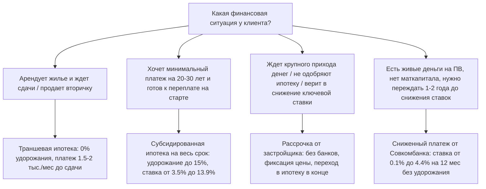

# 📊 Анализ финансовых инструментов для покупки новостроек в Уфе

На основе данных из базы застройщиков Уфы (по состоянию на июнь 2026 года) проведён сравнительный анализ четырёх ключевых способов покупки: **траншевой ипотеки**, **субсидированной ипотеки**, **рассрочки** и **программы «Сниженный платёж» от Совкомбанка**.

Ниже приведены сводная аналитика, специфика каждого инструмента и матрица принятия решений для клиентов.

---

## ⚖️ Сводная таблица сравнения способов покупки

| Параметр | 1. Траншевая ипотека | 2. Субсидированная ипотека | 3. Рассрочка | 4. «Сниженный платёж» от Совкомбанка |
| :--- | :--- | :--- | :--- | :--- |
| **Удорожание квартиры** | **0%** (всегда базовая цена) | **5% — 15.5%** (редко 0% по точечным акциям) | **0%** (при ПВ от 50%) или **1.5% — 20%** / **+5-10к р./кв.м** | **0%** (в большинстве ЖК идет по базовой цене) |
| **Первоначальный взнос (ПВ)** | **10% — 20.1%** | **20.1% — 30.1%** | **5% — 50%** (чаще 30-50%) | **20.01% — 30.01%** |
| **Ежемесячный платёж на старте** | **Микроскопический** (~1 700 - 1 800 р. при первом транше 100к) | **Комфортный** (если ставка субсидирована на весь срок) или **минимальный** (на льготный период 1-5 лет) | **Средний / Высокий** (равные части или фикс. платежи по 30-50к) | **Минимальный** (ставка 0.1% - 4.4% на первый год) |
| **Платёж после льготного периода** | **Резкий рост до рыночного** (ставка ~19.5% - 21.7% на весь остаток кредита) | **Резкий рост до рыночного** (для программ со снижением на 1-5 лет) или **стабильно низкий** (если ставка на весь срок) | **Нет льготного периода** (в конце выплачивается весь остаток 50-80%) | **Резкий рост до рыночного** (через 12-24 мес. ставка до 19.49% - 22.49%) |
| **Использование материнского капитала** | Можно в ПВ (в большинстве банков) | Можно в ПВ (ограничения зависят от банка) | По согласованию (обычно только в ПВ или последним платежом) | **Запрещено использовать в качестве ПВ!** |
| **Срок программы** | До 30 лет | До 30 лет | **Короткий** (6 — 20 месяцев, до ввода дома) | До 30 лет |
| **Основные банки** | СберБанк (монополист в Уфе) | Сбер, ВТБ, Альфа-Банк, ДОМ.РФ, Совкомбанк, МКБ | Без банков (напрямую от девелопера) | Совкомбанк |

---

## 🔍 Детальный разбор каждого инструмента

### 1. Траншевая ипотека
* **Как это работает:** Кредит выдается банком частями. Первый транш — чисто символический (например, 100 000 рублей или 10% от кредита). В этот период клиент платит проценты только на сумму выданного транша (платёж составляет около 1 700 рублей в месяц). Второй транш перечисляется ближе к сдаче дома.
* **Главный плюс:** Нет искусственного удорожания квартиры.
* **Главный минус:** После перечисления второго транша процентная ставка становится стандартной рыночной (~21.7%).
* **Применимость:** Идеально для людей, которые арендуют жилье в период строительства или планируют продать старую квартиру ближе к сдаче новостройки, чтобы закрыть долг досрочно.

### 2. Субсидированная ипотека
* **Как это работает:** Девелопер компенсирует банку недополученную прибыль, за счёт чего банк снижает ставку для клиента на весь срок (например, до 11.9%–13.9% вместо 21.7%) или на первые 1–5 лет.
* **Главный плюс:** Стабильный, прогнозируемый и комфортный платёж на весь срок кредитования.
* **Главный минус:** Квартира продаётся с удорожанием на 5–15.5%.
* **Применимость:** Подходит для долгосрочных покупателей («покупаем для себя на 20 лет, гасить досрочно не планируем»). Переплата за счёт удорожания компенсируется экономией на процентах уже через 4–5 лет обслуживания кредита. Также незаменима для Семейной ипотеки со снижением ставки до 3.5%–5%.

### 3. Рассрочка от застройщика
* **Как это работает:** Оплата напрямую застройщику без участия банка. ПВ составляет от 5% до 50%. Далее следуют ежемесячные платежи (например, по 30–50 тыс. руб.), а остаток вносится перед вводом дома в эксплуатацию.
* **Главный плюс:** Нет требований банка к доходу, страхованию и кредитной истории на первом этапе. Возможность зафиксировать цену без процентов.
* **Главный минус:** Очень короткий срок действия (обычно до конца строительства — 6-20 месяцев) и риск не получить ипотеку на остаток в конце срока.
* **Применимость:** Для тех, кто ждёт деньги от продажи бизнеса/вторички, или для тех, кто рассчитывает на падение ключевой ставки через год, чтобы рефинансировать остаток в дешёвую ипотеку.

### 4. Сниженный платёж от Совкомбанка
* **Как это работает:** Совкомбанк выдает кредит сразу, но снижает ставку на первый год (до 0.1%–4.4%). Далее ставка поднимается до рыночной (~19.5%–22.49%).
* **Главный плюс:** В отличие от стандартной субсидированной ипотеки, по этой программе в большинстве ЖК **нет удорожания квартиры** (идёт по цене 100% оплаты).
* **Главный минус:** **Категорически запрещено использовать материнский капитал в качестве ПВ.**
* **Применимость:** Альтернатива траншевой ипотеке для тех, кто имеет собственные средства на первоначальный взнос (без маткапитала) и хочет платить копейки в первый год, рассчитывая рефинансировать кредит при снижении ключевой ставки ЦБ.

---

## 🎯 Выводы и рекомендации для работы с клиентами

1. **Если у клиента есть маткапитал и он хочет низкий старт:**
   * Предлагайте **траншевую ипотеку** (без удорожания) или **рассрочку «для беременных» / семейную** (например, у Архстрой Групп рассрочка до июня 2027 с платежом 20 000 руб./мес, ПВ 20.1% с возможностью использовать маткапитал).
   * **Совкомбанк сразу мимо** (из-за запрета на маткапитал в ПВ).

2. **Если клиент боится удорожания квартиры:**
   * Противопоказано стандартное субсидирование.
   * Рекомендуются **траншевая ипотека** (Сбербанк, 0% удорожания) или **рассрочка 50/50** без удорожания (Альтима Строй, ГК БРИГ в ЖК Геос, ГК Первый Трест), либо программа **Совкомбанка** (0.1%-4.4% на первый год без удорожания).

3. **Если цель — минимальный платеж "вдолгую" (на 20-30 лет):**
   * Объясняйте клиенту математику **субсидированной ипотеки**. Да, квартира станет дороже на 10%, но при ставке 12% вместо 21% он сэкономит миллионы рублей на дистанции от 5 лет.

4. **Если клиент ждет продажи своего объекта:**
   * Предлагайте **Trade-In рассрочку** от Самолета (ПВ 5%, остаток через 3 месяца без удорожания) или **рассрочку 50/50** на 3 месяца от Альтима Строй.

---

### 📂 Первоисточники условий в Obsidian:
* [[Условия траншевой ипотеки.md|База условий траншевой ипотеки]]
* [[Условия субсидированной ипотеки.md|База условий субсидированной ипотеки]]
* [[Условия рассрочек.md|База условий рассрочек застройщиков]]
* [[Условия сниженного платежа.md|База условий программы Совкомбанка]]
