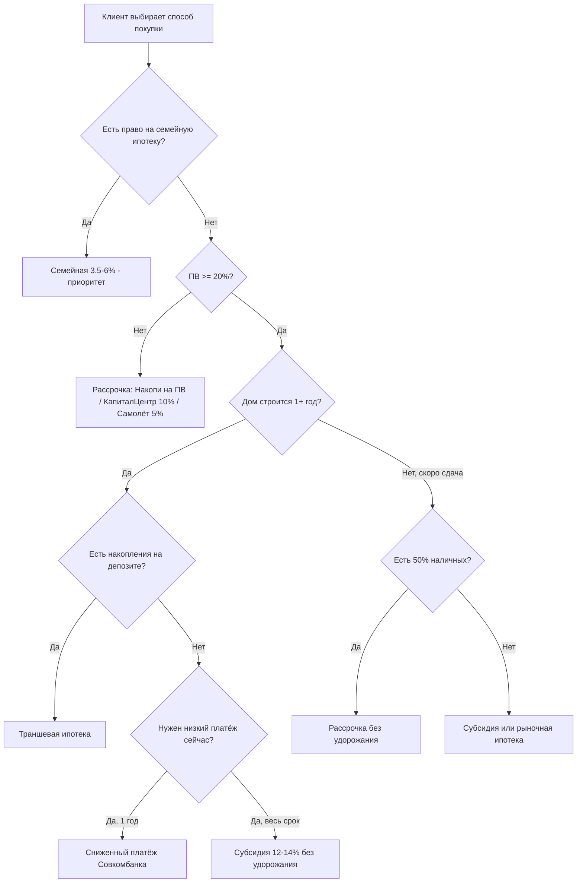

# Приоритет подбора способа покупки

Правило выбора финансового инструмента для клиента новостройки в Уфе. Применяется **после** проверки права на госпрограммы (семейная, IT, сельская и др.).

> [!IMPORTANT]
> Сравнивать инструменты только по **полной стоимости владения**: цена квартиры + удорожание рассрочки + все проценты по кредиту. Не по «ставке в рекламе».

## Порядок приоритета

| Приоритет | Инструмент | Когда выбирать |
| :---: | :--- | :--- |
| **0** | **Семейная / IT / иные льготные ипотеки** | Есть право на программу → всегда в приоритете над коммерческими инструментами |
| **1** | **Субсидия 12–14% на весь срок без удорожания** | ПВ ≥ 20%, нет льготы, нужна предсказуемая переплата (Бионика, Конди Нова, Совком 12,49%) |
| **2** | **Траншевая ипотека** | Дом строится 1+ год, ПВ ≥ 20%, есть накопления на депозите, готовность к росту платежа при вводе |
| **3** | **Рассрочка без удорожания** | ПВ ≥ 50% наличными, короткий мост до ипотеки или полной оплаты (КПД, Первый трест, Альтима) |
| **4** | **Рассрочка с удорожанием / «Накопи на ПВ»** | ПВ < 20%, нужно зафиксировать цену и накопить взнос (Архстрой, КапиталЦентр, Самолёт) |
| **5** | **Сниженный платёж Совкомбанка** | Нужен низкий платёж ровно на 12 мес., **маткапитал не в ПВ**, подтверждённый рост дохода на 2-й год |

## Дерево решений

## Красные флаги (отклонить или считать Excel)

- **Обрыв платежа:** субсидия 0,11–6% → 19–22%; Совком 4,4% → 19,99% — обязательно моделировать год 2.
- **Обрыв при финальном транше:** траншевая ипотека при вводе — предупредить о росте в 5–15 раз.
- **Скрытое удорожание:** рассрочка «бесплатная» с +5–10 тыс. ₽/м² или +30% при низком ПВ (Самолёт).
- **Маткапитал в ПВ:** программа «Сниженный платёж» Совкомбанка — **запрещён**.
- **Ключи до 100% оплаты:** почти все рассрочки — проговорить срок ожидания.

## Комбо-схемы

1. **Рассрочка «Накопи на ПВ»** (Архстрой) → **траншевая ипотека** после набора 20,1%.
2. **Рассрочка 25/25/50** (КПД) → **ипотека** на остаток 50% при снижении ключевой ставки.
3. **Траншевая + депозит** → досрочное погашение при выдаче финального транша.

## Инструменты для расчёта

* **[[Калькулятор 4 сценария]]** — Excel-сравнение на эталонном лоте 6 млн ₽
* **[[INDEX|Индекс способов покупки]]** — матрица ЖК × инструменты

---
*Обновлено: 22.06.2026*
