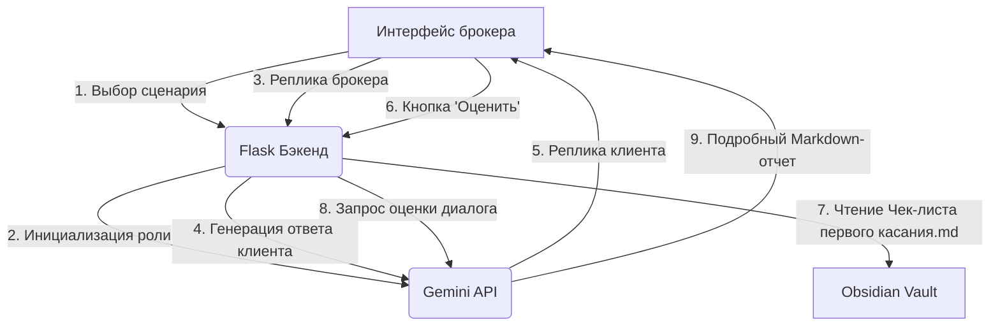

# ⚡ ИИ-Тренажер отработки возражений брокера (Методический Гайд)

Этот модуль представляет собой интерактивный тренажер, предназначенный для обучения и аттестации агентов (как новичков, так и опытных) по твоим собственным чек-листам и регламентам.

---

## 🎯 Назначение и ценность

Основная проблема обучения брокеров — это необходимость тратить время руководителя на ролевые игры («клиент-агент»). Данный инструмент полностью автоматизирует этот процесс:
1.  **Интерактивный отыгрыш:** ИИ реалистично симулирует сложного клиента с конкретным возражением, не давая брокеру простых ответов.
2.  **Мгновенный разбор (Аудит):** Вместо субъективной оценки брокер получает структурированный фидбек, привязанный к твоим критериям из Obsidian.

---

## ⚙️ Как это работает под капотом



1.  **Локальный сервер:** Скрипт `app.py` поднимает сервер, который отдает веб-интерфейс и управляет сессиями.
2.  **Промпты сценариев:** Каждому сценарию прописана жесткая роль (Михаил, Ольга и др.) с определенным уровнем скепсиса и конкретным возражением.
3.  **Динамическая оценка:** При нажатии кнопки «Оценить» бэкенд считывает файл `Чек лист первого касания.md` напрямую из твоего Obsidian. ИИ выступает в роли строгого бизнес-тренера, который сопоставляет реплики брокера с каждым пунктом чек-листа.

---

## 📖 Конкретные примеры диалогов и оценки ИИ

### ❌ Пример 1: Слабая позиция брокера (Низкая оценка ИИ)

*   **Клиент (Михаил):** *«Добрый день! Посмотрел ваш расчет с ипотекой под 3%. Скажите честно, в чем тут подвох? Опять застройщик цену накинул?»*
*   **Брокер:** *«Ну что вы, никакого подвоха! Это официальная программа от банка-партнера. Просто застройщик субсидирует ставку.»*
*   **Клиент (Михаил):** *«Да ладно сказки рассказывать. Я же знаю, что квартиры по этой программе стоят дороже на 1.5-2 миллиона. В итоге я просто переплачиваю эту разницу сразу!»*
*   **Брокер:** *«Да, удорожание есть, но ведь платеж в месяц получается намного меньше! Вы же платите меньше каждый месяц, разве это не выгодно?»*
*   **Клиент (Михаил):** *«Мне невыгодно переплачивать миллионы за сам объект. Я лучше возьму стандартную ипотеку без ваших наценок.»*
*   **Брокер:** *«Как хотите, мое дело — предложить. Давайте я вам скину стандартный расчет.»*

#### 📝 Вердикт ИИ-Оценщика:
> **Общая оценка:** `4/10`
> *   **Установление контакта:** Формальное, имя клиента не уточнено.
> *   **Квалификация болей:** Не выполнена. Брокер не спросил, для чего берется квартира (для себя или под сдачу/перепродажу).
> *   **Отработка возражений:** Провалена. Брокер сразу признал удорожание («Да, удорожание есть»), но не показал математическую разницу на цифрах. Не применил технику согласия.
> *   **Экспертная позиция:** Слабая. Брокер оправдывается, а в конце сдается («Как хотите, мое дело — предложить»).
> *   **Закрытие на шаг:** Отсутствует. Вместо фиксации встречи или звонка — пассивная отправка расчетов.

---

###  Пример 2: Сильная позиция / Финансовый инжиниринг (Высокая оценка ИИ)

*   **Клиент (Михаил):** *«Добрый день! Посмотрел ваш расчет с ипотекой под 3%. Скажите честно, в чем тут подвох? Опять застройщик цену накинул?»*
*   **Брокер:** *«Михаил, здравствуйте! Меня зовут Сергей. Абсолютно резонный вопрос. Вы правы, при субсидировании ставки цена квартиры в договоре действительно выше базовой на 12%. Давайте разберем на цифрах, почему для 80% наших клиентов это все равно оказывается самым выгодным решением. Подскажите, вы квартиру планируете покупать для себя или для сдачи в аренду?»*
*   **Клиент (Михаил):** *«Для себя беру. Но переплачивать лишний миллион за цену объекта все равно не хочется. Откуда выгода, если цена выше?»*
*   **Брокер:** *«Михаил, смотрите. При стандартной ипотеке под 18% за квартиру ценой 8 млн вы будете платить около 110 тыс. рублей в месяц. При субсидированной ставке 3% цена квартиры возрастает до 9 млн, но ежемесячный платеж падает до 38 тыс. рублей. Разница в платеже — 72 тыс. рублей ежемесячно. За 5 лет экономия составит более 4.3 млн рублей. То есть, переплатив 1 млн в цене квартиры, вы экономите 4.3 млн на процентах банку. Скажите, для вас комфортнее переплатить банку или сохранить эти деньги в семейном бюджете?»*
*   **Клиент (Михаил):** *«Хм, ну если так разложить, то логика есть. А если я захочу закрыть ипотеку досрочно за 2 года? Тогда ведь субсидия невыгодна?»*
*   **Брокер:** *«Отличный вопрос! Вы абсолютно правы: если у вас есть вся сумма и вы планируете закрыть кредит за 2-3 года, субсидия не имеет смысла. Для таких случаев у нас есть траншевая ипотека или рассрочка без удорожания, где платеж до сдачи дома составляет всего 10 тыс. рублей. Давайте я сделаю вам два расчета — субсидию и траншевую ипотеку под ваши сроки — и мы сравним их завтра на созвоне в 12:00. Вам удобно будет поговорить?»*

#### 📝 Вердикт ИИ-Оценщика:
> **Общая оценка:** `10/10`
> *   **Установление контакта:** Отличное. Представился, назвал клиента по имени, подтвердил адекватность вопроса («абсолютно резонный вопрос»).
> *   **Квалификация болей:** Уточнил цель покупки (для себя).
> *   **Отработка возражений / Финансовый инжиниринг:** Великолепно. Сразу перевел абстрактный «миллион наценки» в конкретные цифры ежемесячного платежа и показал чистую выгоду (экономия 4.3 млн за 5 лет).
> *   **Экспертная позиция:** На высоте. Брокер не спорит с клиентом, а соглашается при досрочном погашении («вы абсолютно правы») и переводит в альтернативное решение (траншевая ипотека).
> *   **Закрытие на шаг:** Четкое закрытие на созвон с конкретным временем (завтра в 12:00).

---

## 🛠️ Инструкция по кастомизации сценариев

Ты можешь легко добавлять новые сценарии клиентов. Для этого открой файл `app.py` и добавь новый профиль в словарь `CLIENT_PROFILES` в следующем формате:

```python
"new_scenario_id": {
    "title": "Название сценария в меню",
    "description": "Краткое описание для брокера",
    "prompt": "Детальная инструкция для ИИ: как зовут клиента, его характер, какие вопросы задавать, в какой манере отвечать."
}
```
