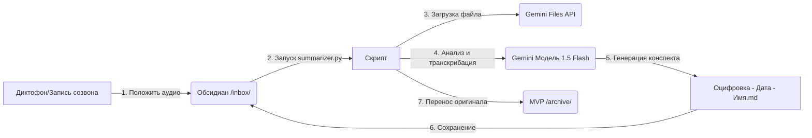

# 🎙️ Умный оцифровщик планерок и встреч (Методический Гайд)

Этот модуль предназначен для автоматической оцифровки живых планерок, совещаний или обучающих сессий с твоей командой брокеров. Скрипт перерабатывает сырую аудиозапись в готовую рабочую заметку со списками задач и новыми инсайтами.

---

## 🎯 Назначение и ценность

Основная потеря информации в бизнесе происходит из-за того, что договоренности на планерках остаются устными. Оцифровщик встреч:
1.  **Экономит время:** Не нужно вручную конспектировать созвоны и писать фоллоу-апы.
2.  **Контролирует задачи:** Автоматически вытаскивает To-Do листы, распределяет задачи по именам брокеров и указывает сроки.
3.  **Фиксирует контент-идеи:** Если на встрече прозвучала крутая идея для Reels, кейс или разбор возражения — ИИ зафиксирует его в твоей базе знаний.

---

## ⚙️ Как это работает под капотом



1.  **Нативная обработка аудио:** Скрипт использует `genai.upload_file`. Gemini API принимает файлы объемом до 8.4 ГБ (что эквивалентно десяткам часов аудио) и анализирует их напрямую, без сторонних конвертеров и платных сервисов транскрибации.
2.  **Шаблон конспекта:** ИИ строго следует заданной структуре: вытягивает ключевую тему, задачи (Action Items), методологию Антона Цоя и проблемные зоны.
3.  **Архивация:** Во избежание повторной обработки, оригинальный аудиофайл переносится в папку `MVP/2_meeting_summarizer/archive/`.

---

## 📖 Пример работы оцифровщика

### 🎙️ Фрагмент аудиозаписи (сырой текст разговора):
> *«Так, коллеги, всем привет. Давайте быстро по задачам на неделю. Дмитрий, у тебя по ЖК Центральный согласование договора застройщиком СУ-10 на каком этапе? Давай до четверга закрой этот вопрос, согласуй правки юристов. Елена, я посмотрел твои последние диалоги, у тебя по лидам с Reels время ответа составляет 2 часа. Это никуда не годится, клиенты остывают. Твоя задача на этой неделе — держать SLA в пределах 15 минут, я проверю в пятницу по выгрузке. И ещё, Сергей, запиши: надо сделать новую карточку ролевой игры по траншевой ипотеке для новичков. Назовем 'Транш по 10 тысяч как альтернатива аренде'. Распиши там выгоду на цифрах, как мы делали в методичке. Сдай мне черновик к следующему понедельнику. По лидам — Дмитрий, отправь Марине ссылку на бота с кодовым словом сегодня же. Всё, всем работать.»*

---

### 📄 Сгенерированная Markdown-заметка в `/Обсидиан/inbox/`:

```markdown
# 🎙️ Оцифровка созвона: Планирование задач брокеров и внедрение траншевой ипотеки

* **Дата обработки:** 2026-07-01
* **Оригинальный файл:** meeting_01_07.mp3

---

## 📝 Краткое содержание встречи
Планерка была посвящена распределению текущих задач на неделю. Основной фокус направлен на ускорение согласования договоров по ЖК Центральный (СУ-10), жесткое соблюдение брокерами SLA по входящим лидам и разработку новых учебных материалов по траншевой ипотеке.

---

## ⚡ Поручения и задачи (Action Items)
*   [ ] **Дмитрий**: Согласовать правки юристов и закрыть вопрос по договору с застройщиком СУ-10 — **Срок: до четверга**
*   [ ] **Елена**: Сократить время ответа по лидам с Reels, удерживать SLA в пределах 15 минут — **Срок: до пятницы (проверка)**
*   [ ] **Сергей**: Разработать карточку ролевой игры для новичков по теме траншевой ипотеки («Транш по 10 тысяч как альтернатива аренде») — **Срок: до следующего понедельника**
*   [ ] **Дмитрий**: Отправить Марине ссылку на Telegram-бота с настроенным кодовым словом — **Срок: сегодня**

---

## 🧠 Методологические инсайты и идеи (Методический блок Антона Цоя)
1.  **Концепт «Транш как альтернатива аренде»**: Разработать учебную схему, показывающую брокерам, как продавать траншевую ипотеку клиентам, сомневающимся в покупке жилья из-за аренды. Платеж 10 000 руб./мес до сдачи дома сравнивается со средней стоимостью аренды аналогичной квартиры.
2.  **Заготовки под Reels/посты**: Идея короткого видео: *«Как платить за свою квартиру 10 тысяч в месяц вместо 40 тысяч за чужую аренду»*.
3.  **Схемы / Расчеты**: Внедрение расчетов траншевой ипотеки для новичков на реальных кейсах.

---

## ❌ Проблемные зоны и обсуждения
*   **Нарушение SLA**: У брокера Елены критическое время ответа на входящие заявки (до 2 часов). Зафиксировано требование исправить этот показатель до нормативных 15 минут.
*   **Затягивание согласований**: Договор по СУ-10 находится в подвешенном состоянии, поставлена задача ускорить юристов.
```

---

## 🛠️ Инструкция по кастомизации промпта

Если ты хочешь изменить структуру конспекта (например, добавить блок «Финансовые расчеты» или «Оценка настроения команды»), открой файл `summarizer.py` и измени текстовую переменную `prompt`. Ты можешь задать любые правила разметки, и Gemini будет им следовать.
