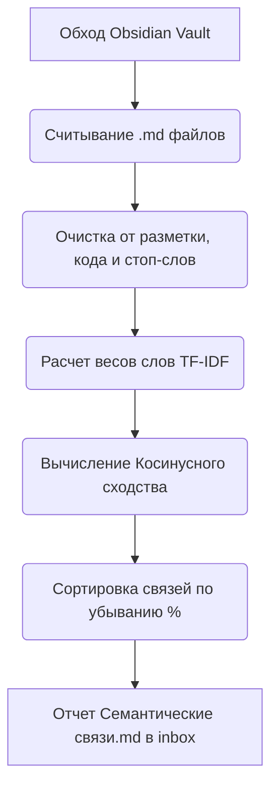

# 🔗 Семантический линкер Второго Мозга (Методический Гайд)

Этот модуль представляет собой интеллектуальный инструмент для связывания заметок в твоем Obsidian. Скрипт анализирует текстовый смысл документов, находит скрытые логические связи и рекомендует проставить перекрестные ссылки `[[ссылка]]`.

---

## 🎯 Назначение и ценность

По мере роста Obsidian-хранилища (Второго Мозга) в нем неизбежно появляются «одинокие» заметки, которые не связаны с остальной структурой. Это приводит к потере контекста. 
Семантический линкер:
1.  **Создает единую сеть знаний:** Помогает быстро переходить от теории к практике (например, от теоретической методички к конкретному кейсу сделки).
2.  **Экономит время на ручной поиск:** Тебе не нужно помнить все 200+ заметок, которые ты написал за год. ИИ сам напомнит о похожих мыслях из прошлого.
3.  **Структурирует контент:** Показывает, какие темы у тебя наиболее проработаны, а какие изолированы.

---

## ⚙️ Как это работает под капотом

1.  **Очистка данных:** Скрипт считывает `.md` файлы и вычищает из них технический мусор: frontmatter (метаданные), блоки кода, HTML-теги и разметку ссылок. Остается чистый русский текст.
2.  **Фильтрация шума (Stop Words):** Из анализа исключаются служебные слова (предлоги, союзы, местоимения «и», «в», «который»), чтобы ИИ сравнивал только смысловые понятия.
3.  **TF-IDF (Важность слов):** Алгоритм оценивает уникальность слов. Если слово «транш» встречается часто в паре документов, но редко в остальном хранилище, его вес повышается.
4.  **Косинусное сходство (Cosine Similarity):** Алгоритм сравнивает направления векторов документов в многомерном пространстве слов. Если векторы близки, документы признаются семантически похожими.

---

## 📖 Пример работы линкера

Представим, что у тебя в Obsidian лежат две заметки в разных папках, которые никак не связаны ссылками.

### 📄 Заметка А: `/6. обучения агентов/Лекция по ипотеке.md`
> *«Сегодня разобрали с агентами особенности траншевой ипотеки. Главная фишка схемы — выдача кредита банком не сразу всей суммой, а частями (траншами). Застройщик СУ-10 согласовал схему, где первый транш составляет 10%, а платеж до сдачи дома равен 10 000 рублей. Это защищает эскроу-счета покупателей от рисков недостроя и делает покупку безопасной.»*

### 📄 Заметка Б: `/10. Выступления/Методичка_Интерактивный_Визуал.md`
> *«При выступлении на тему финансового инжиниринга важно наглядно показывать брокерам безопасность сложных схем. В частности, траншевые ипотеки от застройщика СУ-10 часто вызывают страх банкротства. Объясните на слайде принцип работы эскроу: банк перечисляет первый транш, но деньги лежат на застрахованном счете эскроу, застройщик их не видит до ввода дома.»*

---

### 📊 Результат работы скрипта в файле `Рекомендованные связи.md`:

Скрипт проанализирует эти два файла и обнаружит пересечение ключевых понятий: *«траншевая ипотека»*, *«СУ-10»*, *«эскроу»*, *«застройщик»*, *«первый транш»*. 

В твоем инбоксе появится отчет с рекомендацией:

| Сходство | Заметка А | Заметка Б |
| :---: | :--- | :--- |
| **78.4%** | `[[Лекция по ипотеке]]` | `[[Методичка_Интерактивный_Визуал]]` |

> **Анализ ИИ:** Заметки имеют высокую смысловую связь (сходство 78.4%). Обе заметки описывают безопасность схем траншевой ипотеки от застройщика СУ-10 и работу эскроу-счетов. Рекомендуется связать их ссылкой.

---

## 🛠️ Инструкция по кастомизации параметров

Ты можешь настроить скрипт под свои нужды, открыв файл `linker.py`:
1.  **Порог чувствительности (Threshold):** В строке `if score > 0.25:` задается минимальный процент сходства для вывода в отчет. Если отчетов слишком много, подними порог до `0.40` (40% сходства). Если мало — опусти до `0.20`.
2.  **Исключение папок:** В словарь `IGNORE_FOLDERS` ты можешь вписать любые папки, которые не нужно анализировать (например, личные дневники, архивы старых сделок).
