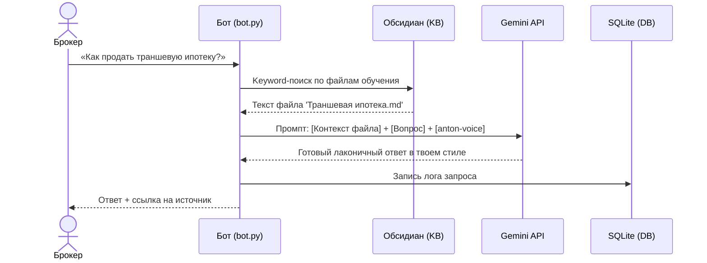

# 🤖 ИИ-Ассистент команды брокеров (Методический Гайд)

Этот модуль представляет собой Telegram-бота для твоих сотрудников. Бот выполняет роль виртуального тренера и справочника, отвечая на вопросы агентов строго по твоим методическим материалам из Obsidian и твоим фирменным голосом (`anton-voice`).

---

## 🎯 Назначение и ценность

Когда в отделе продаж появляется новый брокер, он часто задает руководителю десятки типовых вопросов. ИИ-Ассистент решает эту проблему:
1.  **Разгружает руководителя:** Заменяет постоянные консультации по регламентам и ипотечным программам.
2.  **Обеспечивает единый стандарт ответов:** Брокеры получают не выдуманные ИИ советы, а выжимки из твоих регламентов.
3.  **Контролирует интересы команды:** Все вопросы сотрудников сохраняются в базу данных, позволяя увидеть, какие темы вызывают больше всего вопросов.

---

## ⚙️ Как это работает под капотом (Архитектура RAG)

RAG (Retrieval-Augmented Generation — генерация с привлечением поиска) работает локально на твоих файлах:

1.  **Локальный поиск:** Бот сканирует папку `/6. обучения агентов/` и файл `/Методичка 2.0.md`. Когда агент задает вопрос, бот находит заметку, которая содержит максимум совпадений ключевых слов.
2.  **Генерация в стиле (Tone of Voice):** Найденный текст заметки отправляется в Gemini вместе с системным промптом `anton-voice`. Бот не придумывает ответ от себя, а пересказывает твой файл.
3.  **Логирование:** Каждый запрос, имя пользователя и выданный ответ записываются в файл базы данных SQLite `bot_history.db`.

---

## 📖 Пример работы ассистента

### 💬 Запрос агента в Telegram:
> *«Как новичку отрабатывать возражение клиента про высокие ставки по ипотеке?»*

---

### 🔍 Найденный контекст в Obsidian:
Скрипт находит совпадения в файле `Чек лист первого касания.md` и лекциях по финансовому инжинирингу.

---

### 🤖 Ответ бота в Telegram:
> **Ипотечные ставки сейчас действительно высокие (18-20%). Твоя задача — не спорить с клиентом напрямую, а перевести диалог в плоскость ежемесячного платежа.**
> 
> Действуй по следующей схеме:
> 
> 1. **Смягчение и согласие:** Подтверди адекватность его страха: *«Да, я полностью согласен, ставки сейчас кусаются. И именно поэтому мы с клиентами не смотрим на стандартную ипотеку»*.
> 2. **Математика платежа:** Объясни выгоду альтернативных схем. Сделай расчет: на стандартной ипотеке платеж 110 тыс./мес, а на субсидированной ставке 3% (пусть и с удорожанием объекта) платеж составит всего 38 тыс./мес. Разница в платеже экономит миллионы на процентах банку.
> 3. **Закрытие на шаг:** Предложи сделать расчет под его ситуацию: *«Давайте я сделаю вам два расчета — классический и траншевую схему без удорожания, и мы сравним их завтра в 12:00. Вам удобно будет поговорить?»*
> 
> 📖 _Источник: Чек лист первого касания_

---

## 🛠️ Администрирование и кастомизация

### 1. Как посмотреть, что спрашивает команда
Ты как руководитель можешь в любой момент отправить боту команду:
`/history`
Бот выгрузит из базы данных SQLite последние 10 запросов от твоих брокеров с указанием имен и времени запроса. Это поможет тебе понять, какие регламенты написаны плохо или какие темы брокеры не усвоили на обучениях.

### 2. Как поменять голос бота
Инструкции по Tone of Voice находятся в переменной `system_instruction` внутри файла `bot.py`. Если ты хочешь скорректировать манеру общения (сделать её мягче или, наоборот, еще суше), измени этот блок текста.
