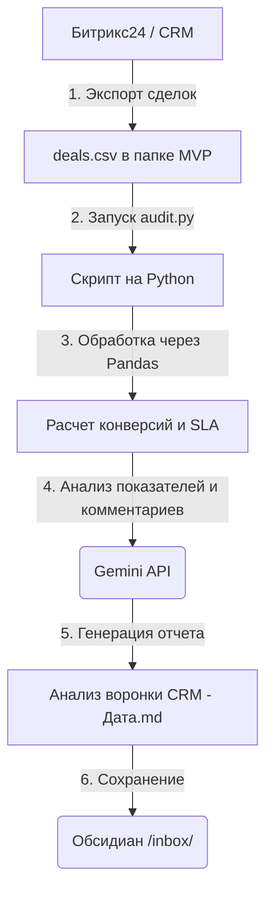

# 📊 Анализатор воронки и дисциплины CRM (Методический Гайд)

Этот модуль предназначен для аудита качества работы твоего отдела продаж на основе выгрузки базы сделок (CSV-файла) из CRM-системы (например, Битрикс24). ИИ анализирует движение сделок, дисциплину брокеров и выявляет узкие места, где сливаются клиенты.

---

## 🎯 Назначение и ценность

Для руководителя важно понимать не просто финансовый итог, а физические причины успехов и неудач. CRM-анализатор:
1.  **Контролирует скорость реакции (SLA):** Показывает, кто из брокеров затягивает время ответа (стандарт — ответ в течение 15 минут).
2.  **Находит точки слива конверсии:** Показывает, на каком именно этапе (Квалификация, Встреча, Показ) отваливается больше всего клиентов.
3.  **Анализирует причины отказов:** Читает текстовые комментарии брокеров по проигранным сделкам, классифицирует их и указывает на систематические ошибки в продажах.

---

## ⚙️ Как это работает под капотом



1.  **Математический расчет (Pandas):** Скрипт считывает файл `deals.csv`, группирует сделки по этапам, вычисляет конверсии переходов и высчитывает среднюю задержку первого ответа (SLA_Delay_Min) для каждого брокера.
2.  **Качественный аудит (ИИ):** Табличные показатели и тексты комментариев по закрытым и проигранным сделкам передаются в Gemini. ИИ работает как независимый аудитор: он сопоставляет комментарии брокеров с методологией Антона Цоя и выносит вердикт.
3.  **Автогенерация демо-данных:** Если ты запустишь скрипт без реального файла выгрузки, он автоматически создаст демонстрационный файл `deals.csv` со сделками вымышленных брокеров (Дмитрий, Елена, Сергей), чтобы ты мог сразу увидеть пример отчета.

---

## 📖 Пример работы анализатора

### 📥 Входные данные (Пример строк из CSV-файла):
*   `ID: 1002, ЖК Символ, Отказ, Брокер: Елена, SLA_Delay: 120 мин, Коммент: Клиент ушел. Сказал, что ставки высокие и лучше будет арендовать. Не отработала возражение.`
*   `ID: 1004, ЖК Центральный, Отказ, Брокер: Дмитрий, SLA_Delay: 45 мин, Коммент: Отказ. Клиент побоялся траншевой схемы, сказал, что застройщик обанкротится.`
*   `ID: 1008, ЖК Символ, Отказ, Брокер: Елена, SLA_Delay: 240 мин, Коммент: Не дозвонилась, сделка в отказе. SLA нарушен жестко.`

---

### 📄 Сгенерированная Markdown-заметка в `/Обсидиан/inbox/`:

```markdown
# 📊 Аудит воронки продаж и дисциплины CRM

* **Дата аудита:** 2026-07-01
* **Проанализировано сделок:** 10 шт.

---

## 📈 Метрики эффективности воронки
* **Конверсия в закрытые сделки (Won Rate):** 20.0%
* **Доля отказов (Lost Rate):** 30.0%
* **Распределение сделок по этапам:**
  * Сделка закрыта: 2 шт.
  * Отказ: 3 шт.
  * Встреча назначена: 1 шт.
  * Экскурсия: 1 шт.
  * Квалифицирована: 2 шт.
  * Новая: 1 шт.

---

## 🕒 SLA и Скорость ответа (Дисциплина)
* **Среднее время задержки ответа (SLA) по брокерам:**
  * **Дмитрий**: 23.3 мин (удовлетворительно, близок к стандарту 15 мин)
  * **Сергей**: 85.0 мин (плохо, задержка ответа более 1 часа)
  * **Елена**: 150.0 мин (критически плохо, клиенты остывают до первого контакта)

> **Анализ дисциплины:** Брокер Елена систематически срывает первичный контакт с клиентами. Задержка в 2.5 часа приводит к потере лояльности еще до выявления потребностей.

---

## 🔍 Глубокий разбор проигранных сделок (Отказов)
Анализ комментариев выявил 2 ключевые проблемы в продажах:

1. **Неумение отрабатывать возражение по высоким ставкам (Елена):** В сделке 1002 клиент ушел в аренду. Брокер согласился с возражением и не предложил альтернативные расчеты субсидии или траншевой ипотеки.
2. **Страх клиентов перед траншевыми схемами (Дмитрий):** В сделке 1004 клиент испугался схемы траншей, боясь банкротства застройщика. Брокер не донес ценность эскроу-счетов как механизма полной защиты средств покупателя.

---

## 🛠️ План корректирующих действий (Рекомендации Антона Цоя)
1. **Провести аттестацию по SLA:** Брокерам Елене и Сергею ограничить выдачу новых лидов до тех пор, пока среднее время первого контакта не снизится до нормативных 15 минут.
2. **Внедрить речевой модуль по эскроу-счетам:** Дмитрию отработать схему объяснения безопасности траншевой ипотеки. Клиент должен понимать, что его деньги лежат в банке, а не у застройщика.
3. **Разбор кейса аренды:** На планерке разобрать с Еленой кейс 1002. Показать математическую разницу между арендой квартиры и платежом по траншевой ипотеке до сдачи дома.
```

---

## 📥 Инструкция по экспорту данных из Битрикс24

Чтобы провести аудит своего реального отдела продаж:
1.  Перейди в Битрикс24 в раздел **CRM -> Сделки**.
2.  Настрой фильтр (например, выбери сделки за последний месяц).
3.  Нажми на шестеренку в правом верхнем углу таблицы сделок и выбери **«Экспорт в CSV»**.
4.  В выгруженном файле переименуй колонки в соответствии с шаблоном: `ID` (Идентификатор), `Title` (Название ЖК/Сделки), `Stage` (Этап), `Broker` (Ответственный менеджер), `SLA_Delay_Min` (Задержка ответа в минутах, если CRM фиксирует это, или создай расчетное поле), `Last_Comment` (Последнее текстовое примечание).
5.  Положи файл в папку `5_crm_funnel_analytics/` под именем `deals.csv` и запусти скрипт.
