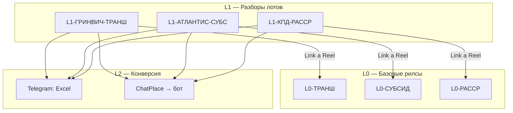

# Контент-граф Reels: способы покупки (MVP)

Единый реестр связанных Reels для аккаунта `@antontsoyufa`. Зеркало графа в Instagram: базовые рилсы (L0) → кейсы на лотах (L1) → воронка (L2).

**Стратегия:** [[Идея контента на привлечение покупателей]]
**Шаблон сценариев:** [[Reels/Шаблон и пример сценария Reels|Шаблон и пример сценария Reels]]

---

## Схема уровней

---

## Реестр роликов

| ID | Уровень | Тема | Сценарий | Instagram URL | Link a Reel → | Заголовок кнопки | Кодовое слово | Статус |
| :--- | :--- | :--- | :--- | :--- | :--- | :--- | :--- | :--- |
| **L0-ТРАНШ** | L0 | Что такое траншевая ипотека | [[Reels/L0/L0-ТРАНШ — Что такое траншевая ипотека]] | — | — | — | — | черновик |
| **L0-СУБСИД** | L0 | Что такое субсидированная ипотека | [[Reels/L0/L0-СУБСИД — Что такое субсидированная ипотека]] | — | — | — | — | черновик |
| **L0-РАССР** | L0 | Что такое рассрочка от застройщика | [[Reels/L0/L0-РАССР — Что такое рассрочка]] | — | — | — | — | черновик |
| **L1-ГРИНВИЧ-ТРАНШ** | L1 | Гринвич + траншевая ипотека | [[Reels/L1/L1-ГРИНВИЧ-ТРАНШ]] | — | L0-ТРАНШ | `Что такое транш` | `ГРИНВИЧ` | черновик |
| **L1-АТЛАНТИС-СУБС** | L1 | Атлантис + субсидированная ипотека | [[Reels/L1/L1-АТЛАНТИС-СУБС]] | — | L0-СУБСИД | `Что субсидия` | `АТЛАНТИС` | черновик |
| **L1-КПД-РАССР** | L1 | Новая Дёма + рассрочка КПД | [[Reels/L1/L1-КПД-РАССР]] | — | L0-РАССР | `Что рассрочка` | `ДЁМА` | черновик |

---

## Порядок публикации

1. Опубликовать **все 3 L0** (один день съёмки).
2. Зафиксировать Instagram URL в таблице выше.
3. Создать Highlight **СЛОВАРЬ** — см. [[Reels/Highlight СЛОВАРЬ — инструкция]].
4. Публиковать **L1** с привязкой Link a Reel к соответствующему L0.

---

## Правила Link a Reel

- На один рилс — **только одна** ссылка.
- L0 **не** ведут в ChatPlace (нет кодового слова на лид).
- L1 **обязательно** озвучивают кнопку: *«Не понятен термин — нажми под видео»*.
- При публикации L1: Share → **Link a Reel** → выбрать L0 → задать заголовок из колонки «Заголовок кнопки».

---

## Источники фактов

| Инструмент | База знаний |
| :--- | :--- |
| Траншевая ипотека | [[Условия траншевой ипотеки]] |
| Субсидированная ипотека | [[Условия субсидированной ипотеки]] |
| Рассрочка | [[Условия рассрочек]] |

---

## Чеклист после публикации L0

- [ ] Вписать Instagram URL в таблицу реестра
- [ ] Создать Highlight `СЛОВАРЬ` (3 рилса в порядке: Транш → Субсидия → Рассрочка)
- [ ] Проверить, что Link a Reel доступен на тестовом L1

**ТЗ на съёмку L0:** [[Reels/ТЗ на съёмку L0 — базовые рилсы]]
