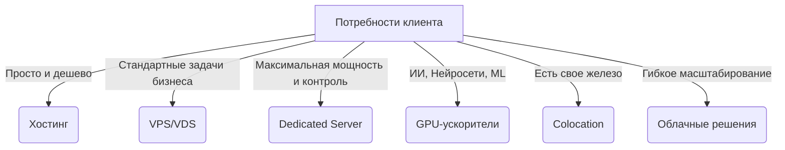

# 🚀 XDataPlus — База знаний и книга партнера
> **Полное руководство по продуктам, инфраструктуре и партнерской программе дата-центра XDataPlus**  
> *Инструмент для быстрого поиска решений, квалификации клиентов, закрытия возражений и генерации пассивного дохода.*

---

## 1. 🏢 О компании и инфраструктуре XDataPlus

**XDataPlus** — это современная российская IT-компания и собственный дата-центр (ЦОД), расположенный в **г. Уфа**. Компания обеспечивает стабильную, безопасную и высокопроизводительную инфраструктуру для размещения сайтов, сложных приложений, корпоративных систем, баз данных и AI/ML-проектов любого масштаба.

### 🛡️ Ключевые преимущества инфраструктуры:
* **Официальный статус:** Компания является официально зарегистрированным реестровым хостинг-провайдером Роскомнадзора.
* **Передовое оборудование:** Серверы на базе новейших процессоров **AMD EPYC** (включая сверхмощные EPYC 9554) и **Intel Xeon**, оперативная память **DDR5 5600 MHz**, сверхбыстрые накопители **NVMe/SSD**.
* **Сетевая доступность:** Прямые каналы связи пропускной способностью **до 10–25 Гбит/с** с минимальными сетевыми задержками (ping).
* **Надежность ЦОД:** Резервирование питания и каналов связи по схеме **N+1**, прецизионное кондиционирование и охлаждение, круглосуточный физический и сетевой мониторинг.
* **Гарантия SLA:** Высочайший уровень доступности сервисов — **99.98%**.
* **Комплексная безопасность:** Защита от DDoS-атак на всех уровнях, интеллектуальная фильтрация входящего трафика, шифрование и многоуровневая система физической безопасности ЦОД.
* **Поддержка 24/7:** Собственный штат квалифицированных инженеров, готовых круглосуточно решить любые технические вопросы клиентов.

---

## 💼 2. Продуктовая линейка решений

Инфраструктура XDataPlus позволяет гибко закрывать любые технические задачи бизнеса. Вся линейка представлена 6 основными решениями:

| Услуга | Суть решения | Для кого идеально подходит |
| :--- | :--- | :--- |
| **VPS / VDS** | Виртуальные серверы с выделенными ресурсами на мощном железе. | Сайты, CRM-системы, 1С, Bitrix, Telegram-боты, тестовые среды. |
| **Dedicated (Выделенный сервер)** | Аренда физического сервера целиком под задачи одного клиента. | Крупные интернет-магазины, порталы с высокой нагрузкой, корпоративные базы данных. |
| **GPU-серверы** | Серверы со сверхмощными графическими ускорителями. | Обучение AI/ML-моделей, нейросети, аналитика данных, 3D-рендеринг. |
| **Хостинг** | Самый простой и доступный вариант размещения небольших сайтов. | Лендинги, сайты-визитки, блоги, промо-страницы. |
| **Colocation (Колокейшн)** | Размещение физического оборудования клиента в ЦОД XDataPlus. | Компании со своим парком серверов, которым нужна надежная гермозона. |
| **Облачные решения** | Гибкая, легко масштабируемая виртуальная инфраструктура. | Быстрорастущие проекты, стартапы с пиковыми нагрузками. |

---

### 🔍 Детальный разбор каждого продукта

#### 🔹 1. Виртуальный сервер (VPS/VDS)
* **Что это такое:** Разделение одного мощного физического сервера на несколько виртуальных машин, которые работают полностью изолированно друг от друга.
* **Как объяснить клиенту простыми словами:** *«Это ваш собственный персональный мини-сервер внутри огромного суперкомпьютера. Он стоит гораздо дешевле физического сервера, но дает вам полную свободу действий».*
* **Почему это удобно:** Полный root-доступ, мгновенное развертывание операционной системы, гибкое масштабирование ресурсов (CPU, RAM, SSD) в один клик без остановки работы проектов.
* **Когда это лучший выбор:** Для интернет-магазинов, корпоративных сайтов, CRM и 1С-бухгалтерии, Telegram-ботов, VPN, а также создания безопасных тестовых окружений для разработчиков.

#### 🔹 2. Выделенный сервер (Dedicated Server)
* **Что это такое:** Аренда отдельного физического сервера в стойке дата-центра, все ресурсы которого принадлежат только одному клиенту.
* **Как объяснить клиенту простыми словами:** *«Это как покупка и установка собственного мощного компьютера в охраняемом дата-центре. Никто не делит с вами процессорное время или диск — вся мощь железа работает исключительно на вас».*
* **Почему это удобно:** 100% выделенные ресурсы, максимальная производительность, абсолютная конфиденциальность данных, полный контроль над аппаратной частью и операционной системой.
* **Когда нужен:** Критически важные бизнес-сервисы, проекты с огромным трафиком и жесткими требованиями к скорости загрузки, распределенные базы данных, сложные ERP-системы.

#### 🔹 3. GPU-серверы (Мощные ускорители)
* **Что это такое:** Серверы, оснащенные профессиональными графическими процессорами для параллельных вычислений.
* **Инфраструктурная гордость:** Доступны передовые ускорители **NVIDIA Tesla H200 NVL 141GB HBM3e**, созданные специально для задач искусственного интеллекта и высокопроизводительных вычислений (HPC).
* **Как объяснить клиенту простыми словами:** *«Это сервер с суперкомпьютерной видеокартой. Он обучает нейросети и обрабатывает терабайты данных в десятки раз быстрее обычного процессора».*
* **Когда подходит:** Обучение и запуск LLM (крупных языковых моделей), работа генеративных нейросетей, сложная аналитика данных, машинное обучение (ML), научные расчеты и профессиональный рендеринг видео/3D-графики.

#### 🔹 4. Хостинг
* **Что это такое:** Размещение файлов сайта на сервере провайдера с предустановленным программным обеспечением.
* **Как объяснить клиенту простыми словами:** *«Готовое решение "под ключ". Вам не нужно настраивать серверы — вы просто загружаете файлы своего сайта через удобную панель управления, и он сразу работает».*
* **Почему это удобно:** Максимально просто, не требует навыков системного администрирования, моментальный старт, удобная панель управления **ISPmanager**, автоматическое резервное копирование.
* **Когда это лучший выбор:** Для простых лендингов, корпоративных сайтов-визиток, личных блогов и небольших интернет-магазинов.

#### 🔹 5. Колокейшн (Colocation)
* **Что это такое:** Аренда места (юнита) в серверной стойке ЦОД для размещения собственного физического оборудования клиента.
* **Как объяснить клиенту простыми словами:** *«Если у вас уже есть свои серверные компьютеры, не держите их в офисе под столом. Привезите их к нам — мы дадим им идеальное питание, скоростной интернет, охлаждение и круглосуточную охрану».*
* **Что получает клиент:** Гарантированное бесперебойное электроснабжение, мощные каналы связи, прецизионное охлаждение, защиту от пожаров и физического проникновения, круглосуточный мониторинг.
* **Когда это нужно:** Крупным компаниям со своим парком IT-оборудования, у которых нет возможности или бюджета строить собственную надежную серверную комнату в офисе.

---

## 💰 3. Партнерская программа XDataPlus

Партнерская программа XDataPlus построена по принципу **win-win**: вы рекомендуете надежную инфраструктуру, приводите клиента — а дата-центр берет на себя всю сложную техническую часть и выплачивает вам честный процент.

### 💸 Сетка вознаграждений партнера:

| Продукт / Решение | Тарифный план | Размер комиссии партнера |
| :--- | :--- | :--- |
| **Хостинг с ISPmanager** | Старт / Базовый / Оптимум | **40%** 🔥 |
| **Хостинг с ISPmanager** | Премиум / Бизнес | **10%** |
| **Виртуальные серверы VPS/VDS/GPU** | Все тарифы и конфигурации | **10%** |

> [!NOTE]
> Комиссия рассчитывается и начисляется автоматически по всем закрытым и оплаченным клиентом услугам.

### 🛡️ Условия и защита сделок (Правила закрепления):
1. **Кросс-продажи и отложенный старт:** Если вы порекомендовали услуги XDataPlus, и клиент зарегистрировался в системе в течение **2 месяцев** после рекомендации — он жестко закрепляется за вашим партнерским аккаунтом.
2. **Пассивный доход:** Все последующие оплаты услуг этим клиентом приносят вам комиссионные начисления.
3. **Длительность выплат:** Стандартные партнерские выплаты по привлеченному клиенту сохраняются в течение **6 месяцев** с момента его первой оплаты. Режим дальнейших выплат может быть пересмотрен и продлен в индивидуальном порядке.
4. **Технический аутсорсинг:** Вам не нужно разбираться в настройках серверов. Вы только передаете контакт — специалисты XDataPlus сами проконсультируют, бесплатно перенесут проекты клиента и запустят инфраструктуру.

### 🏁 Пошаговый алгоритм для старта партнера:
1. **Регистрация:** Перейдите на сайт личного кабинета: [hosting.xdataplus.ru](https://hosting.xdataplus.ru).
2. **Переход в клиентскую зону:** После авторизации откройте раздел **«Клиент»** в левом боковом меню.
3. **Активация:** Выберите пункт **«Реферальная программа»** и нажмите кнопку активации.
4. **Получение ссылки:** Скопируйте вашу уникальную реферальную ссылку.
5. **Контроль результатов:** Вся статистика по регистрациям, кликам, заказам и начислениям будет отображаться в личном кабинете партнера в реальном времени.

---

## ⚡ 4. Быстрые шпаргалки для продаж

### 🎯 Кому продавать? (Целевая аудитория)
* **Владельцы бизнеса с сайтами:** Любой работающий коммерческий сайт требует качественного размещения.
* **Интернет-магазины:** Высоко нагруженные проекты, где скорость загрузки напрямую влияет на конверсию продаж.
* **Компании с CRM и 1С:** Бизнесы, которым нужно вынести бухгалтерию или CRM-базы в безопасное облако для удаленной работы сотрудников.
* **IT-разработчики и веб-студии:** Те, кто создают софт, сайты или сервисы и постоянно нуждаются в надежных серверах для себя и клиентов.
* **Стартапы и AI-проекты:** Команды, обучающие нейросети или запускающие высокотехнологичные продукты.
* **Маркетинговые и Digital-агентства:** Компании, ведущие десятки клиентских сайтов и рекламных кампаний.

### 📢 Как понять, что перед вами потенциальный клиент?
Если в разговоре собеседник произносит хотя бы одну из следующих фраз:
* *«Наш сайт постоянно тормозит или виснет при нагрузках»*
* *«Вчера опять упал сервер, клиенты не могли сделать заказ»*
* *«Мы очень дорого платим за наш текущий хостинг/облако»*
* *«Наша техподдержка отвечает сутками, проблемы не решаются»*
* *«Нам нужна абсолютная стабильность работы баз данных»*
* *«Мы ищем надежное место, чтобы безопасно перенести серверную инфраструктуру»*
* *«Нам не хватает мощностей для запуска нового сервиса»*
* *«Ищем надежный сервер под установку 1С / Bitrix / ИИ»*

> [!IMPORTANT]
> **Каждая из этих фраз — прямой сигнал к действию!** Это готовый лид для XDataPlus, который принесет вам стабильный пассивный доход.

### 💬 Скрипты начала разговора и ледоколы

#### Простые квалифицирующие вопросы:
1. *«А где у вас сейчас размещается ваш рабочий проект/сайт?»*
2. *«Бывают ли у вас проблемы со скоростью работы или стабильностью?»*
3. *«Бывали ли случаи сбоев и как быстро их решала поддержка?»*
4. *«В какую сумму вам обходится содержание серверов в месяц?»*

#### ⚓ Универсальная фраза-оффер:
> *«Слушай, мы плотно сотрудничаем с надежным российским дата-центром XDataPlus в Уфе. У них топовое железо, бесплатный перенос проектов и отличные цены без скрытых переплат. Хочешь, я передам контакты их инженеру, они бесплатно проанализируют твою текущую нагрузку и предложат условия выгоднее и стабильнее?»*

#### 🤷 Что говорить, если клиент задает сложный технический вопрос:
> *«Я не системный администратор, поэтому боюсь ошибиться в деталях. Давай я передам твой технический кейс ведущему специалисту XDataPlus. Он свяжется с тобой, профессионально ответит на все вопросы и бесплатно подберет идеальную конфигурацию под твои требования»*.

---

## 🛠️ 5. Работа с ключевыми возражениями клиентов

#### ❌ Возражение: «У нас уже есть хостинг / нас все устраивает»
* **💡 Ответ партнера:** *«Отлично, это значит, вы понимаете важность надежной инфраструктуры. Но технологии не стоят на месте. Можно просто бесплатно сравнить условия — часто у XDataPlus получается найти конфигурацию быстрее, стабильнее или существенно выгоднее по бюджету. Вы ничем не рискуете, просто получите альтернативное предложение».*

#### ❌ Возражение: «Это дорого»
* **💡 Ответ партнера:** *«В XDataPlus очень гибкая сетка тарифов. Мы можем подобрать индивидуальную конфигурацию строго под ваши текущие задачи, чтобы вы не переплачивали за неиспользуемые мощности. Плюс, вы экономите на администрировании — базовая настройка и поддержка уже входят в стоимость».*

#### ❌ Возражение: «Мы в этом абсолютно не разбираемся»
* **💡 Ответ партнера:** *«И отлично! Вам и не нужно быть системным администратором. Специалисты дата-центра полностью берут всю техническую настройку, оптимизацию и обслуживание серверов на себя. Вы получаете готовое, стабильно работающее бизнес-решение».*

#### ❌ Возражение: «Мы боимся переносить сайт/проект, вдруг все сломается или будет простой»
* **💡 Ответ партнера:** *«Это самый частый страх, но в XDataPlus процедура миграции отточена до мелочей. Инженеры дата-центра бесплатно и полностью под ключ перенесут все ваши сайты, базы данных и настройки. Перенос происходит бесшовно, в ночное время, без остановки работы ваших сервисов и потери клиентов».*

---

## 🏁 Резюме: Главное правило партнера

> 💡 **Мы не просто продаем серверное железо. Мы помогаем решить конкретную бизнес-проблему клиента:** делаем его сайты быстрее, базы данных безопаснее, защищаем от сбоев и экономим его бюджет. 
> 
> Ваша задача — **найти клиента с болью или потребностью и передать его контакт в XDataPlus**. Всю остальную сложную техническую и переговорную работу дата-центр сделает за вас, а вы будете получать стабильные партнерские дивиденды!
