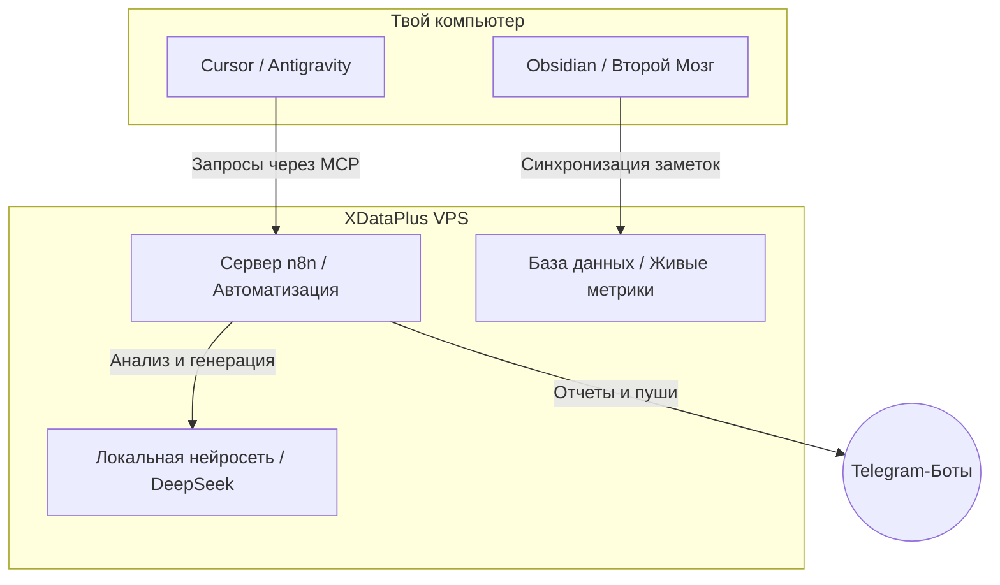

# 🔮 Возможные сценарии использования XDataPlus
> **Инструкция по применению серверной инфраструктуры для предпринимателей, руководителей, AI-разработчиков и обычных пользователей**  
> *Связующее звено между физическим железом дата-центра XDataPlus, силой ИИ (Antigravity) и твоим Вторым Мозгом в Obsidian.*

---

## 🚀 Введение: Зачем тебе сервер в эпоху AI?

В 2026 году серверная инфраструктура перестала быть просто «местом для хранения файлов сайта». Сегодня это **фундамент для твоего цифрового превосходства**. 

Если ты используешь **смыслокодинг**, **Obsidian** и **AI-агентов (Antigravity)**, инфраструктура XDataPlus позволяет тебе развернуть собственные мозговые центры, автоматизировать бизнес-рутину и обеспечить абсолютную независимость от зарубежных облаков и подписок.

---

## 💼 1. Сценарии для Предпринимателя (Бизнес и Юнит-экономика)

> **Главная цель:** Сократить издержки, защитить данные от потери и быстро тестировать гипотезы с минимальным бюджетом (путь наименьшего сопротивления).

* **🏛️ Вынос критической инфраструктуры (1С, CRM, базы клиентов) в ЦОД:**
  * *Как работает:* Вместо покупки дорогого сервера в офис (который шумит, требует кондиционирования и может сгореть при скачке напряжения) ты арендуешь отказоустойчивый **VPS/VDS** или **Dedicated** в XDataPlus.
  * *Результат:* База 1С работает из любой точки мира, данные защищены по схеме резервирования N+1, клиенты всегда имеют доступ к CRM, а бизнес полностью защищен от физического изъятия или кражи офисного оборудования.
* **🛡️ Выполнение закона 152-ФЗ «О персональных данных»:**
  * *Как работает:* Размещение баз данных твоих клиентов на серверах XDataPlus в Уфе.
  * *Результат:* Юридическая безопасность бизнеса перед Роскомнадзором, так как все персональные данные граждан РФ обрабатываются и хранятся на территории России.
* **⚡ Мгновенный тест гипотез (Запуск MVP):**
  * *Как работает:* Запуск лендингов под новые продукты на быстром **Хостинге XDataPlus** в один клик.
  * *Результат:* Проверил спрос за 1 день с затратами в пару сотен рублей. Если взлетело — масштабировал до VPS, если нет — закрыл без финансовых потерь.

---

## 👑 2. Сценарии для Руководителя (Управление и Делегирование)

> **Главная цель:** Гарантировать бесперебойную работу IT-отдела, сэкономить время команды на рутине и спать спокойно.

* **🎯 Делегирование администрирования (Поддержка 24/7):**
  * *Как работает:* Перенос всех сайтов и корпоративных систем компании в XDataPlus.
  * *Результат:* Больше не нужно нанимать в штат дорогого системного администратора. Круглосуточная техподдержка XDataPlus бесплатно перенесет проекты, настроит резервное копирование и будет мониторить серверы 24/7. Если что-то упадет — они починят это ночью, без твоего участия.
* **📊 Защита от простоев (Гарантия SLA 99.98%):**
  * *Как работает:* Размещение высоконагруженных корпоративных порталов на мощных серверах с каналами до 25 Гбит/с.
  * *Результат:* Твоя команда продаж и менеджеры не сидят без дела из-за того, что «лёг сайт или база». Бизнес работает без сбоев и потери прибыли.

---

## 🧠 3. Сценарии для AI-энтузиаста и Смыслокодера (Связка AI + Obsidian + Сервер)

> **Главная цель:** Создать автономную экосистему автоматизации на базе ИИ, которая работает 24/7 без твоего личного присутствия.



* **🤖 Хостинг собственных ИИ-агентов на GPU-серверах:**
  * *Как работает:* Аренда **GPU-сервера с картой NVIDIA Tesla H200** в XDataPlus для развертывания локальных опенсорсных нейросетей (например, *DeepSeek-R1*, *Llama 3*, *Qwen*).
  * *Результат:* Ты получаешь собственного ИИ-ассистента корпоративного уровня, который анализирует конфиденциальные документы твоей компании. Данные **не отправляются в OpenAI или Google**, что гарантирует коммерческую тайну.
* **⚙️ Круглосуточная автоматизация на n8n / Flowise:**
  * *Как работает:* Установка платформы автоматизации n8n на дешевый VPS-сервер в XDataPlus.
  * *Результат:* Твои автоматические воронки, парсеры лидов с Авито/Telegram, автопостинг контента и ИИ-ассистенты работают круглосуточно. Твой компьютер может быть выключен, но система продолжает генерировать пользу.
* **🔌 MCP-серверы для твоего Второго Мозга:**
  * *Как работает:* Подключение ИИ-агента Antigravity через протокол MCP к базе данных Postgres/MySQL, развернутой на твоем VPS в XDataPlus.
  * *Результат:* ИИ-агент видит живые метрики твоего бизнеса, CRM-статусы и финансовые логи в реальном времени прямо из чата, претворяя их в код и стратегии.

---

## 👤 4. Сценарии для Обычного Человека / Создателя

> **Главная цель:** Получить цифровую независимость, безопасный интернет и личное пространство для творчества.

* **🔒 Собственный быстрый VPN / Прокси без ограничений:**
  * *Как работает:* Покупка базового VPS в XDataPlus и установка личного VPN-сервера (например, AmneziaVPN, Outline) в один клик.
  * *Результат:* Безопасный, зашифрованный доступ к любым ресурсам на максимальной скорости без риска утечки твоих паролей и личных данных владельцам бесплатных VPN-сервисов.
* **☁️ Личное облако Nextcloud (Альтернатива iCloud / Google Drive):**
  * *Как работает:* Установка Nextcloud на свой VPS.
  * *Результат:* Тебе больше не нужно платить за подписки Apple или Google. У тебя есть терабайты личного облака для резервных копий фото, видео, архивов Obsidian, доступ к которым есть только у тебя.
* **🤖 Запуск личных Telegram-ботов и пет-проектов:**
  * *Как работает:* Развертывание простых скриптов на Python/Node.js на VPS за 150-300 рублей в месяц.
  * *Результат:* Твои личные боты (например, бот-напоминалка, бот для скачивания видео из YouTube, семейный планировщик) работают стабильно и быстро.

---

## 📊 Сравнительная таблица ценности сценариев

| Сценарий | Что арендуем в XDataPlus | В связке с чем используем | Главный профит для тебя |
| :--- | :--- | :--- | :--- |
| **Для Бизнеса** | VPS / Dedicated | 1C, Bitrix24, CRM | Безопасность 152-ФЗ, защита от проверок и сбоев. |
| **Для Автоматизации** | VPS (минимальный) | n8n, Flowise, Telegram API | Системы и боты работают 24/7 без участия твоего ПК. |
| **Для AI-разработки** | GPU-сервер (Tesla H200) | Ollama, DeepSeek, Langchain | Локальный ИИ корпоративного уровня без утечки коммерческой тайны. |
| **Для Личного пользования**| VPS (базовый) | AmneziaVPN, Nextcloud | Свой скоростной VPN, независимость от iCloud/Google подписок. |

---

## 🧠 5. Твой персональный ИИ в Telegram на базе Obsidian (Архитектура без подписок)

Да, ты всё понял абсолютно верно! Ты можешь полностью отказаться от платных подписок (ChatGPT Plus, Claude Pro) и построить **собственный ИИ-ассистент «под ключ»**, который будет отвечать в Telegram на основе твоей базы знаний Obsidian.

### 🏗️ Как выглядит архитектура твоей личной ИИ-системы на XDataPlus:

```
[Пользователь пишет в Telegram] 
        ⬇️
[Telegram-бот пересылает запрос в n8n / Flowise (на сервере XDataPlus)]
        ⬇️
[n8n делает поиск по твоим заметкам Obsidian в Векторной базе (Qdrant / ChromaDB)]
        ⬇️
[n8n отправляет запрос + найденный контекст в локальную LLM (Ollama / vLLM на сервере)]
        ⬇️
[Локальный ИИ (DeepSeek / Llama) генерирует точный ответ по твоим смыслам]
        ⬇️
[Telegram-бот присылает готовый ответ тебе в чат]
```

### 💎 Почему это революция в твоем рабочем процессе:

1. **🔒 Абсолютная конфиденциальность:** Твои заметки, личные мысли, идеи проектов и данные клиентов хранятся и обрабатываются **только на твоем сервере XDataPlus**. Они не отправляются в OpenAI, Google или Anthropic, что исключает утечки и блокировки аккаунтов.
2. **💰 Фиксированная стоимость без подписок:** Вместо того чтобы платить по $20/мес за каждого пользователя ChatGPT/Claude, ты платишь только фиксированную стоимость аренды VPS-сервера. Сам ИИ для тебя работает **абсолютно бесплатно**, без ограничений на количество сообщений.
3. **🔄 ИИ обучается на твоих заметках (RAG):** Благодаря подключению Obsidian к векторной базе данных, ИИ-бот в Telegram знает твой тон, твои ценности, твои продукты и отвечает в твоей логике («Мой клон»).
4. **🎭 Свобода выбора моделей:** Ты сам решаешь, какую языковую модель запустить на сервере через Ollama (например, сверхбыструю *Qwen-2.5-Coder* для кода, креативную *Llama-3* или глубокую аналитическую *DeepSeek-R1-Distill*). Модели можно менять одной командой в консоли.

---

> 💡 **Финальный инсайт смыслокодера:**  
> Инфраструктура XDataPlus — это «мышцы» твоего Второго Мозга. Загружая смыслы в Obsidian и давая команды AI-агенту (Antigravity), ты строишь «мозг», но именно на серверах XDataPlus этот мозг обретает физическую силу, автоматизируя процессы круглосуточно и принося тебе стабильный доход.
