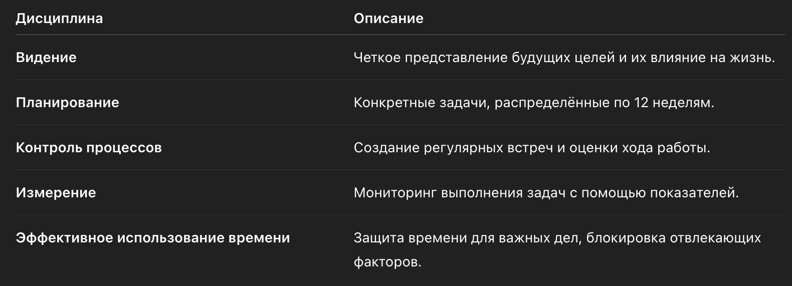
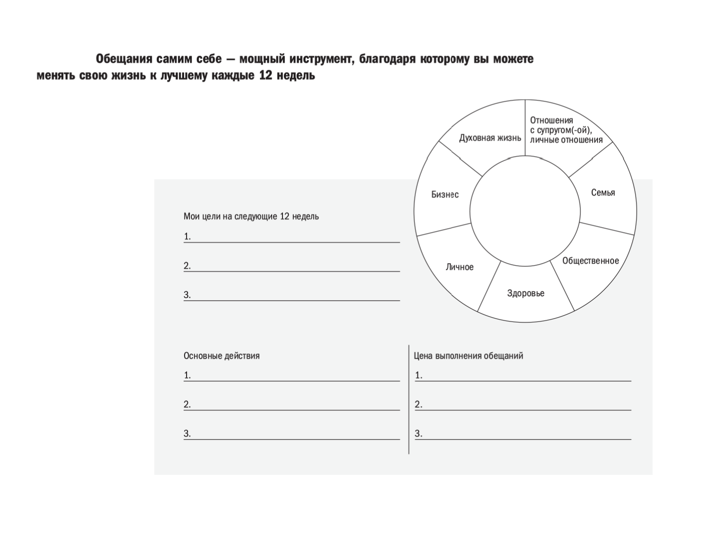
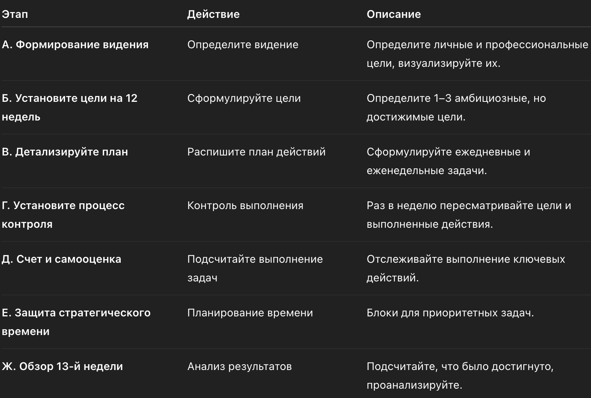
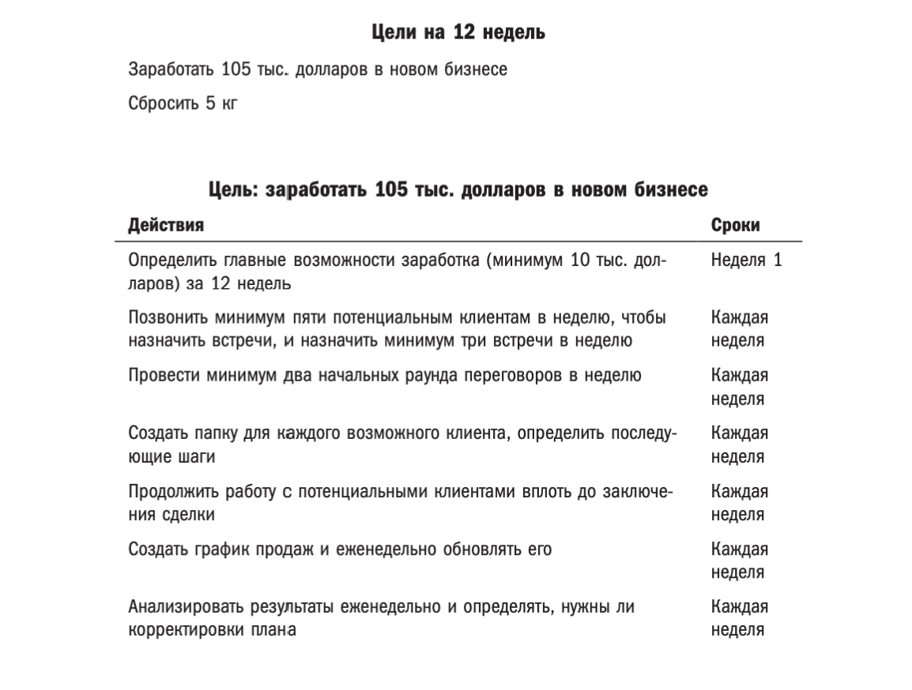
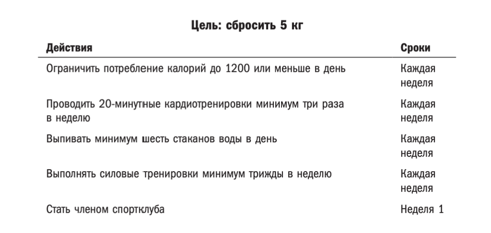
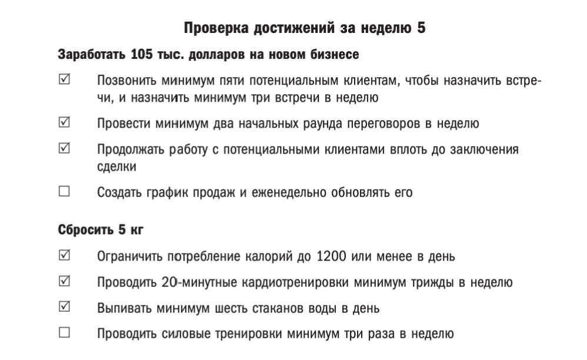
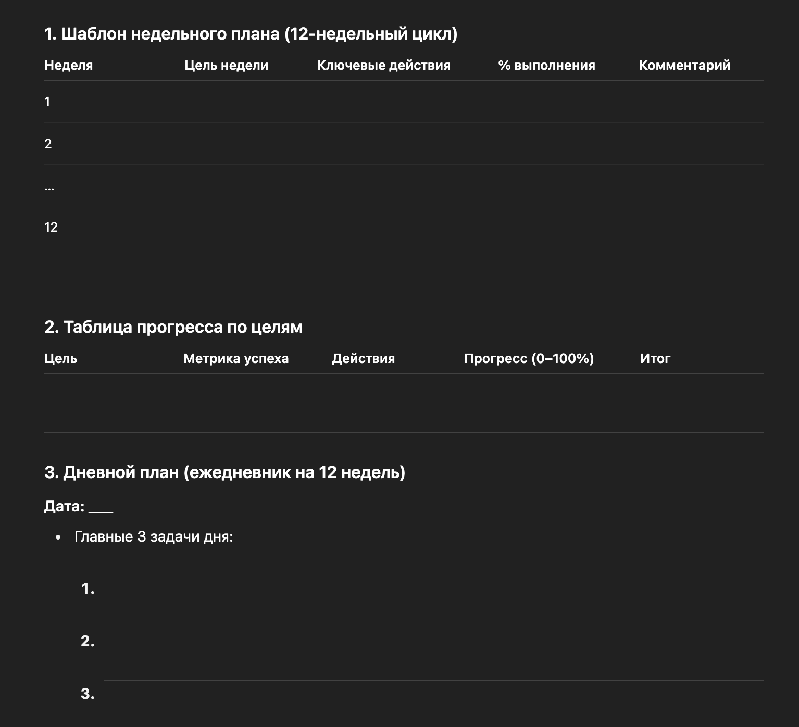

Мы дадим необходимые инструменты, шаблоны и инструкции, которые помогут вам правильно применить стратегию 12-недельного года и достичь всех ваших целей.

**Год спустя вы подумаете, как хорошо было бы, если бы вы начали сегодня!**

**12-недельный год** — система действий, которая позволяет вам раскрывать собственный потенциал каждый день, сосредоточиваясь на главных задачах, представляя себе четкую картину и повышая ощущение неотложности важнейших дел. 

**В результате вы научитесь выполнять главное ежедневно.** 

Конечно, вы не сразу это заметите. Несколько дней или даже недель не покажут вам в полной мере ваши достижения, но через несколько недель успехи начнут расти как снежный ком, и через 12 недель вы увидите совсем другие результаты — как в профессиональном, так и личном плане.

**Основная суть этого метода: ЗА 12 НЕДЕЛЬ ВЫ СДЕЛАЕТЕ И ДОСТИГНЕТЕ БОЛЬШЕ, ЧЕМ ДРУГИЕ ДОСТИГАЮТ ЗА 12 МЕСЯЦЕВ.**

**Почему 12 недель работают лучше, чем 12 месяцев:**

Традиционный год слишком длинный — из-за этого теряется срочность. Мы откладываем действия, надеясь «успеть позже». А 12 недель — достаточно короткий срок, чтобы сохранять концентрацию, и достаточно длинный, чтобы добиться значимого прогресса.

**Методика «12 недель» строится на 3 принципах и 5 дисциплинах:**

**3 принципа:**

> 1. Ответственность.

**Что это означает:**  
Ответственность — это способность брать на себя обязательства и не искать оправданий. Важно осознавать, что успех зависит только от вас. Нет оправданий, нет “плохих дней” — есть лишь ваши действия или их отсутствие.

**Что нужно делать:**

Признайте, что только вы ответственны за результаты в своей жизни.

На каждое ваше решение и действие должны быть последствия, которые вы готовы принять.

Записывайте свои цели и обязательства, чтобы они стали официальными. Чем более публичными они станут (например, в кругу семьи или среди коллег), тем сильнее будет ваша ответственность.

**Как применять:**

Составьте список обязательств, которые вы возьмете на себя в ближайшие 12 недель.

Обязательно расскажите о своих целях человеку, который будет вас поддерживать и помогать не отклоняться от намеченного пути.

> 2. Обязательства.

**Что это означает:**  
Обязательства — это выполнение обещаний, которые вы дали себе, даже если у вас нет настроения или энергии. Это о дисциплине, а не о мотивации.

**Что нужно делать:**

- Составьте список из 1–3 главных целей на 12 недель.
- Для каждой цели установите чёткие обязательства (например, «Я обещаю тренироваться 4 раза в неделю» или «Я обязуюсь написать 5 страниц книги каждый день»).
- Используйте обязательства как руководство для действий. Каждый день напоминание о том, что нужно выполнить, поможет вам не отклоняться от курса.

**Как применять:**

- Каждый день проверяйте, выполнили ли вы свои обязательства. Даже если один день не получится, восстановите дисциплину на следующий день.
- Создайте систему отслеживания выполнения обязательств. Это может быть ежедневник или приложение.

> 3. Величие в моменте.

**Что это означает:**  
Величие в моменте — это способность сосредотачиваться на важном и делать его прямо сейчас, не откладывая на потом. Никаких “я сделаю это завтра” или “когда буду готов”. Вы должны делать важные дела уже сегодня, прямо сейчас.

**Что нужно делать:**

Откажитесь от откладывания дел. Сосредоточьтесь на том, что важно для достижения вашей цели, и выполняйте это немедленно.

Найдите время для ежедневных действий, которые приближают вас к цели.

Когда вы сталкиваетесь с трудностью, например, с прокрастинацией, вспомните этот принцип и сделайте хотя бы минимальные шаги, чтобы двигаться вперед.

**Как применять:**

Запланируйте в своем календаре ежедневные блоки времени для работы над ключевыми целями.

Ведите дневник, в котором отслеживаете, сколько времени вы тратите на важные задачи, и оценивайте свою продуктивность.

**5 дисциплин:**

> 1. Видение.

**Что это означает:**  
Видение — это создание четкой картины того, что вы хотите достичь в жизни или бизнесе. Без видения невозможно оценить, где вы находитесь и куда движетесь. Видение вдохновляет и дает направление.

**Что нужно делать:**

- Определите, каким вы хотите видеть свою жизнь через год, пять лет или десять лет. Это будет вашим глобальным видением.
- Разбейте это видение на более мелкие, достижимые цели, которые можно выполнить за 12 недель.
- Каждый день напоминайте себе о своем видении, чтобы не сбиться с пути.

**Как применять:**

- Запишите четко сформулированные цели на ближайшие 12 недель, которые соответствуют вашему видению.

> 2. Планирование.

**Что это означает:**  
Планирование — это составление детализированного плана действий для реализации ваших целей. Если вы хотите достичь чего-то великого, важно разделить это на маленькие, выполнимые шаги.

**Что нужно делать:**

- Разбейте каждую цель на конкретные задачи и действия, которые нужно выполнить на ежедневной и недельной основе.
- Создайте четкий план на 12 недель, в котором будут указаны все ключевые этапы и промежуточные результаты.

**Как применять:**

- Используйте метод SMART для определения конкретных и измеримых целей. (есть в нашем боте --> раздел "Психологические практики")
- Составьте таблицу или схему, где будут указаны действия и сроки выполнения. (ниже есть примеры и шаблоны)

> 3. Контроль процессов.

**Что это означает:**  
Контроль процессов — это регулярная проверка хода выполнения вашего плана. Этот процесс позволяет скорректировать действия, если что-то пошло не так, или ускорить темп, если результат слишком низкий.

**Что нужно делать:**

- Каждую неделю проверяйте прогресс по всем целям. Это может быть отчёт о выполнении задач или личная рефлексия.
- Определяйте, что работает, а что нет, и адаптируйте свои действия.

**Как применять:**

- Проводите еженедельный анализ, чтобы оценить, что удалось, а что требует изменений.
- Используйте таблицы и графики для отслеживания прогресса. (ниже есть примеры и шаблоны)

> 4. Измерение.

**Что это означает:**  
Измерение — это регулярная оценка того, насколько эффективно вы движетесь к своей цели. Чтобы не потерять фокус, нужно оценивать свою работу по чётким меткам.

**Что нужно делать:**

- Определите ключевые показатели успеха для каждой цели. Например, если ваша цель — похудеть, это может быть потеря веса, уменьшение объема талии, улучшение здоровья, сна, работы ЖКТ и тд.
- Отслеживайте эти метрики ежедневно и еженедельно.

**Как применять:**

- Записывайте количество выполненных действий и успехов в таблицы, чтобы отслеживать прогресс. Измеряйте количество и качество достигнутых целей/выполненных задач в %, так вам будет проще ориентироваться и анализировать. 
- Определите, какие действия дают наибольший результат, и повторяйте их.

> 5. Управление временем.

**Что это означает:**  
Управление временем — это способность выделить для выполнения целей конкретные блоки времени и придерживаться их.

**Что нужно делать:**

- Блокируйте время для выполнения важных задач. Не позволяйте мелочам и отвлекающим факторам вмешиваться в ваш график.
- Используйте тайм-менеджмент для эффективного распределения времени: техника помодоро, блоки времени, приоритетные задачи.

**Как применять:**

- Используйте календарь и планировщики для выделения времени под задачи.
- Каждую неделю создавайте расписание с конкретными временными блоками для работы над целями.

**Таблица для упрощения понимания работы всех 5 принципов, и почему именно в таком порядке:**

**Пошаговый план внедрения. КРАТКО:**

1. **Создайте видение.** Определите, что важно для вас на ближайшие 12 недель. Сформулируйте, где вы хотите быть через три месяца.
2. **Разбейте цели на конкретные задачи.** Определите, какие действия нужно предпринять, чтобы достичь цели.
3. **Запишите свои обязательства.** Составьте план с обещаниями самим себе, что вы обязуетесь делать для достижения целей.
4. **Ежедневный контроль.** Каждый день проверяйте свой прогресс и продумывайте, какие действия предпримете завтра.
5. **Проводите еженедельные обзоры.** Раз в неделю проверяйте свои результаты, корректируйте план и действуйте дальше.

**Ключевой элемент метода: колесо сфер жизни и обещания себе.**

Здесь вы фиксируете:

- свои цели на ближайшие 12 недель,
- ключевые действия,
- «цену» выполнения обещаний (что придётся пожертвовать).

Этот инструмент помогает увидеть, как цели соотносятся со всеми сферами жизни: семья, здоровье, бизнес, личное, общественное, духовное развитие и отношения.

_Скопируйте себе или распечатайте эту схему. Можете начинать заново каждые 12 недель._

**Как внедрить методику шаг за шагом.**

Ниже предлагаем вам наглядную работу принципов метода 12 недель. Каждый шаг прописан подробно + даны примеры для более четкого понимания шагов, в которых участники чаще всего делают ошибки.

Примеры — как поставить 2 амбициозные цели, сформулировать ежедневные/еженедельные задачи для их достижения и разделить все на реальные сроки:

Пример — как отслеживать выполнение ключевых действий и анализировать каждую неделю:

Пример шаблона на каждую неделю/день:

**Эмоциональный цикл изменений.**

Важно понимать, что движение к целям всегда проходит через фазы:

- Оптимизм в начале
- Сомнения и спад
- «Долина отчаяния» (где многие сдаются)
- Новый оптимизм и первые результаты
- Закрепленный успех

**Что делать, чтобы помочь себе дойти до конца на сдаться на 3 этапе:**

Понимать, что сложности — это часть процесса.

Поддерживать мотивацию через видение и систему.

Пройти через трудности и выйти с опытом и уверенностью.

В конце хочется дать вам **еще немного рекомендаций** из личного опыта использования этой методики и по мотивам обратной связи пользователей бота-приложения "Без долгов":

- Не ждите нового года или понедельника — начинайте в любой момент.
- Ставьте ограниченное количество целей (1–3, не больше).
- Используйте ежедневные и еженедельные шаблоны — как те, что выше.
- Объединяйтесь с кем-то, кто тоже хочет изменений и результатов, кто также любит и готов пробовать новое: это усиливает дисциплину.
- Ведите оценку выполнения действий (например, 70%+ считается успешной неделей).

**Метод «12 недель в году» — это не просто способ планирования, а система, которая формирует дисциплину действий, ясность целей и постоянный прогресс.**

**Через 12 недель вы заметите сдвиги, а через год — увидите, что сделали кратно больше, чем обычно**