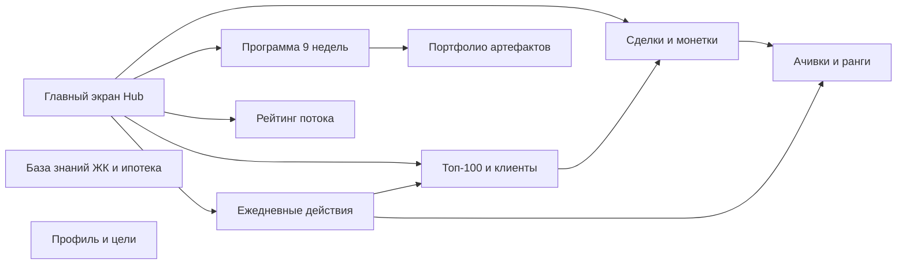
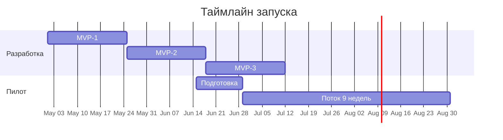

Дата: 2026-04-26
Назначение: короткий питч для руководства АН СРЕДА по запуску дашборда новичка с геймификацией. На 15 минут чтения. Тех-детали — в исходных файлах пакета (см. раздел 12).

---

# Дашборд новичка — презентация для руководства

## Оглавление

1. [Executive Summary](#1-executive-summary)
2. [Проблема](#2-проблема)
3. [Решение — что такое дашборд новичка](#3-решение--что-такое-дашборд-новичка)
4. [Геймификация — три слоя](#4-геймификация--три-слоя)
5. [Связка с программой обучения](#5-связка-с-программой-обучения)
6. [Этапы запуска (MVP-1, MVP-2, MVP-3)](#6-этапы-запуска)
7. [Сроки и команда](#7-сроки-и-команда)
8. [Бюджет](#8-бюджет)
9. [Метрики успеха пилота](#9-метрики-успеха-пилота)
10. [Риски и митигация](#10-риски-и-митигация)
11. [Что нужно от руководства — 5 решений](#11-что-нужно-от-руководства)
12. [Приложение и ссылки](#12-приложение-и-ссылки)

---

## 1. Executive Summary

**Проблема.** Новички теряются между чатом, Excel, материалами курса и CRM. Нет единой точки, где видно: что сделать сегодня, насколько прогрессирую, как обучение конвертируется в сделки и деньги.

**Решение.** Веб-дашборд, который собирает 8-недельную программу обучения, ежедневный трекер действий, мини-CRM, портфолио артефактов и три слоя геймификации (XP/ранги, рейтинг потока, монетки → реальные бонусы и переход на 65/35) в одно рабочее место.

**Бюджет на пилот.** 600–900 тыс.₽ на разработку (10–11 рабочих недель) + ~7 тыс.₽/мес на инфраструктуру + 50–100 тыс.₽ резерв на бонусный фонд первого потока.

**Ожидаемый эффект.** К концу пилота (10 недель + следующие 60 дней наблюдения):
- ≥ 60% новичков прошли программу до конца (сейчас по факту — меньше).
- ≥ 30% сделали первую сделку за 60 дней.
- Время от старта до первой сделки сокращается за счёт прозрачности и системности.
- Получаем продукт, который масштабируется на следующие потоки без дополнительных вложений.

**Что нужно от руководства.** Решения по 5 пунктам (раздел 11): запуск, бюджет, шкала бонусов в рублях, юридическое оформление 65/35, наставник-проверяющий.

---

## 2. Проблема

### 2.1. Как сейчас выглядит работа новичка

| Источник | Что там лежит |
|----------|---------------|
| PDF / docx / Notion | Материалы курса |
| Excel / блокнот | Карточки ЖК, Топ-100, расчёты ипотеки |
| Telegram-чат группы | Вопросы и обмен опытом |
| CRM (если есть) | Клиенты и сделки |
| Голова РОПа | Прогресс по обучению, кому что напомнить |

**Никто целиком не видит** прогресс новичка, его ежедневные действия, артефакты и связь «обучение → действия → деньги».

### 2.2. Тезисы из диагностики агентств

Из материала [diagnostika-agentstva-pered-obucheniem_2026-04-24.md](diagnostika-agentstva-pered-obucheniem_2026-04-24.md), раздел «Красные флаги», встречаются регулярно:

- «У нас нет цифр по воронке».
- «Каждый агент работает как умеет».
- «Новички не знают, что делать в первый день».
- «Нет человека, который внедряет знания после обучения».

Это и есть симптомы того, что **обучение и работа живут параллельно**, а не связаны.

### 2.3. Цена проблемы

- Программа обучения сильная, но без внедрения теряет 70–80% эффекта (стандартная статистика по корпоративному обучению).
- Текучка новичков в первые 3–6 месяцев — основной финансовый удар по агентству (вход стоит дорого, выход не приносит сделок).
- РОП тратит 30–40% времени на ручной контроль, который можно автоматизировать.

---

## 3. Решение — что такое дашборд новичка

### 3.1. Идея в одном предложении

> Одно рабочее место новичка, где курс, ежедневные действия, клиенты и геймификация связаны друг с другом и видны и агенту, и наставнику.

### 3.2. Карта блоков

### 3.3. Что новичок видит на главном экране

- **Сегодня:** одна главная задача дня (например, «Сдай ДЗ Недели 4 — фиксация уникальности, осталось 2 дня»).
- **Текущая неделя курса:** прогресс-бар по чек-листу ДЗ.
- **Дневной трекер действий:** касания, диалоги, подборки, показы, контент. Кнопка «+1».
- **Статус:** ранг (Стажёр / Агент / Опытный / Мастер / Легенда), XP, монетки, место в рейтинге потока.
- **Лента событий:** «Айгуль получила +50 XP за финмодель», «Марат поднялся на ранг Агент».

### 3.4. Что видит наставник

- Сводная таблица по подопечным: текущая неделя, % сдачи ДЗ, активность, риски.
- Очередь ДЗ на проверку с таймером SLA.
- Светофор: зелёный / жёлтый / красный по каждому новичку.

Подробнее: [04-mvp-1-spec.md](04-mvp-1-spec.md).

---

## 4. Геймификация — три слоя

Геймификация специально устроена так, чтобы **усиливать поведение**, а не «развлекать». Три слоя нацелены на три разные мотивации.

### 4.1. Слой 1 — индивидуальный прогресс (XP и ранги)

Каждое действие приносит XP. По мере накопления — ранг.

| Ранг | XP | Что значит |
|------|----|------------|
| Стажёр | 0 | старт |
| Агент | 1 000 | прошёл базу |
| Опытный | 3 000 | пройдена половина программы + первая активность |
| Мастер | 7 000 | пройдена программа + 2–3 сделки |
| Легенда | 15 000 | системно работающий агент |

Источники XP: сдача ДЗ (100–300), артефакты (30–150), действия (с дневными капами), серии (streaks), сделки (1 000 за полный цикл).

Дневные капы XP защищают от накрутки: «не качество, а количество» не работает.

Подробнее: [02-pravila-geymifikacii.md](02-pravila-geymifikacii.md), разделы 2.2–2.5.

### 4.2. Слой 2 — соревновательный (рейтинг потока)

- Виден свой ранг в потоке + 2 человека выше / 2 ниже.
- Топ-3 закреплены сверху.
- Метрики на выбор: XP, касания, диалоги, сделки, монетки.
- Рейтинг скрывается, если в потоке < 5 человек (нет смысла соревноваться).

Цель — не «загнать аутсайдеров», а дать достижимый ориентир рядом.

### 4.3. Слой 3 — материальный (монетки и деньги)

Идея монеток — из ваших же заметок, [Идеи на реализацию.md, раздел 4.2](Идеи%20на%20реализацию.md): «нажал красную кнопку → упала монетка → 3 монетки → бонус → 10 монеток → 65/35».

**1 монетка = 1 закрытая и оплаченная сделка** (по подтверждению РОПа).

| Монеток | Бонус | Тип |
|---------|-------|-----|
| 3 | +5 000 ₽ к выплате (Стартер) | разовый |
| 5 | +15 000 ₽ к выплате (Системный) | разовый |
| 10 | **переход на 65/35** | постоянный |
| 20 | +50 000 ₽ + статус Амбассадор | разовый |

Суммы — гипотеза, требуют подтверждения с финансовой моделью (см. раздел 11).

---

## 5. Связка с программой обучения

Дашборд **встраивает** существующую 8-недельную программу СРЕДА — не заменяет её. Каждая неделя в дашборде это та же неделя курса, но с чек-листом, загрузкой артефактов и автоматическим начислением XP.

| Неделя | Тема | Артефакт | XP за ДЗ |
|--------|------|----------|----------|
| 0 | Знакомство и цели | Карточка целей | 100 |
| 1 | Рынок и роль агента | Карта 5 ЖК + ценность | 200 |
| 2 | Застройщики Москвы / СПб / Краснодара | 6 карточек ЖК | 250 |
| 3 | Стратсессия №1 | План на 4–7 неделю | 150 |
| 4 | Работа с клиентом | Диагностика + фиксация уникальности | 300 |
| 5 | Ипотека и страховка | Финмодель + шпаргалка | 300 |
| 6 | Перерыв | Чек-лист самостоятельной работы | 100 |
| 7 | Каналы привлечения | Топ-100 + рассылки + сторис | 250 |
| 8 | Стратсессия №2 | Полный цикл + ответы на возражения | 200 |
| 9 | Система работы и план на 150к | Финальный дашборд метрик | 300 |

Полные критерии «сдано» по каждой неделе — в [03-kriterii-zachyota-dz.md](03-kriterii-zachyota-dz.md). Они уже превращены в чек-листы для наставника.

Логика: следующая неделя открывается **только после приёма ДЗ предыдущей**. Это защищает от формального прохождения курса.

---

## 6. Этапы запуска

Делаем не «всё и сразу», а тремя ступенями. Каждая — по 3,5 рабочие недели на одного разработчика.

| Этап | Что появляется | Зачем |
|------|----------------|-------|
| **MVP-1** | Курс, ДЗ, артефакты, трекер действий, ранги, ачивки, профиль, кабинет наставника | Проверить, что новички ведут работу в дашборде, а не в Excel |
| **MVP-2** | Мини-CRM Топ-100, сделки, монетки, шкала бонусов, рейтинг потока | Превратить дашборд в рабочий инструмент с реальной экономикой |
| **MVP-3** | Telegram-бот для +1 действий, генератор PDF фиксации и финмодели, кабинет наставника со сводкой и аналитикой | Снять трение в ежедневном использовании, дать наставнику инсайты |

Скоупы каждого MVP подробно — в файлах [04-mvp-1-spec.md](04-mvp-1-spec.md), [05-mvp-2-spec.md](05-mvp-2-spec.md), [06-mvp-3-spec.md](06-mvp-3-spec.md).

Логика пересечения: MVP-2 финализируется к старту пилота. MVP-3 (Telegram-бот) докатывается во вторую половину пилота.

---

## 7. Сроки и команда

### 7.1. Сроки

- **Разработка:** 10–11 рабочих недель суммарно (3,5 + 3,5 + 3,5).
- **Подготовка пилота:** 2 недели до старта потока (наполнение контентом, обучение наставника).
- **Пилот:** 10 недель (1 неделя онбординг + 9 недель программы) + 60 дней наблюдения за сделками.
- **Итог:** от запуска разработки до решения «масштабируем дальше» — около 6 месяцев.

### 7.2. Команда

| Роль | Кто | Загрузка |
|------|-----|----------|
| Продакт | Антон | 5–10 ч/нед на принятие решений и контент |
| Разработчик | внешний или внутренний | full-time на 11 недель |
| Дизайнер | внешний | 1 неделя на UI-кит и ключевые экраны |
| Наставник-проверяющий | 1 РОП | ~1 ч/день в пилоте |
| Тех-поддержка после запуска | разработчик на part-time | 4–8 ч/нед |

---

## 8. Бюджет

Все цифры — гипотеза, требуют подтверждения с финдиректором.

### 8.1. Разовые расходы (на пилот)

| Статья | Минимум | Максимум | Комментарий |
|--------|---------|----------|-------------|
| Разработчик (11 нед.) | 600 000 ₽ | 900 000 ₽ | Middle-Senior fullstack, 150–250 тыс.₽/мес |
| Дизайнер (1 нед.) | 50 000 ₽ | 100 000 ₽ | UI-кит + ключевые экраны |
| Бонусный фонд первого потока | 50 000 ₽ | 100 000 ₽ | Стартер и Системный для первых 1–2 закрывших |
| Контент (заполнение базы знаний, тексты) | 0 ₽ | 30 000 ₽ | Можно силами Антона |
| **Итого разово** | **700 000 ₽** | **1 130 000 ₽** | |

### 8.2. Регулярные расходы

| Статья | В месяц |
|--------|---------|
| Vercel Pro | ~2 000 ₽ |
| Supabase Pro | ~2 500 ₽ |
| Resend (email) | бесплатно до 3 000 писем |
| PostHog (аналитика) | бесплатно до 1 млн событий |
| Sentry (мониторинг ошибок) | бесплатно |
| Домен | ~100 ₽/мес |
| Тех-поддержка part-time | 30 000 – 60 000 ₽ |
| **Итого** | **~35 000 – 65 000 ₽/мес** |

### 8.3. ROI-логика (для обсуждения)

Если из первого потока 8–15 человек хотя бы 3 дополнительно дойдут до сделки благодаря системе (что соответствует целевым метрикам) — это +3 средних чека по 5 млн ₽ = +15 млн ₽ оборота. При комиссии 50/50 = +375 тыс.₽ маржи агентства за квартал.

Со второго потока (та же платформа без новых вложений) ROI становится положительным.

---

## 9. Метрики успеха пилота

Метрики берём из [07-pilotnyy-zapusk.md](07-pilotnyy-zapusk.md), раздел 7.6. Делим на лидирующие (видны в процессе) и запаздывающие (видны в конце).

### 9.1. Лидирующие — снимаем еженедельно

| Метрика | Цель |
|---------|------|
| DAU/WAU потока | ≥ 70% |
| Доля сдавших ДЗ в срок | ≥ 80% |
| Среднее время до приёмки ДЗ наставником | ≤ 24 ч |
| Доля действий с привязкой к клиенту | ≥ 60% |
| Уход из дашборда (нет действий 5+ дней) | < 20% когорты |

### 9.2. Запаздывающие — на конец пилота

| Метрика | Цель |
|---------|------|
| Доля прошедших программу полностью | ≥ 60% |
| Доля с ≥ 1 сделкой за 60 дней | ≥ 30% |
| Доля с ≥ 1 сделкой за 90 дней | ≥ 50% |
| NPS у новичков | ≥ 40 |
| NPS у наставника | ≥ 50 |

### 9.3. Что считаем успехом

Минимально достаточный успех пилота:
- 60%+ прошли программу.
- 30%+ сделали первую сделку за 60 дней.
- NPS ≥ 40.
- 5+ важных UX-багов найдены и устранены.
- Откалиброван баланс XP/монеток.

При успехе — запуск второго потока без новых вложений в платформу.

---

## 10. Риски и митигация

| Риск | Вероятность | Влияние | Митигация |
|------|-------------|---------|-----------|
| Наставник не успевает проверять ДЗ за 48 ч | высокая | среднее | SLA, Telegram-нотификации, резервный наставник |
| Новички не входят в дашборд после первого дня | средняя | высокое | 5-минутное демо в Неделе 0 + индивидуальная помощь |
| Накрутка XP / монеток | средняя | среднее | Дневные капы, обязательные поля, подтверждение РОПом, антифрод-серия |
| Конфликт с существующей CRM | средняя | низкое | В MVP-2 не интегрируемся, обозначаем как ограничение пилота |
| Превышение бюджета на разработку | средняя | среднее | Жёсткий скоуп каждого MVP, fixed-price контракт с разработчиком |
| Геймификация воспринимается как «детский сад» | низкая | низкое | Спокойный тон коммуникации, без эмодзи, по брендбуку СРЕДА |

Полный список рисков по каждому MVP — в файлах MVP-спецификаций.

---

## 11. Что нужно от руководства

Пять решений, без которых нельзя начинать. Сроки — гипотеза, согласовываются на встрече.

| № | Решение | Кто принимает | Дедлайн |
|---|---------|---------------|---------|
| 1 | Принципиальный «да» на запуск пилота на 1 потоке | Собственник | 1 неделя |
| 2 | Утверждение бюджета 700 тыс. – 1,13 млн ₽ на разработку | Собственник + финдир | 1 неделя |
| 3 | Шкала бонусов в рублях (Стартер / Системный / Амбассадор) — 5/15/50 тыс.₽ или иные суммы | Финдир + РОП | 2 недели |
| 4 | Юридическое оформление перехода на 65/35 после 10 сделок (приложение к договору) | Юрист | 3 недели |
| 5 | Назначение наставника-проверяющего на пилот (1 РОП с загрузкой ~1 ч/день) | Собственник | 2 недели |

После принятия — запуск разработки в течение 2 недель.

---

## 12. Приложение и ссылки

Полный пакет спецификаций (для разработчика и наставника):

| № | Файл | О чём |
|---|------|-------|
| 0 | [00-readme.md](00-readme.md) | индекс пакета |
| 1 | [01-stek-i-arhitektura.md](01-stek-i-arhitektura.md) | технический стек (Next.js + Supabase) и архитектура |
| 2 | [02-pravila-geymifikacii.md](02-pravila-geymifikacii.md) | XP, ранги, монетки, ачивки, антифрод |
| 3 | [03-kriterii-zachyota-dz.md](03-kriterii-zachyota-dz.md) | критерии «сдано» для всех 9 недель |
| 4 | [04-mvp-1-spec.md](04-mvp-1-spec.md) | спецификация MVP-1 (курс + действия + ачивки) |
| 5 | [05-mvp-2-spec.md](05-mvp-2-spec.md) | спецификация MVP-2 (мини-CRM, сделки, монетки, рейтинг) |
| 6 | [06-mvp-3-spec.md](06-mvp-3-spec.md) | спецификация MVP-3 (Telegram-бот, PDF, аналитика) |
| 7 | [07-pilotnyy-zapusk.md](07-pilotnyy-zapusk.md) | план пилотного запуска и метрики |

Связанные документы по программе обучения:

- [programma-obucheniya-8-nedel.md](programma-obucheniya-8-nedel.md) — программа на 9 недель
- [Маршрутная карта обучений — СРЕДА.md](../Маршрутная%20карта%20обучений%20—%20СРЕДА.md) — 4 блока онбординга и контроль
- [Идеи на реализацию.md, раздел 4.2](Идеи%20на%20реализацию.md) — исходная идея монеток и амбассадорства

---

## Подпись

**Документ подготовлен:** Антон, продакт дашборда новичка.
**Дата:** 26 апреля 2026.
**Версия:** 1.0 — для презентации руководству.
**Что нужно после встречи:** письменное подтверждение по 5 решениям из раздела 11.
