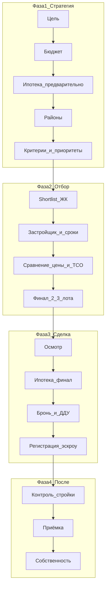

---
tags:
  - #новостройки
  - #сравнение
  - #методология
  - #эксперт-сити
created: 2026-05-23
updated: 2026-05-23
status: аналитика
sources:
  - Чатгпт ИНСТРУКЦИЯ — Как правильно покупать новостройку.md
  - КУРСОР ИНСТРУКЦИЯ — Как правильно покупать новостройку.md
  - Джемини ИНСТРУКЦИЯ — Как правильно покупать новостройку.md
---
# Сравнение ответов: ChatGPT vs Cursor vs Gemini

> **Вопрос:** как правильно подбирать новостройки для клиентов, какие этапы.  
> **Цель анализа:** объективно сравнить три ответа и собрать лучшее в единый стандарт «Эксперт Сити».

---

## Краткий вердикт

| Роль | Лучший ответ | Почему |
|------|--------------|--------|
| **Для бизнеса и агентства** | **Cursor** | 18 шагов, чек-листы, сценарии консультаций, связь с Академией и Telegram — готов к внедрению |
| **Для массового клиента** | **ChatGPT** | Простой язык, понятные блоки «зачем», минимум терминов, хорошо читается с телефона |
| **Для логики рисков и порядка** | **Gemini** | Жёсткая последовательность «сначала деньги и безопасность — потом эстетика», мало воды |
| **Единый стандарт** | **Гибрид** | Cursor как каркас + Gemini как принцип очерёдности + ChatGPT как тон для клиента |

**Итог одной фразой:** Cursor — операционная система; Gemini — философия безопасности; ChatGPT — учебник для человека без опыта.

---

## Сводка по объёму и формату

| Параметр | ChatGPT | Cursor | Gemini |
|----------|---------|--------|--------|
| Шагов / блоков | 20 | 18 | 9 |
| Объём | ~15 тыс. знаков | ~39 тыс. знаков | ~15 тыс. знаков |
| Таблицы / чек-листы | Нет | Да (много) | Нет |
| Mermaid / схемы | Нет | Да | Нет |
| Блок для агента | Нет | Да (3 встречи + фраза win-win) | Нет |
| Контент для Telegram | Нет | Да (4 поста) | Нет |
| Акцент на очерёдность | Слабый | Сильный | Очень сильный |
| Акцент на ипотеку | Средний (шаг 15) | Сильный (шаги 3, 12) | Сильный (шаг 2) |

---

## Сравнительная оценка по критериям (1–10)

| Критерий | ChatGPT | Cursor | Gemini |
|----------|:-------:|:------:|:------:|
| Структура и навигация | 7 | **10** | 8 |
| Практичность «сделать завтра» | 6 | **10** | 7 |
| Безопасность сделки (эскроу, ДДУ, застройщик) | 7 | **9** | **9** |
| Ипотека и полная стоимость | 6 | **10** | 8 |
| Юридический блок | 7 | **9** | 8 |
| Работа агента / консультанта | 4 | **10** | 4 |
| Масштабируемость (обучение, CRM, контент) | 5 | **10** | 5 |
| Простота для новичка-покупателя | **9** | 7 | 8 |
| Логика «не начинать с ЦИАН» | 8 | **9** | **10** |
| Глубина после сделки (стройка, приёмка) | 7 | **10** | 7 |
| **Средний балл** | **6,6** | **9,2** | **7,2** |

*Оценка субъективная, но привязана к критериям внедрения в агентство и обучение.*

---

## Общее: что совпали все три ответа

Все три модели сходятся в базовом:

1. **Сначала цель**, потом выбор квартиры — не наоборот.
2. **Бюджет и платёж** — до просмотра ЖК.
3. **Локация** важнее планировки и отделки (её не изменить).
4. **Застройщик и документы** — критичны (эскроу, декларация, репутация).
5. **Сравнение нескольких вариантов** — без этого решение эмоциональное.
6. **Эмоции и давление** («последняя квартира») — главный враг.
7. **После подписания** — контроль стройки и грамотная приёмка.

Это ядро методологии — его можно смело закрепить как «норму Эксперт Сити» без споров между ИИ.

---

## Где ответы расходятся (ключевые различия)

| Тема | ChatGPT | Cursor | Gemini |
|------|---------|--------|--------|
| **Когда ипотека** | Шаг 15 (поздно) | Шаг 3 (до ЖК) + шаг 12 (финал) | Шаг 2 (до локации) |
| **Критерии квартиры** | Отдельный шаг 5 | Отдельный шаг 5 | Внутри шага 6 (планировка) |
| **Список ЖК** | Размыто в «изучении рынка» (шаг 7) | Явный shortlist 5–10 (шаг 6) | Нет отдельного шага |
| **Цена и акции** | Шаг 14 «момент покупки» | Шаг 9 «полная стоимость на 5 лет» | В шаге 7 (ДДУ/схема) |
| **Осмотр** | Не выделен | Шаг 11 (офис, шоурум, локация) | Не выделен |
| **Бронь** | Не выделена | Шаг 13 | Не выделена |
| **Приоритеты / компромиссы** | Отдельный шаг 6 | В чек-листе must/nice | Нет |
| **Ликвидность** | Отдельный шаг 13 | В шагах 5, 10 | В шагах 3, 6 |
| **Психология / эмоции** | Шаг 16 | В каждом шаге «ошибка если перепутать» | Во вступлении |

**Главный структурный конфликт:** ChatGPT ставит ипотеку после анализа рынка и сравнения ЖК — это **слабое место** относительно Cursor и Gemini. Cursor и Gemini правы: финансовый потолок нужен **до** подбора объектов.

---

## Разбор по каждому ответу

### ChatGPT

#### Сильные стороны

- **Язык для обычного человека** — без перегруза таблицами и жаргоном агентства.
- **Широкий охват смыслов** — цель, бюджет, локация, критерии, приоритеты, рынок, ликвидность, эмоции, приёмка.
- **Хорошие формулировки для контента** — «банк оценивает вас как заёмщика, вы — как человека»; «живёте не в цифре площади, а в пространстве».
- **Отдельный блок про приоритеты и компромиссы** — Cursor это встроил в чек-лист, ChatGPT выделил явно — полезно для первой консультации.
- **Ликвидность даже «для себя»** — зрелая мысль для инвестиционного мышления клиента.

#### Слабые стороны

- **Ипотека на шаге 15** — после рынка, застройщика, сравнения ЖК. Риск: клиент влюбился в объект, который не одобрят / не потянут.
- **Нет операционных артефактов** — таблиц сравнения, чек-листа на одну страницу, сценария встреч агента.
- **20 шагов без жёсткой воронки** — легко «потеряться», нет правила «не больше 3 финалов».
- **Слабая связь с бизнесом** — не сказано, как вести клиента на 2–3 встречи, как позиционировать агента.
- **Дублирование** — бюджет (шаг 2) и комфортный платёж (шаг 3) можно было объединить; «изучение рынка» (7) и «сравнение ЖК» (10) пересекаются.

#### Где использовать

- Посты и stories для **холодной аудитории**.
- Памятка клиенту **до первой встречи** (упрощённая версия).
- Обучение агентов: **как объяснять**, не как вести CRM.

---

### Cursor

#### Сильные стороны

- **Полная воронка 1→18** — от цели до собственности после ключей; каждый шаг с блоками: что делаем / почему / почему сейчас / ошибка при нарушении порядка.
- **Ипотека дважды** — предварительно (3) и финально под лот (12) — соответствует реальной практике брокера.
- **Таблица полной стоимости на 5 лет** — защита от «красивых акций»; критично для win-win с банком и честной сделки.
- **Shortlist 5–10 ЖК → фильтр → 2–3 финала** — снижает хаос и выгорание клиента и агента.
- **Блок для агента** — 3 встречи, домашнее задание, фраза позиционирования — **сразу продукт**.
- **Чек-лист на одну страницу** — можно распечатать / в Telegram / в CRM.
- **Связь с экосистемой** — Академия, Trade-in, цифровой помощник — масштабируемость под 500k+ RUB/мес.
- **Mermaid-схема** — наглядно для обучения и презентаций.

#### Слабые стороны

- **Объём** — для клиента без подготовки может быть «тяжёлым»; нужна укороченная версия (см. раздел 80/20 ниже).
- **Фокус на покупателе**, а не на «подборе для клиента агентом» — формулировка «как покупать», но для агента блок есть только в конце.
- **Мало «человеческой» психологии** — эмоции разобраны через ошибки, а не отдельным сильным блоком как у ChatGPT.
- **Риск перегруза новичка-агента** — 18 шагов без приоритизации «минимум на первую сделку».

#### Где использовать

- **Клиентский стандарт** агентства и скрипт консультации.
- **Академия новостроек** — шаги 7–9, 12–17.
- **Онбординг агентов** и чек-листы в CRM.
- **Серия постов** — уже заготовлены 4 поста в документе.

---

### Gemini

#### Сильные стороны

- **Самая чёткая логика очерёдности** — 9 шагов, каждый с «почему этот пункт именно сейчас».
- **Ипотека на шаге 2** — правильно и жёстко: «одобрение до выбора квартиры».
- **Золотое правило** — финансы и юридическая безопасность → география → эстетика — легко запомнить и продавать экспертизу.
- **Конкретика по рискам** — эскроу, аккредитация банка, разница срока ключей и ввода в эксплуатацию, приёмщик с тепловизором.
- **Компактность** — быстро прочитать за 10–15 минут; хороший «манифест» для агента.

#### Слабые стороны

- **Слишком мало шагов для реальной сделки** — нет брони, осмотра, финальной ипотеки под лот, сравнения акций, пост-сделочной собственности.
- **Нет инструментов** — таблиц, чек-листов, сценариев встреч.
- **ЖК и планировка подряд** (5–6) без shortlist и сравнения цен — риск снова уйти в «один понравившийся ЖК».
- **Нет блока для агента / бизнеса** — только для покупателя.
- **Почти дословное совпадение по объёму с ChatGPT** (~15k) — меньше уникальной глубины в финансовой модели, чем у Cursor.

#### Где использовать

- **One-pager** «как мы работаем» на сайте и в презентации.
- **Обучение:** почему нельзя начинать с ЦИАН (шаги 1–4 — обязательный минимум).
- **Внутренний принцип** агентства — вшить в начало любого длинного гайда.

---

## Объективное сравнение: кто в чём лучше / слабее

### ChatGPT лучше Cursor, когда…

- Нужен **простой текст** без таблиц для клиента 40+ или «первый раз в новостройках».
- Важно проговорить **приоритеты и компромиссы** отдельным блоком.
- Нужны **цитаты для контента** — короткие, запоминающиеся.

### ChatGPT слабее Cursor, когда…

- Нужно **внедрить процесс в агентство** (встречи, CRM, обучение).
- Критична **ипотека до подбора** и **полная стоимость сделки**.
- Нужны **бронь, осмотр, регистрация** как отдельные этапы.

### ChatGPT лучше Gemini, когда…

- Нужен **полный список тем** (20 vs 9) для чек-листа «ничего не забыть».
- Важны **ликвидность, эмоции, момент входа на рынок**.

### ChatGPT слабее Gemini, когда…

- Нужно **жёстко объяснить порядок** «почему нельзя сначала планировку».
- Нужен **короткий** документ для быстрого онбординга.

---

### Cursor лучше ChatGPT, когда…

- Строите **продукт, академию, скрипт продаж**.
- Нужна **повторяемая воронка** на каждого клиента.
- Важны **ипотека × 2, бронь, ДДУ, приёмка, собственность**.

### Cursor слабее ChatGPT, когда…

- Клиент **перегружен** — дайте ему сначала 1–2 страницы ChatGPT-стиля, потом полный Cursor.

### Cursor лучше Gemini, когда…

- Нужна **операционная глубина** после сделки и **инструменты сравнения**.
- Интеграция с **Telegram, Trade-in, Академией**.

### Cursor слабее Gemini, когда…

- Нужен **ультракороткий** принцип на одну карточку — Gemini сжатие сильнее.

---

### Gemini лучше ChatGPT, когда…

- Нужно **объяснить логику порядка** за 9 шагов.
- Акцент на **ипотеку до локации** и **юридическую базу до ЖК**.

### Gemini слабее ChatGPT, когда…

- Нужны **приоритеты, ликвидность, психология** как отдельные темы.

### Gemini лучше Cursor, когда…

- Нужен **манифест на 1 страницу**, а не руководство на 30+.

### Gemini слабее Cursor, когда…

- Нужно **вести сделку до ключей** с чек-листами и встречами агента.

---

## Что взять в финальный стандарт «Эксперт Сити»

| Источник | Что забрать |
|----------|-------------|
| **Gemini** | Принцип: «финансы + безопасность → локация → ЖК → планировка»; ипотечное одобрение **до** подбора; золотое правило в начале каждого гайда |
| **Cursor** | 18-шаговая воронка, таблицы, shortlist, полная стоимость 5 лет, 3 встречи агента, чек-лист, пост-сделка, приёмка, блок Telegram/Академия |
| **ChatGPT** | Тон для клиента; шаг «приоритеты и компромиссы»; формулировки про комфортный платёж и ликвидность; отдельный акцент на эмоции/давление |

### Рекомендуемая архитектура документов

1. **One-pager (Gemini-логика)** — 1 страница для клиента и сайта.  
2. **Полный стандарт (Cursor-каркас)** — для агента и Академии.  
3. **Клиентская памятка (ChatGPT-тон)** — 5–7 страниц PDF/Telegram до встречи 1.

---

## Методология 80/20: минимум, который даёт 80% результата

Если внедрять только **7 шагов** (остальное — по мере сделки):

| № | Шаг | Источник |
|---|-----|----------|
| 1 | Цель + срок ключей | Все три |
| 2 | Бюджет + комфортный платёж + предодобрение ипотеки | Gemini + Cursor |
| 3 | 2–4 района + жизненный сценарий | Все три |
| 4 | Чек-лист квартиры (must / nice) + приоритеты | ChatGPT + Cursor |
| 5 | Shortlist ЖК → проверка застройщика и сроков | Cursor |
| 6 | Сравнение 2–3 лотов: полная стоимость 5 лет | Cursor |
| 7 | Осмотр → бронь → ДДУ → эскроу → приёмка | Cursor + Gemini |

**Не делать до шагов 1–3:** показы ЖК, бронь, подписание «на эмоциях».

---

## Визуальная логика (сводная воронка)

*TCO = total cost of ownership, полная стоимость владения.*

---

## Оценка через призму бизнеса (500k+ RUB/мес, масштаб)

| Вопрос                                         | ChatGPT    | Cursor               | Gemini             |
| ---------------------------------------------- | ---------- | -------------------- | ------------------ |
| Можно ли обучить 10 агентов одному процессу?   | Слабо      | **Да**               | Частично           |
| Можно ли упаковать в продукт / Академию?       | Слабо      | **Да**               | Как вводный модуль |
| Снижает ли риск «плохой сделки» для репутации? | Средне     | **Высоко**           | Высоко             |
| Даёт ли контент на месяц в Telegram?           | Средне     | **Да**               | 2–3 поста          |
| Win-win с застройщиком и банком?               | Не раскрыт | **Да** (явная фраза) | Не раскрыт         |

**Вывод для дохода:** монетизируется не «самый умный текст», а **повторяемый путь клиента** → Cursor + дисциплина Gemini.

---

## Риски, если оставить только один ответ

| Только ChatGPT | Только Cursor | Только Gemini |
|----------------|---------------|---------------|
| Клиенты уходят в ЖК до ипотеки | Перегруз на старте | Пропуск брони, осмотра, TCO |
| Агенты без единого скрипта | Нужна упрощённая версия для клиента | Нет масштаба обучения |

---

## Следующие шаги (действия)

| Действие | Срок | Кому |
|----------|------|------|
| Утвердить **7 шагов 80/20** как обязательный минимум первой консультации | 24 ч | Вы + руководитель обучения |
| Сделать **one-pager** из логики Gemini + шапка Эксперт Сити | На этой неделе | Контент / дизайн |
| Вынести **Cursor-чек-лист** в CRM или Google Doc на каждую сделку | На этой неделе | Агенты |
| Добавить в Академию модуль: шаги 7–9, 12–17 Cursor + тест «порядок этапов» | 2 недели | Академия |
| Серия Telegram: 4 поста из Cursor-документа | 2 недели | Маркетинг |

---

## Итоговая таблица: когда какой ИИ «выиграл»

| Критерий победителя | Победитель |
|---------------------|------------|
| Лучший для внедрения в агентство | **Cursor** |
| Лучший для объяснения клиенту-новичку | **ChatGPT** |
| Лучший для принципа «сначала безопасность» | **Gemini** |
| Лучший баланс «глубина + внедрение» | **Cursor** (с дополнением Gemini + ChatGPT) |

---

## Главное заключение

Три ответа **не противоречат** друг другу в философии — они **разного масштаба и глубины**. Различия в основном в **порядке ипотеки**, **детализации сделки** и **применимости для бизнеса**.

**Рекомендация:** не выбирать один ИИ как «единственно верный». Взять **Cursor как операционный стандарт**, **Gemini как закон очерёдности**, **ChatGPT как клиентский язык** — и собрать один брендированный документ «Как мы подбираем новостройку» для Эксперт Сити.

---

*Файл создан: 2026-05-23 | Анализ на основе трёх инструкций в папке «Как подбирать Новостройки»*
