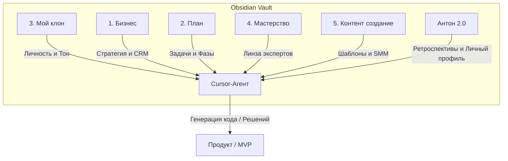

# 🧠 МЕТОДИЧКА: Смыслокодинг и Архитектура Второго Мозга в Cursor + Obsidian
> **Системное руководство по контекст-инжинирингу и AI-разработке**  
> *Адаптация методологии смыслокодинга под экосистему Obsidian и Cursor. Для личного использования, обучения команды и партнеров.*

---

## 1. Философия и Базовая Формула

В 2026 году классический **промпт-инжиниринг устарел**. Ему на смену пришел **контекст-инжиниринг** — искусство проектирования связей и структуры файлов таким образом, чтобы искусственный интеллект (ИИ) сам извлекал нужные знания и принимал точные решения без длинных, раздутых промптов.

**Смыслокодинг** — это перевод твоей личной экспертизы и смыслов бизнеса в работающие цифровые продукты и решения силами ИИ. Это фокус не на написании «кода ради кода», а на создании ценности по пути наименьшего сопротивления с целью генерации стабильного дохода **500k+ RUB/мес**.

### Главная формула смыслокодинга:
```
Короткий запрос ➔ Прогрессивный контекст (Файлы) ➔ Метод (Мастерство) ➔ План ➔ Фаза ➔ Стресс-тест ➔ Реализация ➔ База знаний (Фидбек)
```

> [!IMPORTANT]
> **Принцип 80/20 в действии:**  
> Лучше потратить 2 часа на архитектуру, сбор контекста и стресс-тест плана, чем 2 дня переписывать кодовую базу из-за того, что ИИ «не так понял» исходную задачу.

---

## 2. Архитектура Второго Мозга (Структура папок в Obsidian)

Твоя среда Obsidian организована как единый граф знаний, где файлы связаны через **викилинки** `[[Название_Заметки]]`. ИИ-агент использует эту структуру как карту, подгружая только релевантные файлы (прогрессивная загрузка) для экономии токенов и фокуса.



### Назначение папок и ветвление контекста:

| Папка | Роль в системе | Ключевые файлы внутри |
| :--- | :--- | :--- |
| **`3. Мой клон`** | **Цифровая проекция тебя.** Как ты думаешь, что ценишь, как принимаешь решения и общаешься. | `INDEX.md`, `role.md`, `identity/values.md`, `voice/stop-words.md`, `thinking/mental-models.md`, `principles/business.md` |
| **`1. Бизнес`** | **Второй мозг бизнеса.** Продукты, целевая аудитория, юнит-экономика, CRM-досье, данные клиентов. | `INDEX.md`, `products/`, `customers/avatars.md`, `crm/dossier.md`, `goals/quarterly.md` |
| **`2. План`** | **Тактический хаб.** Живые планы крупных фич, разбитые на последовательные фазы с чекбоксами. | `plans/`, `plans/YYYY-MM-DD-название-фичи.md` |
| **`4. Мастерство`** | **Экспертные линзы.** Сжатые методологии лучших мировых специалистов по темам. | `financial-analysis.md`, `copywriting-frameworks.md` |
| **`5. Контент создание`**| **Дистрибуция.** Шаблоны постов, презентаций, коммерческих предложений в твоем стиле. | `telegram-templates.md`, `presentation-layouts.md` |
| **`Антон 2.0`** | **Личное пространство и лог развития.** Ретроспективы, дневники сессий, карта навигации Cursor. | `Cursor — карта навигации.md`, `retrospectives/` |

---

## 3. Слой 1: AI Клон (Твоя цифровая проекция)

**AI Клон** — это не просто сборник стоп-слов, это инструкция для ИИ, как думать в твоей логике. Он решает главную проблему: **отсутствие необходимости «разогревать» чат** в начале каждого диалога.

### Минимальный скелет папки `3. Мой клон/`:
1. **`INDEX.md`** — Главная карта папки. Роутит агента: *«Если пишем тексты — читай voice/, если принимаем бизнес-решение — читай principles/business.md»*.
2. **`role.md`** — Кто ты: предприниматель, эксперт в недвижимости и AI, цель — продукты с чеком 500k+, стек автоматизации (Obsidian, Cursor, n8n, CRM).
3. **`identity/values.md`** — Ценности: свобода, системность, win-win с партнерами, снижение важности, координация намерения.
4. **`voice/tone.md`** — Стиль общения: на русском, прямо, структурно, без воды, без мотивационной чепухи.
5. **`voice/stop-words.md`** — **Что категорически запрещено писать:** клише (*«уникальный»*, *«инновационный»*), избыточные вводные слова, токсичную срочность, псевдо-экспертную воду.
6. **`thinking/mental-models.md`** — Ментальные модели принятия решений: 80/20, ROI, путь наименьшего сопротивления, сначала ручной тест 3 раза — потом автоматизация.
7. **`principles/business.md`** — Бизнес-правила: не строить сложную систему до первого подтвержденного спроса, сначала оффер и 10 теплых контактов, потом — код.

### 🔄 Петля обратной связи (Feedback Loop)
Клон обучается на ошибках. Если ИИ-агент выдал неверное решение или написал текст «не в твоем стиле», ты правишь его голосом/текстом и даешь команду:
> «Запиши это как жесткое правило в `3. Мой клон/feedback/README.md` в формате: **Правило / Почему / Как применить**».

С каждым коммитом твой клон становится умнее и точнее попадает в твои ожидания.

---

## 4. Слой 2: Бизнес-Контекст и Продукты

В папке `1. Бизнес` хранится вся смысловая база твоих проектов. ИИ-агент принимает решения, сверяясь с экономикой и болями клиентов, а не придумывает их из воздуха.

### 🔒 Безопасность и защита персональных данных (ПДн)
При работе с реальными клиентами в сфере недвижимости или консалтинга строго соблюдай правила ИБ:
* **Никаких секретов в коде:** Пароли, API-ключи, токены хранятся исключительно в файле `.env` (который обязательно заносится в `.gitignore`).
* **Маскирование ПДн:** Не отправляй в LLM реальные e-mail, телефоны или ФИО клиентов без маскирования. Используй обезличенные ID (например, `client_98213`).
* **Закон 152-ФЗ:** Если данные обрабатываются в РФ, следи за тем, чтобы базы данных физически находились на российских серверах (Яндекс.Облако, Timeweb Cloud и т.д.), а ИИ использовался как аналитический слой над обезличенными данными.

### Live-метрики vs Хардкод
Избегай прописывания жестких цифр KPI в markdown. ИИ должен уметь считывать **живые цифры** через MCP-серверы к Google Таблицам или API CRM-системы. Это превращает твой Второй Мозг в живой дашборд.

---

## 5. Слой 3: Процесс Ведения Задач (Воркфлоу из 6 шагов)

Чтобы ИИ не превращал проект в хаос, работа строится по строгому циклу.

```
[Шаг 1: Запрос] ➔ [Шаг 2: Уточнения (Plan Mode)] ➔ [Шаг 3: IDEA.md] 
       ➔ [Шаг 4: Разделение на фазы] ➔ [Шаг 5: Стресс-тест] ➔ [Шаг 6: Реализация]
```

### Шаг 1. Человеческий запрос
Напиши или продиктуй голосом в файл `instructions.md` сырую идею. Не пытайся писать красиво — просто выгрузи мысли из головы за 2 минуты (Brain Dump).

### Шаг 2. Уточнения до 95% ясности
Переведи Cursor в **Plan Mode** (`Shift+Tab` или `/plan`) и скорми инструкцию.
**Промпт:**
> `@instructions.md Задавай мне уточняющие вопросы по одному, пока не будешь уверен на 95% во всех деталях. Если я скажу "на твое усмотрение" — принимай решение сам на основе принципов из моего клона.`

### Шаг 3. Анализ и IDEA.md
Агент проводит исследование рынка, конкурентов и технологических рисков, после чего собирает всю концепцию в один файл `IDEA.md` в корне задачи.

### Шаг 4. Разбиение на фазы в `2. План/`
План крупной фичи создается в отдельном markdown-файле с именем: `YYYY-MM-DD-название-фичи.md`.
Внутри план жестко структурирован на фазы с чекбоксами `[ ]` и `[x]`. 
> [!WARNING]
> Никогда не пиши код на этом этапе. Ошибка в плане правится за 1 минуту. Ошибка в коде стоит дня переделок.

### Шаг 5. Стресс-тест «10 причин облажаться»
Перед написанием первой строчки кода прогони план через жесткую критику в новом окне чата.
**Промпт:**
> `Прочитай мой план в plans/. Проведи его жесткий стресс-тест. Найди 10 причин, почему мы провалимся (двусмысленности в архитектуре, технические риски, конфликты с другими фичами, дыры в безопасности, плохой ROI). Напиши отчет и предложи конкретные правки в файл плана.`

### Шаг 6. Реализация в НОВОМ чистом чате
Когда план утвержден, **закрой старый чат и открой новый**. Это очистит контекстное окно ИИ-агента от «мусора» стадии обсуждения. Включай Bypass Permissions и давай команду:
> `Читай plans/YYYY-MM-DD-название-фичи.md и приступай к Фазе 1. Не переходи к следующему пункту, пока не сдашь текущий с визуальной/технической проверкой.`

---

## 6. Золотые Правила Управления Контекстом

ИИ глупеет и начинает ошибаться, когда контекстное окно переполняется (>60%). Держи жесткую гигиену чатов:

1. **Один чат — одна задача.** Сделал фазу / исправил баг ➔ закрой чат ➔ открой новый.
2. **Контроль объема.** Если шкала контекста приближается к 60-70%, попроси агента:
   > *«Я хочу продолжить в соседнем чате. Напиши мне полный промпт-мост, в котором детально описано, что сделано, что осталось сделать, какие файлы читать и чего не трогать»*.
   Копируешь этот промпт ➔ создаешь новый чат ➔ вставляешь. Контекст чист, работа продолжается без потери фокуса.
3. **Ничего не делай руками.** Все создания папок, перемещения файлов, коммиты, создание структуры делай через команды ИИ-агенту. Иначе ломается синхронизация контекста.
4. **Коммиты после каждой фазы.** Сделал рабочий шаг — сделай коммит. Это твоя точка сохранения. Если все сломается, команда `/rewind` или git-откат спасет проект.

---

## 7. Антипаттерны: Как делать НЕ надо

| Ошибка | Последствия | Как правильно |
| :--- | :--- | :--- |
| **«Сделай все и сразу» одним промптом** | Каша в кодовой базе, агент тупит и переписывает рабочие модули. | Дробление на мелкие фазы. Исполнение строго по шагам. |
| **Технический театр** | Строишь сложную базу данных и микросервисы до первых ручных продаж. | MVP за 7 дней на коленке. Сначала 10 теплых лидов и ручная проверка гипотезы. |
| **Хардкод KPI и конфигов** | Любое изменение ценников, дат или процентов ломает систему. | Вынос всех настроек в переменные окружения, JSON-конфиги или live-таблицы. |
| **Бесконечный чат-монолит** | ИИ начинает забывать начало разговора, глючит и сжигает $100 лимита за день. | «Один чат — одна задача». Смена чатов при переполнении контекста. |

---

## 8. Чек-лист Внедрения для Новичка

Передавая эту методику новому сотруднику или партнеру, дай ему этот пошаговый план на первый месяц:

### 📅 Неделя 1: Фундамент и Микро-MVP
- [ ] Установить **Cursor** и синхронизировать его с папкой Obsidian (Вторым Мозгом).
- [ ] Создать структуру папок: `1. Бизнес`, `2. План`, `3. Мой клон`, `4. Мастерство`, `5. Контент создание`.
- [ ] Написать стартовый `.cursor/rules/` (или README проекта) с правилами навигации.
- [ ] Заполнить базовый AI Клон: `INDEX.md`, `role.md`, `values.md`, `voice/tone.md`.
- [ ] Реализовать первую микро-задачу (например, автоматический генератор офферов под застройщиков) строго по 6-шаговому воркфлоу.

### 📅 Неделя 2: Критика и Узкое Мастерство
- [ ] Внедрить ритуал стресс-теста плана («10 причин облажаться») перед реализацией.
- [ ] Наполнить папку `4. Мастерство` 2-3 выжимками экспертов (например, методология разбора юнит-экономики от Миллера).
- [ ] Начать вести папку `retrospectives/` в `Антон 2.0/` после каждой сессии.
- [ ] Настроить первый кастомный скилл (`SKILL.md`) через Skill Creator для частой рутинной задачи.

### 📅 Неделя 3-4: Масштабирование и Автоматизация
- [ ] Подключить Второго Мозга к живым данным (Live-метрики через Google Sheets MCP).
- [ ] Настроить первый триггер (Cron-запуск анализа CRM-воронки каждое утро в 7:00 с доставкой отчета в Telegram).
- [ ] Провести полный аудит безопасности проекта (Security Review на утечку ключей и ПДн).

---

> 💡 **Финальное напутствие:**  
> Эта система не должна быть идеальной с первого дня. Начни со скелета. Добавляй правила по мере совершения ошибок. Главное — дисциплина контекста и уважение к ИИ как к твоему главному бизнес-рычагу.
