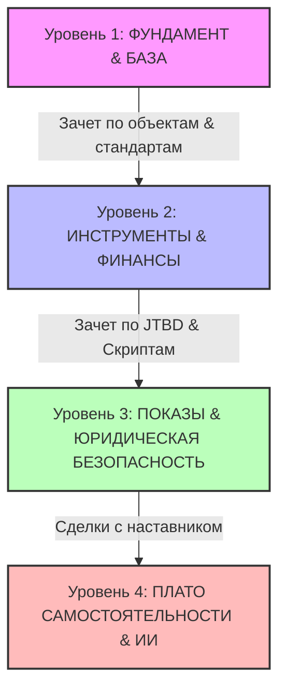

# Маршрутная карта новичка - Эксперт Сити
**Система выращивания антихрупких агентов по новостройкам**

> **Главный манифест:** «Я не продаю - я объясняю». Мы уходим от хаотичного ремесла к системному бизнесу. Наш результат - это следствие дисциплины, глубокого знания рынка и честного, основанного на данных подхода к клиенту.

---

## 1. Философский код программы (ДНК «Эксперт Сити»)

Маршрутная карта построена на пересечении трех фундаментальных опор:

### Опора I. Принцип Антихрупкости (по Нассиму Талебу)
Агент не боится отказов и ошибок - они делают его сильнее.
*   **Ошибки - топливо роста:** Каждый неудачный звонок или потерянный клиент - это обратная связь, а не повод для фрустрации. После каждой ошибки фиксируется урок в *Дневнике антихрупкости*.
*   **Положительная асимметрия:** 10 контактов → 9 отказов → 1 закрытая сделка. Одна сделка окупает все усилия. Чем больше качественных попыток, тем выше вероятность успеха.
*   **Дозированный стресс:** Регулярная практика в безопасной среде (ролевые игры, звонки под присмотром) до выхода к реальным клиентам.

### Опора II. «Я не продаю - я объясняю» (Голос рынка)
*   Мы не манипулируем клиентом и не «впариваем» объекты. Мы помогаем ему разобраться в хаосе предложений на основе реальных данных спроса (*Голос рынка*).
*   Честность превыше быстрой сделки: если ЖК не подходит под сценарий жизни клиента - мы открыто говорим об этом и объясняем риски.

### Опора III. Дизайн-код Генератора (18-58 / 52)
*   **Корректировка систем (Канал 18-58):** Интуитивное видение дефектов и слабых мест. Мы учим новичка замечать, что не работает в текущем выборе клиента, и предлагать точные, логически выверенные исправления.
*   **Стабильный фокус (Ворота 52):** Ритм важнее хаотичной суеты. Умение концентрироваться на одной задаче (блок звонков, блок аналитики) без распыления.

---

## 2. Четыре уровня маршрутной карты

---

### УРОВЕНЬ 1. ФУНДАМЕНТ И АНТИХРУПКОСТЬ (Базовый)
> **Фокус:** Формирование правильного мышления, ДНК агентства, глубокое знание продукта (ЖК Уфы) и дисциплины.
> **Доступ к лидам:** Нет (только симуляции, прослушивание звонков опытных агентов, посещение показов в качестве наблюдателя).

#### Ключевые блоки изучения:
1.  **ДНК и стандарты «Эксперт Сити»:** Кодекс агента, ценности, переход от «впаривания» к экспертному объяснению.
2.  **Дисциплина и Ритм:** Настройка недельного тайм-блокинга, утренние/вечерние ритуалы фокусировки. Метрика дисциплины - выполнение плана недели не ниже 85%.
3.  **Глубокое знание продукта (Флагманы Уфы 2026):**
    *   *ЖК Некрасовский* (наш флагман продаж - 36 сделок в 2025 году).
    *   *ЖК Атмосфера*, *ЖК Урбан Мартен*, *ЖК 8 Небо*, *ЖК Новаленд*.
    *   Заполнение карточек объектов в персональную «Библию агента» (цены, планировки, ипотечные сценарии, честные плюсы и минусы).
4.  **Операционные стандарты:** Правила фиксации уникальности клиента в CRM, партнерские комиссии (РНП до 3 млн - 3%, до 6 млн - 4%, от 6 млн - 5%).
5.  **Наблюдение за практикой:** Прослушивание записей реальных звонков, разбор возражений с тимлидом, физическое присутствие на показах за наставником.

#### Требуемые артефакты уровня:
*   [ ] Персональный SMART-план развития на 8 недель.
*   [ ] Настроенный *Дневник антихрупкости* и трекер дисциплины.
*   [ ] 5 детально заполненных карточек ЖК в «Библию агента» с честным конкурентным анализом.
*   [ ] 3 оформленные учебные фиксации уникальности клиента по регламенту.

#### GATEWAY (Критерий перехода на Уровень 2):
*   **Устный зачет:** Успешная защита каталога объектов перед тимлидом. Быстрый подбор ЖК под выданный кейс за 3 минуты с логической аргументацией.

---

### УРОВЕНЬ 2. JTBD-МЫШЛЕНИЕ И ФИНАНСОВЫЕ МОДЕЛИ (Навыковый)
> **Фокус:** Понимание реальных потребностей клиента, ипотечный брокеридж, расчеты финансовых сценариев, первый контакт.
> **Доступ к лидам:** Ограниченный (работа с первыми теплыми запросами строго через наставника/тимлида).

#### Ключевые блоки изучения:
1.  **Методология Jobs To Be Done (JTBD):**
    *   Клиент покупает не квартиру, а «нанимает» её для решения жизненных задач.
    *   Формулирование *Job Story* («Когда [ситуация], я хочу [мотивация], чтобы [результат]»).
    *   Анализ «Сил прогресса» (Push текущих проблем + Pull преимуществ нового vs Anxiety страхов + Habit старых привычек).
2.  **Голос рынка:** Работа с самыми частыми болями клиентов по реальной статистике спроса (покупка без первоначального взноса, нюансы семейной ипотеки, прогнозы цен, разбор чистовой отделки).
3.  **Первый звонок и переписка:** Скрипты честного контакта, проведение JTBD-диагностики, выявление ограничений и страхов.
4.  **Ипотека и Финмодель:** Расчет ежемесячного платежа, работа с субсидированными ставками, составление сравнительных финансовых таблиц для клиента.
5.  **Системность в CRM:** Ведение карточек сделок по этапам воронки, своевременное заполнение комментариев, выполнение SLA по перезвонам.

#### Требуемые артефакты уровня:
*   [ ] Карта сил прогресса для 4-х основных клиентских сегментов (молодая семья, инвестор, апгрейд, переезд).
*   [ ] Подготовленный банк из 10 шаблонов ответов на сложные/частые вопросы клиентов.
*   [ ] 5 рассчитанных финансовых моделей (ипотечных сценариев) под разные входящие бюджеты.
*   [ ] Успешная CRM-аттестация (правильное ведение воронки).

#### GATEWAY (Критерий перехода на Уровень 3):
*   **Ролевая игра:** Сдача симуляции «Сложный звонок + Диагностика» на оценку «отлично» от тимлида.

---

### УРОВЕНЬ 3. ЮРИДИЧЕСКАЯ БЕЗОПАСНОСТЬ И ЖИВОЕ ПОЛЕ (Практический)
> **Фокус:** Физические показы объектов, юридическая чистота сделки, доведение клиента до брони под контролем наставника.
> **Доступ к лидам:** Самостоятельная работа с входящим потоком под контролем наставника.

#### Ключевые блоки изучения:
1.  **Проведение живых показов:** Регламент встречи на объекте, психология поведения во время презентации, работа с окружением ЖК, акцент на деталях отделки и инфраструктуры.
2.  **Юридический блок:**
    *   Договоры долевого участия (ДДУ), закон 214-ФЗ.
    *   Безопасность расчетов: эскроу-счета, аккредитивы.
    *   Регламент взаимодействия с юристом агентства.
    *   Типичные юридические ловушки и риски застройщиков.
3.  **Работа с возражениями на этапе принятия решения:** «Слишком дорого», «Подожду снижения ставок», «Страшно брать в ипотеку».
4.  **Сопровождение сделки:** От бронирования объекта до подписания кредитного договора в банке и регистрации ДДУ.
5.  **Пост-сервис:** Правильный регламент передачи ключей, удержание контакта после сделки, сбор отзывов и получение рекомендаций.

#### Требуемые артефакты уровня:
*   [ ] Собственный чек-лист проверки юридической надежности строящегося объекта.
*   [ ] 3 самостоятельно подготовленные презентации сравнения объектов для реальных клиентов.
*   [ ] 3 проведенных показа новостроек (зафиксированных видео- или фотоотчетом в чате группы).
*   [ ] Первая самостоятельно доведенная до бронирования/оплаты сделка (при поддержке наставника).

#### GATEWAY (Критерий перехода на Уровень 4):
*   **Первая сделка:** Факт закрытия минимум 1-2 сделок в CRM.

---

### УРОВЕНЬ 4. ПЛАТО САМОСТОЯТЕЛЬНОСТИ И ЦИФРОВИЗАЦИЯ (Автономный)
> **Фокус:** Выход на стабильную системность, применение ИИ-инструментов, создание экспертного контента, полноценная независимая работа.
> **Доступ к лидам:** Полный, безраздельный доступ ко всей инфраструктуре и базам данных.

#### Ключевые блоки изучения:
1.  **ИИ-помощники для агента:** Использование LAMA AI и цифровых ассистентов для транскрибации разговоров, быстрого анализа запросов клиентов, составления текстов писем и подбора квартир.
2.  **Личный бренд & Контент-маркетинг:** Создание экспертных постов и разборов для Telegram-канала Эксперт Сити. Написание Job-ориентированных текстов, привлекающих покупателей.
3.  **Консалтинговое мышление:** Как упаковывать сложные кейсы для застройщиков и вести диалог с менеджерами девелоперов на языке данных и цифр.
4.  **Анализ собственной воронки:** Работа с личными метриками эффективности в CRM (конверсия из звонка во встречу, из встречи в бронь, из брони в сделку). Корректировка личных просадок по конверсии.
5.  **Итоговая аттестация:** Защита выпускного портфеля перед Антоном Цоем и Тимуром Мустакимовым.

#### Требуемые артефакты уровня:
*   [ ] Настроенная персональная рабочая среда с подключенными ИИ-ассистентами.
*   [ ] 3 написанных экспертных лонгрида для Telegram-канала на основе «Голоса рынка».
*   [ ] Заполненный дашборд личной конверсии за весь период обучения.
*   [ ] Защищенный выпускной кейс (презентация сложной сделки, логики подбора и финмодели).

#### ИТОГОВАЯ ЦЕЛЬ (Выход на плато самостоятельности):
*   **Результат:** Стабильное ведение 3–5 активных клиентов в воронке, закрытие от 2 сделок ежемесячно с показателем выполнения недельного ритма не менее 85%.

---

## 3. Таблица перехода по метрикам

| Уровень | Главный фокус | Целевая метрика | Метод проверки (Gate) | Права / Доступы |
| :--- | :--- | :--- | :--- | :--- |
| **Уровень 1** | Продукт & ДНК | Знание 5 базовых ЖК, дисциплина ≥ 85% | Защита каталога объектов | Только теория и симуляции |
| **Уровень 2** | JTBD & Финансы | Скорость диагностики, 5 финмоделей | Симуляция живого звонка | Первые лиды через наставника |
| **Уровень 3** | Показы & Сделки | 3 показа, юридическая чистота | Первая закрытая сделка | Личные клиенты под кураторством |
| **Уровень 4** | ИИ & Автономия | 3-5 активных сделок в месяц, ИИ-драйв | Защита кейса перед Антоном & Тимуром | Полная независимость |

---
**Разработано для Эксперт Сити**  
*Переход от ремесла к масштабируемой системе продаж.*
