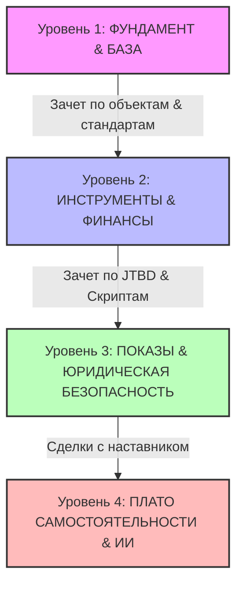

# 🗺️ Маршрутная карта новичка: От старта до автономных сделок («Эксперт Сити»)

> **Главный манифест:** *«Я не продаю — я объясняю»*. Мы уходим от хаотичного ремесла к системному бизнесу. Наш результат — это следствие дисциплины, глубокого знания рынка, честного консалтингового подхода к клиенту и правильной финансовой диагностики.
> 
> *Этот документ объединяет фундаментальный план развития агента «Эксперт Сити» и практическую воронку продаж, сформированную на основе реальных болей и опыта стажеров (разбор диалога Руслана, Эльвины/Лилей и наставников).*

---

## 📑 Содержание
1. **Философский код программы (ДНК «Эксперт Сити»)**
2. **Четыре уровня развития агента (Маршрутная карта)**
3. **Практическая воронка продаж: 5 шагов стажера (CRM-чек-лист)**
4. **Карта болей стажера и фокусы для руководителей**
5. **Таблица перехода по метрикам и воротам (Gates)**

---

## 1. 🧬 Философский код программы (ДНК «Новичка»)

Развитие агента строится на пересечении трех фундаментальных опор:

### Опора I. Принцип Антихрупкости (по Нассиму Талебу)
Агент не боится отказов и ошибок — они делают его сильнее.
*   **Ошибки — топливо роста:** Каждый неудачный звонок или потерянный клиент — это обратная связь, а не повод для фрустрации. После каждой ошибки фиксируется урок в *Дневнике антихрупкости*.
*   **Положительная асимметрия:** 10 контактов → 9 отказов → 1 закрытая сделка. Одна сделка окупает все усилия. Чем больше качественных попыток, тем выше вероятность успеха.
*   **Дозированный стресс:** Регулярная практика в безопасной среде (ролевые игры, звонки под присмотром наставника) до выхода к реальным клиентам.

### Опора II. «Я не продаю — я объясняю» (Голос рынка)
*   Мы не манипулируем клиентом и не «впариваем» объекты. Мы помогаем ему разобраться в хаосе предложений на основе реальных данных спроса (*Голос рынка*).
*   Честность превыше быстрой сделки: если ЖК не подходит под сценарий жизни клиента — мы открыто говорим об этом и объясняем риски.

### Опора III. Дизайн-код Генератора (18-58 / 52)
*   **Корректировка систем (Канал 18-58):** Интуитивное видение дефектов и слабых мест. Мы учим новичка замечать, что не работает в текущем выборе клиента, и предлагать точные, логически выверенные исправления.
*   **Стабильный фокус (Ворота 52):** Ритм важнее хаотичной суеты. Умение концентрироваться на одной задаче (блок звонков, блок аналитики) без распыления.

---

## 2. 🪜 Четыре уровня развития агента

### УРОВЕНЬ 1. ФУНДАМЕНТ И АНТИХРУПКОСТЬ (Базовый)
> **Фокус:** Правильное мышление, ДНК агентства, глубокое знание продукта (ЖК Уфы) и дисциплины.  
> **Доступ к лидам:** Нет (только симуляции, прослушивание звонков, посещение показов с наставником).

#### Ключевые блоки изучения:
1.  **ДНК и стандарты «Эксперт Сити»:** Кодекс агента, ценности, переход от «впаривания» к экспертному консалтингу.
2.  **Дисциплина и Ритм:** Настройка недельного тайм-блокинга. Метрика дисциплины — выполнение плана недели не ниже 85%.
3.  **Глубокое знание продукта (Флагманы Уфы 2026):**
    *   *ЖК Некрасовский* (флагман продаж), *ЖК Атмосфера*, *ЖК Урбан Мартен*, *ЖК 8 Небо*, *ЖК Новаленд*.
    *   Заполнение карточек объектов в персональную «Библию агента» (цены, планировки, ипотечные сценарии, честные плюсы и минусы).
4.  **Операционные стандарты:** Правила фиксации уникальности клиента в CRM, партнерские комиссии (РНП до 3 млн — 3%, до 6 млн — 4%, от 6 млн — 5%).

#### Требуемые артефакты уровня:
*   [ ] Персональный SMART-план развития на 8 недель.
*   [ ] Настроенный *Дневник антихрупкости* и трекер дисциплины.
*   [ ] 5 детально заполненных карточек ЖК в «Библию агента» с честным конкурентным анализом.

---

### УРОВЕНЬ 2. JTBD-МЫШЛЕНИЕ И ФИНАНСОВЫЕ МОДЕЛИ (Навыковый)
> **Фокус:** Понимание реальных потребностей клиента, ипотечный брокеридж, расчеты финансовых сценариев, первый контакт.  
> **Доступ к лидам:** Ограниченный (работа с первыми теплыми запросами строго через наставника).

#### Ключевые блоки изучения:
1.  **Методология Jobs To Be Done (JTBD):**
    *   Клиент покупает не квартиру, а «нанимает» её для решения жизненных задач.
    *   Формулирование *Job Story* («Когда [ситуация], я хочу [мотивация], чтобы [результат]»).
2.  **Голос рынка:** Работа с самыми частыми болями клиентов по реальной статистике спроса (покупка без первоначального взноса, нюансы семейной ипотеки, прогнозы цен, разбор чистовой отделки).
3.  **Первый звонок и переписка:** Скрипты честного контакта, проведение JTBD-диагностики, выявление ограничений и страхов.
4.  **Ипотека и Финмодель:** Расчет ежемесячного платежа, работа с субсидированными ставками, составление сравнительных финансовых таблиц для клиента.

#### Требуемые артефакты уровня:
*   [ ] Карта сил прогресса для 4-х основных клиентских сегментов (молодая семья, инвестор, апгрейд, переезд).
*   [ ] 5 рассчитанных финансовых моделей (ипотечных сценариев) под разные входящие бюджеты.
*   [ ] Успешная CRM-аттестация (правильное ведение воронки).

---

### УРОВЕНЬ 3. ЮРИДИЧЕСКАЯ БЕЗОПАСНОСТЬ И ЖИВОЕ ПОЛЕ (Практический)
> **Фокус:** Физические показы объектов, юридическая чистота сделки, доведение клиента до брони под контролем наставника.  
> **Доступ к лидам:** Самостоятельная работа с входящим потоком под контролем наставника.

#### Ключевые блоки изучения:
1.  **Проведение живых показов:** Регламент встречи на объекте, психология поведения во время презентации, акцент на деталях отделки и инфраструктуры.
2.  **Юридический блок:**
    *   Договоры долевого участия (ДДУ), закон 214-ФЗ.
    *   Безопасность расчетов: эскроу-счета, аккредитивы.
3.  **Работа с возражениями на этапе принятия решения:** «Слишком дорого», «Подожду снижения ставок», «Страшно брать в ипотеку».
4.  **Пост-сервис:** Правильный регламент передачи ключей, удержание контакта после сделки, сбор отзывов и получение рекомендаций.

#### Требуемые артефакты уровня:
*   [ ] Собственный чек-лист проверки юридической надежности строящегося объекта.
*   [ ] 3 проведенных показа новостроек (зафиксированных в чате группы).
*   [ ] Первая самостоятельно доведенная до бронирования/оплаты сделка (при поддержке наставника).

---

### УРОВЕНЬ 4. ПЛАТО САМОСТОЯТЕЛЬНОСТИ И ЦИФРОВИЗАЦИЯ (Автономный)
> **Фокус:** Выход на стабильную системность, применение ИИ-инструментов, создание экспертного контента, полноценная независимая работа.  
> **Доступ к лидам:** Полный, безраздельный доступ ко всей инфраструктуре и базам данных.

#### Ключевые блоки изучения:
1.  **ИИ-помощники для агента:** Использование цифровых ассистентов для транскрибации разговоров, быстрого анализа запросов клиентов, составления писем и подбора квартир.
2.  **Личный бренд & Контент-маркетинг:** Создание экспертных постов и разборов для Telegram-канала Эксперт Сити на основе «Голоса рынка».
3.  **Анализ собственной воронки:** Работа с личными метриками эффективности в CRM (конверсия из звонка во встречу, из встречи в бронь, из брони в сделку).

#### Требуемые артефакты уровня:
*   [ ] Настроенная персональная рабочая среда с подключенными ИИ-ассистентами.
*   [ ] 3 написанных экспертных лонгрида для Telegram-канала на основе «Голоса рынка».
*   [ ] Заполненный дашборд личной конверсии за весь период обучения.

---

## 3. 🎯 Практическая воронка продаж: 5 шагов стажера (CRM-чек-лист)

Чтобы новичок не терялся и не импровизировал там, где нужна строгая система, внедряется следующая пошаговая воронка практических действий:

### 🪜 ЭТАП 1. Холодный звонок в несколько касаний (Утепление)
> **Правило этапа:** На первом звонке ничего не продаем! Цель — выстроить человеческий контакт и договориться о следующем шаге.

*   **Касание 1: Знакомство и Позиционирование**
    *   *Цель:* Показать, что «я здесь, я рядом, я на связи». Сделать так, чтобы клиент записал твой номер.
    *   *Действие:* Краткий разговор о продаже квартиры. Обещание скинуть полезную информацию (не планировки, а аналитику рынка).
    *   *Вопросы для выявления истинной задачи:*
        *   *«С какой целью продаете квартиру? Что планируете приобретать взамен?»*
*   **Касание 2: Аналитическая польза (Язык фактов)**
    *   *Цель:* Продемонстрировать экспертность до живой встречи.
    *   *Действие:* Отправка среза цен конкурентов в локации. Повторный звонок с обсуждением цифр.
    *   *Ключевые вопросы:*
        *   *«Вы видели, что рядом продаются 3 аналогичные квартиры? Обращали внимание на их цену?»*

### 🪜 ЭТАП 2. Подготовка и Выход на встречу
> **Правило этапа:** Не идти «просто посмотреть объект». Идти с готовым разбором рынка и списком вопросов на бумаге (консалтинговый подход).

*   **Повторный звонок перед встречей (Снятие сомнений):**
    *   Если клиент начинает сомневаться, аргументируем пользу:  
        *«Я приду не просто посмотреть квартиру. Я изучил рынок, сравнил вашу квартиру с конкурентами по локации и хочу показать вам факты — почему сейчас нет звонков, как работать с ценой и что нужно улучшить (фото, описание, локальное продвижение)»*.
*   **Диагностика на встрече (Фильтрация клиентов):**
    *   *Цель:* Понять, наш ли это клиент или "пустышка" (выложил объявление «просто посмотреть, продастся или нет»).
    *   *Чек-лист вопросов на встрече (для новичка):*
        1.  *«Вы продаете, чтобы купить что-то взамен, или просто выводите деньги в кэш?»*
        2.  *«Если завтра придет покупатель с деньгами, куда вы физически переедете? Есть ли у вас готовый вариант?»*
        3.  *«Насколько для вас критичны сроки? Что произойдет, если мы не продадим квартиру за 2 месяца?»*
        4.  *«Вы работаете с другими агентствами? Почему решили продавать самостоятельно?»*
    *   *Фильтр:* Если взаимной химии и готовности сотрудничать нет — мягко отказываемся, чтобы не тратить время.

### 🪜 ЭТАП 3. Заключение Эксклюзивного договора (Индивидуальная работа)
> **Правило этапа:** Объяснить выгоду эксклюзива через безопасность и защиту цены, а не «впаривание» договора.

*   **Аргументация индивидуальной работы:**
    *   *«Когда вашей квартирой занимаются 10 агентств, никто за нее не отвечает. Она становится "общественным достоянием" в рекламе. Агенты начинают конкурировать друг с другом, искусственно демпингуя вашу цену, чтобы перетянуть покупателя. Я беру на себя полную ответственность. Моя цель — защитить вашу цену на рынке и продать выгодно, а не просто выставить объявление»*.

### 🪜 ЭТАП 4. Параллельная работа: «Продажа + Покупка»
> **Правило этапа:** Продажа квартиры случится только тогда, когда собственник физически и эмоционально увидит, ЧТО он купит взамен.

*   **Нативные экскурсии (Лестница продаж):**
    *   Не ждем продажи объекта! Уже через неделю после старта начинаем физически ездить с клиентом и смотреть квартиры для покупки взамен (даже если у них нет денег прямо сейчас).
    *   *Эффект 1 (Психологический):* Собственник влюбляется в новую квартиру, у него появляется мощный стимул продать свою.
    *   *Эффект 2 (Рыночный):* Клиент своими глазами видит, что на рынке есть торг (например: «Эта стоила 5 млн, но готовы отдать за 4.7 млн»). Это мягко, нативно подсвечивает ему мысль: *«Если там уступают, значит, и мне на свою квартиру нужно скорректировать цену, чтобы сделка состоялась»*.
    *   *Эффект 3 (Новые лиды):* Приходя на показы встречных квартир, агент знакомится с другими продавцами (часто без риелторов) и может взять их в работу по принципу «лесенки».

### 🪜 ЭТАП 5. Финансовая диагностика перед Новостройками
> **Правило этапа:** Сначала — схема покупки (банки, лимиты, ПВА), и только в самом конце — подбор конкретных ЖК.

*   **Алгоритм работы с новостройками для новичка:**
    1.  **Шаг 1: Финансовый аудит.** Выясняем: одобрена ли ипотека? В каком банке? Каковы условия (первоначальный взнос/ПВА, субсидии)? Есть ли отказы в других банках?
    2.  **Шаг 2: Выбор финансового коридора.** Работаем только с теми ЖК, которые технически проходят под одобренные условия (например, если одобрен только Сбербанк, исключаем ЖК без ПВА для Сбера).
    3.  **Шаг 3: Подбор ЖК и презентация планировок.** Только после прохождения Шагов 1 и 2!
    *   *Защита от фатальной ошибки:* Если сначала влюбить клиента в ЖК, а потом получить отказ банка — клиент разочаруется, сделка сорвется, а виноватым останется агент.

---

## 4. 🌪️ Боли стажера и фокусы для руководителей

Чтобы система обучения работала эффективно, руководителям «Эксперт Сити» необходимо системно устранять барьеры, озвученные новичками:

### ❌ Боль 1: «Мертвый груз» объектов без просмотров и продвижения
*   **Решение:** Ввести **SLA на продвижение**. Если объект взят на эксклюзив по рыночной цене — агентство гарантирует тестовый пакет продвижения на Авито/Циан (7-14 дней). Если цена завышена — продвижение не включается, но агент получает инструмент «Отчет о просмотрах» для собственника: *«Смотрите, у нас 100 просмотров и 0 звонков. Рынок говорит, что цена завышена. Нам нужно снижаться, чтобы реклама начала работать»*.

### ❌ Боль 2: Неумение аргументировать снижение цены
*   **Решение:** Внедрить практику **«Звонок Руководителя»** как системный скрипт. В сложных кейсах наставник или руководитель группы звонит собственнику от лица «службы аналитики/контроля качества» и предоставляет холодные цифры рынка, помогая новичку снизить цену объекта без потери доверия клиента.

### ❌ Боль 3: Хаотичные рекомендации после сделок (потеря повторных продаж)
*   **Решение:** Стандартизировать **систему постсопровождения (3 касания)**:
    1.  *1 месяц:* Звонок-забота («Как дела с ремонтом/переездом?»).
    2.  *3 месяца:* Поздравление / запрос обратной связи. Предложение бонуса за рекомендацию.
    3.  *6 месяцев:* Просьба разместить статус в соцсетях («Посоветуйте меня вашим знакомым, с меня 10-15 тыс. руб. за рекомендацию»). Это превращает одного клиента в бесконечный источник новых сделок.

---

## 5. 📊 Таблица перехода по метрикам

| Уровень | Главный фокус | Целевая метрика | Метод проверки (Gate) | Права / Доступы |
| :--- | :--- | :--- | :--- | :--- |
| **Уровень 1** | Продукт & ДНК | Знание 5 базовых ЖК, дисциплина ≥ 85% | Защита каталога объектов перед тимлидом | Только теория и симуляции |
| **Уровень 2** | JTBD & Финансы | Скорость диагностики, 5 финмоделей | Симуляция живого звонка («Сложный звонок») | Первые лиды через наставника |
| **Уровень 3** | Показы & Сделки | 3 показа, юридическая чистота | Первая самостоятельно закрытая сделка | Личные клиенты под кураторством |
| **Уровень 4** | ИИ & Автономия | 3-5 активных сделок в месяц, ИИ-драйв | Защита выпускного кейса перед Антоном & Тимуром | Полная независимость |

---
**Разработано для команды «Эксперт Сити»** 🚀  
*Переводим боли стажеров в системные стандарты и масштабируемые продажи.*
