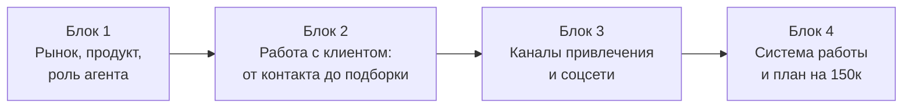

# Программа обучения агентов по новостройкам — АН «Тихий дом»


Назначение: программа из 4 офлайн-блоков для смешанной группы агентов (новички + действующие агенты) АН «Тихий дом», Уфа

---

## Общие параметры

| Параметр        | Значение                                                                             |
| --------------- | ------------------------------------------------------------------------------------ |
| Формат          | 4 офлайн-встречи по 2 часа                                                           |
| Ритм            | Каждый вторник, 4 недели подряд                                                      |
| Аудитория       | Смешанная группа: новички + действующие агенты без стабильных сделок по новостройкам |
| Город           | Уфа                                                                                  |
| Структура блока | ~60 мин теория + ~60 мин практика                                                    |
| Артефакт        | Каждый блок завершается конкретным результатом, который агент забирает с собой       |

**Главный принцип программы:**
> «Я не продаю — я объясняю»
> Без скриптов, без давления, через понимание клиента и данные.

**Почему без скриптов:**
Рынок новостроек 2026 — это не конвейер. Клиенты стали разборчивее, доверие к агентам низкое, а шаблонные фразы вызывают отторжение. Вместо заученных скриптов программа даёт:
- глубокое понимание продукта и рынка;
- умение слышать клиента и задавать правильные вопросы;
- навык объяснять сложное простым языком;
- готовые офферы и формулировки, которые агент адаптирует под свой стиль.

---

## Структура программы



| Неделя | Блок | Фокус |
|--------|------|-------|
| 1 | Рынок, продукт, роль агента | Понимание рынка, доверие, роль агента, агрегаторы |
| 2 | Работа с клиентом | Первая встреча, вопросы, уникальность, общение с застройщиками |
| 3 | Каналы привлечения и соцсети | 10 стратегий, Instagram, Telegram, офферы |
| 4 | Система работы и план на 150к | База знаний, метрики, воронка, минимальные действия |

---

---

# БЛОК 1. Рынок, продукт, роль агента

**Вторник, Неделя 1 | 2 часа**

**Цель блока:** сформировать у агентов понимание рынка новостроек Уфы в 2026 году, объяснить роль агента как навигатора, а не продавца, и показать, почему старые методы перестали работать.

---

## Теоретическая часть (~60 мин)

### 1. Понимание рынка новостроек 2026 (20 мин)

**Ключевой тезис:** раньше агенты продавали не новостройки, а ипотечные продукты. В 2026 году этот подход не работает. Льготные программы ограничены, клиент стал разборчивее, конкуренция выросла.


**О чём говорить:**
- Структура рынка: ключевые застройщики, районы, ценовые сегменты
- Сезонность: когда покупают активнее (сентябрь, декабрь — пики)
- Тренды: рост спроса на семейные планировки, запрос на чистовую отделку, инвест-интерес к ликвидным объектам
- Что спрашивают клиенты чаще всего: покупка без ПВ, семейная ипотека, прогноз цен, чистовая отделка

---

### 2. Доверие рынка и роль агента (20 мин)

**Ключевой тезис:** клиент не доверяет агентам по умолчанию. Доверие строится через прозрачность, факты и отсутствие давления.

**Роль агента в 2026:**
- Навигатор, а не продавец
- «Я объясняю, чтобы вы приняли решение»
- Если объект не подходит — говорим «нет» и объясняем почему
- Не скрываем минусы — объясняем риски
- Не давим на решение — даём право на «нет»

**Агент-рыбак vs Агент-стратег:**

| | Агент-рыбак | Агент-стратег |
|---|---|---|
| Стратегия | Надежда: закинул объявление — жду | Управление: сам выбираю базу, количество касаний, качество крючка |
| Рассылки | Раз в месяц, «с горем пополам» | Ювелирная работа: индивидуальные подборки под сегмент |
| Когда входящих мало | Ждёт | Идёт в холодные звонки, расклейку, разбирается с алгоритмами соцсетей |
| Результат | Зависит от настроения рынка | Зависит от собственных действий |

**Экологичная работа — фундамент:**
- Не создаём фейковые объявления
- Не делаем необдуманные массовые рассылки
- Не давим на клиента
- Работаем через пользу, факты и уважение

---

### 3. Скриптов по продаже новостроек в 2026 не существует (10 мин)

**Ключевой тезис:** жёсткие скрипты не работают на рынке первички, потому что каждый клиент покупает квартиру не «квартиру», а решение своей жизненной задачи. Нельзя продавать по шаблону то, что у каждого связано с уникальной историей.

**Что вместо скриптов:**
- Глубокое знание продукта (ЖК, условия, ипотека)
- Понимание клиента: его ситуации, страхов, мотивов
- Умение объяснять: сложное — простыми словами, с цифрами, без манипуляций
- Готовые формулировки и офферы, которые агент адаптирует под себя

**Формула:**
> Знание рынка + Эмпатия + Данные = Доверие клиента

---

### 4. Агрегаторы и инструменты (10 мин)

**Ключевой тезис:** агрегаторы — это не «выложил и забыл», а инструмент анализа и поиска клиентов.

**Платформы:**
- **Авито** — площадка с наибольшим трафиком. Как оформлять объявления, что пишут конкуренты, как выделиться
- **Тренд** — агрегатор новостроек. Как использовать для подбора и сравнения

**Как читать рынок через данные:**
- Брони и задатки — индикатор реального спроса
- Конверсии — что работает, а что нет
- Частые вопросы клиентов — подсказка, о чём говорить

**Голос рынка — что волнует клиента:**
1. Покупка без первоначального взноса
2. Семейная ипотека: условия, банки, ставки
3. Прогноз цен: «будет ли расти?»
4. Чистовая отделка: «что входит?»
5. Сроки сдачи и надёжность застройщика

---

## Практическая часть (~60 мин)

### Упражнение 1. «Карта рынка» (20 мин)

**Задание:** каждый агент составляет персональную карту — 5 ключевых ЖК, которые он будет рекомендовать клиентам.

**Формат карточки:**

| Параметр | Заполнить |
|----------|-----------|
| Название ЖК | |
| Застройщик | |
| Район | |
| Ценовой сегмент | |
| Для кого подходит (сегмент) | |
| 3 аргумента «почему именно этот ЖК» | |

Каждый агент заполняет 5 карточек. После — 2-3 человека коротко презентуют свой выбор группе.

---

### Упражнение 2. «Кто я: рыбак или стратег?» (15 мин)

**Задание:** честная самооценка. Каждый агент отвечает на вопросы:

1. Сколько целенаправленных касаний я делаю в неделю?
2. Есть ли у меня список контактов, которым я звоню регулярно?
3. Что я делаю, когда входящих клиентов мало?
4. Как часто я обновляю свои знания о ЖК и условиях?
5. Чем я отличаюсь от агента, который просто ждёт?

Обсуждение в группе: что можно изменить уже на этой неделе.

---

### Упражнение 3. «Моя ценность» (15 мин)

**Задание:** каждый агент формулирует в 2-3 предложениях, чем он полезен клиенту и чем отличается от «обычного агента».

**Формула:**
> Я помогаю [кому] + [что получает клиент] + [чем я отличаюсь]

**Примеры:**
- «Помогаю молодым семьям Уфы выбрать первую квартиру в новостройке — честно, прозрачно, на данных»
- «Помогаю собственникам перейти из старого фонда в новостройку без хаоса — показываю 2-3 безопасных сценария»

Запись формулировки — это первый шаг к личному позиционированию.

---

### Домашнее задание (10 мин)

1. **Топ-100:** выписать 10 контактов из телефонной книжки, которым потенциально может быть интересна новостройка
2. **Карточки ЖК:** изучить 3 ЖК из своего фокуса — цены, планировки, ипотечные условия, плюсы/минусы
3. **Самооценка:** перечитать свою формулировку «Моя ценность» и доработать, если нужно

---

### Артефакт Блока 1

- Персональная карта рынка (5 ЖК + аргументация)
- Формулировка ценности агента

---

---

# БЛОК 2. Работа с клиентом — от первого контакта до подборки

**Вторник, Неделя 2 | 2 часа**

**Цель блока:** дать агентам структуру первой встречи с клиентом, научить задавать правильные вопросы перед подборкой лотов, объяснить процесс проверки на уникальность и правила коммуникации с застройщиками.

---

## Теоретическая часть (~60 мин)

### 1. Первая встреча с клиентом — структура (20 мин)

**Ключевой тезис:** на первой встрече мы НЕ продаём. Мы ПОНИМАЕМ.

**5 этапов первого контакта:**

```
1. Приветствие и представление → Кто я, откуда, зачем звоню/пишу
2. Выяснение контекста       → Как вы узнали о нас, что ищете
3. Диагностика               → Бюджет, сроки, критерии (3 ключевых вопроса)
4. Ценностное предложение    → Что мы можем дать: подбор, сравнение, финмодель
5. Следующий шаг             → Назначить встречу / отправить подборку / взять паузу
```

**Принципы честного первого контакта:**
- Говорим, что наша услуга для клиента бесплатна (комиссию платит застройщик)
- Говорим, что можем сказать «нет», если объект не подходит
- Не обещаем того, чего не можем гарантировать
- Не продаём на первой встрече — задача: понять запрос и договориться о следующем шаге

**Что говорить:**
> «Условия подтверждены застройщиком и банком. Мы сопровождаем сделку и отвечаем за прозрачный процесс. Наша услуга для вас бесплатна — комиссию платит застройщик.»

---

### 2. Какие вопросы задать клиенту перед подборкой лотов (15 мин)

**Ключевой тезис:** люди не покупают квартиру — они решают задачу в своей жизни. Задача агента — понять эту задачу.

**Подход JTBD (Jobs To Be Done):**
- Не «какую квартиру хотите?», а «какую задачу в жизни решаете?»
- Три типа задач клиента:
  - **Функциональная:** решить жилищный вопрос, переехать ближе к работе
  - **Эмоциональная:** чувствовать безопасность, гордиться выбором
  - **Социальная:** «мы купили квартиру в новом районе» — статус

**Обязательные вопросы при диагностике:**

| № | Вопрос | Зачем спрашиваем |
|---|--------|------------------|
| 1 | Какая цель покупки? (первое жильё / расширение / инвестиция / переезд) | Определить сегмент и мотивацию |
| 2 | Какой бюджет? (наличные + ипотека) | Понять рамки подбора |
| 3 | Состав семьи? Дети, возраст? | Подобрать планировку и район |
| 4 | Какие сроки? Когда нужно заехать? | Фильтр по стадии строительства |
| 5 | Какой район важен и почему? | Понять привязки (работа, школа, родители) |
| 6 | Что важнее всего при выборе? (цена / район / планировка / сроки) | Определить приоритеты |
| 7 | Что пугает или останавливает? | Выявить тревоги для дальнейшей работы |
| 8 | Смотрели ли уже что-то? Что понравилось / не понравилось? | Понять опыт и ожидания |
| 9 | Кто ещё участвует в принятии решения? | Учесть всех ЛПР |
| 10 | Есть ли одобренная ипотека? Какие программы рассматриваете? | Определить финансовый сценарий |

**Четыре силы прогресса — модель для понимания клиента:**

```
Push (толчок от текущей ситуации)    + Pull (притяжение нового)
            vs
Anxiety (тревога перед изменениями)  + Habit (привычка / инерция)
```

**Формула:** если (Push + Pull) > (Anxiety + Habit) — клиент принимает решение.
**Задача агента:** усилить Push и Pull фактами, снизить Anxiety прозрачностью и сервисом.

**Примеры Push:** «устал от аренды», «тесно», «старый фонд», «плачу аренду как ипотеку»
**Примеры Pull:** «новый район», «детский сад во дворе», «своя квартира», «инвестиция»
**Примеры Anxiety:** «а вдруг застройщик обанкротится?», «потяну ли ипотеку?», «а если цены упадут?»
**Примеры Habit:** «привык к району», «боюсь перемен», «подожду ещё»

---

### 3. Проверка на уникальность (10 мин)

**Ключевой тезис:** фиксация уникальности — это защита вашей комиссии и профессиональный стандарт работы. Без фиксации — нет сделки.

**Зачем:**
- Застройщик подтверждает, что этот клиент — ваш
- Другой агент не сможет «перехватить» клиента
- Это основа для начисления комиссии

**Что фиксируем:**

| Поле | Пример |
|------|--------|
| Супруг — ФИО | Иванов Иван Иванович |
| Супруг — Телефон | +7 (999) 123-45-67 |
| Супруга — ФИО | Иванова Мария Петровна |
| Супруга — Телефон | +7 (999) 765-43-21 |
| Жилой комплекс | ЖК «Яркий» |
| Агент — ФИО | Петров Алексей |
| Агент — Телефон | +7 (917) 000-00-00 |
| Предпочтения по менеджеру застройщика | Если есть |

**Процесс:**
1. Заполняем шаблон → отправляем заявку застройщику
2. Ждём подтверждения уникальности
3. Только после подтверждения — ведём клиента на показ/бронь

**Типовые ошибки:**
- Забыл зафиксировать → потерял комиссию
- Неправильные данные (ошибка в ФИО или телефоне) → отказ в фиксации
- Пропустил сроки → уникальность сгорела
- Не уточнил, зафиксирован ли клиент другим агентом → конфликт

---

### 4. Общение с застройщиками и чаты (15 мин)

**Ключевой тезис:** застройщик — ваш партнёр, а не справочное бюро. Общайтесь профессионально, конкретно, уважая его время.

**Как правильно формулировать вопросы застройщику:**

Плохо:
> «Здравствуйте, расскажите, что у вас есть»

Хорошо:
> «Добрый день! Клиент — молодая семья, бюджет 5 млн, семейная ипотека. Интересует 2-комн., срок сдачи до конца 2026. Есть подходящие лоты?»

**Что спрашивать:**
- Наличие лотов под конкретный запрос клиента
- Актуальные акции и специальные условия
- Сроки бронирования и условия
- Ипотечные программы и банки-партнёры
- Комиссионные условия (если ещё не известны)

**Чаты с застройщиками — правила:**
- Вступить через официального представителя или по рекомендации
- Читать правила чата и следовать им
- Не спамить: не задавать вопросы, ответы на которые есть в закреплённых сообщениях или на сайте
- Не обсуждать конкурентов в чате застройщика
- Быть полезным: делиться обратной связью от клиентов, задавать конкретные вопросы

**Как строить партнёрские отношения:**
- Быть полезным, а не назойливым
- Давать обратную связь: что говорят клиенты, какие вопросы задают
- Фиксировать уникальность вовремя и корректно
- Не подводить с показами и сроками

---

## Практическая часть (~60 мин)

### Упражнение 1. Ролевая игра «Диагностика клиента» (25 мин)

**Формат:** работа в тройках: клиент / агент / наблюдатель. Ротация — каждый побывает во всех ролях.

**Сценарий 1 — Молодая семья:**
> Артём и Юлия, 28 и 26 лет. Ждут первого ребёнка. Сейчас снимают однушку за 25 000 руб./мес. Бюджет: 500 000 наличными + семейная ипотека. Хотят 2-комнатную. Боятся, что не потянут платёж.

**Сценарий 2 — Инвестор:**
> Рустам, 42 года. Свободные 3 млн. Хочет вложить в новостройку. Не торопится с переездом, живёт в своей квартире. Интересует ликвидность и потенциал роста. Скептически относится к агентам.

**Сценарий 3 — Апгрейд жилья:**
> Семья, двое детей (7 и 12 лет). Живут в двушке в старом фонде. Хотят трёшку в новом районе. Нужна школа рядом. Готовы продать текущую квартиру. Боятся «двойного» процесса.

**Задача агента:** провести 7-минутную диагностику по чек-листу вопросов.
**Задача наблюдателя:** фиксировать — какие вопросы задали, какие пропустили, была ли эмпатия, предложен ли следующий шаг.
**Разбор:** после каждого сценария — 3 минуты на обратную связь от наблюдателя.

---

### Упражнение 2. Заполнение шаблона фиксации уникальности (10 мин)

**Задание:** заполнить шаблон фиксации на 2 учебных примерах (из сценариев ролевой игры).

**Шаблон:**

```
ФИКСАЦИЯ УНИКАЛЬНОСТИ

Клиент:
  Супруг — ФИО: _____________ Телефон: _____________
  Супруга — ФИО: _____________ Телефон: _____________

Жилой комплекс: _____________

Агент:
  ФИО: _____________ Телефон: _____________

Предпочтения по менеджеру застройщика: _____________

Дополнительная информация: _____________

[ ] Заявка отправлена
[ ] Уникальность подтверждена застройщиком
```

---

### Упражнение 3. «Письмо застройщику» (15 мин)

**Задание:** написать 3 профессиональных сообщения застройщику по кейсам из ролевой игры.

**Формат сообщения:**
1. Приветствие
2. Кто вы (агентство, имя)
3. Запрос клиента (конкретика: сегмент, бюджет, тип квартиры, ипотека, сроки)
4. Конкретный вопрос (наличие лотов / условия / акции)

**Пример:**
> Добрый день! Петров Алексей, АН «Тихий дом». Клиент — молодая семья, бюджет 4,5 млн с учётом семейной ипотеки. Интересует 2-комнатная, сдача до Q4 2026. Подскажите, есть ли подходящие лоты в наличии и актуальные условия бронирования?

Групповой разбор: лучшие и худшие примеры из написанных сообщений.

---

### Домашнее задание (10 мин)

1. **Диагностика:** провести диагностику 1 реального клиента по чек-листу из 10 вопросов. Записать ответы
2. **Уникальность:** зафиксировать уникальность по шаблону для этого клиента (или учебного)
3. **Проверка ДЗ Блока 1:** карточки 3 ЖК должны быть заполнены — проверить и доработать

---

### Артефакт Блока 2

- Персональный чек-лист диагностики клиента (10+ вопросов)
- 2 заполненных шаблона фиксации уникальности
- 3 профессиональных сообщения застройщику

---

---

# БЛОК 3. Каналы привлечения клиентов и социальные сети

**Вторник, Неделя 3 | 2 часа**

**Цель блока:** дать агентам рабочие каналы привлечения клиентов на первичку, научить работать с Instagram и Telegram, дать готовые офферы и скрипты входа.

---

## Теоретическая часть (~60 мин)

### 1. 10 стратегий поиска клиентов на первичку (20 мин)

**Ключевой тезис:** ошибка агента — пытаться вести все каналы сразу. Лучше 3 канала системно, чем 12 каналов по 3 дня.

**10 каналов:**

| № | Канал | Суть | Скорость результата |
|---|-------|------|---------------------|
| 1 | Trade-in из вторички в новостройку | Клиент продаёт старую квартиру → покупает в новостройке | Быстрый |
| 2 | Переориентация покупателей вторички | На показе вторички предложить сравнить с новостройкой | Быстрый |
| 3 | Рекомендации (сарафанное радио) | Результат прошлой работы — клиенты рекомендуют вас | Системный |
| 4 | Топ-100 (ближний круг) | 100 контактов из телефона, которым звоните регулярно | Быстрый |
| 5 | Рассылка по контактам с оффером | Сегментированное сообщение с конкретным предложением | Быстрый |
| 6 | Сторителлинг в WhatsApp/Telegram статусах | Короткие истории из рабочих будней с призывом | Системный |
| 7 | Расклейка | Оффлайн-объявления в конкретных районах | Быстрый |
| 8 | Холодные звонки | Исходящие звонки по базам (собственники, продающие сами) | Быстрый |
| 9 | Активный блог в Instagram | Визуальная витрина экспертности и образа жизни | Системный |
| 10 | Активный Telegram-канал | Аналитика, расчёты, инсайды для рациональной аудитории | Системный |

**Каналы «здесь и сейчас» — на них можно повлиять прямо сейчас:**
1. Холодные звонки
2. Топ-100
3. Рассылка с оффером
4. Расклейка
5. Переориентация на показе

**Каналы «системного накопления» — работают, когда построены заранее:**
1. Рекомендации / сарафанное радио
2. Блог в Instagram / Telegram
3. Сторителлинг в статусах
4. Trade-in (зависит от наличия текущих сделок)

---

### 2. Социальные сети: Instagram и Telegram (20 мин)

**Instagram — визуальная витрина:**
- Показывать не планировку, а «утро в этой квартире», «безопасный двор для ребёнка»
- Заходить через боли: теснота, старый подъезд, отсутствие эстетики
- Транслировать процесс: как выбираете объекты, на что обращаете внимание
- CTA: не «пишите в директ», а «отправь + в директ, пришлю расчёт ипотеки для этой квартиры»
- Регулярность: 2-3 публикации в неделю — уже система

**Telegram — площадка для «умного» контента:**
- Не дублировать Instagram. Если в IG — эмоции, то в TG — расчёты
- Контекст «инсайдера»: информация, которой нет в широком доступе (закрытые старты, изменения лимитов)
- Заходить через финансовые стратегии: «Как переехать в трёшку, сохранив текущий платёж»
- Перевод в личное общение: «Сегодня могу взять на разбор вашу ситуацию»

**Контент-идеи по сегментам:**

| Сегмент | Идеи |
|---------|------|
| Trade-in | «Как перейти из своей квартиры в новостройку без двойного стресса» |
| Арендаторы | «Когда аренда уже дороже спокойного сценария покупки» |
| Районы | «Какие новостройки смотреть в [районе]» |
| Отказники | «Что изменилось на рынке за 30 дней» |
| Инвесторы | «Что смотреть инвестору кроме цены за квадрат» |
| Семьи | «Как выбирать новостройку, если через год ребёнок идёт в школу» |

---

### 3. Готовые офферы и скрипты входа (20 мин)

**6 офферов под ключевые сегменты:**

**1. Для собственников, которым стало тесно:**
> Покажу, как перейти из текущей квартиры в новостройку без хаоса и лишних рисков. Сравним 2-3 сценария и поймём, какой путь выгоднее именно вам.

**2. Для арендаторов:**
> Сравним ваш текущий сценарий аренды и покупки. Покажу, где реально есть смысл идти в новостройку, а где лучше не торопиться.

**3. Для тех, кто боится ипотеки:**
> Разберу ипотеку простыми словами и покажу 2-3 сценария без давления: платёж, риски, запас прочности.

**4. Для семей с детьми:**
> Подберу новостройки под семейный сценарий: школа, сад, транспорт, срок заселения, безопасный платёж.

**5. Для инвесторов:**
> Покажу не просто «что купить», а какие варианты выглядят ликвидно, где риски и какой горизонт выхода.

**6. Для переезда из другого города:**
> Помогу выбрать новостройку удалённо: объясню логику, покажу риски и выстрою понятный маршрут сделки.

---

**6 скриптов входа:**

**1. Возврат отказника:**
> [Имя], вы раньше смотрели варианты и тогда решили не торопиться. Сейчас появился сценарий, который лучше попадает в ваш прошлый запрос по [району/платежу/сроку]. Если актуально, могу коротко показать 2-3 варианта и объяснить разницу.

**2. Заход через аренду:**
> [Имя], часто вижу, что люди платят за аренду почти как за ипотечный сценарий, но не сравнивали цифры спокойно. Если хотите, могу без давления показать, есть ли у вас вообще смысл рассматривать новостройку сейчас.

**3. Заход через trade-in:**
> Если вопрос переезда из своей квартиры в новую актуален, могу помочь разложить это без хаоса: что делать сначала, как синхронизировать сроки и в каком сценарии новостройка действительно выгодна.

**4. Заход после показа вторички:**
> Судя по тому, что для вас важно по [району/планировке/состоянию дома], есть смысл хотя бы сравнить это с новостройкой. Не чтобы переубедить, а чтобы вы увидели разницу по качеству, рискам и платежу.

**5. Заход через партнёра-ипотечника:**
> Мы с коллегой можем сделать совместный разбор: сначала условия ипотеки, потом 2-3 новостройки, которые реально им соответствуют. Так картина будет понятнее.

**6. Заход через районный контент:**
> Если для вас важен именно [район], могу прислать короткую подборку: какие новостройки там реально стоит смотреть, а какие я бы не рекомендовал под ваш сценарий.

**Принцип любого оффера:**
- Персонализация заголовка (имя, отсылка к прошлому общению)
- Дефицит и срочность (не фейковые — реальные: «только 3 квартиры с субсидией»)
- Твёрдая выгода в цифрах (не «большие скидки», а «экономия 1,5 млн руб. на процентах»)
- Низкий порог входа (не «купи», а «получи подборку под твой бюджет»)

---

## Практическая часть (~60 мин)

### Упражнение 1. «Топ-100» (10 мин)

**Задание:** прямо сейчас — открыть телефон, выбрать 10 контактов и выписать их.

**Критерии отбора:**
- Кто из знакомых снимает квартиру?
- У кого растёт семья?
- Кто недавно говорил про переезд?
- Кто продаёт квартиру?
- Кто может порекомендовать?

**Формат записи:**

| № | Имя | Почему может быть интересна новостройка | Какой оффер подходит |
|---|-----|----------------------------------------|---------------------|
| 1 | | | |
| 2 | | | |
| ... | | | |
| 10 | | | |

Обсуждение: 2-3 человека озвучивают, кому из списка они напишут первому и с каким оффером.

---

### Упражнение 2. Составление рассылки (15 мин)

**Задание:** написать персональное сообщение для 3 контактов из Топ-100. Каждое сообщение — под конкретного человека и его ситуацию.

**Правила:**
- Не выглядит как спам (обращение по имени, отсылка к общему контексту)
- Есть конкретная выгода (цифры, а не абстракция)
- Низкий порог входа (не «купи», а «могу показать расчёт»)
- Длина: 3-5 предложений

**Пример:**
> Марат, привет! Помню, ты говорил, что арендуете с Айгуль двушку за 30 тысяч. Сейчас по семейной ипотеке платёж за двушку в новом ЖК выходит примерно столько же. Если интересно, могу скинуть расчёт без обязательств — просто чтобы сравнить.

Групповой разбор 2-3 лучших сообщений.

---

### Упражнение 3. Сценарий для сторис (15 мин)

**Задание:** написать сценарий 3 сторис по формуле «Проблема → Процесс → Результат».

**Формула:**
1. **Сторис 1 — Проблема:** «Клиент не мог одобрить ипотеку...» / «Семья 3 года искала квартиру...»
2. **Сторис 2 — Процесс:** «Мы сделали вот что...» / «Проверили 5 вариантов и нашли...»
3. **Сторис 3 — Результат:** «Получили ключи» / «Платёж оказался на 15% ниже аренды»

**Добавить:**
- Эмоциональный триггер (облегчение, радость, уверенность)
- Простой призыв: «Нажми реакцию, если хочешь такой же расчёт»

Каждый агент записывает свой сценарий. 2-3 человека озвучивают перед группой.

---

### Упражнение 4. Выбор 3 каналов (10 мин)

**Задание:** каждый агент выбирает 3 канала из 10, которые начнёт вести системно с этой недели.

**Формат:**

| Канал | Почему выбрал | Первое действие на этой неделе | Цель на месяц |
|-------|--------------|-------------------------------|---------------|
| 1. | | | |
| 2. | | | |
| 3. | | | |

---

### Домашнее задание (10 мин)

1. **Рассылка:** отправить сообщения 10 контактам из Топ-100 (адаптировав под каждого)
2. **Сторис:** выложить 3 сторис по формуле «Проблема → Процесс → Результат»
3. **Каналы:** выполнить первое действие по каждому из 3 выбранных каналов

---

### Артефакт Блока 3

- Список Топ-100 (минимум 10 контактов с офферами)
- 3 готовые рассылки
- Сценарий 3 сторис
- Персональный план по 3 каналам привлечения

---

---

# БЛОК 4. Система работы, база знаний и план на 150к

**Вторник, Неделя 4 | 2 часа**

**Цель блока:** построить систему ежедневных действий, объяснить логику базы знаний команды и рассчитать конкретный план минимальных действий для дохода от 150 000 руб./мес.

---

## Теоретическая часть (~60 мин)

### 1. База знаний команды (15 мин)

**Ключевой тезис:** без единой базы знаний каждый агент «изобретает велосипед». База знаний — это инструмент скорости и качества.

**Что входит в базу знаний:**

| Раздел | Содержание | Кто обновляет |
|--------|-----------|---------------|
| Карточки ЖК | Застройщик, адрес, планировки, цены, ипотека, плюсы/минусы, для кого | Агент + руководитель |
| Ипотечные программы | Ставки, банки, условия, лимиты | Руководитель / ипотечник |
| Банк ответов на вопросы | Топ-10 вопросов клиентов + готовые ответы | Агент (по мере обнаружения) |
| Таблица возражений | Возражение → 2-3 варианта ответа | Агент (по мере отработки) |
| Шаблоны сообщений | Первое сообщение, подборка, напоминание, запрос отзыва | Руководитель |
| Промо-материалы | Презентации ЖК, инфографика, PDF-подборки | Руководитель |

**Как поддерживать актуальность:**
- При изменении условий застройщика — обновить карточку в тот же день
- Еженедельно: обмен лучшими практиками (формулировки, ответы, промты)
- Ежемесячно: выбрать 1-2 фокусных ЖК и обновить все материалы по ним

**Инструменты:**
- Общий чат команды (Telegram / WhatsApp) для оперативных обновлений
- Папка с карточками ЖК (Google Docs / Notion / общая папка)
- Шаблоны в закреплённых сообщениях чата

**Шаблон карточки ЖК для базы знаний:**

```
КАРТОЧКА ЖК

Название: _____________
Застройщик: _____________
Адрес / район: _____________
Стадия строительства: _____________
Срок сдачи: _____________

ПЛАНИРОВКИ И ЦЕНЫ:
| Тип       | Площадь | Цена от    | Цена до    |
|-----------|---------|------------|------------|
| Студия    |         |            |            |
| 1-комн.   |         |            |            |
| 2-комн.   |         |            |            |
| 3-комн.   |         |            |            |

ИПОТЕЧНЫЕ ПРОГРАММЫ:
- Семейная: ___% (банк ___)
- Стандартная: ___% (банк ___)
- Без ПВ: да/нет (условия ___)

ПЛЮСЫ (минимум 3):
1.
2.
3.

МИНУСЫ (минимум 3):
1.
2.
3.

ДЛЯ КОГО ПОДХОДИТ:
- Сегмент 1:
- Сегмент 2:

АРГУМЕНТЫ «ПОЧЕМУ ИМЕННО ЭТОТ ЖК»:
1.
2.
3.
```

---

### 2. Минимальные действия для 150к дохода — конкретная математика (25 мин)

**Ключевой тезис:** доход — это не удача. Доход — это результат конкретных, повторяемых действий. Контролируй INPUT — OUTPUT придёт.

**Обратный расчёт (пример для Уфы):**

```
Цель:                    150 000 руб./мес. чистыми
Средний чек сделки:      ~5 000 000 руб.
Комиссия агента (50%):   ~75 000 руб. с одной сделки
Нужно сделок в месяц:    2 сделки

Чтобы получить 2 сделки, нужно:
→ 4-6 показов/встреч     (конверсия показ→сделка ~30-50%)
→ 10-15 подборок         (конверсия подборка→показ ~30-40%)
→ 30-50 квалифицированных диалогов  (конверсия диалог→подборка ~30%)
→ 100-150 касаний в месяц (конверсия касание→диалог ~30%)
```

**INPUT-метрики: что делать каждый день:**

| Действие | В день | В неделю | В месяц |
|----------|--------|----------|---------|
| Касания (звонки, сообщения, комментарии) | 5-7 | 25-35 | 100-150 |
| Квалифицированные диалоги | 1-2 | 7-10 | 30-50 |
| Подборки отправлены | — | 2-3 | 10-15 |
| Показы / встречи | — | 1-2 | 4-6 |
| Контент-единицы (сторис, пост, reels) | 1 | 5-7 | 20-30 |

**Недельный план агента:**

| День | Фокус | Действия |
|------|-------|----------|
| Понедельник | Планирование + база отказников | Поднять 10-15 старых контактов, написать 5, выбрать тему недели для контента |
| Вторник | Контент + вовлечение | 1 пост/Reels под сегмент, 5-7 сторис, ответы на сообщения |
| Среда | Партнёры | 5 касаний по партнёрам (ипотечники, арендные агенты), 1 совместная активность |
| Четверг | Локальный спрос | Районные чаты, комментарии, подборки по районам, предложить разбор откликнувшимся |
| Пятница | Возврат базы | Поднять базу «смотрели, но не купили», 5-10 повторных касаний, обновить заметки |
| Суббота | Показы + анализ | Провести показ/разбор/звонок, собрать вопросы и возражения недели |
| Воскресенье | Итоги | Подвести итоги, какой канал дал больше диалогов, запланировать 3 действия на следующую неделю |

---

### 3. Метрики и воронка (10 мин)

**Два типа метрик:**

**INPUT (под контролем агента):**
- Количество касаний
- Количество отправленных подборок
- Количество показов/встреч
- Количество контент-единиц

**OUTPUT (результат):**
- Новые клиенты в воронке
- Конверсия по этапам
- Количество сделок
- Выручка

**Простая таблица учёта каналов:**

| Канал | Касаний | Диалогов | Встреч | Сделок | Что сработало |
|-------|---------|----------|--------|--------|---------------|
| Топ-100 | | | | | |
| Возврат отказников | | | | | |
| Trade-in | | | | | |
| Арендаторы | | | | | |
| Партнёры | | | | | |
| Районный контент | | | | | |

**Еженедельный самоанализ (5 минут в воскресенье):**
- Какой канал дал диалоги?
- Какой дал пустой отклик?
- Где слабый оффер?
- Где не хватает скорости ответа?
- Какие новые вопросы повторяются?

---

### 4. Итоги программы и план действий (10 мин)

**Повторение ключевых принципов 4 блоков:**

| Блок | Главный вывод |
|------|---------------|
| 1. Рынок | Рынок изменился — работает тот, кто понимает продукт и клиента, а не тот, кто ждёт |
| 2. Клиент | Первая встреча — не продажа, а понимание. Правильные вопросы важнее правильных ответов |
| 3. Каналы | Лучше 3 канала системно, чем 12 по 3 дня. Оффер бьёт в конкретный сегмент |
| 4. Система | 150к = конкретные действия каждый день. Контролируй INPUT — OUTPUT придёт |

**Что делать с понедельника — 3 обязательных действия:**
1. Выбрать 3 канала и выполнить по 1 действию из каждого
2. Написать 5 сообщений из Топ-100 с персональным оффером
3. Начать вести простой учёт: сколько касаний → сколько диалогов → сколько встреч

---

## Практическая часть (~60 мин)

### Упражнение 1. Расчёт персонального плана на 150к (20 мин)

**Задание:** каждый агент рассчитывает свою воронку — сколько касаний, диалогов, встреч и сделок нужно в месяц.

**Шаблон расчёта:**

```
МОЙ ПЛАН НА 150 000 РУБ./МЕС.

Средний чек моих сделок: _________ руб.
Моя доля комиссии: _________ руб. с 1 сделки
Нужно сделок в месяц: _________

Моя воронка:
  Касаний в месяц:    _________  (в день: _________)
  Диалогов в месяц:   _________  (конверсия касание→диалог: ___%)
  Подборок в месяц:   _________  (конверсия диалог→подборка: ___%)
  Показов в месяц:    _________  (конверсия подборка→показ: ___%)
  Сделок в месяц:     _________  (конверсия показ→сделка: ___%)

Мои 3 основных канала:
  1. _________
  2. _________
  3. _________
```

Каждый заполняет. 2-3 агента озвучивают свой расчёт — групповая проверка реалистичности.

---

### Упражнение 2. Составление недельного расписания (15 мин)

**Задание:** составить персональное расписание на неделю с конкретными блоками действий.

**Шаблон:**

| День | 1 час фокуса (утро) | 1 час фокуса (день) |
|------|---------------------|---------------------|
| Пн | | |
| Вт | | |
| Ср | | |
| Чт | | |
| Пт | | |
| Сб | | |
| Вс | | |

---

### Упражнение 3. Заполнение дашборда метрик (10 мин)

**Задание:** заполнить шаблон дашборда — план на первый месяц.

**Шаблон дашборда:**

```
ДАШБОРД — Месяц 1

INPUT (план):
| Метрика              | План/нед. | План/мес. |
|----------------------|-----------|-----------|
| Касания              |           |           |
| Подборки             |           |           |
| Показы/встречи       |           |           |
| Контент-единицы      |           |           |

OUTPUT (цель):
| Метрика              | Цель      |
|----------------------|-----------|
| Новых клиентов       |           |
| Сделок               |           |

Мои 3 канала:
1. _________ → первое действие: _________
2. _________ → первое действие: _________
3. _________ → первое действие: _________
```

---

### Упражнение 4. Круг обязательств (15 мин)

**Формат:** каждый агент встаёт и озвучивает перед группой:

1. **3 конкретных действия**, которые начнёт делать с понедельника
2. **1 метрику**, которую будет отслеживать каждую неделю
3. **1 вещь**, которую перестанет делать (имитация работы, ожидание, прокрастинация)

Группа фиксирует — это публичное обязательство усиливает мотивацию.

---

### Домашнее задание (финальное)

1. **Запустить недельный план:** выполнить расписание первой недели
2. **Заполнить дашборд:** по итогам первой недели — факт vs план
3. **Продолжить вести каналы:** рассылки, сторис, касания по Топ-100
4. **Обновить базу знаний:** добавить 1 карточку ЖК в общую базу команды

---

### Артефакт Блока 4

- Персональный план на 150к (расчёт воронки)
- Недельное расписание с блоками действий
- Заполненный дашборд метрик на первый месяц
- 3 публичных обязательства

---

---

## Сводная таблица артефактов программы

| Блок | Артефакты |
|------|-----------|
| 1 | Карта рынка (5 ЖК + аргументация) + формулировка ценности агента |
| 2 | Чек-лист диагностики (10+ вопросов) + 2 шаблона фиксации уникальности + 3 письма застройщику |
| 3 | Список Топ-100 (10+ контактов) + 3 рассылки + сценарий 3 сторис + план по 3 каналам |
| 4 | План на 150к (воронка) + недельное расписание + дашборд метрик + 3 обязательства |

---

## Домашние задания между блоками

| После блока | Задание |
|-------------|---------|
| 1 | Выписать 10 контактов Топ-100, изучить карточки 3 ЖК, доработать «Мою ценность» |
| 2 | Провести диагностику 1 реального клиента, зафиксировать уникальность по шаблону |
| 3 | Отправить рассылку 10 контактам, выложить 3 сторис, начать вести 3 канала |
| 4 | Запустить недельный план, заполнить дашборд по итогам первой недели |

---

## Рекомендации спикеру

**Тональность:** спокойно, по делу, без манипуляций. Факты важнее лозунгов.

**Формат подачи:**
- Каждый теоретический блок — не монолог, а диалог с группой
- Задавать вопросы аудитории: «Кто сталкивался?», «Как вы это делаете сейчас?»
- Использовать реальные примеры из рынка Уфы
- Практика — минимум 50% времени

**Работа со смешанной группой:**
- Опытных агентов подключать как экспертов: «Расскажи, как ты это делаешь»
- Новичкам давать больше шаблонов и примеров
- Избегать снисходительного тона — все пришли учиться

**Контроль результатов:**
- Проверять домашние задания в начале каждого блока (5 минут)
- Отмечать, кто сделал — это показатель вовлечённости
- По итогам 4 блоков — краткий разбор: кто запустил систему, кто ещё нет
