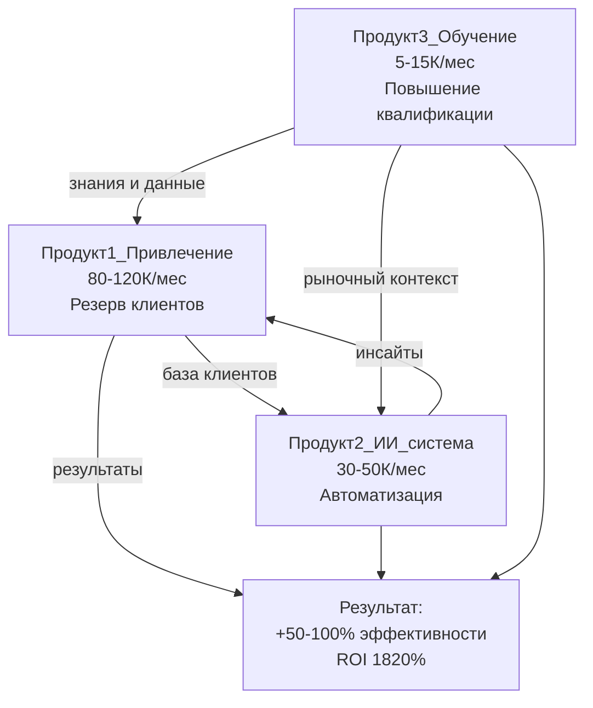
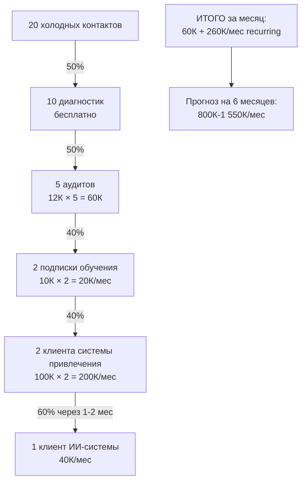

# 🚀 ЭКОСИСТЕМА ИЗ 3 ПРОДУКТОВ ДЛЯ АГЕНТСТВ НЕДВИЖИМОСТИ
## Инвестиционная презентация

**Дата:** 2025-01-27  
**Автор:** Антон Цой  
**Формат:** Одностраничник для инвестора

---

## 📊 EXECUTIVE SUMMARY

### О бизнесе

Экосистема из 3 взаимосвязанных продуктов для агентств недвижимости и риэлторов, которая решает ключевые проблемы рынка: отсутствие постоянного потока клиентов, рутинная работа и отсутствие данных. Через комбинацию вирусного маркетинга, ИИ-технологий и обучения мы помогаем агентствам увеличивать эффективность работы на 50-100%, создавая при этом стабильный рекуррентный доход для бизнеса.

### Ключевые метрики

- **Потенциал дохода:** 800К - 1 550К ₽/мес recurring через 6 месяцев
- **ROI для клиентов:** 1 500-1 820% (окупается за 1-2 дня)
- **Формат:** Recurring revenue (подписки и ретейнеры)
- **Целевой рынок:** Агентства недвижимости и риэлторы Уфы (50+ агентств, 500+ риэлторов)
- **Уникальность:** Единственный в Уфе с вирусной механикой привлечения + ИИ-автоматизация

### Уникальное торговое предложение

Единственный в Уфе эксперт, который может дать агентству резерв клиентов на год вперёд по цене в 20-50 раз дешевле таргета, автоматизировать всю рутину с помощью ИИ и повысить квалификацию команды. Не просто консультирую — ДЕЛАЮ. Работаю с 3-5 агентствами одновременно. Гарантия результата: 50-300 сделок в год или возврат части средств.

---

## 🎯 ПРОБЛЕМА РЫНКА

### Критические проблемы агентств недвижимости

#### 1. Нет постоянного потока клиентов

**Ситуация:**
- Зависимость от дорогой рекламы (таргет, Директ)
- Стоимость лида: 3 000-10 000 руб
- Низкая конверсия холодных лидов (5-10%)
- Нет системы работы с тёплой базой
- Высокие затраты на привлечение (300К-500К/мес)

**Последствия:**
- Теряют 50-70% потенциальных клиентов
- Неэффективное использование бюджета
- Нестабильный поток клиентов
- Отставание от конкурентов

#### 2. Ручная работа и низкая эффективность

**Ситуация:**
- Всё делается вручную (описания объектов, посты, звонки)
- Нет времени на продажи из-за рутины (20+ часов/неделю)
- Нет системы анализа эффективности
- Не понимают, где теряются клиенты

**Последствия:**
- Низкая эффективность работы
- Выгорание агентов
- Высокие операционные затраты
- Невозможность масштабирования

#### 3. Нет данных и обучения

**Ситуация:**
- Принимают решения на основе интуиции
- Не знают, что делают конкуренты
- Нет системного обучения новостройкам
- Отстают от рынка

**Последствия:**
- Неправильные решения
- Упущенные возможности
- Низкая квалификация команды
- Снижение конкурентоспособности

### Размер рынка

**География:** Уфа, Республика Башкортостан

**Потенциальные клиенты:**
- 50+ агентств недвижимости
- 500+ риэлторов
- Средний объём: 5-20 сделок/мес на агентство
- Средняя комиссия: 100-200К ₽

**Размер рынка:**
- 50 агентств × 10 сделок/мес × 150К ₽ = 75 млн ₽/мес выручки агентств
- Потенциал роста: +50-100% = 37.5-75 млн ₽/мес дополнительно
- Наша доля: работа с 5 агентствами = 3.75-7.5 млн ₽/мес выручки агентств

### Текущие решения и их недостатки

**Таргет и Директ:**
- Дорого (3-10К за лид)
- Низкая конверсия
- Высокая конкуренция

**Холодные звонки:**
- Низкая конверсия
- Негативное отношение
- Высокие затраты на персонал

**Сарафанное радио:**
- Неконтролируемо
- Медленно
- Не масштабируется

**Наше преимущество:**
- Вирусная механика (люди делают рекламу бесплатно)
- Стоимость лида: 150-200 руб (в 20-50 раз дешевле)
- Долгосрочный эффект (промокоды работают 12 месяцев)
- ИИ-автоматизация всей рутины

---

## 💡 РЕШЕНИЕ: ЭКОСИСТЕМА ИЗ 3 ПРОДУКТОВ

### Визуальная схема экосистемы

### Почему экосистема, а не отдельные продукты?

**Синергия:** Каждый продукт усиливает другие. Вместе они создают эффект 1+1+1=10 (не 3).

**Автоматизация:** Система работает сама, клиент только контролирует.

**Результат:** +50-100% эффективности работы (больше, чем сумма отдельных продуктов).

**ROI:** Окупается за 1-2 месяца.

---

## 🎯 ПРОДУКТ 1: СИСТЕМА ПРИВЛЕЧЕНИЯ КЛИЕНТОВ

### Описание продукта

**"Резерв клиентов на год вперёд" - Telegram-продвижение под ключ**

Полная система вирусного привлечения клиентов через Telegram с промокодами и базой "забронированных" клиентов.

### Ценообразование

- **Стоимость:** 80 000 - 120 000 ₽/мес (ретейнер) или 300 000 - 500 000 ₽ (разово)
- **Формат:** Ретейнер (12 месяцев) или разовый проект
- **Ограничение:** Максимум 5 агентств одновременно
- **Гарантия:** 50-300 сделок в год или возврат части средств

### Что входит в продукт

#### ЭТАП 1: Диагностика и стратегия (1 неделя)

**Действия:**
1. Анализ текущих каналов привлечения
2. Определение целевой аудитории
3. Разработка стратегии кампании
4. Выбор механики (базовая/премиум/VIP)

**Результат:** Документ стратегии + план кампании

#### ЭТАП 2: Создание кампании (1-2 недели)

**Действия:**
1. Создание/использование Telegram-канала
2. Разработка интерактивного баннера
3. Настройка системы промокодов
4. Подготовка заданий для участников

**Результат:** Готовая к запуску кампания

#### ЭТАП 3: Запуск и поддержка (30 дней)

**Действия:**
1. Активная кампания в течение 30 дней
2. Модерация участников
3. Выдача промокодов
4. Розыгрыш главных призов (опционально)

**Результат:** 1000-3000 "забронированных" клиентов

#### ЭТАП 4: Работа с базой (12 месяцев)

**Действия:**
1. Система работы с промокодами
2. Напоминания клиентам
3. Регулярный контент в канале
4. Отслеживание конверсии

**Результат:** 50-300 сделок в год

### Механика работы

**ВАРИАНТ А: БАЗОВОЕ ЗАДАНИЕ** (стоимость: ~150 руб/чел)
- Меняют аватарку на ваш логотип на 5-7 дней
- Добавляют в био: "Покупаю квартиру через [Название агентства] 🏡"
- Подписываются на ваш канал
- **Награда:** промокод на скидку 10.000 руб. + старсы/кофе

**ВАРИАНТ Б: ПРЕМИАЛЬНОЕ ЗАДАНИЕ** (стоимость: ~200 руб/чел)
- Публикуют stories с вашей рекламой на 24 часа
- 50-200 просмотров от каждого участника
- Подписываются на ваш канал
- **Награда:** промокод на скидку 15.000 руб. + старсы/кофе

**ВАРИАНТ В: VIP-ЗАДАНИЕ** (стоимость: ~250 руб/чел)
- Публикуют stories + меняют аватарку + приводят друга
- **Награда:** промокод на скидку 30.000 руб.

### Для кого предназначен

**Идеальный клиент (ICP):**
- Агентство недвижимости с объёмом 5+ сделок/мес
- Есть бюджет 80-120К/мес или 300-500К разово
- Готовы работать минимум 12 месяцев
- ЛПР понимает ценность долгосрочного привлечения

**Кто НЕ подходит:**
- Совсем мелкие агентства (1-2 сделки/мес)
- Нет бюджета
- Хотят результат за 1 месяц
- Не верят в вирусный маркетинг

### Результаты для клиента

- **1000-3000 "забронированных" клиентов** с промокодами
- **30-100К показов** вашего бренда
- **50-300 сделок в год** из одной кампании
- **Стоимость лида: 150-200 руб** (в 20-50 раз дешевле таргета)
- **ROI: 5000-6400%**

### Пример расчёта ROI

**Текущая ситуация:**
- Сделок в месяц: 10
- Средняя комиссия: 150 000 ₽
- Затраты на рекламу: 300 000 ₽/мес
- Стоимость лида: 5 000 руб

**После внедрения (консервативно, 5% конверсия):**
- Сделок из базы: 2000 × 5% = 100 сделок/год = 8.3 сделок/мес
- Новая выручка: (10 + 8.3) × 150 = 2 745 000 ₽/мес
- Новая прибыль: 2 745 000 - 300 000 = 2 445 000 ₽/мес
- Прирост прибыли: 2 445 000 - 1 200 000 = 1 245 000 ₽/мес

**Экономия на рекламе:**
- Экономия на лид: 5 000 - 50 = 4 950 руб
- Экономия в месяц: 4 950 × 8.3 = 41 085 ₽/мес

**ROI:**
- Общая ценность: 1 245 000 + 41 085 = 1 286 085 ₽/мес
- Инвестиция: 100 000 ₽/мес
- ROI: 1 286%
- Окупаемость: 2-3 дня

---

## 🤖 ПРОДУКТ 2: ИИ-СИСТЕМА ДЛЯ АГЕНТОВ

### Описание продукта

**"ИИ-ассистент риэлтора" или "Цифровой помощник агента"**

Полная система автоматизации работы риэлтора с помощью ИИ: создание контента, анализ звонков, помощь в работе с клиентами.

### Ценообразование

- **Стоимость:** 30 000 - 50 000 ₽/мес (подписка)
- **Внедрение:** 1-2 недели
- **Формат:** Подписка (ежемесячная оплата)
- **Для кого:** Агентства и отдельные риэлторы

### Что входит в продукт

#### ИИ для создания контента

- Автоматическое создание описаний объектов недвижимости (30 сек вместо 1-2 часов)
- Генерация постов для социальных сетей (5 минут вместо 30)
- Email-рассылки и письма клиентам
- Ответы на типовые вопросы

**Инструменты:**
- ChatGPT / Claude для текстов
- Midjourney / DALL-E для изображений
- Perplexity для аналитики
- Готовые промпты под недвижимость

#### Транскрибация и анализ звонков

- Автоматическая транскрибация всех звонков
- Определение этапа воронки продаж
- Анализ качества общения
- Выявление реакций клиента
- Рекомендации по улучшению

**Что анализируется:**
1. Этап воронки продаж — на каком этапе находится клиент
2. Успешность этапа — прошёл ли клиент этап успешно
3. Качество общения — как работает агент
4. Реакции клиента — позитив, негатив, вопросы, сомнения
5. Следующие шаги — назначена ли встреча, что дальше

#### ИИ-помощник в работе с клиентами

- Автоматические ответы на типовые вопросы
- Персонализация коммуникаций
- Напоминания и follow-up
- Анализ потребностей клиента

#### Автоматизация рутины

- Заполнение документов
- Создание отчётов
- Планирование встреч
- Управление задачами

#### Аналитика эффективности

- Дашборд с ключевыми метриками
- Анализ конверсий
- Выявление узких мест
- Рекомендации по улучшению

### Для кого предназначен

**Идеальный клиент (ICP):**
- Агентство с 5+ агентами или риэлтор с 5+ сделками/мес
- Тратит много времени на рутину (15+ часов/неделю)
- Есть бюджет 30-50К/мес
- Готовы автоматизировать процессы

### Результаты для клиента

- **Экономия 15-20 часов/неделю** на рутине
- **+30-50% рост конверсии** за счёт персонализации
- **Автоматические инсайты** для улучшения работы
- **Профессиональный контент** без затрат времени

### Пример расчёта ROI

**Текущая ситуация:**
- Время на рутину: 20 часов/неделю
- Стоимость часа: 2 000 ₽/час
- Сделок в месяц: 10
- Средняя комиссия: 150 000 ₽
- Конверсия: 10%
- Лидов в месяц: 100

**После внедрения (консервативно, +30% конверсии):**
- Экономия времени: 20 часов/неделю = 80 часов/мес
- Экономия денег: 80 × 2 000 = 160 000 ₽/мес
- Новая конверсия: 10% × 1.3 = 13%
- Новые сделки: 100 × 13% = 13 сделок/мес
- Прирост: 13 - 10 = 3 сделки/мес
- Прирост выручки: 3 × 150 000 = 450 000 ₽/мес

**ROI:**
- Общая ценность: 160 000 + 450 000 = 610 000 ₽/мес
- Инвестиция: 40 000 ₽/мес
- ROI: 1 525%
- Окупаемость: 2 дня

---

## 📚 ПРОДУКТ 3: ОБУЧЕНИЕ И АНАЛИТИКА

### Описание продукта

**"IQ Клуб Недвижимости" или "Академия + Аналитика"**

Системное обучение работе с новостройками, доступ к аналитике рынка и сообществу риэлторов.

### Ценообразование

- **Вариант А:** Разовый курс "Академия новостроек" — 15 000 ₽/чел
- **Вариант Б:** Клуб "IQ Клуб Недвижимости" — 5 000 ₽/мес
- **Формат:** Онлайн и офлайн форматы
- **Для кого:** Отдельные риэлторы и агентства

### Что входит в продукт

#### Обучение работе с новостройками (Академия)

**4 модуля:**
1. Рынок и продукт
2. Ипотека и финансы
3. Продажи и коммуникации
4. Практика сделок

**Формат:**
- Онлайн-модули в LMS
- Интерактивные тесты и сертификаты
- Еженедельные офлайн-мастер-классы
- Разборы кейсов и практика
- Доступ к базе знаний

#### Доступ к аналитике рынка

- Ежемесячные отчёты о рынке недвижимости Уфы
- Анализ цен и трендов
- Сравнение объектов
- Прогнозы и инсайты

#### Сообщество риэлторов

- Закрытый Telegram-канал
- Нетворкинг и обмен опытом
- Регулярные встречи
- Доступ к экспертам

#### Регулярные материалы и обновления

- Новые инструменты и методики
- Обновления по рынку
- Кейсы и примеры
- Шаблоны и чек-листы

### Для кого предназначен

**Идеальный клиент (ICP):**
- Риэлтор или агентство, работающие с новостройками
- Хотят повысить квалификацию
- Нужна аналитика рынка
- Готовы инвестировать в обучение

### Результаты для клиента

- **Повышение квалификации** агентов
- **Понимание рынка** и конкурентов
- **Рост продаж** за счёт знаний (+15-25% конверсии)
- **Сообщество** для обмена опытом

### Пример расчёта ROI

**Текущая ситуация:**
- Агентов: 5
- Сделок на агента: 2/мес
- Средняя комиссия: 150 000 ₽
- Конверсия: 10%
- Лидов на агента: 20/мес

**После обучения (консервативно, +15% конверсии):**
- Новая конверсия: 10% × 1.15 = 11.5%
- Новые сделки: 20 × 11.5% = 2.3 сделок/мес
- Прирост: 2.3 - 2 = 0.3 сделок/мес
- Прирост выручки: 0.3 × 150 000 = 45 000 ₽/мес
- Прирост в год: 45 000 × 12 = 540 000 ₽/год

**ROI:**
- Инвестиция: 15 000 ₽ (разовый курс)
- ROI: 3 600%
- Окупаемость: 10 дней

---

## 🔗 СИНЕРГИЯ ПРОДУКТОВ

### Как продукты усиливают друг друга

#### 1. Продукт 3 → Продукт 1:
Обучение и аналитика дают понимание рынка и клиентов → Система привлечения использует эти знания для более эффективных кампаний

#### 2. Продукт 1 → Продукт 2:
Система привлечения создаёт базу клиентов с промокодами → ИИ-система автоматизирует работу с этой базой и персонализирует коммуникации

#### 3. Продукт 2 → Продукт 1:
ИИ-аналитика показывает, какие клиенты наиболее перспективны → Система привлечения фокусируется на наиболее эффективных каналах

#### 4. Продукт 3 → Продукт 2:
Обучение даёт понимание лучших практик → ИИ-система использует эти знания для более точных рекомендаций

### Итоговая синергия

**1 + 1 + 1 = 10** (не 3)

Каждый продукт в отдельности даёт результат, но вместе они создают **экосистему**, которая работает на автопилоте и приносит максимальный результат.

### Пример расчёта ROI полной экосистемы

**Текущая ситуация:**
- Сделок в месяц: 10
- Средняя комиссия: 150 000 ₽
- Затраты на рекламу: 300 000 ₽/мес
- Конверсия: 10%
- Лидов в месяц: 100

**После внедрения экосистемы:**

**Продукт 1:**
- +8 сделок/мес (консервативно)
- Прирост: 8 × 150 000 = 1 200 000 ₽/мес
- Экономия на рекламе: 41 085 ₽/мес

**Продукт 2:**
- +30% конверсии
- Новые сделки: 100 × 1.3 × 10% = 13 сделок/мес
- Прирост: 13 - 10 = 3 сделки/мес
- Прирост: 3 × 150 000 = 450 000 ₽/мес
- Экономия времени: 160 000 ₽/мес

**Продукт 3:**
- +15% конверсии
- Новые сделки: 100 × 1.15 × 10% = 11.5 сделок/мес
- Прирост: 11.5 - 10 = 1.5 сделок/мес
- Прирост: 1.5 × 150 000 = 225 000 ₽/мес

**Синергия (×1.3):**
- Общий прирост: (1 200 000 + 450 000 + 225 000) × 1.3 = 2 437 500 ₽/мес
- Общая экономия: 41 085 + 160 000 = 201 085 ₽/мес
- Общая ценность: 2 437 500 + 201 085 = 2 638 585 ₽/мес

**ROI:**
- Инвестиция: 145 000 ₽/мес (100К + 40К + 5К)
- ROI: 1 820%
- Окупаемость: 1-2 дня

---

## 🎯 ВОРОНКА ПРОДАЖ

### Схема воронки

### Этапы воронки

#### Этап 1: Вход (Холодный контакт → Диагностика)
- **Конверсия:** 50%
- **Результат:** Понимание проблем, доверие

#### Этап 2: Аудит (Диагностика → Аудит 10-15К)
- **Конверсия:** 50%
- **Результат:** Детальный анализ, рекомендации

#### Этап 3: Обучение (Аудит → Обучение/Клуб 5-15К)
- **Конверсия:** 40%
- **Результат:** Рекуррентный доход, ценность

#### Этап 4: Система привлечения (Обучение → Система привлечения 80-120К/мес)
- **Конверсия:** 40%
- **Результат:** Основной рекуррентный доход

#### Этап 5: ИИ-система (Система привлечения → ИИ-система 30-50К/мес)
- **Конверсия:** 60% (клиент уже вовлечён)
- **Результат:** Полная автоматизация экосистемы

---

## 💰 ФИНАНСОВАЯ МОДЕЛЬ

### Прогноз на 6 месяцев

#### Месяц 1-2:
- 3 агентства × Продукт 1 (100К/мес) = **300 000 ₽**
- 10 агентов × Продукт 2 (40К/мес) = **400 000 ₽**
- 20 агентов × Продукт 3 (5К/мес) = **100 000 ₽**
- **ИТОГО: 800 000 ₽/мес**

#### Месяц 3-6:
- 5 агентств × Продукт 1 (100К/мес) = **500 000 ₽**
- 20 агентов × Продукт 2 (40К/мес) = **800 000 ₽**
- 50 агентов × Продукт 3 (5К/мес) = **250 000 ₽**
- **ИТОГО: 1 550 000 ₽/мес**

### Структура дохода

**Recurring revenue (подписки):**
- Продукт 1: 500 000 ₽/мес (5 агентств × 100К)
- Продукт 2: 800 000 ₽/мес (20 агентов × 40К)
- Продукт 3: 250 000 ₽/мес (50 агентов × 5К)
- **ИТОГО: 1 550 000 ₽/мес recurring**

**Разовый доход:**
- Аудиты: 60 000 ₽/мес (5 × 12К)
- Разовые курсы: 30 000 ₽/мес (2 × 15К)
- **ИТОГО: 90 000 ₽/мес разово**

**Общий доход через 6 месяцев:**
- Recurring: 1 550 000 ₽/мес
- Разовый: 90 000 ₽/мес
- **ИТОГО: 1 640 000 ₽/мес**

---

## 🚀 ПЛАН РАЗВИТИЯ

### Квартал 1 (Месяцы 1-3)

**Цели:**
- Запустить воронку продаж
- Привлечь первых 3 клиентов Продукта 1
- Привлечь первых 10 клиентов Продукта 2
- Привлечь первых 20 клиентов Продукта 3

**Метрики:**
- 20 холодных контактов/мес
- 10 диагностик/мес
- 5 аудитов/мес
- 2 подписки обучения/мес
- 1 клиент системы привлечения/мес

**Доход:**
- 800 000 ₽/мес recurring
- 90 000 ₽/мес разово

### Квартал 2 (Месяцы 4-6)

**Цели:**
- Масштабировать воронку
- Увеличить количество клиентов
- Автоматизировать процессы
- Нанять ассистента

**Метрики:**
- 30 холодных контактов/мес
- 15 диагностик/мес
- 7 аудитов/мес
- 3 подписки обучения/мес
- 2 клиента системы привлечения/мес
- 1 клиент ИИ-системы/мес

**Доход:**
- 1 550 000 ₽/мес recurring
- 120 000 ₽/мес разово

---

## 🎯 КОНКУРЕНТНЫЕ ПРЕИМУЩЕСТВА

### Уникальность

1. **Единственный в Уфе** с вирусной механикой привлечения клиентов
2. **Комбинация вирусного маркетинга + ИИ** — никто не делает
3. **Личные связи** со всеми агентствами Уфы
4. **Опыт 3 года** в развитии продаж на рынке недвижимости
5. **Гарантия результата** — 50-300 сделок в год или возврат

### Барьеры входа

1. **Личные связи** — нужно время на построение
2. **Экспертиза** — нужен опыт в недвижимости
3. **Технологии** — нужны знания ИИ и автоматизации
4. **Репутация** — нужны кейсы и отзывы

### Масштабируемость

1. **Продукт 1** — ограничен 5 агентствами (премиум-позиционирование)
2. **Продукт 2** — легко масштабируется (подписка)
3. **Продукт 3** — легко масштабируется (обучение)

---

## 📊 РИСКИ И МИТИГАЦИЯ

### Риски

1. **Низкая конверсия в воронке**
   - Митигация: Оптимизация скриптов, улучшение материалов

2. **Отток клиентов**
   - Митигация: Гарантии результата, постоянная поддержка

3. **Конкуренция**
   - Митигация: Уникальность, личные связи, опыт

4. **Изменение рынка**
   - Митигация: Гибкость, адаптация продуктов

### Гарантии

1. **Продукт 1:** Гарантия 50-300 сделок в год или возврат части средств
2. **Продукт 2:** Гарантия экономии 15+ часов/неделю или возврат
3. **Продукт 3:** Гарантия повышения квалификации или возврат

---

## ✅ ВЫВОДЫ

### Инвестиционная привлекательность

1. **Высокий ROI для клиентов** — 1 500-1 820% (окупается за 1-2 дня)
2. **Стабильный recurring revenue** — 1 550К ₽/мес через 6 месяцев
3. **Масштабируемость** — легко увеличить количество клиентов
4. **Уникальность** — единственный в Уфе с такой комбинацией
5. **Низкие риски** — гарантии результата, проверенная воронка

### Следующие шаги

1. Запустить воронку продаж
2. Привлечь первых клиентов
3. Собрать кейсы и отзывы
4. Масштабировать бизнес
5. Автоматизировать процессы
6. Нанять ассистента

---

**Дата создания:** 2026-01-26  
**Версия:** 2.0  
**Автор:** Антон Цой  
**Источник:** Агенство 2026.md
