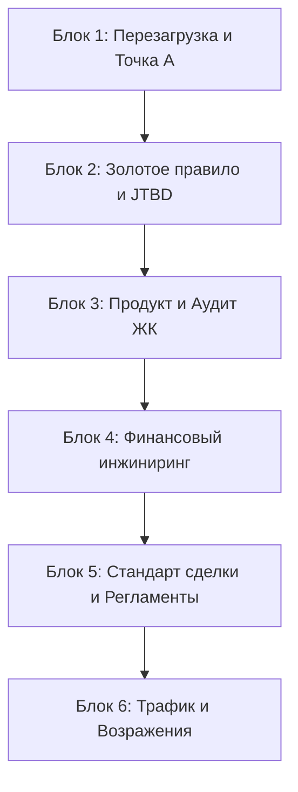

# 🧭 Архитектура курса «Среда обучения 2.0» в Telegram-боте

Этот документ описывает 6 контентных блоков обучения для опытных агентов («старичков»), переведенных из формата офлайн-встреч в логику асинхронного Telegram-бота. 

Каждый блок рассчитан на 1 неделю и делится на 2 коротких урока. В конце каждого блока агент сдает практический артефакт в бот.

---

## 🗺️ Общая карта блоков

---

## 📂 Детальное содержание блоков

### Блок 1. Перезагрузка: новая роль и оцифровка Точки А
* **Цель:** Столкнуть с реальностью рынка 2026 года, снять иллюзии прошлого опыта, пересобрать позиционирование в роль Навигатора и оцифровать текущие показатели.
* **Урок 1.1:** Почему новички обгоняют опытных агентов. 5 болезней «старичка» и новая реальность без дешевой ипотеки.
* **Урок 1.2:** Роль Навигатора: «Я не продаю — я объясняю». Принцип «Право на Нет» и экологичные продажи.
* **Сдача артефакта:** Входной опрос «Точка А» (Google Форма) + ДЗ (запись аудиосообщения с отработкой нового позиционирования).
* **Критерий прохождения:** Заполнена форма + куратор подтвердил аудиозапись.

---

### Блок 2. Золотое правило подбора и JTBD-диагностика
* **Цель:** Навести порядок в логике подбора объектов и научить агента быстро выявлять истинную потребность клиента для немедленного аудита базы текущих клиентов.
* **Урок 2.1:** Золотое правило очередности подбора: Бюджет ➔ Локация ➔ ЖК ➔ Квартира. Почему нельзя показывать планировки до одобрения лимитов. Правило шорт-листа «не более трех вариантов».
* **Урок 2.2:** Методология JTBD в недвижимости. Модель «4 силы прогресса» (Push, Pull, Anxiety, Habit) и 10 обязательных вопросов для квалификации.
* **Сдача артефакта:** 2 заполненные карты критериев по реальным клиентам из текущей базы агента (выгрузка и аудит базы).
* **Критерий прохождения:** Зафиксирован жизненный сценарий и финансовые рамки клиентов, определен круг потенциальных сделок «здесь и сейчас».

---

### Блок 3. Рыночный продукт: технический и коммерческий аудит
* **Цель:** Научить агента собирать твердую продуктовую экспертизу на месте, а не по рекламным буклетам застройщиков.
* **Урок 3.1:** Застройщики Уфы 2026: кто строит, из чего, какие реальные сроки и риски проектов.
* **Урок 3.2:** Как проводить технический аудит ЖК «ногами». Чек-лист инженерии (стены, лифты, окна, стяжка) и разбор остатков шахматки.
* **Сдача артефакта:** Готовая Карточка аудита одного ЖК Уфы по стандарту.
* **Критерий прохождения:** Карточка содержит честные минусы и риски объекта, а не только плюсы.

---

### Блок 4. Финансовый инжиниринг: новая математика сделок
* **Цель:** Дать агенту инструменты для расчета и аргументации сложных схем покупки (транши, рассрочки, субсидированные ставки).
* **Урок 4.1:** Продукты-драйверы: траншевая ипотека, комбинированная ставка, лимиты рассрочек. Математика удорожания.
* **Урок 4.2:** Сценарное сравнение «Вторичка vs Новостройка» через ежемесячный платёж и переплату на дистанции.
* **Сдача артефакта:** Сводный расчет 3 финансовых сценариев под конкретный JTBD-кейс + аудиозапись объяснения цифр для клиента.
* **Критерий прохождения:** В расчетах нет ошибок, объяснение дано простым языком без давления.

---

### Блок 5. Стандарт сделки и регламенты девелоперов
* **Цель:** Зафиксировать 18 шагов безопасного ведения сделки и правила защиты агентской комиссии.
* **Урок 5.1:** 18 шагов от цели до ключей: подробный регламент ведения сделки без хаоса и ошибок.
* **Урок 5.2:** Регламенты фиксации уникальности клиента у застройщиков Уфы (правила защиты уникальности, сроки удержания брони, агрегаторы).
* **Сдача артефакта:** Заполненный бланк фиксации уникальности по реальному клиенту + проверочный чек-лист безопасной сделки.
* **Критерий прохождения:** Форма фиксации оформлена без ошибок, агент знает правила защиты комиссии ключевых девелоперов.

---

### Блок 6. Управляемый трафик и отработка возражений
* **Цель:** Загрузить агента заявками через 10 стратегий поиска и дать технологию работы со сложными коммуникациями.
* **Урок 6.1:** 10 стратегий привлечения клиентов на новостройки (холодные контакты, отказники, показы вторички, рекомендации). Шаблон личного плана на 150к.
* **Урок 6.2:** Работа с возражениями («дорого», «удорожание», «ставки упадут») по принципу ЛПСД. Пост-сервис на 30 дней и VoC-цикл (Voice of Customer).
* **Сдача артефакта:** Журнал звонков (минимум 20 контактов по новым скриптам) + личный дашборд метрик на месяц.
* **Критерий прохождения:** Назначено минимум 2 встречи с новыми клиентами, оцифрована личная воронка.
