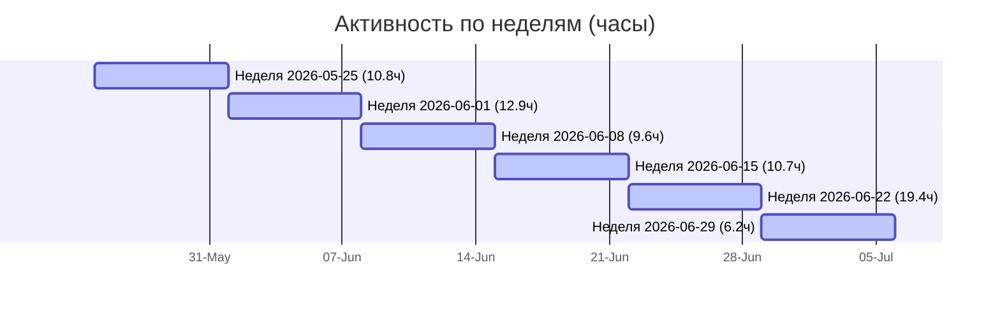
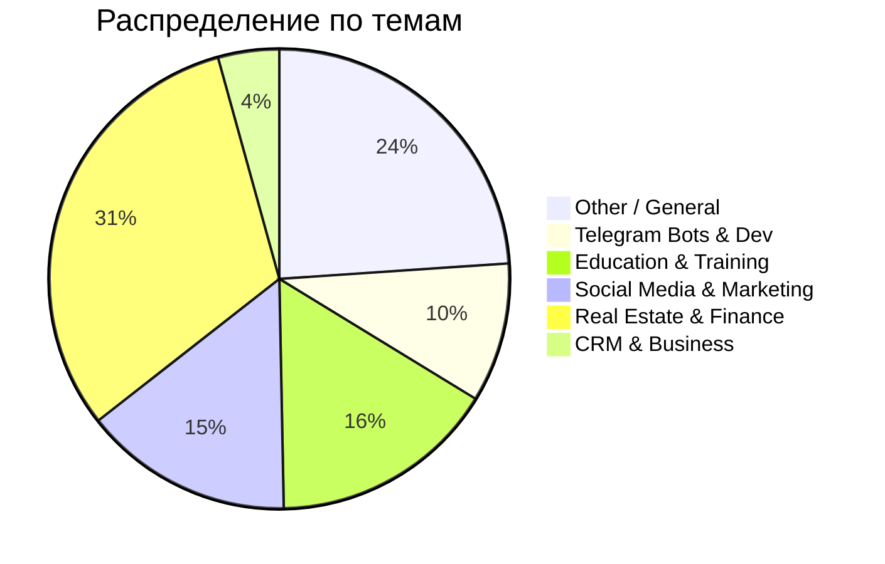

# 📊 Рефлексия: 2 месяца работы с Antigravity (Май — Июнь 2026)

Привет, Антон! Я проанализировал историю нашего с тобой общения за последние два месяца (с 1 мая по 1 июля 2026 года). Это был очень продуктивный период. Ниже собраны подробные метрики, графики и рекомендации, которые помогут увидеть паттерны работы и открыть новые точки роста.

---

## 📈 Ключевые показатели (KPIs)

*   **Всего диалогов:** 163 шт.
*   **Активные дни:** 35 из 61 календарных дней (57.4% времени).
*   **Всего времени вместе (активная работа):** 69.8 часов.
*   **В среднем за активный рабочий день:** 119.6 минут (около 2.0 часов).
*   **В среднем за календарный день (включая выходные):** 68.6 минут (около 1 часа 10 минут ежедневно).

> [!NOTE]
> Под **активным временем** понимается реальное время взаимодействия: интервалы между твоими запросами и моими ответами, если они не превышают 15 минут, плюс стандартные 5 минут на чтение/проверку результата для каждого отдельного запроса.

---

## 📅 Динамика активности по неделям

В конце июня (неделя с 22 июня) произошел огромный всплеск активности — почти 20 часов чистой работы за неделю! Это было связано с активной разработкой Telegram-бота, презентации по финансовому инжинирингу и структуры обучения.

| Неделя (с понедельника) | Кол-во диалогов | Активные дни | Время работы (ч) | Кол-во запросов |
| :--- | :---: | :---: | :---: | :---: |
| 2026-05-25 | 26 | 6 | 10.8ч | 95 |
| 2026-06-01 | 25 | 7 | 12.9ч | 114 |
| 2026-06-08 | 26 | 7 | 9.6ч | 121 |
| 2026-06-15 | 32 | 6 | 10.7ч | 120 |
| 2026-06-22 | 43 | 7 | 19.4ч | 187 |
| 2026-06-29 | 11 | 2 | 6.2ч | 77 |

### График недельной активности (Mermaid)

---

## 🗂️ Направления работы (Категории)

Мы разделили диалоги по ключевым темам на основе твоих запросов. Очевидный лидер — **Финансы и Недвижимость** (разбор способов покупки, ипотека, транши, расчеты) и подготовка **Обучающих материалов**.

| Направление | Кол-во диалогов | Доля |
| :--- | :---: | :---: |
| Real Estate & Finance (Ипотека/Сделки) | 51 | 31.3% |
| Other / General | 39 | 23.9% |
| Education & Training (Обучение/Тесты) | 26 | 16.0% |
| Social Media & Marketing (Reels/Посты) | 24 | 14.7% |
| Telegram Bots & Dev (Разработка/Автоматизация) | 16 | 9.8% |
| CRM & Business (Битрикс/CRM/Анализ) | 7 | 4.3% |

### Диаграмма распределения (Mermaid)

---

## 🛠️ Твой арсенал инструментов (Tool Usage)

Инструменты, которые я запускал для выполнения твоих задач, показывают, что мы много работаем в режиме "исследования и редактирования" твоего Obsidian-хранилища.

| Инструмент                   | Вызовы |
| :--------------------------- | :----- |
| `view_file`                  | 1911   |
| `run_command`                | 1110   |
| `replace_file_content`       | 795    |
| `list_dir`                   | 745    |
| `write_to_file`              | 691    |
| `grep_search`                | 460    |
| `manage_task`                | 168    |
| `multi_replace_file_content` | 74     |
| `schedule`                   | 74     |
| `search_web`                 | 41     |

### Детальный разбор каждого инструмента:

1. **`view_file` (Просмотр содержимого файлов — 1911 вызовов)**
   * **Что это:** Инструмент для чтения содержимого конкретного файла на диске (целиком или выбранного диапазона строк).
   * **Как ты его применяешь:** Это основа нашей совместной работы. Каждый раз, когда ты говоришь «посмотри методичку», «проанализируй вопросы к первому блоку» или «проверь скрипт Reels», я открываю эти файлы через `view_file`. Это позволяет мне видеть твой оригинальный текст, структуру и стиль.

2. **`run_command` (Запуск системных команд — 1110 вызовов)**
   * **Что это:** Выполнение команд в консоли macOS (zsh) в рабочей папке (за исключением команды перехода `cd`, которая заблокирована ради безопасности).
   * **Как ты его применяешь:** Используется для всех технических операций «под капотом»: проверка версий Python, запуск локальных веб-серверов для тестирования создаваемых нами сайтов, работа с Git (когда мы отправляем изменения в твой репозиторий через `./publish_to_github.sh`) и запуск скриптов анализа.

3. **`replace_file_content` (Редактирование файлов — 795 вызовов)**
   * **Что это:** Инструмент точечной замены текста. Он находит конкретный кусок кода или текста в файле и заменяет его на новый.
   * **Как ты его применяешь:** Твой главный инструмент редактирования. Когда мы перерабатываем методички, меняем вопросы к тестам, добавляем новые строки в таблицы способов покупки или правим структуру Obsidian-заметок, я использую именно его, чтобы аккуратно обновить файл, не ломая остальной контент.

4. **`list_dir` (Просмотр структуры папок — 745 вызовов)**
   * **Что это:** Чтение списка файлов и подпапок в указанной директории.
   * **Как ты его применяешь:** Позволяет мне ориентироваться в твоем Obsidian. Когда мы начинаем работу в новой папке или ты просишь «посмотри, какие файлы у меня в блоке 1», я сканирую директорию через `list_dir`, чтобы понять структуру твоего хранилища.

5. **`write_to_file` (Создание новых файлов — 691 вызов)**
   * **Что это:** Создание нового файла с нуля и запись в него указанного содержимого.
   * **Как ты его применяешь:** Каждый раз, когда мы создаем новую методичку, пишем с нуля скрипт автоматизации (как `analyze_history.py` в scratch-папке) или собираем интерактивный дашборд `Аналитика Antigravity.html`, я создаю этот файл на диске с помощью `write_to_file`.

6. **`grep_search` (Полнотекстовый поиск — 460 вызовов)**
   * **Что это:** Поиск заданного слова, фразы или регулярного выражения по содержимому всех файлов в указанной папке.
   * **Как ты его применяешь:** Твой инструмент навигации. Если ты просишь «найди, где мы обсуждали СУ-10» или «где у нас упоминается траншевая ипотека», я запускаю `grep_search` по твоему Obsidian, и он мгновенно находит точные файлы и строки с нужным контекстом.

7. **`manage_task` (Управление фоновыми процессами — 168 вызовов)**
   * **Что это:** Мониторинг и управление процессами, запущенными в фоновом режиме (проверка статуса, отправка команд ввода, остановка).
   * **Как ты его применяешь:** Используется, когда мы запускаем что-то долгоиграющее. Например, когда мы поднимаем локальный сервер для твоего интерактивного сайта, `manage_task` позволяет мне контролировать работу сервера в фоновом режиме, пока мы продолжаем переписываться в чате.

8. **`multi_replace_file_content` (Множественные правки — 74 вызова)**
   * **Что это:** Продвинутая версия редактирования, позволяющая за один раз заменить несколько независимых, разрозненных фрагментов текста в разных частях одного файла.
   * **Как ты его применяешь:** Мы используем его при комплексном рефакторинге или реструктуризации документов. Например, когда в большой методичке нужно одновременно обновить шапку, изменить пример расчета в середине и поправить ссылки в самом конце.

9. **`schedule` (Планировщик задач — 74 вызова)**
   * **Что это:** Установка одноразового таймера или регулярного расписания для выполнения действий в фоновом режиме.
   * **Как ты его применяешь:** Используется для ожидания длительных операций или автоматизации. Например, поставить напоминание проверить статус сборки проекта или запустить фоновый скрипт через заданное время.

10. **`search_web` (Поиск в Интернете — 41 вызов)**
    * **Что это:** Выполнение поисковых запросов в вебе и парсинг результатов для получения свежей информации.
    * **Как ты его применяешь:** Применяется для фактчекинга и поиска внешних данных: когда нам нужно проверить актуальные условия по ипотеке у банков, изучить новые фишки алгоритмов Reels или найти справочную информацию по разработке ботов.

---

## 🧠 Паттерны взаимодействия и наблюдения

Анализируя твои запросы, можно выделить несколько ярких паттернов:

1.  **Проектирование и структура "Сверху вниз":** Ты часто заходишь с масштабными задачами (создать "богоподобный сайт", спроектировать Telegram-бота для обучения агентов, переструктурировать папку с обучениями в Obsidian). Ты даешь мне общую картину, а потом мы пошагово углубляемся в детали.
2.  **Прикладное обучение и методология:** Твои запросы очень практические. Мы готовим материалы для офлайн/онлайн обучений опытных агентов, пишем чек-листы первого контакта, вопросы к блокам обучения. Это не "теоретические" вопросы к AI, а создание рабочих инструментов.
3.  **Использование Смыслокодинга:** У тебя настроен плагин `smyslokoding-plugin` с кастомными навыками (коуч по воркфлоу, tone of voice, CRM-диагностика, reels-ideas, factor analysis). Это крутой паттерн "Второго мозга", где AI адаптирован под твою личную методологию.
4.  **Фокусированные сессии:** Среднее время работы в активные дни — около 2 часов. Это говорит о том, что ты садишься за работу с Antigravity для решения крупных, сфокусированных блоков задач, а не для мелких разовых вопросов.

---

## 🚀 Рекомендации и точки роста

На основе анализа я выделил 4 рекомендации для повышения эффективности:

### 1. Автоматизация разбора "Входящих" (Inbox Triage)
Ты активно используешь Obsidian как базу знаний. С помощью навыка `second-brain-triage` мы можем сделать автоматический скрипт (например, запускаемый раз в день через `/schedule`), который будет сканировать твою папку `raw` или `inbox`, классифицировать новые заметки и раскидывать их по структуре (Бизнес, План, Мой клон, Мастерство) с генерацией Action Items.

### 2. Создание интерактивных микро-приложений в Obsidian
Поскольку мы создавали калькуляторы и схемы способов покупки (траншевая ипотека, субсидии), мы можем разрабатывать локальные интерактивные HTML/JS калькуляторы прямо в Obsidian (используя плагин Obsidian Custom JS / HTML, или просто сохраняя HTML-файлы и открывая их во встроенном фрейме). Это позволит тебе наглядно показывать расчеты агентам прямо во время презентаций.

### 3. Автоматическое применение Tone of Voice
Ты разработал отличный навык `anton-voice` (прямо, по делу, я объясняю, а не продаю). Чтобы не напоминать мне применять его каждый раз, ты можешь добавить жесткое правило в файл `.agents/AGENTS.md` в корне своего Obsidian-хранилища. Тогда я буду автоматически генерировать все тексты, посты и Reels в твоем Tone of Voice по умолчанию.

### 4. Доведение Telegram-бота для обучения до MVP
В конце июня мы спроектировали Telegram-бота для обучения агентов. Следующий логичный шаг — создать работающий прототип (MVP) прямо на твоем компьютере с локальной базой данных SQLite. Я могу полностью написать код для этого бота, настроить тестовую среду и помочь тебе его запустить, чтобы ты мог дать его потестировать первым трем опытным агентам.

---

## 💡 Перспективные сценарии использования ИИ (На основе твоего опыта)

Опираясь на то, как ты уже работаешь с Antigravity (проектирование, методология, Obsidian, разработка), вот 5 сценариев, которые используют эксперты твоего уровня:

### 1. Интерактивные ИИ-Тренажеры возражений для агентов (ИИ как клиент)
Поскольку ты пишешь сценарии ролевых игр и методички («Вопросы к первому блоку.md», «Чек-лист первого касания.md»), мы можем создать локальный веб-интерфейс или Telegram-тренажер.
* **Как это работает:** ИИ берет на себя роль сложного, сомневающегося клиента (например, покупателя с заниженными ожиданиями). Брокер общается с ним текстом или голосом.
* **Фишка:** После диалога ИИ переключается в роль коуча и оценивает брокера по твоей конкретной методологии (выявил ли потребности, отработал ли траншевую ипотеку, не свалился ли в слабую позицию).

### 2. Умный оцифровщик планерок и встреч (Whisper + Obsidian)
Ты проводишь много живых планерок, обучений и созвонов.
* **Как это работает:** Ты записываешь аудио встречи на диктофон, закидываешь аудиофайл в папку `inbox` твоего Obsidian.
* **Фишка:** ИИ не просто транскрибирует текст, а вытаскивает структуру: фиксирует договоренности, задачи в To-Do лист, новые инсайты для методичек и автоматически раскладывает это по папкам Второго Мозга, связывая перекрестными ссылками с существующими заметками.

### 3. База Знаний «На автопилоте» (Семантическое связывание заметок)
Когда база в Obsidian разрастается до сотен заметок, связи между ними теряются.
* **Как это работает:** Локальный Python-скрипт с использованием ИИ сканирует твой vault и находит смысловые (семантические) связи между файлами разных лет.
* **Фишка:** ИИ предлагает: «Антон, ты сейчас пишешь про субсидированную ипотеку СУ-10. По смыслу это на 87% совпадает с кейсом, который ты описывал в мае 2025 года. Связать эти заметки ссылкой?» Твой Второй Мозг становится живой самоорганизующейся системой.

### 4. ИИ-Ассистент для твоих агентов (RAG на твоем Obsidian)
Твои агенты часто задают повторяющиеся вопросы по методикам продаж, расчетам ипотеки или регламентам.
* **Как это работает:** Создается закрытый Telegram-бот для твоей команды, подключенный только к выбранным папкам твоего Obsidian (`6. обучения агентов`, `Методичка 2.0`).
* **Фишка:** Бот отвечает агентам строго на основе твоей методологии и исключительно в твоем Tone of Voice (`anton-voice`). Это масштабирует тебя как руководителя: агенты получают твои ответы 24/7, не отвлекая тебя от стратегических задач.

### 5. Автоматический аудит CRM (ИИ как аналитик данных)
У тебя есть навыки факторного анализа и CRM-диагностики.
* **Как это работает:** Ты выгружаешь из Битрикс24 простой CSV-отчет по сделкам и действиям агентов и отдаешь его ИИ.
* **Фишка:** ИИ анализирует лог сделок: находит брокеров, которые нарушают SLA (долго не перезванивают), выявляет этапы, на которых сливается больше всего клиентов, и готовит для тебя готовый отчет-диагностику с рекомендациями: «На этапе 'Встреча согласована' конверсия упала на 12%. Основная причина — агенты не отправляют 'Методичку для клиента' перед встречей».

---

*Этот отчет сохранен в твоем Obsidian по пути: [Анализ использования Antigravity.md](file:///Users/anton_tsoy/Desktop/Обсидиан/Анализ использования Antigravity.md)*
*Также я создал интерактивный HTML-дашборд с графиками: [Аналитика Antigravity.html](file:///Users/anton_tsoy/Desktop/Обсидиан/Аналитика Antigravity.html)*

