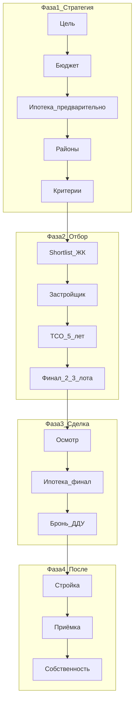

---
tags:
  - #новостройки
  - #обучение
  - #эксперт-сити
  - #агенты
created: 2026-05-26
updated: 2026-05-26
status: сценарий-обучения
audience: агенты Эксперт Сити
duration: 60-90 мин
sources:
  - Сравнение ответов.md
  - КУРСОР ИНСТРУКЦИЯ — Как правильно покупать новостройку.md
  - Агентское обучение Гранель — выжимка.md
original_path: "life/Как подбирать Новостройки/Как покупать новостройку.md"
moved_at: "2026-06-14"
---
# Как покупать новостройку — структура обучения для агентов

> **Формат:** обучение агентов «Эксперт Сити»  
> **Длительность:** 60–90 минут  
> **Цель занятия:** агент умеет вести клиента по понятному пути — от первого контакта до брони — без хаоса, перегруза и «показа ради показа».

---

## Что должен уметь агент после обучения

| Навык                                                             | Проверка                   |
| ----------------------------------------------------------------- | -------------------------- |
| Объяснить клиенту, **с чего начинать** подбор (не с Авито)        | Устный ответ за 60 сек     |
| Провести **первую консультацию** по шагам 1–5                     | Заполнен «паспорт покупки» |
| Собрать **shortlist 5–10 ЖК** и сузить до **2–3 финалов**         | Таблица сравнения          |
| Назвать **красные флаги** застройщика                             | Минимум 5 пунктов          |
| Позиционировать себя как **навигатора**, а не «показчика квартир» | Фраза win-win              |

---

## Главный принцип (золотое правило)

**Финансы и безопасность → география → ЖК → планировка → эмоции.**

| Фаза | Что делаем | Что НЕ делаем |
|------|------------|---------------|
| 1. Стратегия | Цель, бюджет, ипотека, район, критерии | Не едем на показы |
| 2. Отбор | Shortlist ЖК, проверка застройщика, TCO | Не влюбляем в один ЖК |
| 3. Сделка | Осмотр 2–3 финалов, ипотека финал, бронь, ДДУ | Не бронируем без ипотеки |
| 4. После | Контроль стройки, приёмка, собственность | Не «забываем» клиента после подписания |

**Фраза для клиента:**
> «Я не продаю квартиру — я веду вас по понятному пути: сначала ваша цель и безопасность, потом выбор. Застройщик получает честную сделку, банк — надёжного заёмщика, вы — квартиру без сюрпризов.»

---

## Почему агенту это нужно в 2026

Клиент 2026 года приходит **перегруженным**: десятки роликов, страх ошибиться, недоверие обещаниям.

| Было (2021) | Стало (2026) |
|-------------|--------------|
| Показал объект → сделка | Навигатор по сложному решению |
| Достаточно скидки и планировки | Нужна ясность, структура, снижение тревоги |
| Агент = «проводник по ЖК» | Агент = **эксперт по пути покупки** |

**Выигрывает** не тот, кто больше показал, а тот, кто **структурировал выбор** и довёл до следующего шага.

---

## Карта обучения на 60–90 минут

| Блок | Время | Тема | Результат для агента |
|------|-------|------|----------------------|
| 1 | 10 мин | Роль агента-навигатора + золотое правило | Понимает, чем отличается от «показчика» |
| 2 | 15 мин | 7 шагов 80/20 — обязательный минимум первой встречи | Знает, что делать на 1-й консультации |
| 3 | 20 мин | 18-шаговая воронка — полный стандарт сделки | Видит весь путь клиента |
| 4 | 15 мин | 3 встречи с клиентом: сценарий по шагам | Есть скрипт встреч 1–2–3 |
| 5 | 15 мин | Практика: паспорт покупки + сравнение ЖК | Заполнен шаблон на кейсе |
| 6 | 5 мин | Чек-листы, ошибки, домашнее задание | Забрал инструменты в работу |

---

# БЛОК 1. Золотое правило (10 мин)

### Что объяснить агентам

1. **90% покупателей** начинают неправильно: Авито → офис продаж → влюбились в планировку → потом деньги.
2. **Правильный порядок** — фильтр: на каждом шаге отсекаем плохие варианты.
3. Агент **не ведёт на показ**, пока не закрыты шаги 1–3 (цель, бюджет, ипотека).

### Типичные ошибки агента

| Ошибка | Последствие |
|--------|-------------|
| Сразу везти на ЖК | Клиент влюбился → бюджет не тянет |
| Не проверил застройщика | Репутационный риск + срыв сделки |
| Дал 10+ «финалов» | Усталость → покупка «наугад» |
| Давил «последняя квартира» | Потеря доверия |



---

# БЛОК 2. Семь шагов 80/20 — минимум первой консультации (15 мин)

> **Правило:** если клиент не прошёл шаги 1–3 — **не показываем ЖК**.

| № | Шаг | Что делает агент с клиентом | Вопросы клиенту |
|---|-----|----------------------------|-----------------|
| 1 | **Цель + срок ключей** | Записывает «паспорт покупки» | Зачем квартира? Когда ключи? На сколько лет? |
| 2 | **Бюджет + комфортный платёж** | Фиксирует 3 цифры: макс. цена, взнос, платёж/мес | Сколько готовы внести? Какой платёж комфортен? (не макс. банка!) |
| 3 | **Предодобрение ипотеки** | Направляет к брокеру / 2–3 банка | Какие программы подходят? Какой лимит одобрения? |
| 4 | **2–4 района + сценарий жизни** | Сужает географию | Куда ездите каждый день? Школы, метро, парк? |
| 5 | **Критерии квартиры + приоритеты** | Чек-лист must / nice | Что обязательно? На чём готовы уступить? |
| 6 | **Shortlist 5–10 ЖК** | Собирает после шагов 1–5 | — (домашнее задание агента) |
| 7 | **Сравнение 2–3 лотов: TCO 5 лет** | Таблица полной стоимости | Не цена на баннере, а стоимость владения |

### Паспорт покупки (шаблон на 1 страницу)

```
Клиент: _______________
Цель: жить / аренда / детям / инвестиция
Срок ключей: _______________
Макс. цена: _______________ ₽
Первый взнос: _______________ ₽
Комфортный платёж: _______________ ₽/мес
Ипотека (предодобрение): _______________ ₽
Районы (2–4): _______________
Must have: _______________
Nice to have: _______________
Компромисс готов на: _______________
```

**Домашнее задание клиенту после встречи 1:** документы для ипотеки, уточнить районы, подумать над must/nice.

---

# БЛОК 3. Восемнадцать шагов — полный стандарт сделки (20 мин)

> Каркас из [[КУРСОР ИНСТРУКЦИЯ — Как правильно покупать новостройку]]. Агент знает весь путь — ведёт клиента по фазам.

| №   | Шаг                     | Суть                               | Когда агент включается |
| --- | ----------------------- | ---------------------------------- | ---------------------- |
| 1   | Цель покупки            | Зачем, срок ключей, горизонт       | Встреча 1              |
| 2   | Финансовая рамка        | Макс. цена, взнос, платёж, подушка | Встреча 1              |
| 3   | Ипотека предварительная | Лимит до выбора ЖК                 | Встреча 1              |
| 4   | Районы и сценарий       | 2–4 района, не весь город          | Встреча 1              |
| 5   | Критерии квартиры       | Must / nice, комнаты, срок сдачи   | Встреча 1              |
| 6   | Shortlist 5–10 ЖК       | Корзина под рамку                  | Между встречами        |
| 7   | Застройщик              | Эскроу, декларация, репутация      | Встреча 2              |
| 8   | Проект и сроки          | Стадия стройки, корпус, переносы   | Встреча 2              |
| 9   | Цена и TCO 5 лет        | Полная стоимость, не «скидка 15%»  | Встреча 2              |
| 10  | Финал 2–3 лота          | Не больше трёх вариантов           | Встреча 2–3            |
| 11  | Осмотр                  | Офис, шоурум, локация вживую       | Встреча 3              |
| 12  | Ипотека финал           | Ставка под конкретный лот          | Перед бронью           |
| 13  | Бронь                   | Лот, договор, срок, возврат        | Сделка                 |
| 14  | ДДУ                     | Сроки, неустойка, отделка, эскроу  | Сделка                 |
| 15  | Регистрация             | Росреестр, деньги на эскроу        | Сделка                 |
| 16  | Контроль стройки        | наш.дом.рф, претензии при переносе | После сделки           |
| 17  | Приёмка                 | Дефектовка, акт с замечаниями      | За 1–2 мес до ключей   |
| 18  | Собственность           | Регистрация права, ремонт, аренда  | После ключей           |

### Что нельзя делать раньше времени

| Если сделать раньше | Что ломается |
|---------------------|--------------|
| ЖК до цели и бюджета | Переплата, несоответствие жизни |
| Бронь до ипотеки | Потеря депозита |
| Осмотр до проверки застройщика | Эмоции на небезопасном объекте |
| Акт приёмки без осмотра | Дефекты за ваш счёт |

---

# БЛОК 4. Три встречи с клиентом — сценарий агента (15 мин)

## Встреча 1. Диагностика (30–40 мин)

**Цель:** закрыть шаги 1–5, **не показывать ЖК**.

| Этап | Действие | Время |
|------|----------|-------|
| Рамка | «Сегодня разберём вашу задачу и цифры. На ЖК пойдём, когда будет ясно, что вам подходит» | 2 мин |
| Цель | Шаг 1 — паспорт покупки | 8 мин |
| Деньги | Шаги 2–3 — бюджет, платёж, ипотека | 12 мин |
| География + критерии | Шаги 4–5 — районы, must/nice, приоритеты | 15 мин |
| Итог | Домашнее задание, дата встречи 2 | 3 мин |

**Запрещено на встрече 1:** показы, бронь, давление «успейте».

---

## Встреча 2. Разбор вариантов (40–50 мин)

**Цель:** шаги 6–10 — shortlist, проверки, таблица сравнения.

| Этап | Действие |
|------|----------|
| Shortlist | Показать 5–10 ЖК, отсечь по застройщику и срокам |
| Факты | Не реклама: эскроу, декларация, история сдачи |
| Таблица TCO | Сравнить 2–4 ЖК: цена, ипотека, срок, полная стоимость 5 лет |
| Финал | Оставить **2–3 лота** — назначить осмотр |

**Домашнее задание клиенту:** посмотреть районы вживую (дорога в час пик), список вопросов к осмотру.

---

## Встреча 3. Осмотр и решение (по объектам)

**Цель:** шаги 11–13 — осмотр, ипотека финал, бронь.

| Этап | Действие |
|------|----------|
| Осмотр | Офис, шоурум, локация — по чек-листу, не «понравилось» |
| Ипотека финал | Одобрение под конкретный лот |
| Бронь | Только после финансовой ясности; договор брони — читать |

**После сделки (шаги 14–18):** сопровождение до ключей — отдельный сервис, удержание клиента и рекомендации.

---

# БЛОК 5. Практика на обучении (15 мин)

## Упражнение 1. Паспорт покупки (7 мин)

**Кейс:** семья, 2 детей, хотят 3-комнатную, бюджет «до 12 млн», платёж «как получится».

**Задание:** в парах заполнить паспорт покупки и назвать **3 вопроса**, которые агент обязан задать, прежде чем предлагать ЖК.

**Эталонные вопросы:**
- Зачем именно 3-комнатная? Срок ключей?
- Какой платёж **комфортен**, не максимальный от банка?
- Есть ли предодобрение? На какую сумму?
- Какие 2–3 района реально рассматриваете?
- Что must have, на чём готовы уступить?

---

## Упражнение 2. Таблица сравнения ЖК (8 мин)

Заполнить на 2–3 условных ЖК:

| Параметр | ЖК A | ЖК B | ЖК C |
|----------|------|------|------|
| Цена лота | | | |
| Цена за м² | | | |
| Срок сдачи | | | |
| Застройщик (эскроу?) | | | |
| Ипотека / субсидия | | | |
| Отделка | | | |
| **TCO 5 лет** | | | |

**Правило:** побеждает не «скидка», а **меньшая полная стоимость** с учётом ипотеки и срока.

---

## Упражнение 3. Презентация за 60 секунд

**Формула (не реклама ЖК):**

> «Этот ЖК подходит [тип клиента], потому что [сильная сторона]. Компромисс — [слабое место]. Сравнивать логично с [конкурент]. По цифрам: [цена / платёж / срок]. Следующий шаг — [осмотр / ипотека / бронь].»

**Пример:**
> «ЖК подходит молодой семье с понятным платежом и сроком сдачи в 2027. Сильная сторона — цена входа и семейная ипотека. Компромисс — не центр, зато метро 15 минут пешком. Сравнивать с ЖК X у метро — там дороже на 1,5 млн. Следующий шаг — осмотр в субботу и предодобрение под этот лот.»

---

# БЛОК 6. Чек-листы агента (5 мин + раздать)

## Вопросы клиенту на первой встрече

- [ ] Зачем покупаете? На сколько лет планируете держать?
- [ ] Когда нужны ключи?
- [ ] Максимальная цена и первый взнос?
- [ ] Какой **ежемесячный платёж комфортен**? (не «сколько одобрят»)
- [ ] Есть ли предодобрение ипотеки? На какую сумму?
- [ ] Какие 2–4 района? Почему?
- [ ] Must have / nice to have / готовый компромисс?
- [ ] Были ли уже просмотры? Что понравилось и почему отказались?

---

## Красные флаги застройщика (до брони)

- [ ] Нет эскроу / давление перевести деньги напрямую
- [ ] Системные задержки по другим домам
- [ ] Нет актуальной проектной декларации на наш.дом.рф
- [ ] Давление «бронь сегодня без документов»
- [ ] Смена названия компании, суды, негатив в открытых источниках
- [ ] Объект не в белом списке банков (если ипотека)

---

## Чек-лист агента на одну сделку

- [ ] 1. Паспорт покупки заполнен
- [ ] 2. Предодобрение ипотеки есть
- [ ] 3. Shortlist 5–10 → финал 2–3
- [ ] 4. Застройщик проверен
- [ ] 5. TCO 5 лет посчитан
- [ ] 6. Осмотр только финалистов
- [ ] 7. Ипотека финал до брони
- [ ] 8. ДДУ проверен (сроки, неустойка, эскроу)
- [ ] 9. Клиент в курсе: приёмка с дефектовкой

---

# Домашнее задание агентам после обучения

| Задание | Срок | Критерий |
|---------|------|----------|
| Заполнить паспорт покупки на **реальном** или учебном клиенте | 24 ч | Все поля шагов 1–5 |
| Собрать shortlist **5 ЖК** под этого клиента | 3 дня | С обоснованием по критериям |
| Сравнить **2 лота** в таблице TCO | 3 дня | Есть итог «рекомендую X, потому что…» |
| Отрепетировать **60-сек презентацию** одного ЖК | До следующей планёрки | Запись голосом или устно наставнику |

---

# Материалы и связи

| Документ | Назначение |
|----------|------------|
| [[Сравнение ответов]] | Почему выбрана эта методология |
| [[КУРСОР ИНСТРУКЦИЯ — Как правильно покупать новостройку]] | Полный клиентский стандарт 18 шагов |
| [[Агент по Новостройкам/Первая встреча новичка агента на объекте у продавца]] | Работа на объекте у застройщика |
| [[Агентское обучение Гранель — выжимка]] | Контекст рынка 2026 и роль агента |

---

# Кратко: одна фраза на выход из обучения

**Покупка новостройки — не поиск красивой картинки, а последовательное снижение рисков. Агент Эксперт Сити ведёт клиента по этому пути — сначала зачем и сколько, потом где и у кого, потом какая квартира, и только в конце — подпись и ключи.**

---

*Версия 1.0 | 2026-05-26 | Обучение агентов «Эксперт Сити»*
