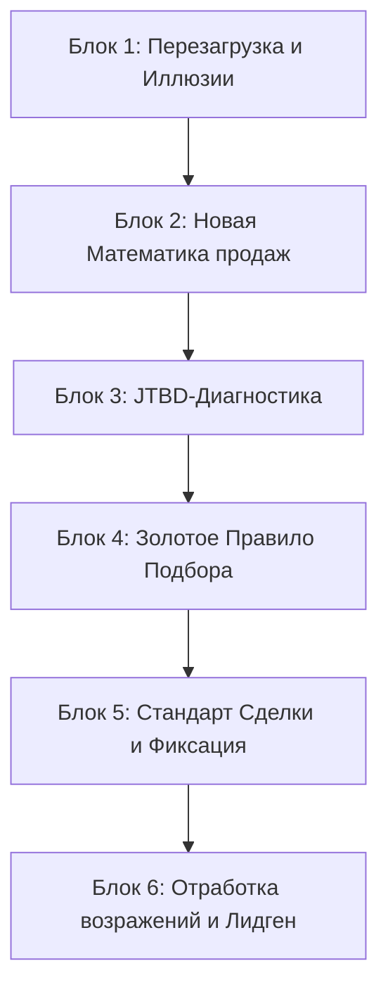

# МЕТОДИЧЕСКАЯ ПРОГРАММА И СТАНДАРТЫ ОБУЧЕНИЯ ПО НОВОСТРОЙКАМ ДЛЯ ОПЫТНЫХ АГЕНТОВ (10+ ЛЕТ НА РЫНКЕ)

> **Автор:** Антон Цой
> **Целевая аудитория:** Агенты с опытом работы от 10 лет, имеющие твердые навыки во вторичке/загородной недвижимости, активную клиентскую базу, но испытывающие системный спад продаж на рынке новостроек 2026 года.

---

## 1. Архитектура программы: Концепция «Навигатор vs Рыбак»

Опытный агент имеет огромный багаж знаний, но часто находится в плену **иллюзии экспертизы**: он считает, что понимает сегодняшний рынок новостроек, опираясь на опыт прошлых лет. Задача этого обучения — не «заставить учиться с нуля», а **обновить операционную систему** (сделать ресет) и превратить хаотичный опыт в системные продажи через два основных механизма:
1. **Смена позиции:** Переход из роли «Продавца мнения» (Агент-Рыбак, ждущий поклевки) в роль «Навигатора-Аналитика» (Агент-Стратег, оперирующий цифрами и финансовыми сценариями).
2. **Системный контроль (Telegram-CRM):** Интеграция обучения и контроля действий в единый цикл, где Telegram-бот выступает не просто как библиотека материалов, а как сквозная система контроля KPI, базы знаний и тестирования.

---

## 2. Архитектура Telegram-CRM: Контроль действий и ИИ-интеграция

Telegram-бот в этой программе решает ключевую проблему опытных сотрудников — **неприятие внешнего контроля и саботаж отчетов**. Для них это должно выглядеть как интерактивный личный ассистент с игровыми механиками.

### Структура базы данных и бэкенда (у сервера)
* **Профиль агента:** ID, ФИО, уровень допуска (грейд по результатам тестов), текущие баллы (XP), список сданных/не сданных блоков.
* **Матрица знаний (Knowledge Graph):** Интеграция с базой данных ЖК Уфы.
* **ИИ-Ядро (LLM API):** Обрабатывает текстовые и голосовые запросы агента, вытаскивая информацию по объектам одной кнопкой (например: «Выдай рассрочки по ЖК Новатор на сегодня»).

### Механика прохождения блоков
1. **Выдача контента:** Бот отправляет ссылки на короткие видеоуроки (до 15 минут), аудиоподкасты или текстовую транскрипцию (на выбор агента для удобства восприятия).
2. **Проверка через ДЗ:** Агент отправляет артефакт в чат-бота (в виде файла, ссылки на подборку или аудиосообщения со скриптом — ИИ-модуль распознает аудио и оценивает соответствие скрипту).
3. **Тестирование:** Рандомизированные тесты после каждого блока (порог прохождения — 80%). При провале бот блокирует открытие следующего блока и предлагает пройти альтернативную подачу материала по этой теме через 24 часа.
4. **Игровая динамика (Рейтинг):** Внедрение лидерборда. «Старички» азартны. Показ их статуса относительно коллег мотивирует сдавать тесты быстрее.

---

## 3. Модульная маршрутная карта (Блоки обучения)

Прохождение не привязано к жестким датам. Каждый агент движется в своем темпе, но бот сигнализирует куратору/РОПу, если прохождение блока затянулось более чем на 7 дней.

### Блок 1. Перезагрузка: Рынок Уфы 2026 года и разрушение иллюзий
* **Суть:** Разбить иллюзии старого опыта, перевести агента из позиции «я всё знаю» в позицию «я готов обновлять инструменты».
* **Контент в боте:** 3 коротких видео-кейса о том, почему классические методы продаж вторички сливают сделки на новостройках.
* **Тест уровня 1:** Проверка на понимание ключевых отличий трех эр рынка недвижимости Уфы.
* **Сдаваемый артефакт:** Личная карточка «Мои 3 иллюзии, от которых я отказываюсь» + формулировка своего нового УТП как Навигатора.

### Блок 2. Новая математика продаж: Ипотека и Финансовые сценарии
* **Суть:** Дать агенту инструменты точных финансовых расчетов (субсидии, рассрочки, траншевая ипотека).
* **Контент в боте:** Видео-гайд по расчету комбинированных программ. Шаблон Excel-калькулятора.
* **Тест уровня 2:** Кейс-тест (на входе даны параметры клиента, нужно рассчитать ежемесячный платеж и переплату по 3 программам и выбрать самую выгодную).
* **Сдаваемый артефакт:** Заполненный расчетный файл-сравнение «Вторичка за 7 млн (под 18%) vs Новостройка за 8.5 млн (под 6%)» для реального клиента.

### Блок 3. JTBD-Диагностика и психология «4 сил прогресса»
* **Суть:** Переучить агента с презентации характеристик объекта на выявление истинной жизненной задачи клиента (Jobs to be Done).
* **Контент в боте:** Интерактивный разбор 4 сил прогресса (Push, Pull, Anxiety, Habit) на примерах уфимского рынка. Скрипт «10 обязательных вопросов».
* **Тест уровня 3:** Диалоговый симулятор в боте (бот имитирует клиента с возражениями, агент должен отвечать правильными квалифицирующими вопросами).
* **Сдаваемый артефакт:** Заполненные чек-листы глубинной диагностики по 2 реальным клиентам из базы агента.

### Блок 4. «Золотое правило»: Очередность и технология подбора лотов
* **Суть:** Внедрить жесткую технологическую цепочку фильтрации: Финансы (одобрение) → Локация → ЖК → Планировка.
* **Контент в боте:** Сводная база ЖК Уфы с фильтрацией по надежности застройщиков и эскроу. Инструкция по формированию шорт-листа из строго 2-3 вариантов.
* **Тест уровня 4:** Тест на знание продуктовых линеек и инфраструктурных особенностей топ-5 застройщиков города.
* **Сдаваемый артефакт:** Оформленный шорт-лист (подборка из 3 вариантов) с четкой защитой логики выбора каждого лота под цели клиента.

### Блок 5. Технологический стандарт сделки и регламенты девелоперов
* **Суть:** Исключить срывы сделок из-за нарушения регламентов фиксации клиентов.
* **Контент в боте:** Таблица регламентов уникальности застройщиков Уфы. 18 шагов безопасной сделки.
* **Тест уровня 5:** Тест на правила уникальности (что делать, если клиент ранее звонил застройщику сам; как зафиксировать клиента через агрегатор Trend Agent / Нмаркет).
* **Сдаваемый артефакт:** Заполненные по регламенту заявки на фиксацию уникальности клиентов для 3-х ключевых застройщиков.

### Блок 6. Системный лидген и новые скрипты
* **Суть:** Активация спящей клиентской базы агента с помощью новых триггерных офферов 2026 года.
* **Контент в боте:** База из 10 стратегий поиска клиентов (Топ-100, холодные звонки, переориентация, рассылки). Конструктор скриптов ЛПСД (Лайт-отказ → Пауза → Согласие → Действие).
* **Тест уровня 6:** Запись аудиосообщения со скриптом отработки возражения «Дорого / Подожду снижения ставок». ИИ-оценка интонации и триггерных слов.
* **Сдаваемый артефакт:** Персональный план на 150 000 руб. комиссии (расчет воронки в боте) + реестр из 50 контактов для проработки.

---

## 4. Конструктор тестирования и уровни контроля в боте

Чтобы объективно оценивать готовность агентов, в Telegram-бот закладываются три уровня контроля:

| Уровень проверки | Формат | Что проверяет | Кто оценивает |
|------------------|--------|---------------|---------------|
| **Авто-тест** | 5-7 вопросов с выбором ответов | Знание матчасти (ставки, лимиты, регламенты застройщиков) | Telegram-бот (автоматически) |
| **Кейс-задача** | Расчет конкретных цифр или выбор лучшего лота | Умение применять инструмент на практике | Бот + ИИ-верификатор формул |
| **Аудио-аттестация** | Запись голосового сообщения со скриптом разговора | Речевые маркеры, интонации, отсутствие давления | ИИ (транскрипция и скоринг) + РОП (выборочно) |

---

## 5. Дополнения и упущенные моменты: Точки усиления опытных агентов

Анализ вводных показывает, что опытные агенты часто совершают три скрытые ошибки, которые блокируют продажи:

1. **Эго Эксперта:** Они стесняются признаться, что не понимают новые программы («я 15 лет в недвижимости, вы меня учить будете?»).
   * *Решение в программе:* Позиционировать обучение не как базовую школу риелтора, а как **«Мастер-группу по сложным финансовым инструментам 2026»**. Использовать их опыт для разбора кейсов на общих встречах.
2. **Игнорирование фиксации:** Старые агенты привыкли вести дела на доверии и часто теряют комиссию, забывая вовремя зафиксировать уникальность клиента в базах застройщиков.
   * *Решение в программе:* Внедрить жесткое правило в боте — пока агент не пришлет скриншот подтверждения фиксации из кабинета застройщика/агрегатора, сделка не считается запущенной в CRM-контроль.
3. **«Выгорание» базы:** Они утверждают, что их старым клиентам новостройки не нужны.
   * *Решение в программе:* Блок по реактивации базы. Отправка клиентам не предложений «купить новостройку», а бесплатного аудита их текущих ипотечных кредитов и предложение схем рефинансирования/обмена через новые программы рассрочки.

---

## 6. Ментальный фильтр: Работа с субъективным неприятием ЖК и расчетов

У опытных агентов есть частая профессиональная деформация — **«мне лично это не нравится, значит и клиенту предлагать не буду»**. Если агент субъективно считает какой-то ЖК неудачным, планировки неудобными, а финансовые схемы или расчеты переусложненными / невыгодными, он сознательно или подсознательно исключает их из работы, лишая клиентов выбора.

Для преодоления этого барьера внедряется обязательный **Блок ментальной декомпозиции**:

### Принцип разделения личного мнения и потребностей рынка
* **«Не для себя покупаешь»:** Задача агента — не одобрять объект лично, а понять, какой конкретно категории клиентов и под какую JTBD-задачу данный инструмент или ЖК подходит идеально.
* **Обязательное упражнение по каждому спорному объекту/инструменту:**
  Если агент заявляет: *«Этот ЖК — ерунда»* или *«Эти расчеты рассрочки невыгодны»*, он обязан выполнить задание в боте:
  1. **Шаг 1. Поиск соответствия:** Описать 3 портрета клиентов (из реальной практики), которым именно эти условия (пусть даже с удорожанием или в спорной локации) дадут решение их боли (например, сверхнизкий первоначальный взнос, отсрочка платежа до продажи старой квартиры, или близость к конкретному вузу для детей из районов).
  2. **Шаг 2. Разбор альтернатив:** Доказать на цифрах, почему для данных 3-х портретов классическая альтернатива (например, стандартная ипотека на вторичку) будет еще более губительной.
  3. **Шаг 3. Деконструкция «Нет клиентов»:** Если агент утверждает: *«У меня нет таких клиентов в базе»*, бот запускает аудит структуры базы агента. РОП или бот-помощник задают вопрос: *«Кто твои клиенты? Давай разберем топ-20 твоих прошлых сделок. Какую задачу они решали тогда, и какая финансовая ситуация у них сейчас?»*. Это позволяет переоткрыть базу под углом актуальных продуктов.

---

## 7. Клиентская памятка: «Как правильно покупать новостройку»
*(Интегрированный текстовый блок для выдачи агентам как рабочий стандарт и клиентам как гайд)*

### Главный принцип (золотое правило)
**Финансы и безопасность → география → ЖК → планировка → эмоции.**

### Фазы взаимодействия
1. **Стратегия:** Согласование целей покупки, расчет бюджета и подушки безопасности, предварительное одобрение ипотеки, выбор районов и составление карты критериев (Must / Nice). *На этом этапе показы ЖК не проводятся.*
2. **Отбор:** Формирование shortlist из 5–10 ЖК, детальная проверка застройщиков и юридической чистоты, расчет полной стоимости владения (TCO за 5 лет) по 2–3 финалистам.
3. **Сделка:** Осмотр выбранных 2-3 объектов на месте, финальное одобрение ипотеки под выбранный лот, подписание брони, проверка и подписание ДДУ, открытие эскроу-счета.
4. **После:** Контроль этапов строительства, экспертная приёмка квартиры с дефектовкой, регистрация собственности.

### Чек-лист «Красные флаги» застройщика (до бронирования)
* Отсутствие проектной декларации на наш.дом.рф.
* Использование эскроу-счетов не подтверждено или предлагаются обходные схемы платежа.
* Системные задержки сдачи объектов застройщиком более чем на 6 месяцев по прошлым проектам.
* Давление менеджера продаж («Бронируйте прямо сейчас, завтра цена вырастет на миллион») до анализа документов.
* Объект не аккредитован крупнейшими банками.
