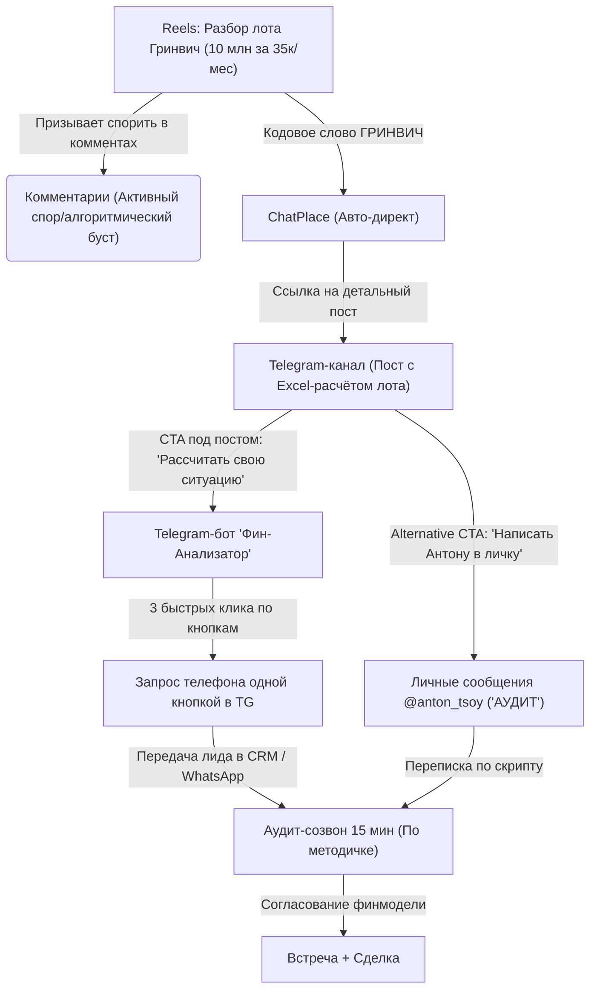
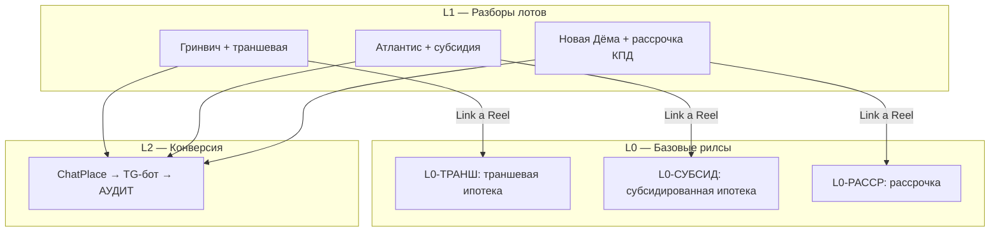

# 🏔️ Стратегия B2C-контента: «Финансовый инжиниринг лотов»
## Руководство по воронке привлечения конечных покупателей недвижимости

Этот документ объединяет концепцию продвижения недвижимости через разбор конкретных лотов, критический анализ рисков, архитектуру воронки и готовый пошаговый план делегирования, полностью сфокусированный на привлечении конечных покупателей (B2C).

---

## 🧠 1. Концепция и Позиционирование

В условиях ключевой ставки 20%+ и отмены массовой господдержки стандартная реклама («купите квартиру в ЖК Х») больше не работает. Покупатели испытывают баннерную слепоту к рендерам и красивым описаниям холлов. 

Твоя позиция на новом аккаунте — **«Независимый Финансовый Аналитик»** (на основе методологии **РОСТ** и **JTBD**). Ты продаешь не квадратные метры, а **математику доступности квартиры** под конкретный сценарий жизни покупателя (B2C).

### Как эта концепция продает сопутствующие услуги нативно:
1. **Одобрение ипотеки (сложные кейсы):** Рассказывая про использование лимитов созаемщиков (донорские схемы), ты показываешь клиенту решение его проблемы. Он понимает, что сам такую схему в банке не согласует, и обращается за твоей услугой одобрения.
2. **Страховки:** Демонстрация экономии на банковской страховке (оформление напрямую в страховой на 30–50% дешевле) выступает как легкий лид-магнит с очевидной выгодой.
3. **Вторичка:** Продажа через схемы «выкупа ставки продавца» или покупку недооцененных объектов с расчетом на быстрое рефинансирование.

---

## 💳 1.1. Полный реестр способов покупки новостроек (Физлица)

Для эффективного финансового инжиниринга лотов аналитик должен владеть полной картой инструментов покупки. Каждый из этих способов — это отдельный «конструктор» для создания контент-схем и персонализированных расчетов. Подробные базы данных по всем условиям доступны в едином **[[INDEX|Каталоге способов покупки недвижимости]]**.

### 💰 Группа 1: Собственные средства и субсидии
* **Прямая покупка (100% оплата):** Расчёт собственными средствами через эскроу-счета. Важный технологический инфоповод для контента — оплата с использованием **цифрового рубля**.
* **Материнский капитал:** Использование средств господдержки в качестве первоначального взноса или для досрочного погашения долга.

### 🏛️ Группа 2: Ипотечные программы (Господдержка, Рынок, Субсидирование)
* **Семейная ипотека (6%):** Ключевой инструмент для семей с детьми. Главный инфоповод для контента — покупка через созаемщиков (донорские схемы).
* **ИТ-ипотека:** Льготная программа для сотрудников аккредитованных IT-компаний.
* **Военная ипотека:** Покупка в рамках накопительно-ипотечной системы (НИС).
* **Сельская ипотека:** Льготная ставка для покупки объектов в сельской местности/пригородах Уфы.
* **Дальневосточная и арктическая ипотека:** Льготная региональная программа (часто используется инвесторами).
* **Рыночная (стандартная) ипотека:** Базовый ориентир ставок (20%+). В контенте используется как контраст («до/после») для демонстрации выгоды альтернативных программ.
* **Субсидированные программы:** Льготные ставки за счёт комиссии застройщика (см. базу: **[[Условия субсидированной ипотеки|Условия субсидированной ипотеки в Уфе]]**).
* **Траншевая ипотека:** Кредит выдается частями, что снижает платеж до сдачи дома (см. базу: **[[Условия траншевой ипотеки|Условия траншевой ипотеки в Уфе]]**).
* **Сниженный платеж на первый год:** Программа компенсации процентов (см. базу: **[[Условия сниженного платежа|Сниженный платеж от Совкомбанка]]**).

### ⚡ Группа 3: Альтернативные и рассрочные инструменты
* **Рассрочка от застройщика:** Программы отсрочки платежа с удорожанием или без него (см. базу: **[[Условия рассрочек|Условия рассрочек от застройщиков в Уфе]]**).
* **Трейд-ин (Trade-In):** Обмен имеющейся вторичной недвижимости на новостройку с доплатой.
* **Аренда с правом выкупа (Лизинг для физлиц):** Схема постепенного выкупа жилья, выступающая альтернативой стандартной ипотеке.

---

## 📐 2. Архитектура воронки: «Шум — Аналитика — Приватный расчет»

Мы разделяем контент на два уровня: виральный (для алгоритмов Instagram) и конверсионный (для сбора качественных лидов).



### 1. Как разжечь обсуждение («срач») в комментариях Reels:
Для алгоритмов Reels важна активность под видео. Мы провоцируем споры среди покупателей, задавая полярные вопросы в конце роликов:
* **Тема донорства:** *«Донорская ипотека — это реальная помощь семье или финансовое рабство на 30 лет для вашего родственника? Напишите, вы бы согласились стать созаемщиком?»*
* **Тема рассрочек с удорожанием:** *«Застройщики закладывают 10% переплаты в рассрочку. Риелторы называют это бесплатным вариантом. Что выгоднее: переплатить миллион сразу за рассрочку или платить 20% годовых банку? Пишите в комменты»*.
* **Тема «Семейный ЖК vs Эстетика»:** *«ЖК Prime шикарен для холостяков, но для семьи с детьми это бетонный мешок без нормального двора. Или эстетика важнее детской площадки? Жду владельцев в комментариях»*.

### 2. Варианты бесшовного сбора заявок (Low-Friction):
* **Вариант А (Автоматический):** ChatPlace переводит человека в Telegram-бот. Бот в 3 клика (без ручного ввода текста) квалифицирует клиента: накопления -> дети/созаемщики -> комфортный платеж. В конце запрашивает контакт кнопкой «Поделиться номером».
* **Вариант Б (Интерактивный микро-лендинг):** Простой калькулятор с двумя ползунками (Взнос и Платеж), показывающий подходящие ЖК Уфы. Для получения сметы клиент оставляет телефон.
* **Вариант В (Человеческий):** Прямой перевод на личный аккаунт Telegram с кодовым словом `АУДИТ` для бесплатного ручного расчета.

---

## ⚠️ 3. Критический анализ и скрытые риски

1. **Комплаенс-риски банков:** Открытая реклама «обхода ограничений» через донорские схемы в Reels может привести к блокировке аккредитации компании в банках.
   * *Решение:* В Reels использовать термины «совместная покупка», «семейные лимиты внутри династии». Детали механики раскрывать в закрытых каналах.
2. **Мусорный трафик:** Reels на широкую B2C-аудиторию привлечет людей с нулевым бюджетом и испорченной кредитной историей.
   * *Решение:* Автоматический квалификатор в боте на первом шаге отсекает нецелевые заявки, экономя время на прозвонах.
3. **Устаревание информации (Rate Decay):** Ставки, программы и акции меняются раз в неделю (актуальные спецпредложения фиксировать в базе [[Акции застройщиков Уфы]]).
   * *Решение:* В Reels давать только порядок цифр и логику, а за актуальной таблицей отправлять в Telegram-канал, где пост можно оперативно отредактировать.
4. **Доверие конечного покупателя:** В B2C-сегменте математика важна, но люди покупают у людей. Сухой язык формул может оттолкнуть эмоциональных покупателей.
   * *Решение:* Разбавлять разборы лотов «живым» контентом — личными выездами на стройплощадки, показом планировок «вживую» и эмоциями со сделок.

---

## 🛠️ 4. Делегируемый пошаговый план (Action Plan)

Формат плана адаптирован для быстрой передачи задач помощникам, брокерам или подрядчикам.

### Этап 1. Подготовка финансово-юридической базы (Срок: 3 дня)

#### Задача 1.1. Сбор условий банков по «совместным» сделкам
* **Кому делегировать:** Ипотечный брокер (штатный или внештатный партнер).
* **Зачем это делать:** Чтобы не давать клиентам ложных обещаний в расчетах. Нужен точный список банков, одобряющих схемы с «донорами».
* **Инструкция по выполнению:** 
  1. Сделать официальный запрос кураторам ключевых банков в Уфе (Сбербанк, ВТБ, Альфа-Банк, Совкомбанк, Банк ДОМ.РФ).
  2. Задать вопросы: 
     * *«Разрешено ли оформление Семейной ипотеки 6%, где созаемщиком с детьми выступает родственник, а основным заемщиком — лицо без детей?»*
     * *«Требуется ли официальное подтверждение родства созаемщика и заемщика?»*
     * *«Какая минимальная доля в собственности должна быть выделена созаемщику с детьми (допускается ли 0% или 1/100)?»*
  3. Свести данные в сравнительную таблицу.
* **Результат на выходе:** Excel-таблица с требованиями банков Уфы по созаемщикам и долям собственности.

#### Задача 1.2. Сбор актуальных сеток рассрочек застройщиков Уфы
* **Кому делегировать:** Помощник или менеджер по работе с застройщиками.
* **Зачем это делать:** Условия рассрочек меняются еженедельно. Нужна актуальная база удорожаний и графиков выплат.
* **Инструкция по выполнению:**
  1. Запросить у отделов продаж застройщиков (КПД, Садовое Кольцо, Prime Development, Третий Трест, Жилстройинвест) актуальные регламенты рассрочек на текущий месяц.
  2. Выписать: размер первоначального взноса, процент удорожания стоимости квартиры, график промежуточных платежей, крайний срок полной оплаты.
* **Результат на выходе:** База акций и условий рассрочек в базе знаний: [Акции застройщиков Уфы.md](file:///Users/anton_tsoy/Desktop/Обсидиан/life/Застройщики/Акции%20застройщиков%20Уфы.md).

#### Задача 1.3. Сбор тарифов на страхование
* **Кому делегировать:** Помощник или ипотечный брокер.
* **Зачем это делать:** Для демонстрации наглядного кейса экономии на страховке покупателям.
* **Инструкция по выполнению:**
  1. Запросить у аккредитованных страховых компаний (АльфаСтрахование, ВСК, Ингосстрах, РЕСО) тарифную сетку страхования жизни и имущества для заемщиков разного возраста (25, 35, 45 лет) по ипотечным кредитам Сбербанка и ВТБ.
  2. Подготовить шаблон сравнения: тариф банка vs тариф страховой компании напрямую.
* **Результат на выходе:** Таблица сравнения стоимости страховок с примерами экономии.

---

### Этап 2. Оцифровка лотов и создание базы расчетов (Срок: 3 дня)

#### Задача 2.1. Подбор 5 пилотных лотов под JTBD-сценарии
* **Кому делегировать:** Агент по новостройкам / менеджер по продажам.
* **Зачем это делать:** Нужны реальные, ликвидные квартиры с конкретными ценами для разборов покупателям.
* **Инструкция по выполнению:**
  Найти и прислать планировки и цены по следующим лотам в Уфе:
  1. **Лот 1 (Семейный):** Евро-3 в Зелёной Роще (ЖК Гринвич или Терле Парк) под расширение семьи.
  2. **Лот 2 (Студенческий):** Студия/1ккв около крупных ВУЗов (УГНТУ, УУНиТ) под старт для ребенка.
  3. **Лот 3 (Инвесторский):** Квартира под долгосрочную аренду с минимальным ПВ.
  4. **Лот 4 (Вторичка):** Интересный лот в Зелёной Роще или Центре с возможностью торга.
  5. **Лот 5 (Альтернатива):** Лот в Новой Дёме (сравнение КПД vs альтернативы).
* **Результат на выходе:** Папка с PDF-планировками и зафиксированными ценами лотов.

#### Задача 2.2. Создание калькулятора расчета 3-х схем
* **Кому делегировать:** Финансовый аналитик или помощник со знанием Excel.
* **Зачем это делать:** Чтобы автоматизировать расчеты для постов и личных консультаций B2C-клиентов (ввод цены лота -> авторасчет трех схем за 1 минуту).
* **Инструкция по выполнению:**
  Создать Google Таблицу с формулами, где при вводе стоимости лота и первоначального взноса автоматически рассчитываются:
  1. Платёж по рыночной ипотеке (для контраста).
  2. Платёж по Семейной ипотеке (6%).
  3. Платёж по Траншевой ипотеке (с разбивкой на транш 1 и транш 2).
  4. График платежей по рассрочке (с учетом удорожания застройщика).
  5. Сумма ежегодной экономии на страховке.
* **Результат на выходе:** Рабочая ссылка на Google Таблицу-калькулятор.

---

### Этап 3. Техническая подготовка воронки (Срок: 2 дня)

#### Задача 3.1. Настройка автоответов в Instagram (ChatPlace)
* **Кому делегировать:** Технический специалист по чат-ботам / таргетолог.
* **Зачем это делать:** Чтобы автоматизировать выдачу ссылок в директ при высокой активности в комментариях конечных покупателей.
* **Инструкция по выполнению:**
  1. Создать сценарий в ChatPlace: при комментировании Reels кодовым словом (например, `ГРИНВИЧ`, `ДЁМА`, `РАСЧЕТ`) отправлять пользователю автоматическое сообщение в Direct.
  2. Текст сообщения: *«Привет! Отправляю тебе детальный разбор этого лота со всеми планировками и финансовой математикой в Telegram-канал: [Ссылка на конкретный пост в TG]. Там же ты можешь рассчитать комфортный платёж под свой бюджет»*.
* **Результат на выходе:** Протестированная связка Reels-комментарий -> Сообщение в Директ.

#### Задача 3.2. Сборка квалифицирующего Telegram-бота «Ассистент Антона Цоя»
* **Кому делегировать:** Технический специалист по чат-ботам (на платформе LeadTeh, Bothelp или через Python).
* **Зачем это делать:** Первичная квалификация B2C-клиентов, сбор ТЗ под финансовый аудит и нативный сбор контактов без эффекта «дешевого опросника».
* **Инструкция по выполнению:**
  Настроить бота со следующей логикой шагов:
  1. **Приветствие:** *«Привет! Я цифровой ассистент Антона Цоя. Антон сейчас проводит встречи на стройплощадках Уфы, поэтому я помогаю ему собрать первичные данные, чтобы он подготовил для вас точные финансовые расчеты вручную».*
  2. **Вопрос 1 (JTBD-цель):** *«Какую главную задачу вы сейчас решаете?»* ➔ Кнопки: 
     * `[🏠 Своё первое жильё]`
     * `[🔑 Переезд из аренды]`
     * `[👨‍👩‍👧‍👦 Расширение для детей]`
     * `[💼 Сохранить деньги от инфляции]`
  3. **Вопрос 2 (Накопления / ПВ):** *«Какая сумма накоплений (резерв под первый взнос) у вас реально есть на руках?»* ➔ Кнопки:
     * `[❌ Нет первоначального взноса (0 ₽)]`
     * `[🔹 До 1.5 млн ₽]`
     * `[🔸 1.5 – 3 млн ₽]`
     * `[🔥 Более 3 млн ₽]`
  4. **Вопрос 3 (Комфортный платеж):** *«Какой ежемесячный платёж будет комфортен и не задушит семейный бюджет?»* ➔ Кнопки:
     * `[🔹 До 35 000 ₽ / мес]`
     * `[🔸 35 000 – 50 000 ₽ / мес]`
     * `[🔥 50 000 – 70 000 ₽ / мес]`
     * `[🚀 Свыше 70 000 ₽ / мес]`
  5. **Разделение логики вердикта (Результат шага):**
     * *Сценарий А (Если выбран вариант [Нет ПВ]):* Выдать сообщение: *«При отсутствии первого взноса стандартные ипотечные программы банков со ставкой 21% не сработают. Однако в Уфе сейчас есть застройщики, которые предлагают рассрочки без ПВ или субсидированные программы с отложенным взносом. Я передал данные Антону. Он вручную выберет подходящие лоты с нулевым взносом. Нажмите кнопку ниже, чтобы Антон прислал вам расчеты в WhatsApp/Telegram»* ➔ Кнопка «Поделиться контактом» (передача телефона в 1 клик).
     * *Сценарий Б (Если выбран ПВ):* Выдать сообщение: *«При вашем взносе и комфортном платеже ипотека по рыночной ставке 21% сейчас финансово невыгодна. Но под ваши параметры отлично подходят 2 схемы: Траншевая ипотека и Семейная (через созаёмщика). Антон вручную подберёт 3 конкретных лота в Уфе под ваш коридор, рассчитает платежи по этим схемам и напишет вам лично. Нажмите кнопку ниже для связи»* ➔ Кнопка «Поделиться контактом» (передача телефона в 1 клик).
* **Результат на выходе:** Ссылка на готового Telegram-бота, интеграция лидов в CRM/Google Таблицу.

---

### Этап 4. Контент и Трафик (Срок: 3 дня)

#### Задача 4.1. Написание сценариев Reels и постов для Telegram
* **Кому делегировать:** Копирайтер со знанием рынка недвижимости Уфы (под твоим контролем и ToV).
* **Зачем это делать:** Обеспечить регулярность выхода B2C-материалов.
* **Инструкция по выполнению:**
  1. Написать 5 сценариев Reels на основе оцифрованных лотов из Шага 2. В конце каждого сценария прописать триггерные вопросы для комментариев.
  2. Написать 5 детальных постов для Telegram-канала с разбором планировок, плюсов/минусов ЖК и сравнительными финансовыми таблицами (данные брать из калькулятора Шага 2.2).
* **Результат на выходе:** Контент-план из 5 связок «Reels + Пост в TG» в виде текстов в Obsidian.

#### Задача 4.2. Съемка и монтаж видео
* **Кому делегировать:** Мобилограф / видеомонтажер.
* **Зачем это делать:** Обеспечить высокое качество картинки и динамику монтажа для удержания внимания конечных покупателей.
* **Инструкция по выполнению:**
  1. Организовать съемку в офисе Эксперт Сити (однотонный фон, качественный свет, петличный микрофон).
  2. Смонтировать ролики длительностью до 60 секунд. Добавить всплывающие крупные цифры (размер платежей, стоимость переплаты) и субтитры.
* **Результат на выходе:** 5 готовых видеороликов Reels в формате MP4.

---

### Этап 5. Квалификация, ведение клиента и допродажи (Срок: постоянно)

#### Задача 5.1. Первичная квалификация B2C-лидов
* **Кому делегировать:** Менеджер по продажам / агент (для фильтрации).
* **Зачем это делать:** Выделять наиболее горячих и платежеспособных покупателей для личного закрытия Антоном на сделку.
* **Инструкция по выполнению:**
  1. Все лиды из Telegram-бота попадают в CRM.
  2. Менеджер связывается с клиентом в WhatsApp в течение 15 минут, отправляет подборку лотов и проводит квалификационный созвон по скрипту (Точка А, Точка Б, JTBD-сценарий).
  3. Передает Антону клиентов категории А (есть ПВ, одобрена ипотека или понятная ситуация, готовы к покупке в течение месяца).
* **Результат на выходе:** Распределение лидов по категориям в CRM, назначенные встречи в календаре.

#### Задача 5.2. Кросс-продажи сопутствующих услуг (Одобрение и Страховки) на этапе сделки
* **Кому делегировать:** Агент по недвижимости / менеджер по сделкам.
* **Зачем это делать:** Страхование и одобрение — это высокомаржинальные продукты, которые увеличивают прибыль с одной B2C-сделки на 30 000 – 50 000 ₽ без дополнительных вложений в рекламу.
* **Инструкция по выполнению:**
  1. При выходе B2C-клиента на бронирование квартиры менеджер запрашивает параметры одобрения и расчёты текущих страховок.
  2. Производит альтернативный расчёт стоимости страховки напрямую через аккредитованные СК (выгода для клиента должна быть от 30%).
  3. Заемщику презентуется финансовая выгода от оформления страхового полиса через наше агентство.
* **Результат на выходе:** Регламент обязательной допродажи страховых и кредитных продуктов B2C-клиенту в процессе сделки.

---

## 🎨 5. Утвержденная упаковка нового B2C-аккаунта (ТЗ)

Это официальные настройки профиля, которые служат техническим заданием для запуска аккаунта.

### 1. Основные реквизиты профиля

* **Имя (Display Name):** `Антон Цой | Ипотека Недвижимость Уфа`
* **Никнейм (Username):** `@antontsoyufa`

---

### 2. Шапка профиля (Bio)
*Лимит: 147 символов (включая переносы строк и эмодзи)*

```text
➖ Считаю умные схемы покупки жилья 
➖ Семейная ипотека 6% без детей (законно) 
➖ Вскрываю скрытые рассрочки банков 
💬 Пиши «АУДИТ» в ЛС за расчетом
```

---

### 3. Структура закрепленных Highlights (MVP-актуальное для старта с нуля)

Если на аккаунте 0 постов и нет контента, не нужно делать 5 разных папок. Нужен **минималистичный MVP-канал продаж** из двух папок, которые работают исключительно на воронку и переводят человека в Direct. 

Ты записываешь эти истории за один день (говорящая голова + скринкаст экрана с таблицей) и сразу закрепляешь их.

---

#### Папка 1: `СТАРТ` (Позиционирование и логика метода)
* **Цель:** Объяснить твою философию («Сначала расчеты — потом стены») и предложить аудит.
* **Сценарий по слайдам (Stories):**
  * **Слайд 1 (Твое лицо / видео из машины):** *«Почему 90% покупателей квартир в Уфе переплачивают миллионы рублей? Они совершают одну и ту же ошибку: сначала выбирают красивый ЖК по рендерам, а потом идут в банк».*
  * **Слайд 2 (Текст на темном фоне):** *«Сценарий обычно такой: влюбились в картинку холла ➔ банк одобрил рыночную ставку 21% ➔ платёж 120 000 ₽ в месяц ➔ стресс и кабала на 30 лет».*
  * **Слайд 3 (Твое лицо):** *«Мой метод — Финансовый инжиниринг лотов. Сначала мы оцифровываем ваши накопления и комфортный платёж. Это ваш финансовый коридор. И только потом под него мы ищем лазейки в банках и программы застройщиков».*
  * **Слайд 4 (Скриншот переписки с клиентом или сметы):** *«В итоге вместо 120к клиент платит за ту же квартиру 35к в месяц. Безопасно, без переплат и перегрузки бюджета».*
  * **Слайд 5 (CTA со стикером):** *«Хотите узнать свой реальный финансовый коридор под покупку жилья в Уфе? Напишите мне слово `АУДИТ` в директ, я пришлю варианты расчетов»*.

---

#### Папка 2: `СХЕМЫ` (Математика на реальном лоте)
* **Цель:** Показать математику доступности на конкретном примере квартиры и подтвердить, что «схемы» работают.
* **Сценарий по слайдам (Stories):**
  * **Слайд 1 (Планировка конкретной квартиры, например ЖК Гринвич):** *«Разбираем реальный лот в Уфе. Двушка, 54 кв.м. Базовая цена — 10.2 млн ₽. У вас на руках первоначальный взнос 2.1 млн ₽»*.
  * **Слайд 2 (Таблица расчетов / Скринкаст экрана):** *«Вариант 1 (В лоб по рынку): платёж 136 200 ₽/мес. Переплата банку — космическая. Брать так сейчас — безумие»*.
  * **Слайд 3 (Таблица расчетов / Скринкаст):** *«Вариант 2 (Траншевая ипотека): Платёж до сдачи дома — 150 ₽ в месяц. Ваши накопления продолжают лежать на депозите под 18-20%»*.
  * **Слайд 4 (Таблица расчетов / Скринкаст):** *«Вариант 3 (Семейная ипотека через донора): находим созаемщика с детьми, одобряем под 6%. Платёж — 48 560 ₽ в месяц»*.
  * **Слайд 5 (Твое лицо или текст):** *«Любой лот в новостройках можно разложить минимум на 3 разных финансовых сценария. Подберем тот, который не задушит ваш бюджет»*.
  * **Слайд 6 (CTA со стикером):** *«Напишите мне кодовое слово `СХЕМА` (или `АУДИТ`) в Direct — я сделаю расчёт под ваши параметры и пришлю варианты лотов»*.

---

## 🔗 6. Контент-граф Reels (связанные рилсы по способам покупки)

Базовые рилсы объясняют термины (L0), кейсы на лотах ссылаются на них через **Link a Reel** (L1), воронка ChatPlace → Telegram остаётся на L1 (L2).



### Правила

| Уровень | Что это | CTA на лид | Link a Reel |
| :--- | :--- | :--- | :--- |
| **L0** | «Что такое…» — без конкретного ЖК | Нет (только «сохрани» + комменты) | — |
| **L1** | Разбор лота с цифрами | Да (кодовое слово → ChatPlace) | На соответствующий L0 |
| **L2** | Telegram-пост с Excel | Да | Ссылка на L0 в тексте поста |

### Порядок производства

1. Снять и опубликовать **все 3 L0** (один день в студии).
2. Создать Highlight **`СЛОВАРЬ`** с тремя базовыми рилсами.
3. Публиковать **L1** с привязкой Link a Reel.

**Полный реестр, сценарии и чеклисты:** [[Reels/Контент-граф — способы покупки]]

---

## 🏷️ 7. База акций застройщиков Уфы (Спецпредложения как инфоповоды)

Чтобы твой контент о «Финансовом инжиниринге лотов» был всегда актуальным и цепляющим, используй реальные скидки и акции застройщиков в качестве инфоповодов для Reels и постов.

**Основной реестр акций:** [[Акции застройщиков Уфы]] (регулярно обновляется).

### 💡 Как превратить текущие акции в контент-схемы:

1. **Для СВО-тематики (Патриотический/Социальный хук):**
   * **Акция:** [[Акции застройщиков Уфы#1. Скидка 10% для участников СВО и членов их семей|Скидка 10% от ИСК г. Уфы]] в ЖК [[Новаленд]] и [[Паруса]].
   * **Идея для Reels/Поста:** «Как получить квартиру за 1 рубль или сэкономить 10% законно? Разбор программы для семей участников СВО в Уфе». Показать математику экономии на примере конкретного лота в ЖК [[Паруса]].

2. **Для молодых семей / Переезда из аренды (Мебельный хук):**
   * **Акция:** [[Акции застройщиков Уфы#2. Кухня в подарок при покупке квартиры|Кухня в подарок от СЗ Новый Дом]] в ЖК [[Мечтателей]] или [[Акции застройщиков Уфы#5. Кухня в подарок для всех типов оплаты|DARS]] в ЖК [[Город природы]].
   * **Идея для Reels/Поста:** «Скрытые расходы после покупки новостройки: на чем вас разорит ремонт? (Спойлер: кухня)». Показываем, как акция «Кухня в подарок» экономит 300–500 тыс. рублей на старте и позволяет заехать в квартиру сразу без потребительских кредитов на мебель.

3. **Для эстетов и премиум-сегмента (Лайфстайл хук):**
   * **Акция:** [[Акции застройщиков Уфы#3. Спеццена на квартиры с террасами (скидка до 34%)|Скидка до 34% на террасы от Первого Треста]] в ЖК [[Атлантис]].
   * **Идея для Reels/Поста:** «Квартира с собственной террасой в Уфе дешевле обычной однушки? Разбор скрытых лотов в ЖК Атлантис». Показать расчет: как за счет дисконта 34% ежемесячный платеж по семейной ипотеке становится подъемным.

4. **Для тех, у кого мало накоплений (Входной барьер):**
   * **Акция:** [[Акции застройщиков Уфы#4. Скидка на первоначальный взнос при семейной ипотеке|Снижение ПВ от Архстрой Групп]] в ЖК [[Цветы Башкирии]].
   * **Идея для Reels/Поста:** «Что делать, если не хватает на первоначальный взнос по семейной ипотеке? Скрытая схема в Цветы Башкирии». Разобрать, как получить дисконт на ПВ и зайти в сделку с минимальным кэшем.

5. **Для инвесторов и арендного бизнеса (Пассивный доход):**
   * **Акция:** [[Акции застройщиков Уфы#9. Скидка на пул квартир для всех типов оплаты (до 15%)|Скидки до 15% от Самолет Уфа]] (ЖК [[Урбан Мартен]], [[Урбан Тау]]) или [[Акции застройщиков Уфы#6. Скидка на квартиры при всех типах оплаты (до 15%)|ЖК Заря]].
   * **Идея для Reels/Поста:** «Инвестиции в новостройки Уфы под аренду: как скидка 15% перекрывает переплату по ипотеке». Показать на калькуляторе разницу платежей и арендной ставки.

6. **Подарки для комфорта (Бытовой хук):**
   * **Акция:** [[Акции застройщиков Уфы#7. Кладовая в подарок на пул квартир|Кладовая в подарок в ЖК Формула]] (Умный Дом).
   * **Идея для Reels/Поста:** «Куда деть велосипед и шины в современной квартире? Как бесплатно забрать келлер у застройщика».

---
*Шаблоны и готовые примеры сценариев:* [[Reels/Шаблон и пример сценария Reels|Шаблон и пример сценария Reels.md]]
*Контент-граф связанных Reels (MVP):* [[Reels/Контент-граф — способы покупки]]